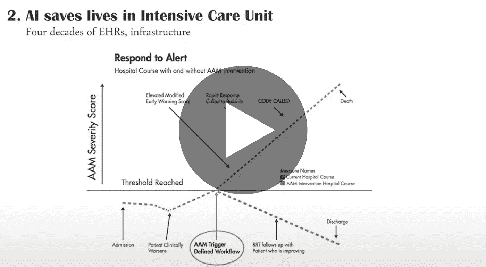

# 临床决策支持中的人工智能:障碍与机遇

> 原文：<https://towardsdatascience.com/ai-in-clinical-decision-support-roadblocks-opportunities-fddb3311fe99?source=collection_archive---------42----------------------->

## [活动讲座](https://towardsdatascience.com/event-talks/home)

## Niki Athanasiadou | TMLS2019

https://torontomachinelearning.com/

## 关于演讲者

我在爱丁堡大学(英国)获得了分子和细胞生物学博士学位，在基因组研究、医学和人口健康的计算建模方面拥有丰富的经验。值得注意的是，作为美国国立卫生研究院的研究员，我建立了一个管道原型，利用基因组和 EHR 水平的信息创建疾病风险的个性化模型。

除了发表在国际同行评审期刊上，我的工作还在英国和美国赢得了几个奖项，包括 2018 年纽约市开放数据竞赛的一个数据科学项目。我目前是 H2O.ai 的数据科学家，与医疗保健行业的公司密切合作，帮助他们利用人工智能扩展他们的能力。

## 关于谈话

随着数据处理和存储变得越来越便宜，采用人工智能的主要障碍往往是数据可用性。这在医学领域是最好的例证，人工智能支持的临床决策支持的进步反映了医疗保健系统中数据记录和存储方式的创新。

人工智能支持的临床决策支持包括诊断和预后，并涉及分类或回归算法，这些算法可以预测医疗结果的概率或某种疾病的风险。在过去的两年中，FDA 已经批准了几种使用医学图像的图像分类算法作为诊断工具，并且肯定会有更多的算法出现。

类似地，FDA 已经批准了监测生命体征以捕捉异常情况的可穿戴设备。这些早期的例子展示了人工智能在医学领域应用的巨大潜力，因为获取的医疗数据的数量和种类都在增加。

超过 80–90%的美国医院和医生办公室正在实施某种形式的 EHR，全球范围内的采用率类似甚至更高。尽管持续存在未决问题，EHR 系统之间缺乏互操作性或病历连续性，过去与数据可用性和可用性相关的采用障碍正在被克服。

将讨论建立在 EHR 数据上的临床决策支持人工智能模型的三个例子。

*   (1)在医疗机构中积累出生时的病史以及相关联的母亲 EHR 信息，使得能够在出生后两年内预测高肥胖风险儿童，这可能允许改变生活的预防性干预。
*   (2)由 Kaiser Permanente 开发和部署的高级警报监控系统使用重症监护病房(ICU)数据来预测致命恶化的病例，并提醒员工需要救生干预。
*   (3)最后但并非最不重要的是，临床决策支持系统通常需要提供对其预测的充分解释。关于医院再入院预测的全球和局部解释证明了可解释性技术是如何实现这种解释的。

随着 EHR 信息变得标准化并富含基因组信息，医学已准备好利用人工智能突破来改善健康结果。

[临床决策支持中的人工智能:路障&机遇](https://www.youtube.com/watch?v=Hf_u3YRnUkA)