# 金融中的人工智能:如何最终开始相信你的回溯测试[1/3]

> 原文：<https://towardsdatascience.com/ai-in-finance-how-to-finally-start-to-believe-your-backtests-1-3-1613ad81ea44?source=collection_archive---------5----------------------->

## 模拟、风险和指标

## 关于回溯测试的危险，如何测量它们，不要感觉正确，但要正确

插图形式[https://papers.ssrn.com/sol3/papers.cfm?abstract_id=3544431](https://papers.ssrn.com/sol3/papers.cfm?abstract_id=3544431)

***来自《走向数据科学》编辑的提示:*** *虽然我们允许独立作者根据我们的* [*规则和指导方针*](/questions-96667b06af5) *发表文章，但我们不认可每个作者的贡献。你不应该在没有寻求专业建议的情况下依赖一个作者的作品。详见我们的* [*读者术语*](/readers-terms-b5d780a700a4) *。*

定量研究是一个包含许多中间步骤的过程，每个步骤都必须经过仔细彻底的验证。资产选择、数据收集、特征提取、建模——所有这些阶段都需要时间，并且由不同的团队交付和测试。但是投资者最终想看到什么呢？对历史数据的“完美”回溯测试，具有高夏普比率、相对于市场的阿尔法值，可能还有一些与基金相关的指标，如容量、杠杆、平均 AUM 等。然而，这种方法**并不能告诉我们任何关于策略的未来表现**的信息，而且这种回溯测试很容易被过度拟合，甚至当它们被用来衡量一个交易想法的“成功”时是危险的(详见我的文章[金融想法发现](https://medium.com/swlh/ai-in-finance-advanced-idea-research-and-evaluation-beyond-backtests-d4d7bb185854))。

> 没有什么比对过去表现良好的策略进行回溯测试更容易的了，但你会冒险把资本押在这上面吗？大多数投资者都是这样。

在接下来的两篇文章中，我想全面回顾一下测试交易策略本身的想法。

*   首先，解释标准方法的**危险**,并展示一些替代指标，这些指标提供了关于战略绩效的更多见解。
*   然后，我将展示我们如何摆脱单一的向前回溯测试，而支持众所周知的度量标准的**模拟、场景和概率解释**。这将有助于我们从对过去的分析转向对未来表现的评估。
*   最后但同样重要的是，我想丰富风险的概念:通常投资者和投资组合经理会计算并考虑投资组合的风险，但不会考虑策略本身的风险，这导致他们无法控制和理解现场表演中的策略。

像我最近的大多数文章一样，这篇文章的灵感来自于[洛佩斯·德·普拉多](https://www.amazon.com/Advances-Financial-Machine-Learning-Marcos/dp/1119482089)博士的书，我推荐他们深入探讨这个主题。一如既往，你可以在[我的 GitHub](https://github.com/Rachnog/Advanced-Deep-Trading/tree/master/backtest_metrics) 上找到来源。

# 回溯测试的危险

2014 年，由罗隐领导的德意志银行从业人员团队发布了一部名为《量化投资的七宗罪》的作品。它谈到了你可能已经听说过的事情:**生存偏差、前瞻偏差、讲故事、数据窥探、交易成本、离群值和短期问题**。我希望我们已经知道如何获得正确的数据并正确处理它，而不是展望未来，并执行特性重要性分析，而不是在回溯测试中解释随机模式。

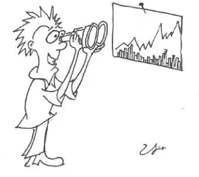

上述论文中量化投资的一些“死罪”的例证

然而，除了这个至关重要的列表，我还想补充一些质疑回溯测试本身的时刻:

1.  **是随机过程**的单一路径。市场可以用一个包含数百万变量的极其复杂的随机过程来描述。我们可以对这一过程的不同场景和结果进行采样，但我们只观察到了一个实际发生的情况。**我们** **依靠一个极其复杂的系统的无限的单一结果**来测试一个交易算法，这本身就是疯狂的。
2.  **它没有解释金融发现**。回溯测试说明了过去可能发生的事情，但没有解释原因。依赖夏普或索提诺配给意味着蒙着眼睛呆在不确定的世界里。诸如特征重要性分析之类的替代方法将允许我们首先**建立金融理论**，并且只有在用回溯测试或另一个方案测试它们之后。
3.  **它不允许我们预测业绩和风险**。你的策略可以在 2008 年的危机中幸存下来，这是否意味着它可以轻松地度过当前的 COVID one？你怎么知道你没有过度适应某个特定的场景？还是一组特定的因素？如何准确估计**这种结果的概率**？经典的回溯测试没有给出任何答案。

总的来说，即使我们避免了德意志银行的人犯下的致命错误，我们的回溯测试也只能告诉我们一些规则在过去是如何执行的，除此之外别无其他。这就是为什么拥有一个**更丰富的战略评估工具包至关重要，它允许概率性的、基于场景的、以风险为中心的方法**，这是我们在[神经元实验室](https://neurons-lab.com/)使用的，我们将在这两篇文章中开发并测试它。

# 基于人工智能的战略概述

让我们定义一个典型的基于预测的策略:在某种工具上有一个做多或做空的信号源，我们据此采取行动。为了简单起见，我们将执行一个典型的时间序列预测练习:取前 N 天，提取因子，预测第二天的价格变化，然后交易。这是一个非常原始的场景，没有考虑交易成本、滑点、空头、获利和止损障碍，但让我们先关注**市场理解原则的发现**，然后关注执行——我们总是有时间因为不适合市场/交易规则而放弃策略。

## 基础数据

让我们把重点放在银行部门，并将学习 C、DB、BAC、WFC 和其他已知银行的投机信号。由于他们在 2008 年危机中的崩溃，看看我们的 ML 模型将如何应对这种政权更迭将是一件有趣的事情。我们将主要依靠统计因素，我们将这些因素分为三类:

*   **统计特征**:最小值、最大值、自相关和统计矩
*   **技术指标**:交易者喜爱的经典特征
*   **“AFML 特色”**:详情查看名著:)

我们将以滚动窗口方式提取这些因素(分数微分时间序列上的统计因素),并根据 iid 规则对输入和输出进行采样。输入将是“今天”的滚动特征，预测-第二天的固定范围收盘价格变化。

## 预测模型

根据 López de Prado 博士的建议，我们将使用决策树的 bagging，并对 iid 抽样进行校正。我们期望集成将有助于处理过度拟合，基于树的模型将有助于进一步的特征重要性分析。一般来说，我们希望保持预测模型尽可能简单，关注我们的因素洞察力的质量。

## 超参数

我们将根据 5 年的数据训练我们的模型，然后在接下来的 3 年里用这个模型进行交易，之后重复这个过程，直到数据结束(从 2000 年到 2020 年)。这种方式至少在某种程度上我们应该适应不断变化的政体。

# “正常”回溯测试和分析

让我们从德意志银行(DB)股票开始，运行上述策略，并计算回报率、策略绩效和基准(买入并持有)与 ML 策略相比的夏普比率。

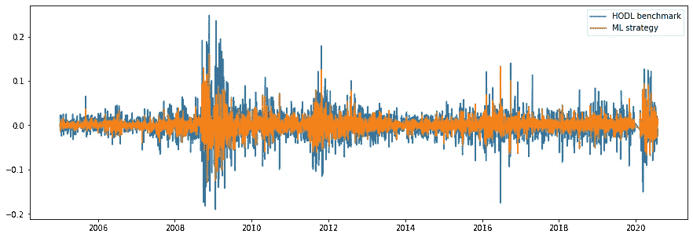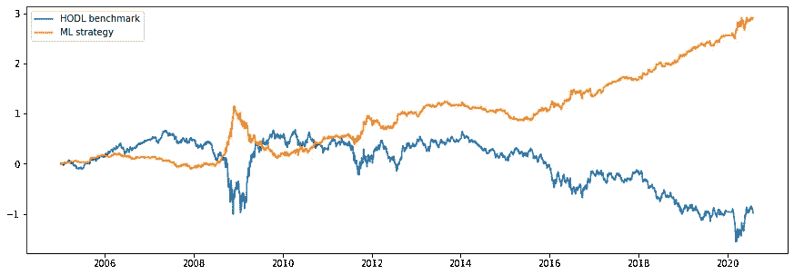

与 HODL 基线相比，DB ticker 上 ML 策略的回报和累积回报(即业绩)

数字呢？

*   **平均收益:** -基准 0.00026，ML 策略 0.0008
*   **夏普比率:** -基准 0.14，ML 策略 0.74

看起来很不错，但是我们从这个回溯测试中得到了什么**实际的见解**？字面**无**！也许我们的模型只是在熊市中几乎总是过多地给出“做空”信号，将来会失败得很惨:)让我们回顾一下更有趣的指标，这些指标可以帮助我们更详细地了解模型的表现！

# 替代指标

## 数据统计

*   **特征组重要性:**显示哪个数据源在哪个时刻是重要的(市场、基本面、情绪、替代方案)，我们可以检测状态并部分解释模式
*   **特性暴露:**如果一个模型过于依赖某个特定的特性，那么它将来可能会变得不可靠。我们可以跟踪这种不一致，并将它们视为风险的来源

## 模型统计

*   **“准确性代理”:**马修相关系数(MCC)是预测模型“准确性”的一个相对通用的度量，它可以提供关于我们可以在多大程度上依赖该模型的见解。此外，它有助于检测政权，我们的模型是不可靠的。

著名的 MCC 公式

*   **模型确定性:**模型返回概率，我们可以跟踪预测的可信度，并研究可信度如何影响风险和回报

## **效率**统计

*   **夏普比率**(年化的、概率的、紧缩的):基本的性能指标，但是，对于厚尾和偏斜分布以及多重测试，这些指标必须是固定的。

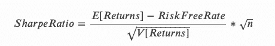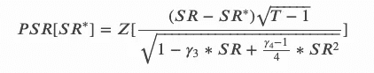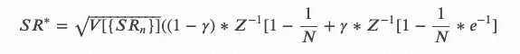

年化的、概率的和缩减的夏普比率(从[https://mlfinlab.readthedocs.io/](https://mlfinlab.readthedocs.io/))

*   **“聪明的”夏普比率:**我们希望我们的策略没有自相关，没有记忆，因此不会有任何长的燃烧期。如果我们用自相关惩罚我们的夏普，它可以帮助我们通过优化选择这样的策略。

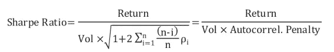

夏普比率与校正的自相关，参见[本文](https://www.keyquant.com/Download/GetFile?Filename=%5CPublications%5CKeyQuant_WhitePaper_APT_Part2.pdf)了解更多详情

*   **信息比率:**该指标有助于我们将我们的战略与“alpha”之外的基础或基准进行比较。它是平均超额收益和跟踪误差之间的年化比率。

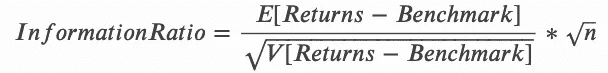

来自[https://mlfinlab.readthedocs.io/](https://mlfinlab.readthedocs.io/)的信息比率公式

## 运行统计

*   **所需的最小跟踪记录长度:**回答问题“一个跟踪记录应该有多长时间，才能有统计置信度表明其夏普比率高于给定阈值？”如果跟踪记录比它短，我们就没有足够的信心认为观察到的夏普比率高于指定的夏普比率阈值。

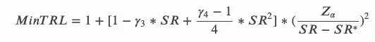

来自[https://mlfinlab.readthedocs.io/](https://mlfinlab.readthedocs.io/)的最小要求跟踪记录长度公式

*   **水位下降&水下时间:**投资者不仅对最大水位下降的风险感兴趣，还对他们将在那里停留多久感兴趣。与数据和模型统计数据相结合，它可以提供关于为什么以及何时该策略表现不佳的见解。

## 一般化统计

*   **市场推广:**由于我们的目标是在特定的行业中经营，我们寻找在不同工具中一致的因素，因此我们知道，我们不会仅仅为了一个单一的证券而“过度拟合”我们的发现。没有标准化的方法来衡量这样的概括，所以我们将随机应变:)

# 新的指标和见解

首先，让我们在 DB ticker 上计算基准测试和策略的所有上述指标:

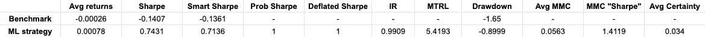

DB ticker 上 ML 策略的回溯测试统计数据与 HODL 基线的比较

我们可以看到，在主要性能和信息价值指标方面，我们基于 ML 的策略**确实优于**基线！过度拟合怎么办？概率 SR 等于 1.0，这意味着该发现是真实的，并且缩小的 SR(从 Bagging 模型的多次运行计算)也等于 1.0，这证实了我们的模型也是适当的。平均 MCC 相当高，甚至除以 MCC 的标准偏差(某种准确度得分的 SR)也有很高的值。功能重要性呢？我们可以看到，有些特征在重要性的底部是稳定的，而有些是非常高的。我们从经验上看到，**基于交易量的因素**在这个股票市场表现良好。

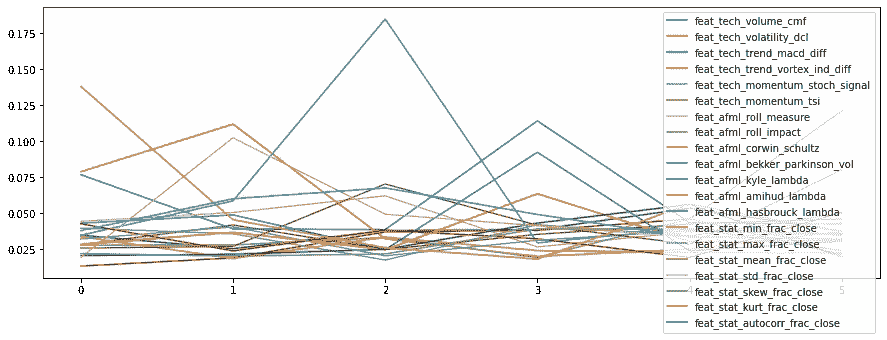

与 HODL 基线相比，ML 策略在 DB ticker 上的时变特征重要性

如果我们已经计算了特征的重要性，为什么我们不应用它来使结果更好呢？例如，我们可以删除最不重要的 3 个特性(假设它们没有任何意义)。会改变性能吗？

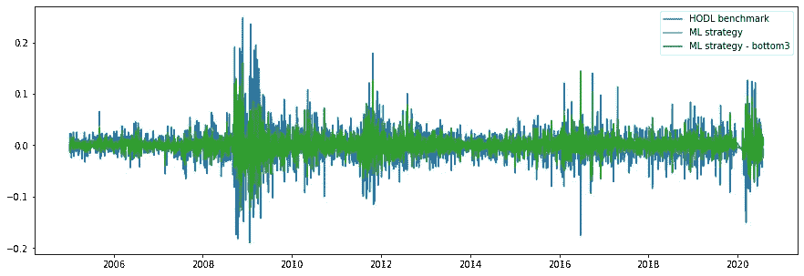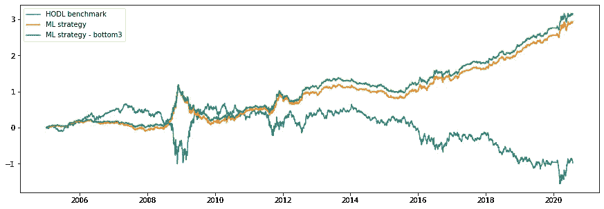

与 HODL 基线相比，DB ticker 上两种 ML 策略的回报和累积回报(即业绩)

从视觉上我们可以确认，具有更新功能集的外部更新策略(每 5 年重新评估一次)**击败了我们使用所有功能的 ML 策略基准**。从指标的角度来看，我们也看到了改进，但注意 MRTL(最小所需跟踪记录长度)特性，它现在告诉我们，我们需要更多天来观察这两种策略，以确实确认这种提升(这是有意义的，因为它们高度相关)。此外，请注意平均确定性的下降——删除一些特征实际上可能会损害模型。

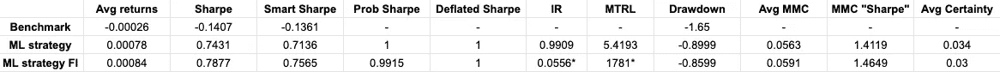

与 HODL 基线和使用所有特征的 ML 策略相比，在 DB ticker 上去除了 3 个最低性能特征的 ML 策略的回溯测试统计；*-所选特性我们根据第一个 ML 策略的基准来计算该指标

现在，我们需要确保我们关于给定特征的非线性依赖性的策略和假设能够适用于其他银行 tickers。

# 我们可以推广到其他 tickers 吗？

## BAC 股票代码(美国银行)

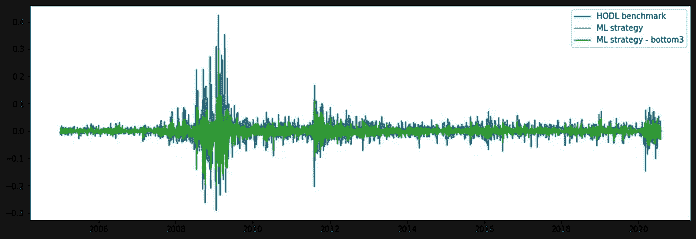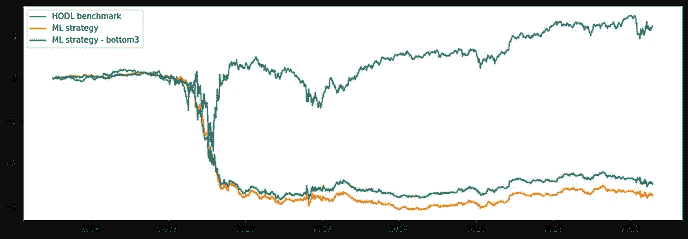

与 HODL 基线相比，BAC 报价器上两种 ML 策略的回报、累积回报(即业绩)和特征重要性

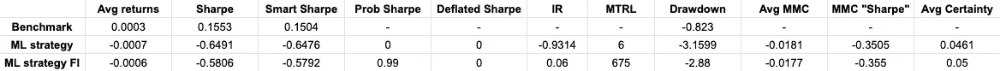

HODL 和两个 ML 策略的回测统计量

嗯……看起来不太好。如果我们详细检查度量，我们可以看到这是 ML 模型的一个明显的错误。“重要”特性也与德意志银行的例子有很大不同。也许只是一个异常值，让我们试试下一个！

## WFC 股票交易所(富国银行)

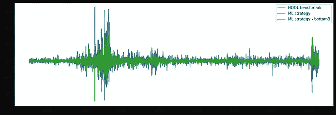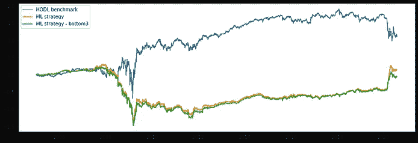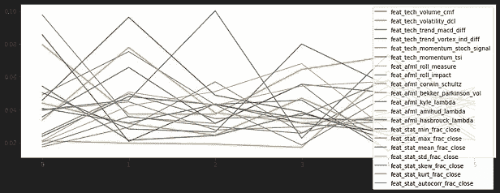

与 HODL 基准相比，WFC 证券交易所的两种洗钱战略的回报、累积回报(即业绩)和特征重要性

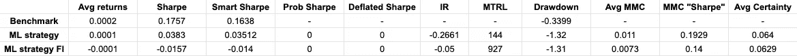

WFC 证券交易所 HODL 和两个 ML 策略的回溯测试统计

接下来的尝试也是一点收益都没有！然而，这里的情况更加棘手:MCC 指标不是负数(甚至非常接近于零)，但是战略绩效非常糟糕。让我们看看更多的例子，但是现在，值得考虑的是德意志银行的例子只是一个幸运的例子。

## C ticker(城市集团)

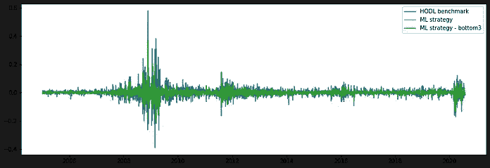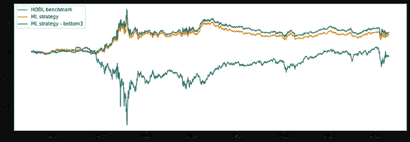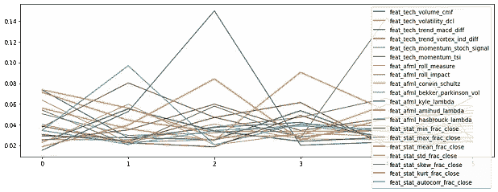

与 HODL 基线相比，C ticker 上两种 ML 策略的回报、累积回报(即业绩)和特征重要性

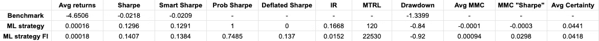

HODL 和两个 ML 策略的回测统计量

检查图表！你看到了吗？终于，我们答对了！等等，让我检查一下漏气的 SR？零？过度装配的迹象…那么 MCC 呢？再次接近零！我们真的认为一个几乎随机的模型可以击败我们的基准吗？我们不能相信这个结果！

## 瑞士瑞信银行集团股份公司

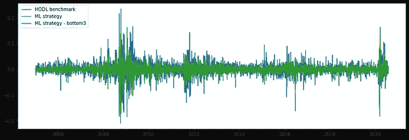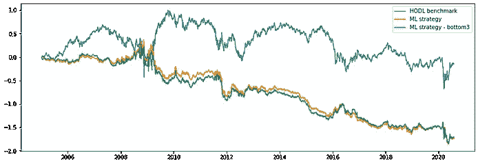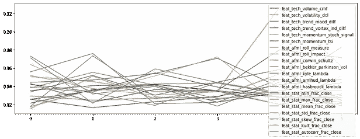

与 HODL 基线相比，CS ticker 上两种 ML 战略的回报、累积回报(即业绩)和特征重要性

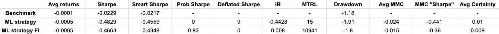

CS ticker 上 HODL 和两个 ML 策略的回测统计

好吧，如果它在 DB 上工作得这么好，也许它是关于在欧洲？让我们看看瑞士瑞信银行的股票吧！而且……我们又失败了:)

## 汇丰(汇丰控股有限公司)

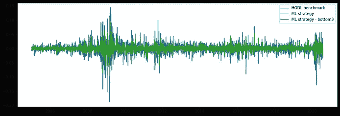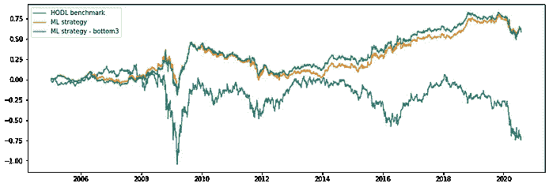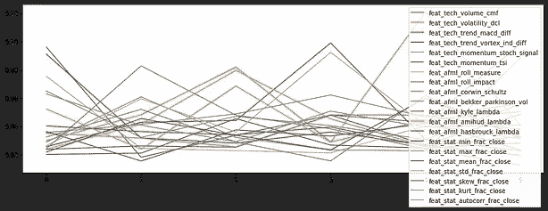

与 HODL 基线相比，汇丰股票市场上两种洗钱战略的回报、累积回报(即业绩)和特征重要性

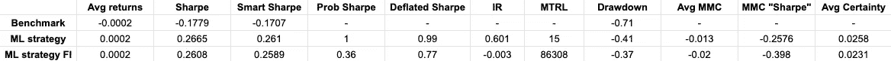

汇丰股票上 HODL 和两个 ML 策略的回溯测试统计

出于好奇，我与另一家欧洲银行汇丰银行(HSBC)尝试了这一策略，从视觉上看，它看起来非常积极，但同样，魔鬼在于模型性能和 MCC——我们只是在 ML 模型上再次走运，实际上没有学到任何有用的东西。

## 荷兰国际集团

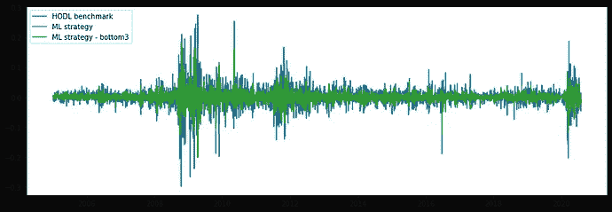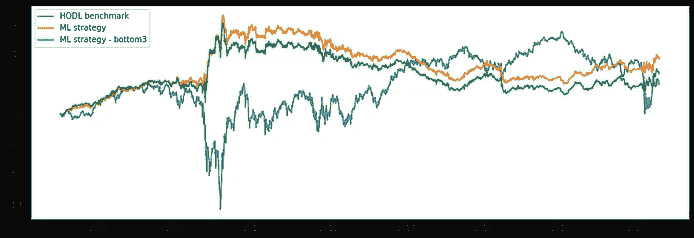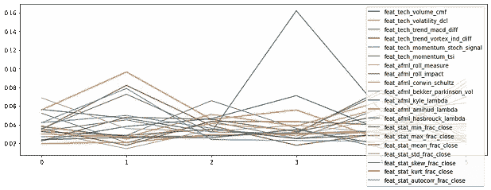

与 HODL 基线相比，ING ticker 上两种 ML 策略的回报、累积回报(即业绩)和特征重要性

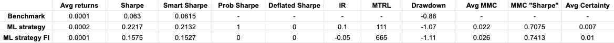

HODL 的回测统计量和 ING ticker 上的两个 ML 策略

我想以积极的方式完成实验，然而，奇迹，如果发生的话，不是在定量金融中，尤其是如果我们正确地衡量一切；)从业绩和 MCC 战略来看很好看，不幸的是，已经把 SR 缩小为零——样本外表现不好的可能性很大。此外，如果去掉底部特征，它的性能会更差，这本身就很奇怪。

# 结论

我们所做工作的主要结果是简单明了的——我们学会了如何从比过去更多的维度来评估基于 ML 的策略的回溯测试。我们需要与模型的过度拟合、多重比较和“黑箱化”作斗争，要解决这些问题，我们需要首先发现它们。新提议的统计做了以下工作:

*   **用非线性模型解释数据中的因素**
*   解释**模式**和**战略**绩效之间的**联系**
*   丰富概念**“超越基准”**
*   给出关于**泛化和过拟合**的提示

然而，结果是令人沮丧的，但我希望，没有人期望我们可以通过书中的几个公式实际上击败市场，并创造新的经济发现:)检查我们可以看到的重要特征，不同的报价器之间没有共识——所有时间不同的因素都在顶部，这**不允许我们建立一个强大的理论**关于驱动银行股的统计因素。我们能做些什么来弥补呢？

*   **发现定义银行间差异的新特征**——基本面、宏观、替代数据——2020 年依靠统计因素并不明智；)
*   **改变超参数** —谁说的 5 年训练，3 年交易，14 天平均窗口等等和正确的数字？我们实际上需要运行超参数搜索来找到最优值。我们将在下一个帖子中详细检查它，同时检查我的这篇文章(这里和那里有许多错误，但搜索部分是正确的)
*   在**特性重要性**上多下功夫——我们看到，几乎在所有情况下，移除底层特性都会对 ML 策略有所帮助。也许我们需要移除更多？或者对特征重要性应用更好的算法？或者既然我们观察到过度拟合，也许我们不仅可以移除底部特征，还可以移除顶部特征？；)

在下一篇博文中，我们将更深入地探讨我们今天介绍的概念。我们将开发模拟和数据扩充的方案，而不是在一个历史数据集上计算这些数字，我们将得出的不是点估计，而是概率解释。谁知道呢，也许我们的模型在一个时间序列实现上表现很差，但是在这个尺度上，它们是相当可靠的？敬请关注，不要忘记查看源代码:)

**附言**
如果你觉得这个内容有用，有观点，可以[在 Bitclout](https://bitclout.com/u/alexrachnog) 上支持我。你也可以在[脸书](https://www.facebook.com/rachnogstyle.blog)博客或 [Linkedin](https://www.linkedin.com/in/alexandr-honchar-4423b962/) 上与我联系，在那里我会定期发布一些对媒体来说太短的人工智能文章或新闻，并在 [Instagram](http://instagram.com/rachnogstyle) 上发布一些更私人的内容:)