# 金融中的人工智能:如何最终开始相信你的回溯测试

> 原文：<https://towardsdatascience.com/ai-in-finance-how-to-finally-start-to-believe-your-backtests-2-3-adfd13da20ec?source=collection_archive---------19----------------------->

## 模拟、风险和指标

## 来自历史数据和模拟的组合和基于场景的回溯测试

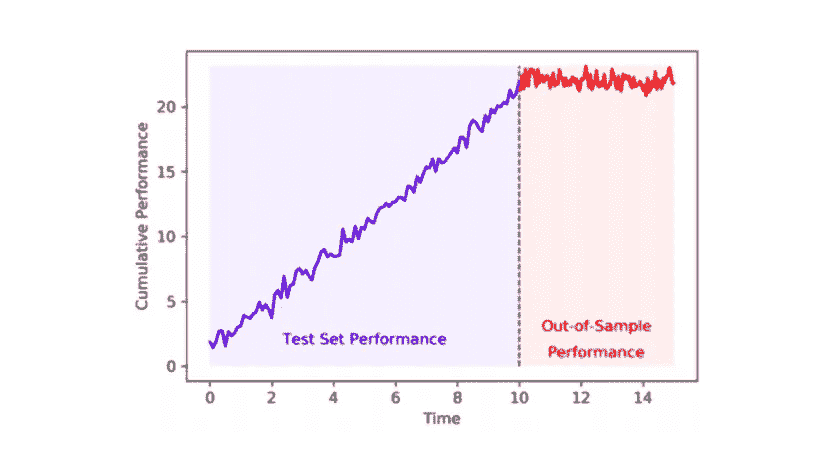

插图来自 https://papers.ssrn.com/sol3/papers.cfm?abstract_id=3544431

***来自《走向数据科学》编辑的提示:*** *虽然我们允许独立作者根据我们的* [*规则和指导方针*](/questions-96667b06af5) *发表文章，但我们不认可每个作者的贡献。你不应该在没有寻求专业建议的情况下依赖一个作者的作品。详见我们的* [*读者术语*](/readers-terms-b5d780a700a4) *。*

让我们拆解回测，让它们再次变得伟大:)在[上一部分](/ai-in-finance-how-to-finally-start-to-believe-your-backtests-1-3-1613ad81ea44)中，我们已经用历史数据和与策略性能相关的标准度量回顾了经典回测例程的主要危险。我们引入了与数据、模型、效率和交易相关的新的统计组，这些统计组可以提供关于潜在战略的更多见解。

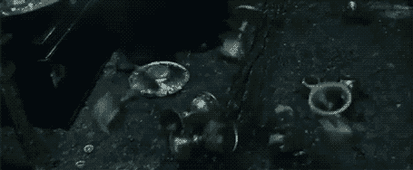

这篇文章将是关于我们的初始数据集潜在的无限翻倍，来自[https://harrypotter.fandom.com/wiki/Doubling_Charm](https://harrypotter.fandom.com/wiki/Doubling_Charm)的 GIF，没有侵犯版权的意图

然而，如前所述，对某个具有众多变量的极其复杂的随机过程所产生的单一历史路径进行回溯测试似乎根本不够。它既不允许概率解释，也不允许基于情景的战略观点。这篇文章的第二部分是关于为我们打开一个更广泛的方法来验证我们的定量策略的技术:

*   **通过交叉验证进行回溯测试:**首先，我们将开始一项技术，该技术允许使用交叉验证对随机数据**进行采样，而无需知道明确的数据生成模型**；
*   **对合成数据进行回溯测试:**然后，我们将展示如何使用随机建模和**生成样本路径**进行回溯测试；
*   **基于压力情景的回溯测试:**最后，我们将检查如何在控制主要因素的情况下对合成数据进行采样，从而允许我们对**异常情况**进行建模。

像我最近的大部分文章一样，这篇文章的灵感来自洛佩兹·普拉多博士的书，我推荐他们深入探讨这个话题。一如既往，你可以在我的 GitHub 上找到[的来源。](https://github.com/Rachnog/Advanced-Deep-Trading/tree/master/proba_backtest)

# 通过交叉验证进行回溯测试

长话短说，我们希望有一个以上的历史路径来检查我们的战略绩效。我们可以**从历史数据**中以某种方式取样，但是用什么方式呢？我们可以从整个数据集中选取不同时间的不同部分作为训练集和测试集。为了生成这些部分，我们已经知道了机制——它被称为**交叉验证**。出于我们的目的，我们需要尽可能丰富的一组模拟——子集的所有可能的**组合**用于训练和测试算法，这为我们带来了**组合净化交叉验证**算法:

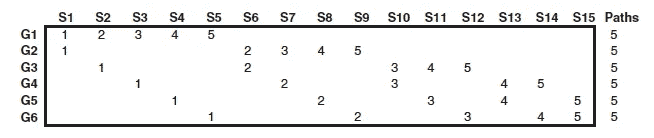

组合交叉验证时间序列分割图。行代表我们的初始数据集和列的 6 个分割—回溯测试路径。插图来自[https://www . Amazon . com/Advances-Financial-Machine-Learning-Marcos/DP/1119482089](https://www.amazon.com/Advances-Financial-Machine-Learning-Marcos/dp/1119482089)和[http://www.quantresearch.org/Innovations.htm](http://www.quantresearch.org/Innovations.htm)

例如，我们将整个数据集分成 N = 6 组 *G1…G6* ，从中随机抽取 2 组进行测试。因此，我们可以有 15 个分割选项，如上面的列 *S1…S15* 所示。在每个分割中，2 组用于测试，4 组用于所有组合都存在的训练。现在，**我们可以对我们的算法进行比单次回测多 15 倍的**测试，并获得相关夏普比率和其他风险度量的**分布**。尽管有这些优点，这种方法也有一些缺点:

*   它**不允许历史解读**，
*   **数据泄漏是可能的**，需要单独解决。

# 合成数据的回溯测试

组合清除交叉验证是一个强大的工具，但它将我们限制在可用数据的子集。在金融数学中，我们使用**蒙特卡罗模拟**成千上万次来获得精确的估计。例如，在衍生品定价中，我们使用随机微分方程来模拟基础价格，根据方程的不同，这些随机模拟可能看起来非常不同:

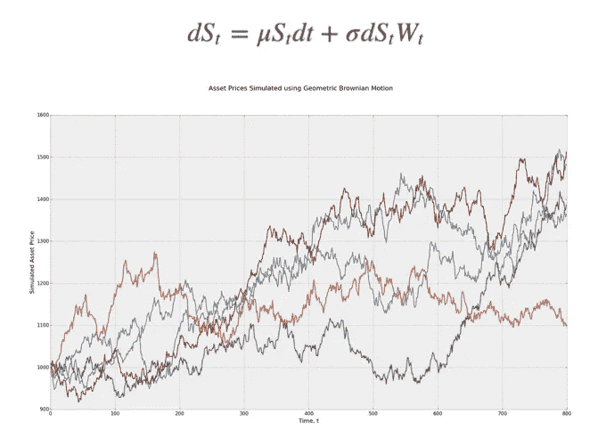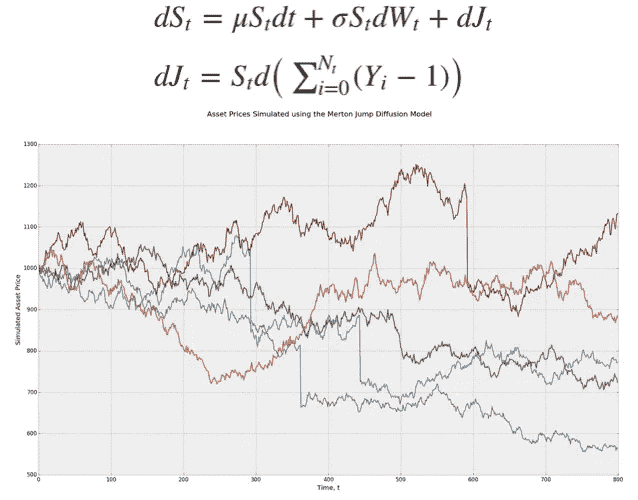

几个随机过程和相应方程的图解。从左至右:几何布朗运动、Merton 跳跃扩散模型、均值回复模型；插图来自[http://www . turing finance . com/random-walks-down-wall-street-random-processes-in-python/#](http://www.turingfinance.com/random-walks-down-wall-street-stochastic-processes-in-python/#)

这种模拟可以给我们许多不同的回溯测试数据，但我们在这里有两个问题:我们不知道从**的哪个随机过程**中抽取金融数据，以及**如何重新创建外生变量**如基本面、情绪等。

*   第一个问题可以通过**校准过程**解决，即找到漂移、波动性、跳跃概率、均值回复系数等参数的精确值。
*   第二个更复杂。在[我用于实验的代码](https://github.com/Rachnog/Advanced-Deep-Trading/tree/master/proba_backtest)中，我正在训练一个**单独的机器学习模型**仅使用收盘价来预测高、低、开盘价和成交量。看起来有点过了(和过拟合)，但是我们不打算在这里预测任何东西，只是复制潜在的动态，因此，它或多或少是合法的(但是值得怀疑，如果你知道更好的方法，请告诉我)。

最终结果是回溯测试度量在不同场景中的分布，与组合交叉验证方法相同。

# 压力情景回溯测试

模拟也可以用来产生我们感兴趣的特定政权和场景。例如，我们有兴趣知道在市场突然下跌的情况下我们的策略会如何表现。我们该怎么做？如果我们只看历史数据，我们可以根据市场找到 2-3 次这样的危机。在这里，蒙特卡罗模拟再次有用，但我们需要非常仔细地选择特定随机过程的参数:对我们测试这种策略所针对的确切风险进行建模。例如，对于上述市场下跌，我们可以用负的跳跃大小和相应的频率来模拟跳跃扩散过程。

还有其他数据驱动的方法来模拟基于生成式机器学习模型的现实场景，如 GANs。对于收益时间序列生成和相关矩阵采样，有几种有前途的方法:

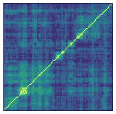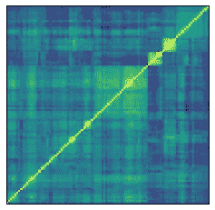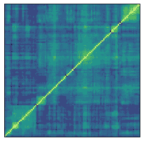

那些相关矩阵是真实的还是由 GAN 生成的？在[http://www.corrgan.io/predict](http://www.corrgan.io/predict)检查自己

然而，通常情况下，GANs **不允许我们控制场景生成**，因为神经表征是纠缠不清的，也就是说，我们不知道操纵漂移、波动或其他金融变量的“按钮”在哪里。变分自动编码器在这里可能是一个有趣的方法，我不久前写了一篇关于**解开表征学习**的文章，可能对这里有用。

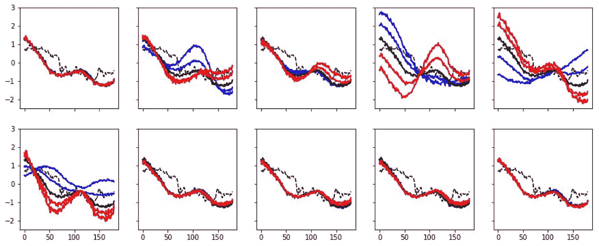

简要说明 beta-VAEs 试图从原始数据中理清不同的市场属性。更多详情请访问 https://towards data science . com/gans-vs-odes-the-end-of-mathematical-modeling-EC 158 f 04 ACB 9

# 数值实验

让我们像在[上一篇文章](/ai-in-finance-how-to-finally-start-to-believe-your-backtests-1-3-1613ad81ea44)中一样，以德意志银行股价数据为例。基于 ML 的策略的回溯测试看起来非常好，直到我们意识到在其他银行这种方法失败了，这不允许我们认为我们的财务发现是可信的。现在，我想展示一下，我们如何在不看类似市场参与者的情况下实现这一点，而是使用这些指标的概率解释。

## 组合交叉验证

让我们重新排列价格时间序列的第一部分，以生成 15 个训练和回溯测试路径(正如我们上面讨论的)。我们可以在下面的一些插图中看到，我们的回溯测试数据已经有了不同的市场机制和方向，这立即允许基于场景的验证:

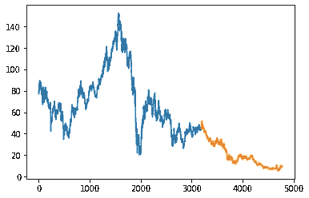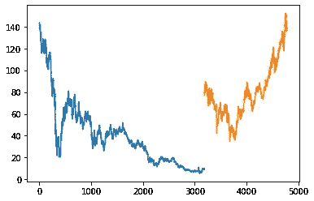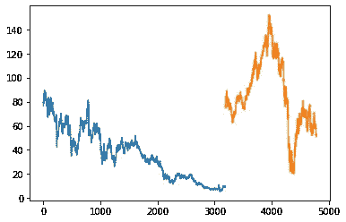

基于 DB 时间序列分割的十五个训练和回溯测试数据组合中的三个

在我们从上一篇文章的[运行 ML 和策略管道之后，我们应该首先在这些回溯测试数据上检查 **ML 模型的性能**，只有在我们对机器学习性能有信心之后，我们才能运行策略回溯测试。从下面的直方图中，我们可以看到，平均 MCC(马修斯相关系数)是正的，但是，有几个数据给了我们负面的表现(我们已经可以从这里估计一些风险)。](/ai-in-finance-how-to-finally-start-to-believe-your-backtests-1-3-1613ad81ea44)

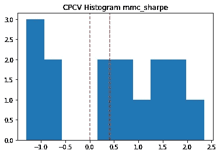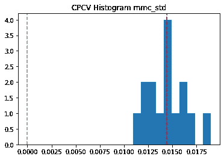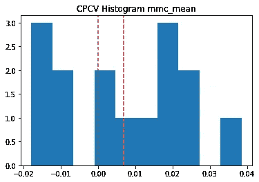

在回测数据中，平均 MCC、其标准偏差以及两者之比的直方图表示为“MCC 夏普比率”

让我们假设风险是可接受的，并绘制战略夏普比率、收缩夏普比率和概率夏普比率的直方图(更多详细信息，请参见[上一篇文章](/ai-in-finance-how-to-finally-start-to-believe-your-backtests-1-3-1613ad81ea44))。与 MCCs 直方图相比，我们可以在夏普比率中看到一个**“更胖”的左尾**，更重要的是，在这些回测中**零值收缩夏普比率**的总流行率，这意味着我们的结果容易出现重复实验的问题，并且不可靠。

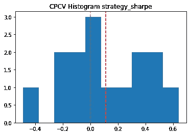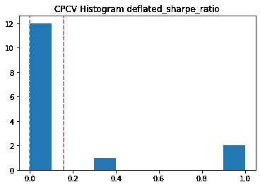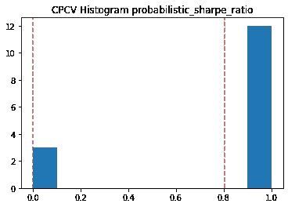

回测数据的夏普、缩小夏普和概率夏普比率直方图

正如我们所看到的，一个单独的走查不能向我们揭示这些问题，简单的组合交叉验证已经显示了比点度量估计更多的内容。

## 蒙特卡罗模拟

如果组合交叉验证如此有效，我们能用随机模型的模拟做什么呢？让我们看看下面的 DB 价格时间序列，它是如何表现的？什么随机模型和什么参数在描述它？

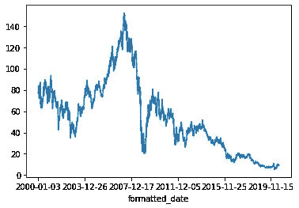

DB 收盘价时间序列和一些模拟。动力学看起来差不多吧？

我们可以清楚地看到一些跳跃(顺便说一下，还有随时间变化的波动)，但为了简单起见，让我们假设这个过程遵循**Merton 跳跃扩散模型**，漂移和波动取自历史数据(-3.036e-05，0.02789)，跳跃强度、大小及其标准偏差选择为“肉眼可见”(0.1，-0.01，0.001)。让我们模拟这种接近价格时间序列的几条路径，预测相应的低、高、开盘价，以及在这些生成的路径上的交易量和回溯测试策略。

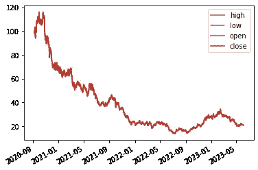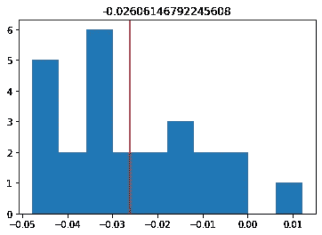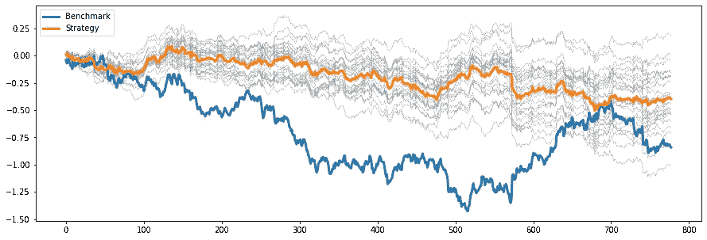

回测数据模拟#1:模拟数据本身，不同装袋运行的 MCC 直方图，以及相应的策略回测

从第一个例子中，我们可以从多次运行 bagging 分类器计算的 MCC 分布中看出，平均而言，我们的**样本外模型精度为负**。它应该阻止我们运行回溯测试，但是出于好奇，让我们这样做，我们可以看到，这样的回溯测试可能是骗人的——即使模型很差，它也优于基准测试！很好地指出了[上一篇文章](/ai-in-finance-how-to-finally-start-to-believe-your-backtests-1-3-1613ad81ea44)关于正确的指标计算和跟踪的重要性。

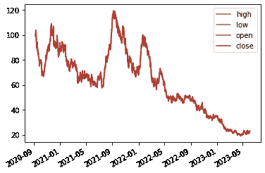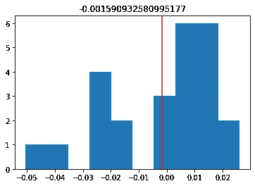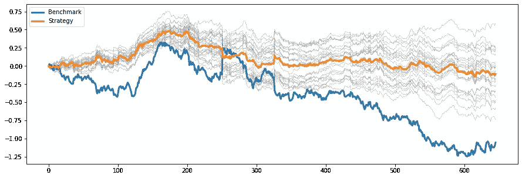

回测数据模拟#2:模拟数据本身，不同装袋运行的 MCC 直方图，以及相应的策略回测

重新启动模拟给出了类似的熊市时间序列，但现在随着时间的推移有了更多的跳跃(看起来更类似于原始的 DB 时间序列)，但 MCC 的分布再次给出了**负结果**，回测再次产生误导。

当然，如果我们对这一时间序列进行更多次的重新采样，并构建这种预测的直方图，我们将清楚地看到模型精度中的一个肥胖的左尾巴，这将清楚地向我们发出信号:如果我们以非常相似的动态对数据进行采样，但与历史数据略有不同，那么**我们最初的金融假设不再成立**。如果我们做了正确的初步研究，就不会出现这种情况:)

# 结论

在这篇文章中，我们回顾了允许**概率回测**与历史回溯测试相比较的技术。后者的主要问题是，它只是一个复杂随机过程的单一实现，这个过程可能有许多不同的方式，我们不希望从一个分布中过度拟合一个样本。

我们使用了两种主要技术来解决这个问题:**组合交叉验证**和**随机模拟**，每种技术都有其优点和缺点。在之前的文章[中，我们已经看到我们基于 ML 的策略在 DB 股票价格上表现良好，但是对银行业其他资产的实验表明，这一“发现”并不能推广到市场。在这篇文章中，我们已经表明，如果我们不使用走前估计，而是使用组合 CV 或随机模拟，我们可以看到，即使不检查市场上的其他资产，这种策略也是不可靠的，这可以节省我们的研究时间。](/ai-in-finance-how-to-finally-start-to-believe-your-backtests-1-3-1613ad81ea44)

我们研究了更多关于回溯测试性能的额外指标，并将它们扩展到概率估计。我们这样做是为了评估我们的策略在样本外表现不佳的风险，这与测量这些策略的**“过度拟合】**相关。我们还知道，过拟合是样本内和样本外性能之间的权衡，在这两篇文章中，我们只关注 OOS 的情况。在这个简短系列的下一篇，即第三篇文章中，我们将关注其他考虑样本内数据的过度拟合风险的度量，并以测试量化交易策略的一般框架结束。敬请关注，不要忘记查看源代码:)

**附言**
你也可以在[脸书](https://www.facebook.com/rachnogstyle.blog)博客或者 [Linkedin](https://www.linkedin.com/in/alexandr-honchar-4423b962/) 上与我联系，在那里我会定期发布一些对媒体来说太短的人工智能文章或新闻，以及 [Instagram](http://instagram.com/rachnogstyle) 上一些更私人的内容:)