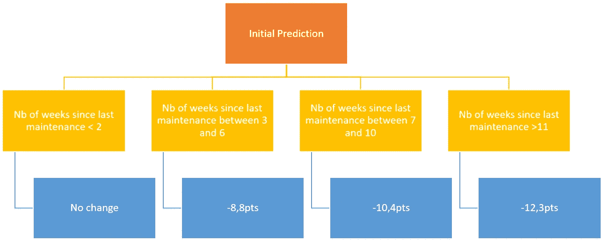

# 工业中的人工智能:一个维护程序如何毁了我的机器学习模型！

> 原文：<https://towardsdatascience.com/ai-in-industry-how-a-maintenance-routine-ruined-my-machine-learning-model-9b45acc69f83?source=collection_archive---------43----------------------->

基于一个真实的用例，发现为什么在建模一个工业过程时你应该总是注意维护活动……以及如果你不这样做该怎么做！

亚伦·巴纳比在 [Unsplash](https://unsplash.com?utm_source=medium&utm_medium=referral) 上拍摄的照片

# 机器学习的挑战:

许多数据科学家确实同意在实际使用机器学习算法之前进行数据准备的重要性。这一挑战通常被描绘成下图左侧显示的冰山。

第二个挑战可能是将概念验证(P.O.C .)转移到真实环境中，在真实环境中实时收集数据并将预测集成到现有的数字基础设施中。

(冰山绘图来源:fr.123rf.com)

但是，在我看来，最大的挑战是创造一个可以长期持续的解决方案:

(冰山绘图来源:fr.123rf.com)

令人高兴的是，工业过程通常不会像人类消费者那样在一夜之间改变他们的行为。(如果你需要一个奇怪行为转换的例子，只需记住当第一次 COVID 锁定开始时卫生纸短缺是多么不合理，人工智能系统应对它是多么困难！)

但是，即使是工业机器学习模型也可能会偏离，因为它们的鲁棒性也依赖于数据科学的 3 个公理:

(图标来源:flaticon.com 的 Freepix)

# 从好…到伟大…到更坏！

对于每一个建模项目，从一个运营团队带着一个要解决的用例来找我，到质量预测以相当高的准确度实时显示在控制室的仪表板上，我花了几个星期的时间。

然而，几个星期后，预测准确性的突然漂移使我质疑整个模型的稳健性，进而质疑工业过程的稳定性！

预测的趋势似乎不错，但总是被低估。

我们可以从“绝对误差”度量的角度来看待它:

上个月的预测准确度(MAE)

我们看到，过去四天的预测超出了我们与团队定义的稳健性阈值(2，2)，并且显著高于 0.9 的平均绝对误差(M.A.E .)。

我并没有花很长时间去检查和理解发生了什么:一个为期 6 个月的全面维护已经在周末进行了！

让我们来了解一下我们是如何分析数据的变化，从而使模型立即回到正轨的！

# 精度漂移的三个潜在原因

## 1)设备的完全更换

让我们想象一下，你用一台全新的压缩机替换了一台 40 年的旧压缩机。

是的，除了电场强度、压力、转速等，它的基本工作原理是一样的。测出来会完全不一样。

这可能是最糟糕的情况，因为预先收集的数据现在已经过时。更不用说车间布局或设备类型(从燃气转换为电力)也发生变化的情况了…

这里没有魔法:最简单的解决方案是收集新的数据，根据您以前的配置经验，可能将重点放在最相关的特性上…

## 2)测量系统的变化

全面维护不仅仅意味着更换备件或润滑剂；也可以是重新校准传感器、探头等。

我们的模型使用 8 个特征来预测产品的质量，所以我决定看看测量值是否有显著变化，因为尽管有维护工作，系统应该是相当稳定的。让我们来看看维护停止前 30 天和维护停止后几天的每个特性的中值:

(出于保密原因，对数据进行了清理)

八个特征中的三个，包括最重要的一个(中的**流速)，似乎发生了显著变化。**

但是我们知道“**水流 1** ”和“**水流 2** ”回路可以交替使用(一个优先于另一个，反之亦然)，并且总流量应该保持稳定。我把这两个特征相加，检测是否有真正的变化；这并不明显。我对流出的流量做了同样的分析，同样的结论:

因此，似乎模型的最关键参数(进气流量)的测量值发生了变化，并且很可能在完全相同的物理情况下增加了 5%!(这一点后来得到了维修团队的确认，他们重新校准了相应的传感器)

因此，为了保持整个数据集的一致性，我决定在维护和重新训练模型之前对所有值应用+5%的增量。

在更新的数据集上重新训练模型后，上个月的预测准确度(MAE)

即使不完美，新模型也表现得更好，维护后的平均寿命从 3.5(原始状态)下降到 1.6。

(注意:在两种情况下(原始模型和更新模型)，算法仅使用维护工作之前获得的值进行训练；这里没有目标泄漏！)

## 3)缓慢的性能下降

这种突然漂移的最后一个可能原因是，随着时间的推移，过程的性能已经慢慢下降…这就是为什么我们需要定期执行日常维护的第一个原因！

让我们来看看最近两次维护操作之间的流程性能:

同样，在过程的自然变化之外，下降趋势是明显的，直到我们达到某种平稳状态！

## 现在的问题是:我们如何将这些信息集成到模型中？

一种可能的选择是简单地添加自上次维护工作以来经过的天数。

但是我建议以较低的频率提供“维护”信息。

提供较低频率的信息就像迫使模型在一个移动范围内工作，从而使过程的自然高点和低点变平。

例如。:如果您每天都获得预测和相应的结果，请提供自上次操作以来经过的周数。

因此，模型将更容易确定该特征的重要性。

如果您以决策树的形式考虑它，它可能看起来像:

## 每次修正都对应于该期间的平均业绩下降。

显然，您需要几个周期来集成到您的数据集中，以便模型可以学习此模式，但是能够包括此信息(在本例中为 4 个维护周期)使我们的模型在维护重启后达到了更低的 m . a . e . 1，2。

**总之，获取维护周期信息和所收集数据的潜在变化对于确保您的模型能够长期持续至关重要！你可能会想到！**

 [## 皮埃尔-路易·贝斯康德关于媒介的文章

### 数据科学、机器学习和创新

pl-bescond.medium.com](https://pl-bescond.medium.com/pierre-louis-besconds-articles-on-medium-f6632a6895ad)