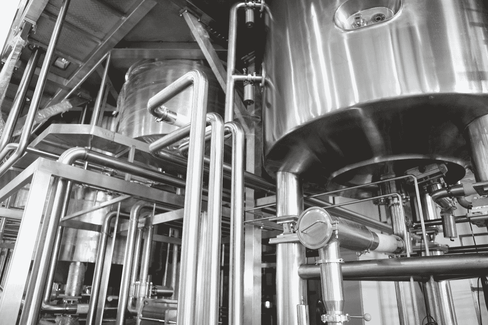

# 工业中的人工智能:如何利用传感器的准确性来创建增强数据

> 原文：<https://towardsdatascience.com/ai-in-industry-how-to-use-sensors-accuracy-to-create-augmented-data-86c685a98379?source=collection_archive---------88----------------------->

了解如何通过估算传感器的准确性来扩充数据集，从而克服标注数据的不足。本文通过使用 Tensorflow 和 Scikit-learn 在一个工业案例上的实际实现来说明。



[郭锦恩](https://unsplash.com/@spacexuan?utm_source=medium&utm_medium=referral)在 [Unsplash](https://unsplash.com?utm_source=medium&utm_medium=referral) 上拍照

> 深度学习算法确实需要大量的数据！(委婉……)

当可用的标记数据不足以达到良好的准确度水平时，用于图像识别的标准技术是创建“增强图片”。

原理很简单:你可以创建同一只狗的人工图片，并进行或多或少的细微变化，这将有助于你的模型微调其网络权重，并最终提高其准确性，而不是只给你的深度学习算法提供一张狗的图片。

原始图片的经典修改将会以以下形式出现:

*   **对称(水平、垂直)**
*   **旋转(角度)**
*   **宽度或高度移动**
*   **缩放、剪切、颜色或亮度变化**

它们可以用 [Tensorflow](https://keras.io/api/preprocessing/image/#imagedatagenerator-class) 中的几行代码轻松实现:


伯爵，我可爱的狗🐶(原图)

```
from tensorflow.keras.preprocessing.image import ImageDataGeneratortrain_datagen = ImageDataGenerator(
    rotation_range=10,
    horizontal_flip=True,
    vertical_flip=False,
    width_shift_range=0.1,
    height_shift_range=0.1,
    #zoom_range=0.2,
    #brightness_range=(0.1, 0.9),
    #shear_range=15
    )
```

我总是对我的狗很好(即使是虚拟的！)所以我故意限制了转换！


扩增克隆人伯爵！

**很容易理解，这种机制对于图片来说是合理的，因为这些变化不会影响主体**，并且它还将帮助您的模型解释具有不同方向、颜色等的狗图片..

# **是否有可能将该技术应用于工业过程数据，以达到更高水平的预测准确度？**


照片由[郭锦恩](https://unsplash.com/@spacexuan?utm_source=medium&utm_medium=referral)在 [Unsplash](https://unsplash.com?utm_source=medium&utm_medium=referral) 上拍摄

让我们探索一个我过去工作过的用例。数据集(经过净化、规范化和预处理)存储在[这里](https://drive.google.com/file/d/1-0b5dL9sCobVOGu1czYvxSUex2ArGmJa/view?usp=sharing)并且具有 250 x 52 的形状。

尽管每周 7 天、每天 24 小时、每 30 秒测量一次工艺参数，但由于获取一个样品的难度和成本，对应于最终产品浓度的标签数量是有限的。采样频率通常在 3 到 4 天左右。

这个小数据集的每一行都对应于在获取样本之前的最后 30 分钟内过程参数的平均值。

在评估了“经典”机器学习模型(RandomForest、SVM 和 GradientBoostedRegressor)之后，我惊讶地发现，根据所选的度量标准:**平均绝对误差**，一个简单的 Keras 模型正在实现最佳精度。

这个“不太深”的学习架构设计如下:

```
model = keras.Sequential([
# The 1st layer as the same shape as the number of input features
        layers.Dense(df.shape[1],
                     activation='relu',
                     input_shape=[X.shape[1]]),
        layers.BatchNormalization(),
        layers.Dense(12, activation='relu'),
        layers.BatchNormalization(),
        layers.Dense(1)
])
```

深度学习模型没有嵌入式交叉验证方法，因为在处理大量数据时通常不需要。

**然而，当处理这样的小数据集时，训练/测试分割操作可以输出非常不同的配置，并且确实需要一个。**

经过 5 k 倍交叉验证后，该 Keras 模型的平均绝对误差达到了 **2.4** (相当于 4%的相对误差)。

是的，这不是一个非常高的精度，但从现场的角度来看，这仍然意味着从"**盲目地在每个样品之间"**"切换到"**"在每一个时刻获得一个非常好的产品浓度估计值！**”

让我们来看看这篇文章的核心:**我们的样本测量过程的统计评估(通过 ANOVA gauge R & R)确定了一个** **2%的相对准确度。**

简而言之，当我们测量 100 时，真实值可能是 98 到 102 之间的任何值。

当我与一位专门从事深度学习和图像识别的数据科学家同事讨论时，我抱怨说，我不可能像他那样为工业过程产生增强数据！

这就是他建议利用传感器的准确性来创造人为值的时候！

```
**X1, X2, X3, ..., X51 => Sample measurement at 100**could actually corresponds to:**X1, X2, X3, ..., X51 => Sample measurement at 98**
or
**X1, X2, X3, ..., X51 => Sample measurement at 99.5**
or
**X1, X2, X3, ..., X51 => Sample measurement at 100.2**
or
**X1, X2, X3, ..., X51 => Sample measurement at 101**
etc.
```

问题是:它是否会帮助我们的模型获得比仅用初始数据集训练时更高的精度？

答案是…


乔恩·泰森在 [Unsplash](https://unsplash.com?utm_source=medium&utm_medium=referral) 上的照片

至少，对于这个非常特殊的用例！

我玩的“超参数”是:

*   **传感器的估计精度**:我决定谨慎行事，只考虑 1%
*   **初始数据集的复制因子**:我用过 1，2，5，10。这是什么意思？

复制因子为 2 时，最终数据集将是以下内容的组合:

*   初始数据集

*   一个扩充数据集，基于初始数据集，但其大小是初始数据集的两倍，标记的数据与原始值相差 1%:

```
Initial row: **X1, X2, X3, ..., X51 => 100**Final rows:
**X1, X2, X3, ..., X51 => 100 (initial)
X1, X2, X3, ..., X51 => 99.5 (augmented)
X1, X2, X3, ..., X51 => 100.2 (augmented)**
```

我见证的改进如下:


```
MAE Initial:             2,404342MAE (Replication x 1):   2,222344 (-0,18)
MAE (Replication x 2):   2,240588 (-0,16)
MAE (Replication x 5):   2,200172 (-0,20)
MAE (Replication x 10):  2,343116 (-0,06)
```

这种方法有明显的好处，但我想补充以下注意事项和警告:

*   **复制因子的“最佳点”似乎位于 2 和 5 之间:** -低因子(< 1)不会对数据集产生真正的显著改进。
    -超过 5 将开始添加许多与实际值相比的随机值，精确度的提高可能会很快下降(只要看看 10 个复制因子的结果)。
*   **我没有试图增加 X 数据集**，因为这里的例子中的输入特征已经是过去 30 分钟的平均值，因此，与“y”上的唯一采样相比，不容易出现不准确。
*   **一些非常特殊的训练分割配置**(尤其是在非常小的数据集上)**与不利的扩充数据随机化相结合，可能会导致实现比初始模型性能更低的性能**。
*   **只能在列车测试分割后执行增强过程**！否则，一些几乎相同的值将落入训练集和测试集中。该算法将很容易推断出测试集中的值，如果它已经用它的几乎孪生兄弟训练过的话…这将错过训练和测试样本的全部意义。

# 长话短说:像往常一样，盲目复制粘贴这种技术是有风险的！

为了帮助您自己运行这个示例，并可能提出一些问题、评论、顾虑或想法，这里有相应的笔记本(最初创建于 Google Colab)。

请注意，出于保密原因，带标签的数据(y)也已标准化。因此，你应该在 **0.035** 和 **0.055** 之间找到 MAE。

[](https://pl-bescond.medium.com/pierre-louis-besconds-articles-on-medium-f6632a6895ad) [## 皮埃尔-路易·贝斯康德关于媒介的文章

### 数据科学、机器学习和创新

pl-bescond.medium.com](https://pl-bescond.medium.com/pierre-louis-besconds-articles-on-medium-f6632a6895ad)