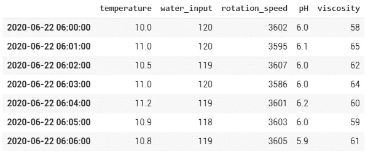
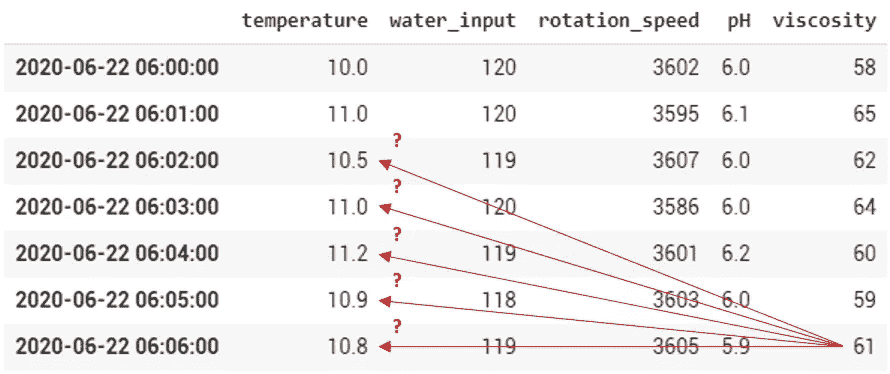
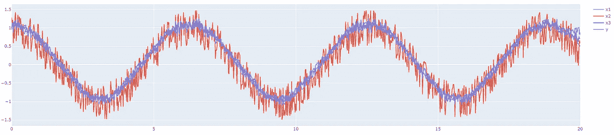
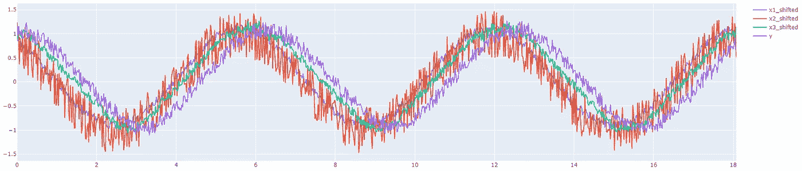
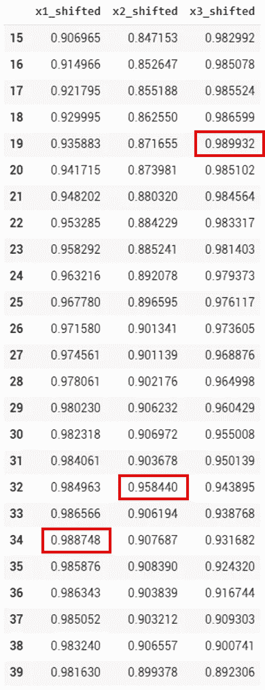

# 工业中的人工智能:为什么你应该同步时间序列中的特征

> 原文：<https://towardsdatascience.com/ai-in-industry-why-you-should-synchronize-features-in-time-series-f8a2e831f87?source=collection_archive---------76----------------------->

## 用几行代码提高模型的准确性，避免这个常见的陷阱。


Alexander Schimmeck 在 [Unsplash](https://unsplash.com?utm_source=medium&utm_medium=referral) 上的照片

你不需要成为数据科学家就能体会这种感觉:现在是冬天，你早上打开“热”水龙头，需要几秒钟(有时更久)水才能从冷的温度升到理想的温度。

原因很明显:热水需要时间从锅炉流到你手里。而且，换个说法，这两件事(要热水和得到一些)是“不同步”的。

如果你想在 t 时刻达到一个特定的温度，你必须预测水通过管道需要多长时间。

# 这与工业中的建模过程有什么关系？


[郭锦恩](https://unsplash.com/@spacexuan?utm_source=medium&utm_medium=referral)在 [Unsplash](https://unsplash.com?utm_source=medium&utm_medium=referral) 上拍照

当您提取历史数据时，通常会得到一个带有时间戳的时间序列作为索引。该时间戳对应于记录值的时间:



让我们假设产品的“**粘度**”是您的目标特性，并且在您的温度传感器和粘度计之间有一根 200 米长的管道。

当您在 06:06 测量粘度“ **61** ”时，同一时间测量的温度(10.8°C)是否会导致此结果？除非流量真的很快，大概不会！那么在建立机器学习模型时，应该考虑什么温度呢？



从工程的角度来看，你可以试着确定流速、管道直径等。猜猜产品从 A 到 b 需要多少秒。

# 从数据科学的角度来看，您可以使用数据本身来确定这种“不同步”并对其进行处理！

像往常一样，没有什么比一个简单的例子更好地理解我们如何应对这个问题了。

我们将创建 3 个循环特征(x1、x2 和 x3)和相应的目标“y”，作为所有这些特征的加权组合。



让我们来计算一下(显然很强！)x1、x2、x3 和 y 之间的相关性:

```
**df.corr().loc["y",:]**x1    0.989357
x2    0.961574
x3    0.990654
```

现在，让我们在 x 特征和 y 特征之间引入一个随机延迟，因为在现实生活中，在“x1”、“x2”或“x3”上的变化确实影响“y”上的测量之前，应该需要几秒、几分钟甚至有时几小时。

(x1 移至-34；x2 移至-32；x3 偏移了-19)

这里的滞后现在是"**视觉上明显的**"但是让我们记住真实的情况要复杂得多！



我们现在可以将这个数据集视为我们的基线，因为“**去同步特征**是我们在现实生活中会得到的。正如您在下面看到的，功能之间的相关性已经急剧下降:

```
**df.corr().loc["y",:]**x1          x1_shifted
0.989141 -> 0.748233x2          x2_shifted
0.959595 -> 0.706007x3          x3_shifted
0.990252 -> 0.914779
```

现在只需循环每个特征并增加偏移值，以观察系数相关性如何演变。

当它达到其峰值时，那么它应该是目标和所述特征之间的实际滞后:

```
Best shift of x1_shifted at 34 with 0.9887480759856975
Best shift of x2_shifted at 32 with 0.9584397947951305
Best shift of x3_shifted at 19 with 0.9899320966442271
```

**这与数据集中引入的初始滞后相匹配！** (如果你没有看过，它们写在执行功能转换的代码下面。)

我们还可以查看 15 和 40 之间的行，以再次检查这些等级是否确实对应于相关峰值:



我们现在可以获取初始数据集，并根据相应的滞后移动每个要素。由于这一点，机器学习算法将创建一个模型，其中目标及其影响参数很好地同步，并获得最佳的潜在结果！

像往常一样，在我们结束这篇文章之前，有一些评论:

*   无论何时运行模型来预测目标，**“实时”数据集也应该以同样的方式重新同步**。
*   运行" **pandas 时使用的默认关联方法。DataFrame.corr** 为“ **Pearson** ”，适用于线性关系。如果你假设你的特征和目标有**非线性关系**，那么“ **Spearman** ”等级相关系数将是一个更聪明的选择。
*   我发现了一些案例，其中一个**数学奇点导致了一个从物理角度来看不可能的转变提议(太远或太近)**。这就是为什么与现场专家交叉验证这些变化总是更好。
*   **深度学习架构**，如**长短期记忆(LSTM)神经网络**也有能力管理这种特征的重新同步，但从计算角度来看，它通常更重。

[](https://pl-bescond.medium.com/pierre-louis-besconds-articles-on-medium-f6632a6895ad) [## 皮埃尔-路易·贝斯康德关于媒介的文章

### 数据科学、机器学习和创新

pl-bescond.medium.com](https://pl-bescond.medium.com/pierre-louis-besconds-articles-on-medium-f6632a6895ad)