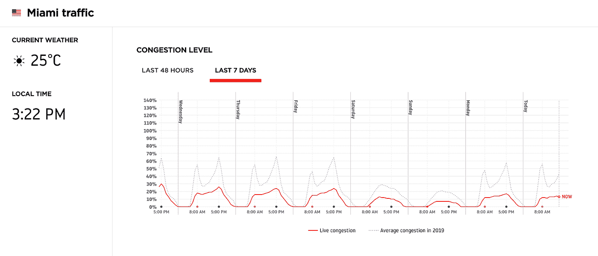

# 日冕时代的艾

> 原文：<https://towardsdatascience.com/ai-in-the-time-of-corona-c6d3193fada8?source=collection_archive---------22----------------------->

## 当过去与现在不再相关，我们如何预测未来？

## 如何在异常事件和极端环境中建立生产 AI/ML 的弹性

由车在[拍摄](https://www.shutterstock.com/image-vector/black-white-swans-silhouette-666360289)

# 极端环境的挑战

冠状病毒是 2020 年的黑天鹅。不仅病毒的最初出现是一个意想不到的极端异常事件，人类试图遏制病毒的反应正在通过运行世界的系统产生巨大的涟漪——健康、商业、金融、零工经济、信贷、商业、汽车交通和旅游，仅举几例。

黑天鹅事件给机器学习(ML)模型带来了特殊的挑战。ML 模型根据以前看到的观察结果进行训练，以预测未来的情况。然而，今天这些模型看到的事件与他们曾经接受的训练完全不同。许多企业(尤其是在信贷和金融领域)有 100 到 1000 个实时生产模型在他们的组织中运行，对影响他们未来业务成果的数据做出不正确的决策。未来几天/几个月可能出现问题的模型包括信贷、房屋定价、资产定价、需求预测、转换/流失模型、演出公司的供需、广告定价等等。

建立一个模型来预测模型从未在训练数据中观察到的场景是很困难的。标准的模型训练过程将尽可能多的数据投入到模型中，并帮助拟合跨事件通用的数据结构。真正的黑天鹅事件没有足够的跨其他事件的可学习结构，留给人们来填补数据和模型空白。那你是做什么的？

在[这篇博文](https://arize.com/blog/ai-in-the-time-of-corona/)中，我们将首先通过进入系统的一些极端范围的数据点来量化这个黑天鹅事件。其次，我们将介绍一些最佳实践，以便通过对生产模型进行强大的监控、分析和故障排除来掌控异常事件。

# 我们当前的环境有多极端

我们先问一下，现在的环境到底有多极端？

是**非常极端**。

当您查看今天从天气、失业数据、交通模式、用户支出进入生产模型的输入要素数据时，它将与模型的训练数据大相径庭。我们来量化一下。

首先，看看本周刚刚公布的失业数据。328 万人申请失业的读数是第二高读数的 4 到 5 倍，是一个+25 倍的 sigma 事件。

1995 年至今作者图表，资料来源——美国就业与培训管理局

任何使用失业数据作为输入并根据该数据做出决策的模型都使用了一个超出期望值超过**20σ的特征。这是一个预计每 10 万年发生一次的**事件**！这只是一系列极端事件中的一个例子，这些极端事件正被输入到制定日常商业决策的模型中。**

一个模型不可能完美地处理每一个意外的输入。记住这一点，重要的是要考虑整体系统对这些输入的弹性以及在问题出现时进行故障排除的能力。最重要的是团队要有可观察的模型；如果你不能观察，你就不能适应。这意味着对模型决策进行检测+分析。

所需的模型可观测性:

*   异常事件应该是可以检测到的，并且会自动浮出水面
*   异常值事件应与分析联系起来，以便对模型响应进行故障排除

很明显，失业数据将会严重偏离分布。

让我们看看汽车交通的数据。

来源于 [TomTom 国际](https://www.tomtom.com/en_gb/traffic-index/new-york-traffic)

纽约市从周三(3 月 18 日)到周二(3 月 24 日)测量的交通流量。上周，流量已降至日流量的 20%左右，或日流量的 1-10%。

这一跌幅远远超出了预期的每日价值，也只是一个模型可能预期的一小部分。

来源于 TomTom 国际公司

据测量，迈阿密的交通流量没有纽约下降得多。看起来迈阿密人不像纽约人那样积极接受隔离。在这种情况下，使用交通量作为输入要素进行特定于城市的预测的 ML 模型的输入变量会因城市而异。

所需的模型可观测性:

*   监控输入数据的分布变化
*   针对模型输入的强大拼接和过滤功能

在这一周里，我们已经看到人工智能没有为冠状病毒产生的事件做好准备。[天气预报预测一直不准确](https://www.aljazeera.com/news/2020/03/weather-predictions-affected-coronavirus-outbreak-200326104501955.html)，我们也看到银行考虑人工智能模型可能无法应对[市场低迷](https://www.americanbanker.com/opinion/ai-models-could-struggle-to-handle-the-market-downturn)。

# 在这些极端时期建立弹性

对于面临这些快速变化的企业来说，目前在生产中使用的人工智能/人工智能模型是根据与今天的情况*非常不同*的数据进行训练的。

当一个企业的模型之前没有看到这些观察结果时，它应该做什么？换句话说，当过去与现在不再相关时，我们如何预测未来？

随着新冠肺炎继续影响许多人类系统，**利用人工智能/人工智能的企业将不得不** **在他们的生产环境中建立弹性**。随着模型性能的波动，企业需要实时监控生产模型，以了解模型输入是如何变化的，以及模型在哪些方面存在不足。

## 进去的东西必须出来

这一切都始于数据进入用于生成预测的模型。

如果罕见事件和其他极端事件之间有相似之处，有一些方法可以将预测组合在一起，以创建一个基准期并进行分析。如果一个罕见的事件在输入数据结构中与训练集中的任何其他数据组都没有关系，您仍然需要监视它如何影响模型。

就新冠肺炎而言，这些情景不仅仅是一次性的异常值，而是数以百万计的快速演变的趋势，这些趋势正在世界各地不同的城市发生，所有这些趋势都有不同的时间表和反应。展开场景的规模需要许多不同的分析和检查，跨越许多不同的预测子群。

以下是 AI/ML 模型在生产中应该具备的一些输入级监视器:

*   输入检查，以确定特性的值和分布是否与正常的基准期有很大不同
*   检查单个事件或少量最近发生的事件，检测不在分发范围内的问题
*   检测您的模型最敏感的特征是否发生了巨大变化
*   用于确定特征与训练集的距离的统计数据

## 模型反应如何？

一旦您知道模型的输入已经改变，接下来要监控的是模型如何响应极端输入。

*   检查特定预测子类的模型性能。某些行业，如能源、航空或旅游，可能存在重大风险。你需要快速在线检查各种预测
*   使用以前的周期来产生最坏情况和基本情况，然后与结果进行比较
*   根据你收到的每一个新的真实事件(真实世界的预测反馈)实时监控预测
*   如果现实世界的反馈由于时间滞后而不可能，那么使用代理指标——您可以预测和测量的东西来确定模型的性能

# 极端环境下生产 ML 模型的最佳实践

在 Arize AI，我们每天都在思考生产环境中的 ML 可观察性和弹性。我们的目标是在这个不确定的时期将我们的一些经验传授给你的团队。生产 ML 模型的最佳实践与生产软件的最佳实践相差不远——构建可观察性工具，以了解模型或软件处于活动状态时发生的情况，从而在问题影响您的客户之前发现问题。

根据我们在许多公司部署 AI/ML 模型的背景，我们分享了在这些极端环境下生产 ML 模型的一些最佳实践。

1.  **跟踪和识别异常事件**

这包括跟踪异常事件的输入数据和模型性能。注释这些事件并能够过滤异常事件有助于为未来的极端环境收集训练数据。考虑是否在数据中包含异常事件以用于未来的模型训练也很重要。该模型将积极应对未来的极端情况，但它也可能认为极端情况是新常态。

**2。决定模型后备计划**

在过去，当你的模型没有什么可以借鉴的时候，它会做什么？了解您的模型过去在极端环境中的表现有助于了解您的模型现在的表现。如果你的模型表现不好，你能根据最近 N 分钟或 N 天建立天真的预测，并将你的模型表现与这个天真的模型进行比较吗？

**3。寻找相似事件**

你对过去的类似事件有足够的观察能力来为当前的情况建立相似的模型吗？例如，如果您的模型将失业数据作为输入，您可能能够利用类似经济衰退(如 2008 年衰退)的失业数据。

**4。构建多样化的模型组合并比较模型性能**

对外部世界做出反应的实时模型今天可能比批量预测表现得更好。拥有多样化的模型组合使团队能够比较模型性能，并将流量路由到对极端环境反应更好的模型。

**5。当模型性能无法提高时，要知道模型预测的不确定性。**

有时候，可能没有好的模型。在这些情况下，你知道你的模型有多不确定吗？在这种情况下，考虑一种贝叶斯方法，在这种方法中，返回模型的预测及其置信度。

# 保持安全并监控您的模型！

## 参考

1.  [半岛电视台:天气预测影响冠状病毒爆发](https://www.aljazeera.com/news/2020/03/weather-predictions-affected-coronavirus-outbreak-200326104501955.html)
2.  [美国银行家:人工智能模型可能难以应对市场低迷](https://www.americanbanker.com/opinion/ai-models-could-struggle-to-handle-the-market-downturn)

*感谢优步市场高级工程经理钦坦·图拉希亚对本文的编辑。*

## 联系我们

如果这个博客引起了你的注意，并且你渴望了解更多关于[机器学习可观察性](https://arize.com/platform-overview/)和[模型监控](https://arize.com/model-monitoring/)，请查看我们的其他[博客](https://arize.com/blog/)和关于 [ML 监控](https://arize.com/ml-monitoring/)的资源！如果您有兴趣加入一个有趣的 rockstar 工程团队，帮助模型成功生产，请随时[联系](https://arize.com/contact/)我们，并在此处[找到我们的空缺职位](https://arize.com/careers/)！