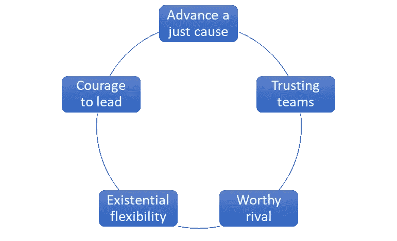

# 人工智能是一个无限的游戏——你的公司有合适的游戏计划吗？

> 原文：<https://towardsdatascience.com/ai-is-an-infinite-game-does-your-company-have-the-right-game-plan-for-it-b55bf8580685?source=collection_archive---------42----------------------->

## 许多公司仍然在努力为他们的业务采用更大规模的人工智能。他们心态的转变可能有助于他们做得更好。

AI 是一个无限的游戏。(图片由 iStock photo 提供)

# 需要什么类型的战略思维来充分发挥人工智能和数据智能的潜力？

受 Simon Sinek 的“有限”与“无限”策略概念的启发(“无限游戏”，2019 年)，本文试图挑战组织和领导者在从事人工智能(AI)计划时的思维模式。你如何参与这项改变游戏规则的技术，在人工智能和机器学习概念不断发展并改变业务基准的市场中，你需要什么来保持竞争力？

我认为目前的许多方法都存在根本性的错误。人工智能采用计划通常仍然是半心半意的，甚至是市场和投资者的托辞活动。但是，这样一个要求苛刻的环境需要一个适当的长期愿景和战略，这足以推动必要的业务和组织变革。这就是 Sinek 描述的“无限”心态。相比之下，“有限的”人工智能策略更关注眼前的挑战，比如通过为产品添加单一智能功能来赢得当前市场，或者通过基于自动化的成本降低来击败当前竞争对手。这可能是一个聪明的开始方式，但如果不致力于更长远的愿景，这是否会混淆为旅程建立组织所急需的战略投资重点。

然而，需要强调的是，不应孤立地看待人工智能。它是一个更大的数字技术和概念生态系统的先锋，目前正在改变我们周围的世界。

几年来，IT 行业一直在谈论人工智能能力的更广泛采用——甚至产业化。我们可以看到基础技术、数据和解决方案生态系统以及多行业概念采用方面的显著进步。期望仍然很高。例如，普华永道 2017 年的一项研究预测:[*“2030 年，人工智能可能为全球经济贡献高达 15.7 万亿美元，超过中国和印度当前产出的总和*](https://www.pwc.com/gx/en/issues/data-and-analytics/publications/artificial-intelligence-study.html) ”

我们还没有看到的是，全球对人工智能的巨大投资如何接近为大多数企业产生相应的结果。一些精通数据的公司正在努力取得成功，并在旅游、保险、投资或娱乐等行业树立了新的基准。然而，许多组织仍然在努力应对人工智能的新世界，许多人工智能计划仍然没有比概念证明或原型状态更进一步。

但是，如果试错是任何创新过程的自然组成部分，为什么这是一个挑战呢？问题是，这些公司中的许多根本不适合迭代创新过程，因此很可能在他们有机会成熟之前就停止努力。所谓“速赢”和“快速结果”的僵化文化限制了有效人工智能和数据驱动创新的机会空间。利用基于数据的自动化或创建智能用户体验既需要颠覆现有流程，也需要基础架构和应用程序具备更高的灵活性。这对于任何遗留系统或思维定势来说都是一个重大挑战。

无限商业思维专注于为执行长期战略创造合适的条件，而不是赢得眼前的短期游戏。在游戏规则不断变化的背景下，这是有意义的，就像人工智能这样的新兴领域一样。我相信，对无限游戏机制的理解可以为公司提供巨大的杠杆，使他们的人工智能工作更加有效。

那么，为什么人工智能的采用是一个无限的游戏——你怎么玩它？

# 从组织人工智能采用中吸取的经验教训

通过多年参与高级分析、数据挖掘、机器学习和人工智能概念，我的个人和专业热情一直是将这些概念应用到现实世界的商业应用中。与许多优秀的同事一起，我学到了很多东西。然而，许多公司在扩大其人工智能概念和组织时，仍然会遇到非常相似的挑战。

在我看来，这往往是由于对我们所处游戏的误解造成的。这不仅会导致错误的决定；它往往会在一开始就引发错误的讨论。想想自制或购买和技术策略、团队构成或市场策略，以及它们在长期战略承诺下会如何变化。人工智能计划通常始于管理层和组织的善意和热情。然而，令管理层感到惊讶的是，单个人工智能项目很少有积极的短期甚至中期投资回报。基于人工智能的解决方案的启动投资和所需的成熟时间需要更长的投资视角，涵盖概念的多代，并包括相关的用例。项目团队和数据科学家更擅长创建功能，以服务于组织的长期人工智能支持，而不是为少量预定义的问题构建单点解决方案。

人工智能的采用没有明确的开始、中间或结束，只有一个发展能力和扩展数据集和用例的过程。

**无限人工智能采用战略的要素**

那么，你如何为不断发展的事物做计划，包括技术、生态系统以及不要忘记用户的采用？

*   **业务关键用例**
    健康的人工智能应用最重要的先决条件是强大的用例以及长远的眼光。当数据可用并且建立了最佳实践时，在开始时试验较简单的问题通常是明智的。但是为了确保战略影响和持续的管理，你的人工智能战略需要解决关键业务用例。需要明确的是，将人工智能驱动的概念投入生产从来都不是一件容易的事情。它包括对基础设施、能力、销售和维护流程的重要要求，并且不要忘记专门的合规性和治理。因此，选择的用例必须能够证明所有需要的启动工作。
*   **从“人工智能至上”转向“人工智能优先”的理念。实现人工智能概念的全部变革潜力需要重新设计相关的业务流程，通常还需要重新设计底层的业务模式。这意味着组织需要时间来成熟他们的概念理解，从将人工智能能力置于现有结构之上(“人工智能之上”)到围绕人工智能能力重新设计他们的解决方案(“人工智能优先”)**
*   **敏捷项目管理连接到高层次的长期路线图** **承诺**。
    技术，以及我们对其可能性的理解，都在不断变化。项目优先级和解决方案细节应该能够灵活地改变，并相应地成熟。里程碑很重要，但它们应该用于根据长期战略评估和调整当前任务，而不是用于“停止/继续”评估逻辑，这种逻辑会助长错误的优先级和负面的项目氛围。
*   **制造和购买策略**
    围绕你的人工智能解决方案创造自己的知识产权可能是一项战略资产，但成本高昂，需要持续努力。作为一个经验法则，如果人工智能应用领域接近他们的价值产生过程和核心商业模式，并且如果知识产权难以复制，组织应该只追求它。对于大多数公司来说，这封信将不会围绕开发新的算法或工具，而是围绕数据集和功能的特殊组合，他们为自己的特定用例建模和调整。其他一切都可以而且应该从外部获得，要么是开源的，要么是打包解决方案的专业供应商。

# 人工智能咨询实践的教训

人工智能的采用不仅对产品和服务组织来说是一个挑战，当将人工智能纳入其咨询和基础设施实践时，对技术和商业服务提供商来说也是如此。此类计划通常始于向现有的分析团队添加数据科学家和/或向他们现有的精通数据的咨询团队添加新技能。这可以产生一个非常强大的技能组合，可以支持从后端应用程序、数据基础架构、分析到数据科学组件的整个数据价值链。

这是一笔巨大的资产，在市场上需求量很大。但这并不能保证成功。许多这样的咨询公司很难通过他们的人工智能计划获得足够多的资金，并且需要多年来通过传统的面包和黄油项目获得资金。

这个问题的一个原因是对人工智能概念更强的应用关注，以及作为人工智能团队的一部分对软件开发和用户体验技能集的相关需求。如果人工智能概念可以推动决策或流程自动化，那么它们将是最强大的，这反过来需要与业务应用程序和流程紧密集成。这是与传统的分析和报告概念的主要区别，传统的分析和报告概念通常侧重于向最终用户呈现见解。

尽管许多服务提供商已经建立了这样的多学科团队，但其中大多数都面临着扩大人工智能相关咨询实践的挑战。在我看来，建立一个成功和可扩展的人工智能咨询产品的成功因素是专注于产品中的一个或几个专门的人工智能用例领域，然后围绕这些领域建立相关的能力集群。一名优秀的数据科学家可以处理任何类型的用例，但扩展业务服务需要围绕一系列用例、选定的行业或选定的人工智能概念建立共享的 IP 堆栈。这是在整个团队中推进方法和工具堆栈以及共享最佳实践的基础，这对相关的营销和销售过程同样重要。人工智能通过用例及相关的好处进行销售，而不是通过使用的方法或工具。这样的人工智能概念可能会让专家们兴奋，但它们的价值很难向最终用户解释清楚。专注于行业或用例的咨询实践可以更好地将客户对话引向新的人工智能功能和相关的商业机会。

# 一个公司玩无限游戏需要什么条件？

人工智能的采用不是孤立发生的事情。总是局限于一个公司的文化和战略。只有整个公司都做好了玩的准备，知道了无限游戏的规则，才能在新的领域应用。在他的书《无限游戏》中，S. Sinek 定义了一些实现无限策略的一般元素，我认为这些元素提供了一个很好的起点:

图一；无限策略的要素；来源:S. Sinek，无限游戏，2019

**推进正义事业**
无论你的企业是什么，为了给你的员工提供长期的动力，你需要为你的企业找到并追求一个真正的“正义事业”。正义案例可以是直接或间接有利于社会、人类发展或支持例如地球和自然保护的事情。乍看之下，可能更容易看出这样一个正义的事业对于非政府组织或社会和政府组织来说应该是什么样子。然而，所有组织都是整个社会的一部分，因此可以追求正义的事业。它可以为学校的健康膳食做出贡献，为其他企业提供融资，以促进地区经济发展。其他公司致力于探索技术创新，以推进气候保护或社会包容等社会关键任务，提高人们的生产力。正义的事业激励我们今天、下个月甚至十年后继续玩这个游戏。

信任团队
对于组织的长期成功来说，团队中的相互信任比规则和绩效体系更重要。相互信任为所有人创造了一个富有成效的工作环境，在这个环境中，他们可以感到精神上的安全。一个信任的团队将加强一种支持性的学习文化，这对于多学科团队的最佳运作是必不可少的。数据科学项目高度依赖于团队和组织对过程和结果的批判性评估能力。一个最终的解决方案通常是方向和方法的多次迭代和改变的结果。这种创造性和关键性的合作需要团队成员之间高度的信任和尊重。

值得尊敬的对手
在他的书中，Sinek 对竞争者和值得尊敬的对手做了重要的区分。竞争对手是你试图在争夺合同或客户的“有限”竞争中击败的人。一个有价值的对手是一个能挑战和激励你的人。你们一起定义和发展你们所处的市场。根据 Sinek 的说法，20 世纪 80 年代的苹果是“值得竞争的对手”心态的一个很好的例子，当时他们推出了小型个人电脑，而其他人，尤其是 IBM，仍然在投资客厅大小的商业机器。IBM 加紧了这场游戏，并通过仅经过 12 个月的开发就推出他们自己的个人电脑来应对挑战。苹果随后做出了一个惊人的公关举措，在*华尔街日报*上用整版广告欢迎 IB，广告中写道:
“欢迎来到自 35 年前计算机革命开始以来最激动人心和最重要的市场。[……]将真正的计算机能力掌握在个人手中，已经在改善人们工作、思考、交流和休闲的方式。”(S. Sinek，《无限游戏》，2019 年)

在由人工智能和数据智能驱动的新兴市场中，制定自己的战略很重要，但同时也要选择值得你追随的对手，然后与之竞争。与此同时，重要的是要明白，这将需要所有或大多数现有的球员，以建立这个巨大的和快速移动的新空间的生态系统。更重要的是，与每个人竞争是为了确定你想在其中扮演什么角色，以及你如何从其他人那里获益

存在的灵活性
在 IT 市场有一种普遍的说法，即公司必须拥抱灵活性，以收获人工智能采用中的转型能力。尽管我非常同意这一点，但我想补充一点，无限的心态是在战略层面上实现灵活性的基本促成因素。只有关注长期愿景和目标，才能提供重新思考方法和策略的自由。相比之下，短期有限的商业策略几乎没有给真正的创造力留下空间。

一家公司的商业思维通常直接体现在组织采用人工智能的优先顺序上。有限采用策略通常从关注成本降低和日常操作的自动化用例开始。虽然这可能会很好地工作，并为公司带来一些短期结果，但它并没有为推动和发展业务模式本身提供实质性的杠杆作用。思维有限的公司通常认为自己被市场的创新者和颠覆者追逐，而无限的参与者则设法释放新技术的潜力，让他们重新定义自己。

**领导的勇气**
存在灵活性指的是改变你的整个商业模式和取代传统做事方式的能力和意愿，通常是在当前商业模式仍然成功的情况下。
拥有无限思维的领导者会发现推进其事业的战略机遇，但只有强有力的领导者才能抵制短期胜利的诱惑，挽救选择。在现有策略似乎仍然有效的情况下，投资新策略需要勇气。所以，一个正常的商业反射就是驱使人们保存当前的状态。但从长远来看，所有保护和补贴旧战略或方式的努力都会削弱组织的财务和精神能力。在问领导的勇气应该来自哪里时，Sinek 也提出了一个很好的观点。它很少是个人生活改变的结果。通常，勇敢的领导是小步骤和决定的总和，由正义的事业激励和引导，并由值得尊敬的对手推动。

当前人工智能顶级研究社区的许多人都相信，我们仍然处于人工智能技术采用的非常初级的阶段，我们仍然远远无法想象商业和社会的相关变化。例如，我推荐计算机科学家和机器学习研究员迈克尔·乔丹的伟大文章*[【人工智能——革命尚未发生】](https://medium.com/@mijordan3/artificial-intelligence-the-revolution-hasnt-happened-yet-5e1d5812e1e7)。因此，我认为，在这种环境下，公司最重要的技能是将变革作为企业文化的一部分。*

***人工智能的采用是一个无限的游戏——让我们也这样玩吧。***

***参考文献:***

*Simen，Sinek《无限游戏》，企鹅商业 2019*

*确定奖品的大小；[普华永道全球人工智能研究:利用人工智能革命](https://www.pwc.com/gx/en/issues/analytics/assets/pwc-ai-analysis-sizing-the-prize-report.pdf)，普华永道 2017*

*迈克尔·乔丹《人工智能— [革命还没发生叶](https://medium.com/@mijordan3/artificial-intelligence-the-revolution-hasnt-happened-yet-5e1d5812e1e7) t》，中 04–2018。*