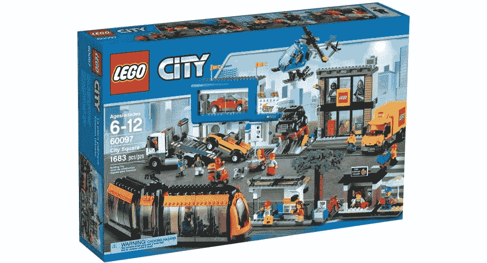

# AI 正在走向错误的方向

> 原文：<https://towardsdatascience.com/ai-is-heading-the-wrong-direction-dc758f7e870?source=collection_archive---------15----------------------->

## 意见

## 衡量标准很重要，但我们遵循的是错误的标准

在 [Unsplash](https://unsplash.com?utm_source=medium&utm_medium=referral) 上 [NeONBRAND](https://unsplash.com/@neonbrand?utm_source=medium&utm_medium=referral) 拍摄的照片

四天前，[汉娜·肯纳写了](https://www.technologyreview.com/2020/08/18/1007196/ai-research-machine-learning-applications-problems-opinion/)

> “太多人工智能研究人员认为现实世界的问题无关紧要。社区对新方法的过度关注忽略了真正重要的东西。”

这不是第一篇(也不会是最后一篇)讨论人工智能社区如何遵循自己议程的文章。大型场馆公然忽视申请文件——工作侧重于将当前方法应用于现实世界的问题和这样做的挑战(有很多)。诉讼程序完全脱离现实。物体检测上额外的 10%远比癌症死亡率减少 1%更有价值。

人工智能社区在很大程度上忽略了一个显而易见的事实:深度学习是一门实验科学。尽管有其正式的根源，神经网络是难以解释的大规模非线性系统。尽管越来越多的工作致力于它们的解释，神经网络仍然像以往一样神秘。我们了解它们的唯一可靠工具是科学方法——它深深植根于实验之中。

矛盾就在这里:**尽管本质上是实验性的，这个领域拒绝纯粹的实验。**平均神经网络论文呈现其新颖性，尝试形式化证明，并做消融研究。
*结尾*。这是实验的极限。

想象一下，如果土木工程界决定发明新颖的桥梁设计，但选择在桌子大小的乐高复制品上进行所有验证。没有昂贵的模拟，也没有使用真实建筑材料的试验。你会相信新提出的设计吗？你会相信这些实验足以投资数百万美元来实现它们吗？我不这么认为。

面向建筑商的 ImageNet—[获得您的](https://www.amazon.com/LEGO-60097-City-Square/dp/B00SDTYXVM)。

简化的世界模型对于快速原型和尝试想法很有用。他们暗示好的设计，即使他们不能证明它们。为了实际的证明，你需要世界。这是一个*两步过程*。

现代人工智能研究停留在前半部分:基准测试。真正的用例是另一半——缺失的那一半。 ImageNet，COCO，CIFAR-10，以及 sort 都是 AI 的乐高。他们允许我们尝试新的想法，摒弃不好的想法。它们是很好的工具。然而，它们是达到目的的手段，*而不是目的本身*。

**消息是*而不是*当前的作品很糟糕，远非如此。问题是目前学术界和现实世界之间的脱节。**

考虑一下情节。它展示了 COCO 对象检测基准测试的最新进展。每个小点都是一个不同的模型——一项新技术或现有技术的混合。领导者以蓝色突出显示。

代码为[的论文 COCO 测试开发排行榜](https://paperswithcode.com/sota/object-detection-on-coco)

图表显示了从 2016 年 1 月的 28.8 AP 到 2020 年 7 月的 55.1 AP 的轨迹。进步是不可否认的。根据该图，EfficientDet D7x 是当前用于对象检测的最佳技术。然而，我问你:**你会为应用程序实现这些模型中的哪一个？**

你甚至不会回答的几率很高，因为你不知道我在说哪个应用程序，也不知道它的要求是什么。它需要实时运行吗？它能在移动设备上运行吗？它要识别多少个类？其用户对错误检测的容忍度如何？等等。

**根据不同的答案，以上都不值得考虑，包括 EfficientDet D7x。**例如，如果模型必须在手机上实时运行，这些模型中没有一个在性能上稍作调整。更糟糕的是，无法保证这些模型能够在连续的帧中产生一致的检测结果。我甚至想不出一款应用需要最高质量的检测，除了高精度之外没有其他要求。

**换句话说，研究团体追逐的指标只服务于团体本身，不服务于任何人。**

B ack 在 2015 年，将神经网络的深度增加到十几层以上不利于性能。何等人*、*在[著名的 ResNet 论文](https://arxiv.org/abs/1512.03385)中假设，通过跳接连接非连续层可以扩大容量，因为这将提高梯度流量。

在第一年，ResNet 在几个基准比赛中取得了优异的成绩，如 ILSVRC 和 COCO。到目前为止，你已经意识到这只是一个暗示，表明 ResNet 是一个重要的贡献——这不是证据。

ResNet 在人工智能历史上的地位的明确证据是建立在它之上的大量工作。ResNet 引人注目的方面是它解决的不相关问题的数量，而不是它赢得的比赛。而且，平心而论，真正的贡献是 skip 的想法，而不是架构本身。

同样，[焦损失论文](https://arxiv.org/abs/1708.02002)经受住了时间的考验，因为它的贡献给其他人的工作带来了真正的改善。[的关注文件](https://arxiv.org/abs/1706.03762)遵循同样的路线。每天都有一篇新文章展示注意力是如何提高某个基准的(而专注的损失会让它变得更好)。

重要的不是比赛。这是遗产。其实 AlexNet 在 2012 年就拿下了 ILSVRC，ResNet 在 2015 年就拿下了。你能说出 2013 年和 2014 年的获奖者吗？2016 年，2017 年，2018 年举办的挑战赛呢？你确定每年都有一个 ILSVRC 吗？

所以你可能会问，为什么会这样？为什么没有更好的基准或更有用的指标？**我们如何衡量遗产或影响？**

可悲的事实是…我们不能。我们可以使用引用次数或下载次数，或者 Reddit 提及次数或 GitHub stars。然而，这些都是有缺陷的指标。为了公平的比较，我们需要考虑每一个细节，同时将等式中的所有偏差标准化。这太难了。

例如，为了比较注意力的遗产和 ResNet 的遗产，我们需要考虑这些概念的任何成功使用，权衡它们的相对影响，并根据年龄(ResNet 更老)和范围(注意力也与文本相关)进行标准化。显而易见，量化这些属性是一项巨大的任务，很可能与任何基准或指标一样存在缺陷。《华尔街日报》的影响因子等观点甚至没有触及这个问题的表面。

**有些目标就是无法量化。谁是最重要的人物:被认为是西方音乐最有影响力的作曲家巴赫，还是被认为是最有影响力的戏剧家莎士比亚？比较他们的工作毫无意义，更不用说他们的领域了。**

巴赫还是莎士比亚，音乐还是戏剧？

这让我们走进了死胡同。我们可以衡量准确性，我们可以衡量速度，但我们无法衡量影响力。我们都同意我们需要更好的科学，但是我们如何判断一门科学比另一门好呢？我们如何衡量研究和现实之间的脱节？

我们想和 AI 一起前进，但我们不知道前进的方向是什么，也不知道我们已经走了多远。

这并不是艾一个人的问题。我们想要更好的政府，更好的医疗保健，更好的教育，但是我们如何真正量化这些东西呢？到目前为止，最不成功的方法(也是最流行的方法)是**替代指标。**surrogate 是一种替代品——我们用来代替其他东西的东西。比如 COCO AP 评分。

**我们无法衡量人工智能的进步，但我们可以衡量目前的物体检测方法有多精确。由于物体检测是人工智能的一部分，如果我们在这方面取得任何进展，我们也可以期待在人工智能方面取得进展。在 COCO 之前，我们使用 ImageNet Top-5 结果…直到我们搞定它，所以我们转向更具挑战性的问题。从一个问题跳到另一个问题，我们也希望在更好的人工智能方面取得进展。**

我们一直都这样。我们不能训练检测模型来提高它们的 AP，但是我们可以教它们减少包围盒坐标的 L2 损失。**损失是不可微度量的替代物。L2 损耗不是 AP，但是我们知道低 L2 损耗与高 AP 相关，所以它是有效的。**

曾几何时，识字率是许多国家衡量教育进步的主要标准。几十年后，识字率高到足以让重点转向更高的学校毕业率。然后，更高的大学出勤率。我不知道学位是否像我们认为的那样与教育相关，或者高中是否教授他们应该教授的内容，但这些是我们今天的目标指标。

**从某种意义上说，解决这类问题没有正确的方向。所以，从定义上来说，所有的路线都是错的。我们能够增加选择一条不那么错误的道路的几率的唯一方法是尽可能多地走这条路。使用人工智能术语，我们需要使用更大的批量，并尽可能多地采样分布。**

**这意味着我们必须拓宽我们的关注点，不仅要关注“准确性”和“速度”，还要关注“稳健性”或“一致性”等问题最重要的是，我们需要从精心挑选的基准转移到现实世界**。

鉴于我的个人帐户正在研究乳腺癌检测算法，很容易认为这个领域已经解决了。[最近的](https://arxiv.org/abs/1703.07047) [作品](https://ieeexplore.ieee.org/abstract/document/8861376)在题目上取得了超人的分数，然而，你没有看到这些算法在任何医院得到应用。原因很简单:行不通。

我知道这听起来有点牵强，但它非常简单:如果你在数据集 A 上训练，该算法在数据集 B 上不起作用，尽管它是同一个东西:乳房 x 光照片。今天没有一种已知的技术可以在一个数据集上训练，而不需要微调就可以在其他数据集上很好地工作。您必须为每台机器/医院建立一个数据集，以获得任何有用的结果。从公制角度来看，场已经解决了。实际上，它甚至几乎没有开始。

**最重要的是，算法很少甚至没有提供对答案的洞察。**站在医生的立场上:你会因为一台机器这么说而告诉别人他们得了癌症吗？你不会；你会再看一眼这些图像。如果人工智能不被信任，它将永远不会被使用。

到目前为止，出版作品的主要指标是 AUC 分数。它告诉你该算法如何将乳房 x 光片分类为良性和恶性。它没有告诉你它对其他数据集有多稳健，或者其中任何一个是可以解释的。**换句话说，它几乎没有回答:它有用吗？**

推进人工智能没有正确的道路，但肯定有非常错误的道路。业内人士不需要太多时间就能意识到大多数文献是多么不适用，真正紧迫的问题是如何被明显忽视的。就像我开头说的，**这篇文章的信息是*而不是*说现在的作品不好。关键是目前学术界和现实世界之间的脱节。我们过于狭隘地关注准确性。**

再次引用汉娜·肯纳的话，“社区对新方法的过度关注忽略了真正重要的东西。”在我看来，真正重要的是推进我们的社会——我们希望通过改善人工智能来实现这一点。然而，只有当我们面对真正的社会问题时，我们才能做到这一点。比精确的物体检测更复杂的问题。

欢迎评论或者[联系我](https://www.linkedin.com/in/ygorreboucas/)。如果你是中新，我强烈推荐[订阅](https://ygorserpa.medium.com/membership)。对于数据和 IT 专业人员来说，中型文章是 StackOverflow 的完美搭档，对于新手来说更是如此。注册时请考虑使用[我的会员链接。](https://ygorserpa.medium.com/membership)

感谢阅读:)