# 人工智能学习飞行(第 2 部分)|创建您的定制强化学习环境并训练您的代理

> 原文：<https://towardsdatascience.com/ai-learns-to-fly-part-2-create-your-custom-rl-environment-and-train-an-agent-b56bbd334c76?source=collection_archive---------10----------------------->

## Tensorforce 让定制强化学习变得简单

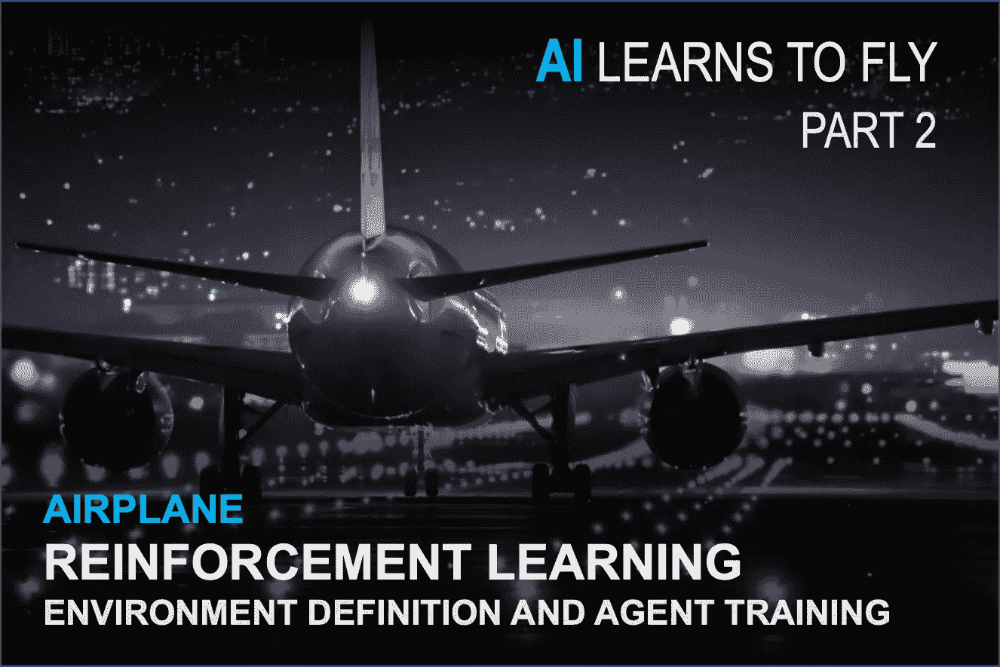

来源:Pixabay

> 从伊卡洛斯燃烧他的翅膀到莱特兄弟翱翔天际，人类花了几千年才学会飞行，但一个人工智能要多久才能做到？

# 介绍

大家好！

欢迎回到这一系列文章，我将写下我使用**人工智能**驾驶飞机的旅程(第一部分是[这里是](https://medium.com/@yannberthelot1/how-i-taught-a-plane-to-fly-using-rl-c170a152b771))。

在上一篇文章中，我们根据**代理的**动作定义了从一个**状态**到另一个状态的**转换函数**。

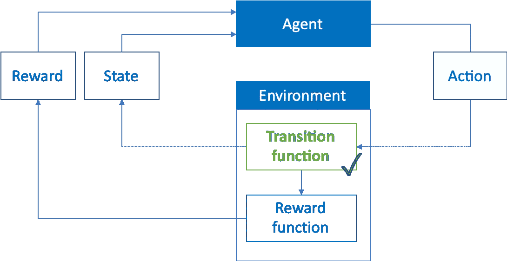

在本文中，我们将呈现一个**完整的例子**:

*   如何使用**Python**/**tensor force**轻松**创建你的**自定义 RL 环境****
*   如何在您的环境中定制、培训和测试**最先进的** **代理**。

我们首先简要回顾一下什么是**强化学习**什么是**。**然后我们要为今天的练习定义我们的**环境** ( **动作**，**状态**，**奖励**)(飞机会尽可能高效的学习起飞)。最后，我们将定义我们的**代理**(我们将使用的**代理**的类型、**超参数**优化、**训练、**和**测试**)。

# 什么是强化学习？

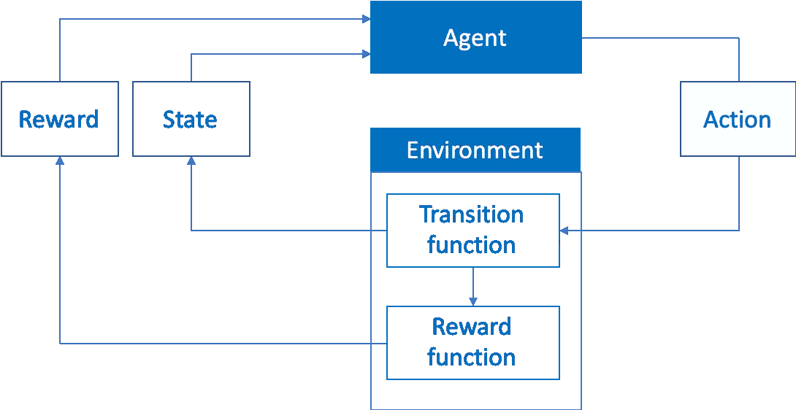

强化学习是机器学习的一个分支，它允许训练代理人如何根据当前状态选择最佳的行动序列，以最大化长期回报。这个动作序列被称为策略。强化学习通过**试错**模仿现实生活中的学习过程。

代理从一个给定的状态开始，它采取一个行动，然后观察其环境的状态，并因达到这种状态而获得奖励(或惩罚)。强化学习的目标是理解行动、状态和奖励之间的关系，以便找到在任何给定情况下采取行动的最佳顺序。这完全符合我们的问题，因为控制飞机可以很容易地描述为采取推力和俯仰动作的序列，从而实现最佳轨迹。

在我们的虚拟平面示例中，动作(推力和俯仰)和结果(奖励和新状态)之间的关系是已知的，因为我们在前一篇文章中已经设计了物理模型来计算它们。然而，它不为代理所知(否则它将变成规划而不是强化学习)。因此，代理必须了解其环境如何工作，以选择最佳的操作。

# 环境定义

如前所述，我们将使用 [**张量**](https://tensorforce.readthedocs.io/en/latest/) 来实现我们的工作。这个库允许我们相当容易地创建自定义环境，并进行大量的自定义。它提供了一种易于定制的先进代理的实现。Tensorforce 的自定义环境定义需要以下信息(来自 [Tensorforce 的文档](https://tensorforce.readthedocs.io/en/latest/basics/getting-started.html?highlight=environment#initializing-an-environment)):

**-Init** 不言自明，初始化创建环境所需的值(更多细节见[文档](https://tensorforce.readthedocs.io/en/latest/basics/getting-started.html?highlight=environment#initializing-an-environment)

**-状态**定义状态表示的形状和类型。在本例中，它由 8 个浮点数表示(因此它有 8 个连续的维度)。

**-动作**定义代理可用的动作的形状和类型。在本例中，代理有可能在 1、2、3 和 4 之间选择一个动作(其中每个动作将由环境处理以创建下一步，例如，我们可以在网格世界游戏中想象以下关系，1:向上，2:向下，3:向左，4:向右)。

**-重置**将环境恢复到其开始状态，以便开始新的一集。因此，它与**状态相同。**

**-Execute** 处理代理选择的动作，并收集新状态、奖励以及代理是否达到终止状态。

# 环境定制

现在让我们定制我们的环境吧！对于我们的第一个案例，我们将训练**机长**(我们的人工智能飞行员)学习如何起飞。我们将以它为例详细介绍所有步骤。

机长还不知道如何着陆，但没关系！(来源: [gfycat](https://gfycat.com/fr/sleepyjampackedauklet) )

## 状态和动作

让我们从定义我们的**状态**和**动作开始。**

为了能够学习如何飞行，我们希望机长观察飞机的位置和速度(水平和垂直)。因此，我们希望我们的状态空间是 4 维的(2 维用于水平和垂直位置，2 维用于水平和垂直速度)。

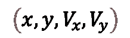

国家代表权

为了驾驶飞机，我们希望我们的机长能够控制飞机的推力(或功率)和俯仰(或方向)。推力将以 10%的增量(最大功率的 50%、60%、70%、80%、90%、100%)从发动机推力的 50%限制到 100%。这将有助于训练，将功率限制在飞行中实际使用的值。音高将被限制为实际的正值(从 0 到 15)。

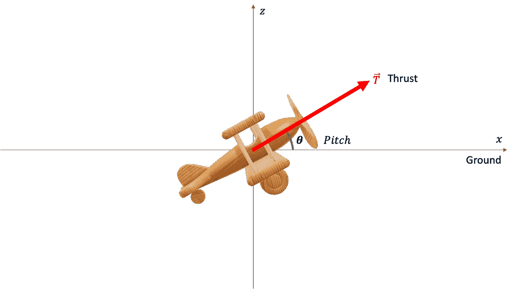

推力和俯仰

这导致了以下实现:

## 终端状态

现在让我们研究一下终端状态。我们将定义一集的三种结尾方式:

*   飞机到达 25m 高度(这是我们对起飞的定义)。
*   飞机在没有起飞的情况下冲出跑道(> 5 公里)
*   这一集持续了 100 多秒。

*自我。FlightModel.Pos[1]* 是飞机在跑道和*自身上方的垂直位置。FlightModel.Pos[0]* 它离跑道起点的水平位置。

## 奖励

下一步是奖励的定义。它们需要被设计成鼓励代理执行我们的任务，它需要被足够频繁地遇到，以便代理快速学习，同时足够精确，以便代理仅学习我们寻求的行为。我们希望我们的机长尽可能快地起飞，因此我们希望鼓励最短的起飞距离或最短的起飞时间(这两者是直接相关的)。

为了实现这一点，我们将对代理为达到目标所花费的每一个时间步骤进行惩罚。我们可以把它想象成起飞每一秒钟就从机长的银行账户里取出 1 美元。如果它达到目标(达到 25 米的高度)，我们也会奖励他，奖励金额将基于起飞时还剩多少跑道。我们可以把它想成大概是每剩余一米跑道给他 1 美元，以激励他使用尽可能少的跑道，同时也奖励他成功起飞。

## 执行

最后但同样重要的是，我们将使用前一篇文章中定义的转移函数，根据当前状态和动作(执行代理的动作)计算下一个状态和奖励。

转换函数( *compute_timestep* )在我们的飞机环境中定义如下:

对于您的定制环境，您必须提供自己的转换函数。既然已经定义了环境，让我们继续进行代理定义！

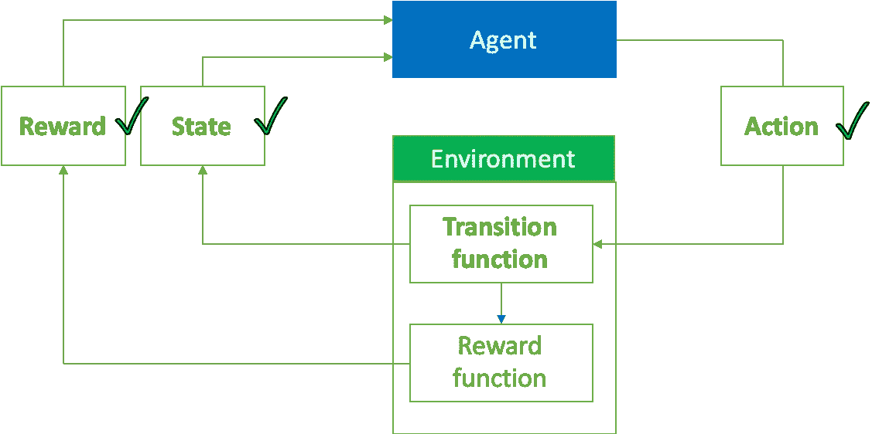

我们现在有一个完整的环境！

# 代理定义

我们的机长需要能够理解连续状态(位置和速度)和离散动作(推力和俯仰)之间的复杂关系(我们的转换函数，他不知道)，以便最大化其长期回报。

Tensorforce 已经实现了多个代理(深度 Q 网络、决斗 QDN、演员评论家、PPO …)，所以我们不必自己动手。

为了避免这篇文章内容过多，我们不会详细讨论代理的选择以及它们是如何工作的。在尝试了不同的代理之后，很明显最适合我们任务的是 PPO(近似策略优化)算法。有关其工作原理的更多详细信息，请参考[这篇](https://medium.com/@jonathan_hui/rl-proximal-policy-optimization-ppo-explained-77f014ec3f12#:~:text=A%20quote%20from%20OpenAI%20on,simpler%20to%20implement%20and%20tune.&text=Instead%20of%20imposing%20a%20hard,penalty%20in%20the%20objective%20function.)文章。它们之间的特性和优势可能是一整篇文章的主题，但是我们今天将继续关注实现。

## 代理实现

下面是取自 Tensorforce 文档的 PPO 代理的基本实现。我们将在接下来的部分中讨论超参数，并暂时坚持使用默认值。

随着代理的运行，我们已经完成了整个框架。

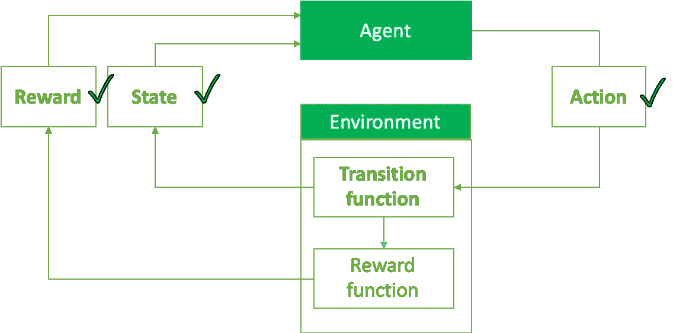

一切准备就绪！

# 培训和测试

现在环境和代理都好了，系好安全带，准备起飞！

(来源:[吉菲](https://giphy.com/gifs/season-15-the-simpsons-15x18-3orieOcI2dFlcEqH9S))

让我们看一下初始化我们的环境以及训练和测试代理的基本代码。

这个函数采用我们之前定义的环境以及我们的代理，并在给定的剧集数内运行它。有两种模式，训练模式(允许探索)，用于在大量剧集上训练代理；以及用于评估代理性能的测试模式(不允许浏览)。

*run* 函数将由 *runner* 函数调用，以便分批执行剧集，通过在每批之后执行测试运行来监控训练期间的结果，并收集结果。

这是控制这些功能的主脚本。

让我们来看看这个基本脚本的结果:

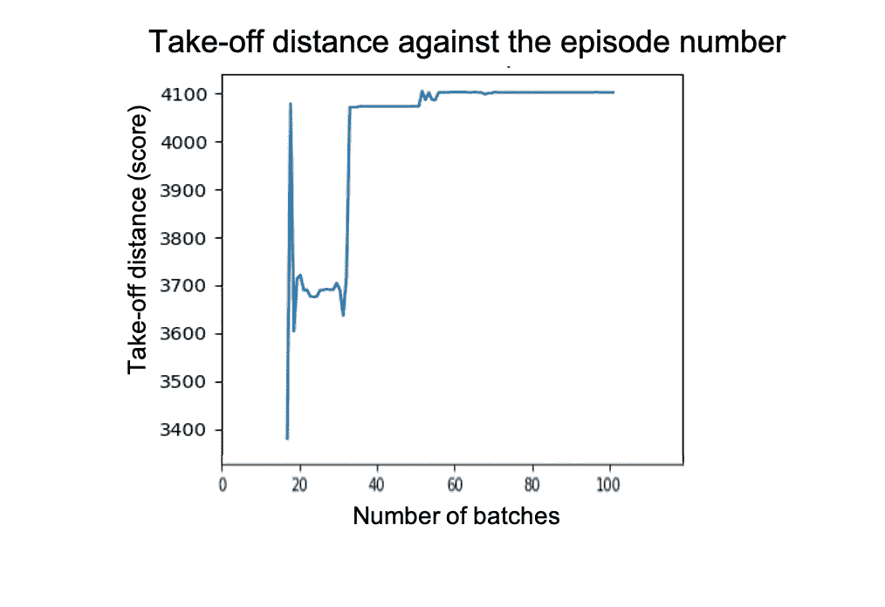

1 批= 100 集

结果并不令人印象深刻。不仅代理人需要更多的跑道来起飞，随着时间的推移情况会变得更糟，而且最佳起飞距离也与现实生活中的 1.7 公里左右的结果相去甚远

# 超参数调谐

为了改进我们的结果，让我们看看我们的代理的主要超参数(要更深入地了解那些超参数，请阅读[这篇文章](https://medium.com/aureliantactics/ppo-hyperparameters-and-ranges-6fc2d29bccbe)和关于 PPO 的[原文](https://arxiv.org/pdf/1707.06347.pdf)):

*   折扣:该参数描述了代理对未来的展望，而不仅仅是对未来几个奖励预期的展望。
*   探索:这个参数是采取随机动作而不是由代理的策略决定的动作的概率，顾名思义，这允许代理尝试它通常不会去做的动作。
*   子采样分数:这是批处理时间步长与子采样的相对分数(为了减少使用的数据量)
*   熵正则化:这个参数有助于策略不要“太确定”和一开始就冻结。
*   L2 正则化:这是为了使代理不过度拟合而添加到损失中的随机噪声量。
*   似然比裁剪:该参数定义 PPO 中使用的替代目标将被裁剪多少，以将策略的变化保持在安全范围内。

为了找到这些参数的最佳值，我们将针对这些参数的不同值运行一系列剧集，并通过使用起飞距离作为得分来观察最佳组合。我们将使用的脚本基本上是一个网格搜索。我们将直接将其他超参数冻结为默认值或任意值，在本例中我们不会尝试优化这些值。

然后，我们使用该函数迭代一系列超参数，并计算最佳组合。每个组合将在 100 批 100 集的跨度内运行。

让我们首先检查非网络参数结果(子采样分数、似然比剪裁、l2 正则化、熵正则化)。

下图表示具有相同给定参数值的所有配置中的平均起飞距离(例如，在第一个图中，蓝色曲线表示二次采样分数为 0.2 的所有情节的平均起飞距离)。我们可以看到这种距离的演变，因为代理学习了具有相同参数的情节。曲线周围的彩色区域代表标准偏差。

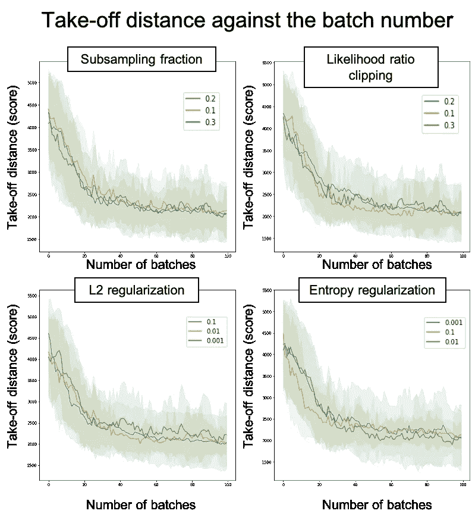

1 批= 100 集

从这些图表中，我们可以获得所研究参数的最佳值，同时也观察到它们对结果没有非常重要的影响:

*   子采样分数:0.3
*   似然比削波:0.1
*   l2 正则化:0.1
*   熵正则化:0.01

然后，我们对网络参数(每层的大小和神经网络的深度)进行同样的操作

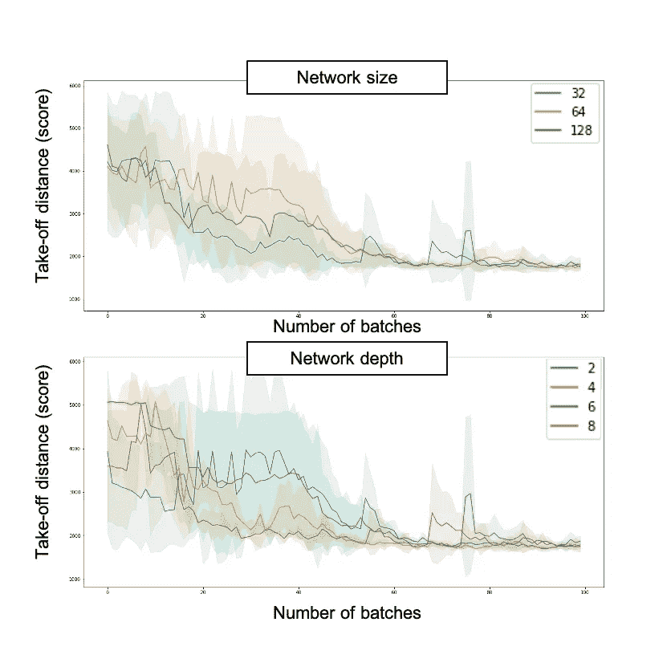

1 批= 100 集

最佳网络参数是:

*   大小:32(使用 64 可以获得更好的精度，但是 32 允许类似的结果和更好的计算效率)
*   深度:4(同样，不是绝对最好的结果，而是最好的平均结果和良好的计算效率)

现在让我们来看看最后两个参数，折扣和探索:

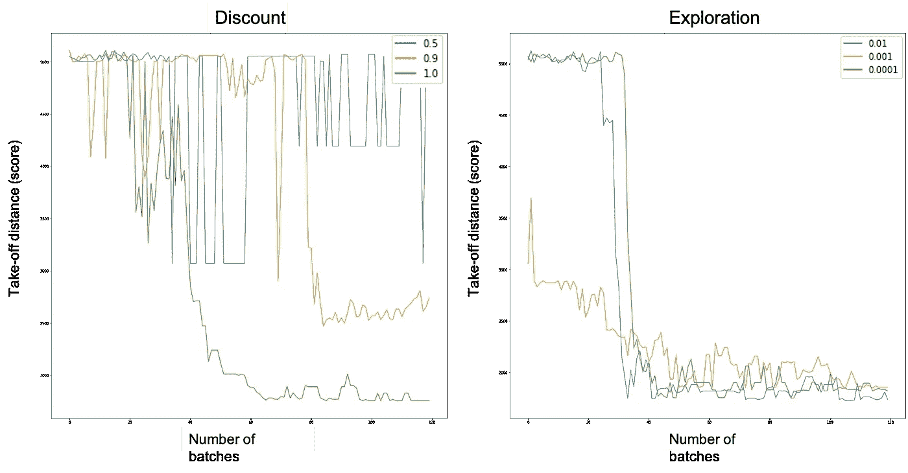

对于折扣系数，我们可以看到，对于 0.5 的值，它在整个研究期间并没有真正改善，对于 0.9 的折扣，它确实达到了大约 2000 米起飞距离的平台期；最后，1.0 的折扣达到 1700 万的平台，同时比 0.9 的折扣系数花费更少的时间收敛(大约 50 集，而不是大约 80 集)。因此，我们将选择 1.0 的折扣系数。

对于探索因素，结果更加接近，所有 3 个因素(1%、0.1%和 0.01%)最终似乎都表现得相当好(尽管 0.1%似乎收敛得更慢)。然而，在研究结束时，1%的勘探系数似乎是最好的，因此我们将选择这个值。

# **结果**

使用固定的超参数、我们定义的环境和我们训练的代理，我们现在可以观察 CaptAIn 做得如何。

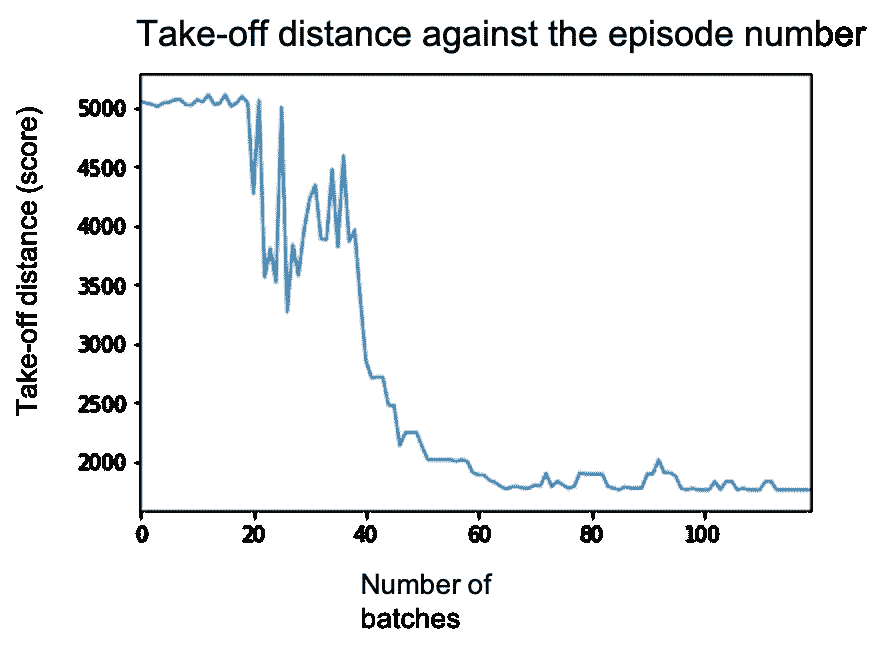

在这个图表上，我们可以看到每一批 100 集的每一批之后达到的起飞距离。我们可以看到，由于探索，起飞距离总体上在减少，并且有一些周期性的退化。最终实现的起飞距离为 1725 米。

该值与实际 A320(我们正在建模的飞机)所达到的值相当，因此结果令人鼓舞！现在让我们来看看代理是如何做的，也称为 T2 政策。我们先来看看培训阶段:

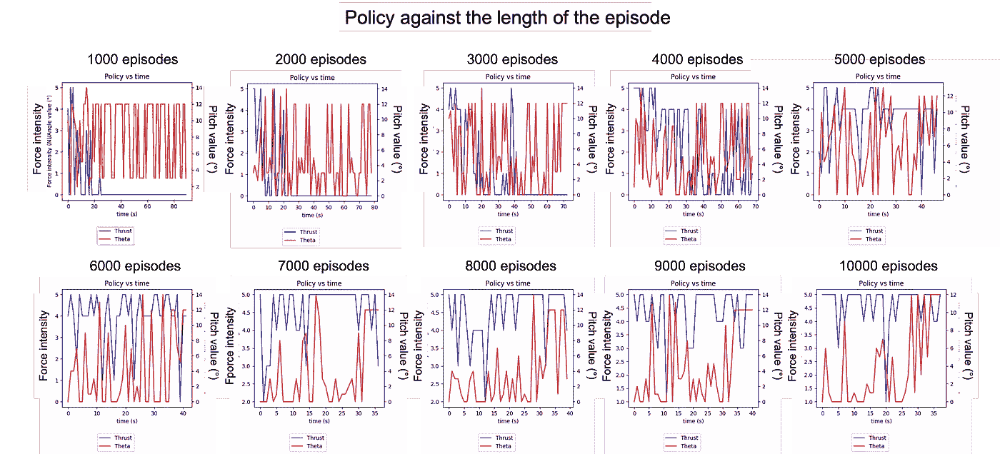

这是每千集政策的演变。每一张图表都代表了代理人在每一集的每个时间点所做的事情。蓝色曲线(数值在左边)是推力，红色曲线(数值在右边)是俯仰角。起初，代理人执行看似随机的行动，并没有设法起飞。

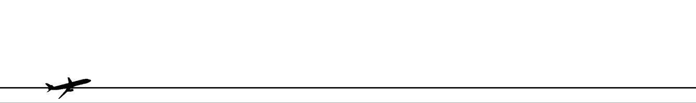

机长最初的政策看起来不太像起飞，偏离了跑道

然后，我们可以看到代理如何逐渐收敛于在整个事件中应用全部推力，并且只有当飞机达到足够的速度时才旋转。行动的高度可变性是由于训练代理人所固有的探索性和随机性。我们现在将切换到测试模式来观察实际的策略(没有探索)。

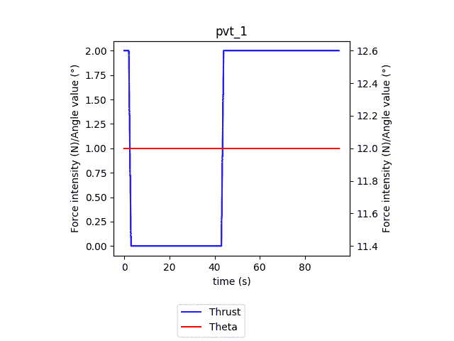

政策 vs 时间超过 100 批次，题目中的数字就是该批次的编号。蓝色表示推力(5 =最大功率的 100%，0 =最大功率的 50%)，红色表示俯仰角(从 0°到 15°)。

在这部动画中，我们可以看到每一批 100 集超过 100 批的政策演变。类似于训练阶段，我们观察到代理向它的最终策略收敛:在整个事件中使用全功率，并且在获得足够的速度(大约 30 秒)后才旋转。我们还可以观察到起飞时间从一集 100 秒的最大允许时间减少到 33 秒。

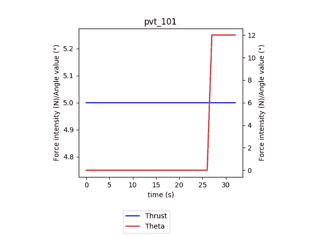

最终策略是推力恒定为 100%功率(力强度为 5.0)，25 秒时俯仰角为 12°。

事情是这样的:

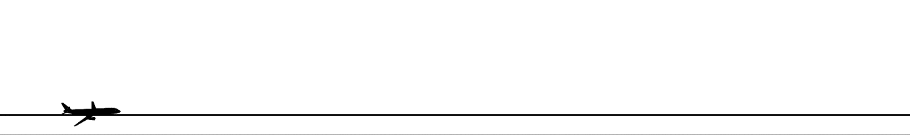

机长的最终政策(为了形象化，高度被夸大，速度增加)

总结一下，机长已经成功起飞，甚至比真正的飞行员还要好！尽管这看起来并不令人印象深刻，因为人类会很容易地发现使用全功率并在一定速度后旋转飞机是正确的方式，但我们必须记住，机长从未见过飞机起飞，而是完全靠自己发现的！

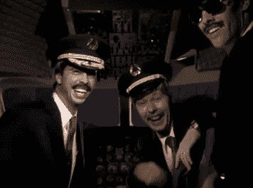

我们做到了！(来源:[吉菲](https://giphy.com/gifs/foofighters-foo-fighters-learn-to-fly-3ohs7MNCq8mhWzWdyM/links))

现在，我们已经了解了如何在 Tensorforce 中创建自定义环境并使用它来训练和优化代理，您现在可以使用我们定义的框架将强化学习应用到您自己的环境和问题中！

# 后续步骤

机长刚刚学会如何起飞，如何让他实现水平飞行和着陆还有待观察。然而，这些任务不像起飞(像现实中一样)那么容易，需要一些更复杂的方法，而不仅仅是使用预先定义的代理和“简单”的奖励。为了保持这篇文章的主题是如何从头开始做一个简单的 RL 问题，我们将在下一篇文章中讨论奖励工程，以便队长登陆！

在经历了几百万次失败的着陆和水平飞行试验后，我暂时离开了机长休息区。(来源:[吉菲](https://giphy.com/gifs/season-14-the-simpsons-14x9-d2VNG3GkpLdlyio8))

感谢阅读，我真的很喜欢分享我的强化学习之旅，我将非常感谢你的回报。敬请关注下一部分！

扬·贝特洛

我使用的完整代码(Python)可以在我的 Github 上找到:

 [## YannBerthelot/飞机模型

### RL 的 PlaneModel 环境。在 GitHub 上创建一个帐户，为 YannBerthelot/PlaneModel 开发做贡献。

github.com](https://github.com/YannBerthelot/PlaneModel) 

# 资源

[https://www . coursera . org/learn/complete-reinforcement-learning-system/home/welcome](https://www.coursera.org/learn/complete-reinforcement-learning-system/home/welcome):关于 RL 理论的伟大 MOOC(但缺少一点点或真正的实现，主要是数学，从今以后尝试自己的项目的重要性！)

https://tensorforce.readthedocs.io/en/latest/:tensor force 文档，相当完整，但有时不太容易理解。

[https://medium . com/aureliantactics/ppo-Hyperparameters-and-ranges-6 fc2d 29 bccbe](https://medium.com/aureliantactics/ppo-hyperparameters-and-ranges-6fc2d29bccbe):关于 PPO 超参数的好文章

[https://towards data science . com/the-complete-reinforcement-learning-dictionary-e 16230 b 7d 24 e](/the-complete-reinforcement-learning-dictionary-e16230b7d24e):大部分 RL 术语的清晰解释

[https://arxiv.org/pdf/1707.06347.pdf](https://arxiv.org/pdf/1707.06347.pdf):PPO 纸。

[https://toppng . com/black-and-white-plane-png-free-PNG-Images _ 71843](https://toppng.com/black-and-white-airplane-PNG-free-PNG-Images_71843):飞机动画使用的 PNG