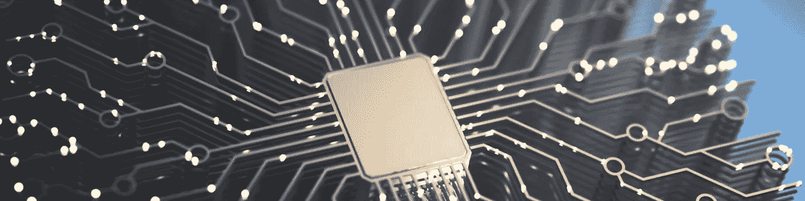
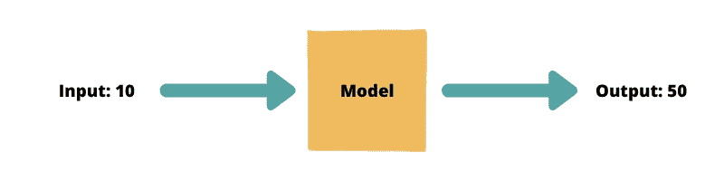
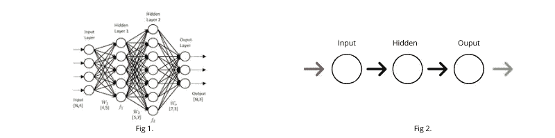

# AI 20 秒学会乘法

> 原文：<https://towardsdatascience.com/ai-learns-to-multiply-ce844c68aefe?source=collection_archive---------53----------------------->

## AI 学习乘法能有多快多准？

> 今天，人工智能正在完成曾经被认为超出人类能力的任务。从检测视网膜病变的眼睛到威胁生命的肿瘤，人工智能很快就能完成所有复杂的任务。
> 
> 今天我们下坡跑，看看人工智能如何执行现代计算机最简单的任务之一:乘法。



Canva.com 的股票图片

在这篇文章中，我们将尝试教一个机器学习模型乘法，并看看它的表现如何。帖子会更倾向于 ML 的初学者一方，代码最少(准确的说是 14 行)。

声明:在现实生活中，你永远不会希望一个 ML 算法为你执行乘法。这篇文章只是带你做了一个实验，试图建立一个做算术的机器学习模型。让我们开始吧。

我们在这里的目标是开发一个模型，它以一个整数作为输入，并给出一个输出，这个输出是输入乘以某个数字，让这个数字为 5。所以，如果你给了 10 英镑作为投入，你肯定期望 50 英镑作为产出。请注意，我们不会告诉模型我们正在寻找的任务是一个简单的乘法；它必须自己想办法解决。



作者图片

# 重要的事情先来

我们的第一项工作将是创建一个示例数据集，通过查看该数据集，模型可以了解到我们正在寻找的任务是乘以 5。我们将使用 1 到 300 之间的 10k 个随机生成的数据点。因此，我们有 10k 个输入数据点[20，120…..5，15]和 10k 输出数据点[100，600…..25，75]即输入点数乘以 5。Python 中的相同代码如下所示。

```
import random
X=[]
Y=[]
for i in range(10000):
    n = random.randint(0,300)
    X.append(n)
    Y.append(n*5)#X is the input array and Y is the output array
```

答对了。我们已经准备好了数据集。现在，让我们设计一个可以学习我们任务的神经网络。一个基本的教科书式人工神经网络设计看起来像下图(图 1)一样，其中有许多隐藏层和许多神经元，但那是为了复杂的任务，如数字分类。对于我们简单的乘法任务，只有一个隐藏层和一个隐藏神经元的简单神经网络可能就可以工作。



作者图片

# 建筑时间

让我们为图 2 中的架构编写代码。看看这个模型能不能学会乘 5。我们在 Tensorflow 上面使用 Keras，一个高级的 ML 库。我们知道，我们试图构建的架构是一个简单的顺序网络。我们添加一个带有一个神经元的密集层，这将是我们的隐藏层，然后我们再添加一个带有一个神经元的层，它将保存我们的输出答案。我们对所有神经元使用“relu”优化函数。

我们使用均方误差来查看每一步的模型预测和地面实况之间的误差，并使用“Adam”优化器来优化我们的损失。“metrics”参数在启用时会显示您的模型在训练时的状态。架构设置好了，现在模型都准备好学习了。我们最后使用 model.fit()函数，其中模型试图理解输入和输出之间的关系。

我们传递输入(X)、输出(Y)、批量大小:在重置模型权重和偏差之前要查看的数据点数、验证分割:用于验证的数据集部分和时期:模型遍历整个数据集的次数。

```
from keras.models import Sequential #using Keras Library
model=Sequential()
model.add(Dense(1,activation='relu',input_shape=(1,)))
model.add(Dense(1,activation='relu'))
model.compile(loss='MSE', optimizer='adam', metrics=['accuracy'])
model.fit(X, Y, batch_size=50,
              validation_split=0.1, epochs=100, verbose=1,shuffle=1)
```

让我们看看在模型被训练时打印的一些统计数据。

```
#From 10k samples, since validation_split=0.1, we trrain on 0.9*10k i.e. 9k samples.After First iteration
Epoch 1/100
9000/9000 [==============================] - 1s 148us/step - loss: 625973.1757 - acc: 0.0038 - val_loss: 577468.6391 - val_acc: 0.0020After 74th iteration
Epoch 74/100
9000/9000 [==============================] - 0s 24us/step - loss: 0.0723 - acc: 0.9583 - val_loss: 0.0595 - val_acc: 1.0000
```

看看第 1 步和第 74 步的准确度差异。开始时的准确度为 0.0038 或 0.38%，这表明模型在开始时不知道输入和输出之间的关系。一开始的损失也是巨大的。随着训练的继续，模型开始理解数据，准确性提高，损失(误差)减少。

在第 74 步之后，该模型具有 0.9583 或 95.83%的准确度，即，它能够以 95.83%的确信度告知该任务是乘以 5。我们可以看到，在 74 次迭代中，验证损失也从 0.20%提高到了 100%。经过 100 次迭代后，训练精度(acc)和验证精度(val_acc)都达到 100%，表明我们的模型成功地发现了这种关系是乘以 5。

*在 NVidia 940 MX 4 GB GPU 和 16 GB RAM 上，训练过程需要大约 20 秒来完成 100 次迭代。那确实是快速的学习。*

# 结果呢

最后，是时候测试我们的模型了。让我们在 test_array 中取任意五个数字，并使用上面建立的模型来获得预测。理想情况下，输出应该是 test_array 元素乘以 5。

```
test_array=np.array([4,27,100,121,9])
print(model.predict([test_array]))
```

*擂鼓！最后预测的时间到了。*

```
[[19.9995174407959], [134.9995880126953], [499.9997253417969], [604.9998168945312], [44.99952697753906]]
```

我们看到我们的模型快完成了。实际值为[20，135，500，605，45]，如果将预测值四舍五入到小数点后两位，我们看到预测值与预期结果相同。


Canva.com

这就是你要的，一个简单的人工智能已经学会了乘 5。还有一些事情；然而，需要考虑的是:尝试给出负值并检查输出，您会得到什么？我想把它留给你去尝试，实验，并提出使算法更精确的技术。此外，尝试对架构进行更改，例如添加更多的层和神经元，并查看指标的差异。如果你有任何疑问，请在评论中告诉我。

我希望你喜欢这篇文章，并喜欢构建一个可以执行简单乘法任务的人工智能。下次见。