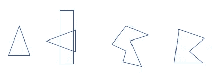
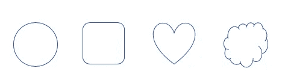
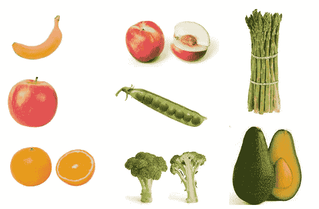
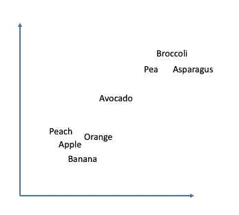
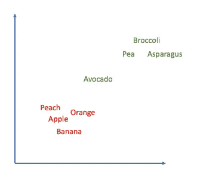
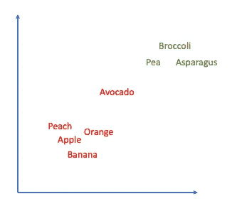
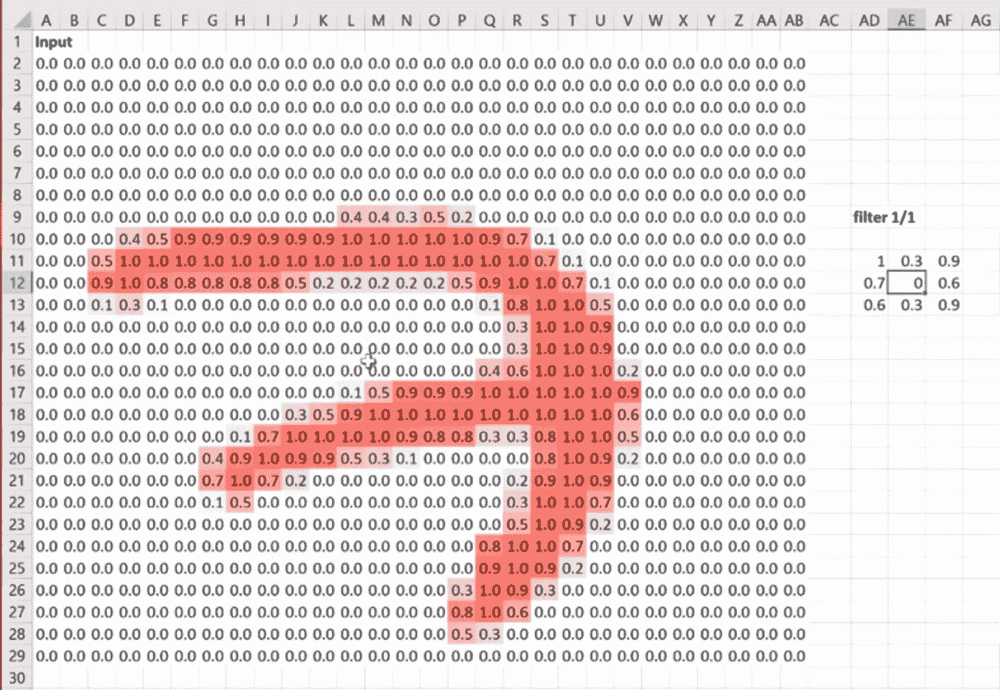
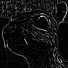
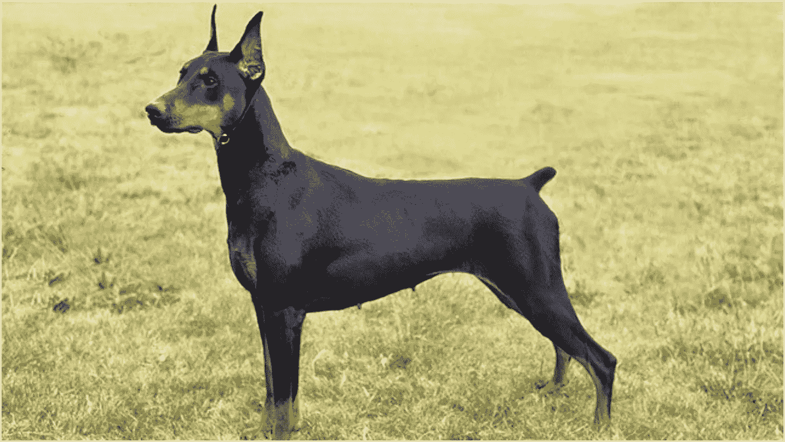

# 给老师、青少年和所有介于两者之间的人上人工智能课

> 原文：<https://towardsdatascience.com/ai-lesson-for-teachers-teens-and-everyone-in-between-7df81bd343f3?source=collection_archive---------90----------------------->

我的目标是概述一个课程，任何老师都可以在课堂上使用，或者任何对人工智能如何工作有兴趣的人都可以走一遍。这并不意味着是人工智能如何真正工作的精确表示，而只是给出它如何工作的直觉。我做了近十年的数学、SAT、ACT 和 ISEE 辅导老师，从事机器学习研究。

先决条件:知道什么是概率。

有两个子课程，一个较小的和一个较大的。所有课程都属于计算机视觉问题的范畴——物体检测。

1.  监督学习与非监督学习
2.  训练机器学习模型

机器学习问题通常分为两类，监督问题和非监督问题。监督问题是指你给模型一些例子，然后期望它能够在看不见的图像上预测那个东西。无监督的问题是，你有一堆图像，你试图找出哪些是最密切相关的(除了你能看到的以外，不基于任何东西)，然后将它们分组，而不知道你试图预测的最终类别实际上是什么。

# **监督学习**

我现在将向您展示一系列的形状和形状的名称。



“扎格斯”

上面这些形状被称为**扎格斯**。



" flarks "

上面这些形状被称为**扇形**。

现在我会给你一个物体，你告诉我它是一个扎格还是一个 flark。有一个潜规则，把 zhags 和 flarks 分类。你的工作是学习规则。


?

这是一个**扎格**。如果你猜对了，太棒了！你学到了一个成功的模式。

但也许现在你得到的对象并不完全符合你的想法。


?

这是一把 **flark** 。

你不知道，潜规则是，如果形状有任何曲线，它就是一个 flark。这就是为什么充足的训练数据对机器学习问题如此重要！如果这是自动驾驶汽车中丢失的训练数据点，这可能会让某人付出生命的代价。

# **无监督学习**

假设我们有一组图像，并且严格使用这些图像，我们不需要任何先验知识就可以将它们放置在 *xy* 平面上，其中它们之间的距离表示它们彼此之间的差异。

这里有一组图片。



图片来自维基百科

现在我们要把这些放在 *xy* 平面上。这是一个可能的迭代。



如果我现在说，把这些分成两组，你可能会用两种方法之一。



可能的分组

现在，如果我们应用水果或蔬菜的分类任务，我们已经做了一个相当不错的分类工作，却从未被告知什么是水果或蔬菜！简单地通过确定不同图像之间的某种距离映射，我们已经对水果和蔬菜进行了分类。

# **训练**

让我们看一个监督学习任务的例子，在这个例子中，我们试图识别一幅图像是一只**杜宾**还是**达克斯**。

神经网络结构由输入、隐藏层和输出组成。在这种情况下，输入是一幅图像，然后对于我们的隐藏层，我们将使用所谓的卷积层，然后输出将是两个数字——第一个数字是图像是杜宾犬的概率，第二个是腊肠犬的概率。

输入图像是一个固定大小的正方形图像，其中每个像素的值在 0 到 255 之间，图像有 3 层(红、绿、蓝)。一个简单的版本就是只有一层的黑白图像。所以你可以把图像想象成一个大的数字矩阵，每个数字代表一个像素值。

这是一个矩阵形式的示例，其中像素值已被转换(归一化),因此它们现在不是在 0 和 255 之间，而是在 0 和 1 之间，其中 1 与 255 相同。



摘自 fast.ai 第 4 课

简而言之，卷积层是一个小过滤器，它通过图像并捕捉图像的不同方面，如边缘或高光。不同的卷积可以提取关于图像的不同信息。这是卷积核通过后的图像。神经网络然后学习更新该过程，以便提取预测目标变量的最佳信息(在我们的情况下，是**杜宾**或**达克斯猎犬)。**



来自维基百科图像内核

隐藏图层之后，这些值会减少到预测问题中的类数。对于杜宾或腊肠犬，我们有两个等级。因此，输出看起来类似于`[0.15, 0.85]`，这是给定图像的概率输出，并且会被归类为腊肠犬，因为 0.85 > 0.15。

现在让我们做一个稍微模仿神经网络学习过程的示例练习。

我会给你一张**杜宾犬**或**腊肠犬**的蒙版图片，你必须用一个介于-10 和 10 之间的值来回答，其中值越接近-10 意味着你认为这张图片是一只**杜宾犬**，而值越接近 10 意味着它是一只**腊肠犬**。

我们的神经网络有 4 层，所以 4 个屏蔽图像是同一图像的不同视图。

我将通过一个例子并给出值。


第一层

我会给这个一个 **8** 。


第二层

我给这个一个 **-1** 。


第三层

我给这个一个 **-7** 。


第 4 层

这个我给个 **-9** 。

所以某些层我不确定，而其他层似乎倾向于这样或那样。

现在取这 4 个值并求平均值。

```
np.mean([8,-1,-7,-9])
```

*出局:* **-2.25**

现在，我们将通过所谓的 sigmoid*层，这将给出图像是腊肠犬的概率(因为我们分配的值越大，我们就越认为它是腊肠犬)。

```
z = -2.25
1 / (1 + np.exp(-z))
```

*输出:* **0.095**

所以我们的概率变成了`[0.905, 0.095]`。

*你也可以用[这个站点](https://keisan.casio.com/exec/system/15157249643325)用 sigmoid 计算概率。

现在我们看到事实上是一只杜宾犬，所以我们是对的！



图片来自 vetstreet.com