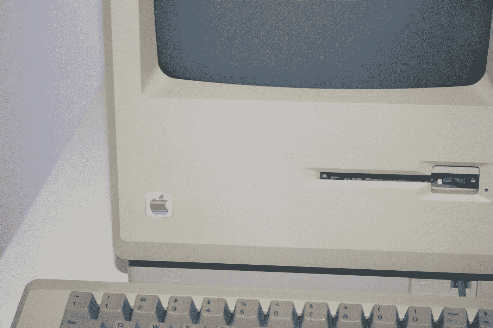

# 人工智能扫盲 101

> 原文：<https://towardsdatascience.com/ai-literacy-101-what-is-it-and-why-do-you-need-it-73238ec7c2db?source=collection_archive---------48----------------------->

## 它是什么，为什么我们都需要它？

没有多少人真正理解人工智能，它是什么，以及如何让它工作。许多组织已经开始，但并不真正知道如何让它工作，许多数据科学家对他们的工作感到沮丧。我们需要做点什么。

大约四十年前，我们处于类似的情况。那时候，我们处在一个大多数人缺乏 T2 电脑知识的阶段。我们生活在一个只有一小部分人在技术上有能力建造计算机，创造软件，连接软件和硬件的时代。听起来很熟悉？在那些日子里，大多数办公室工作人员不使用电脑，他们不知道这是什么，它如何能给他们带来好处。他们也不了解构建软件的复杂性，他们害怕失去工作，或者只是觉得太好而不想使用它们。

照片由[马修·梅克](https://unsplash.com/@mattsphotography?utm_source=medium&utm_medium=referral)在 [Unsplash](https://unsplash.com?utm_source=medium&utm_medium=referral) 上拍摄

快进到今天——我们现在几乎都懂电脑。我们知道如何使用我们的电脑，即使我们不在电脑中工作，我们也是别人制造的电脑的用户。我们不需要能够看到引擎盖下，但我们知道我们需要什么，实现新系统需要什么，以及如何使用软件。

**我们目前生活在人工智能的 80 年代** -有一个小型但不断增长的从业者群体能够构建人工智能系统，并非所有这些系统都出于多种原因而工作，也并非所有系统都对最终用户有用。为什么？公司的大多数员工不知道人工智能是什么，它如何让他们受益，或者他们如何参与这样的系统。与此同时，管理层无法提供所需的资源，因为他们根本不知道如何利用人工智能创造价值。他们需要成为有人工智能素养的人。

**人工智能素养**是关于**知道什么是人工智能**，关于**人工智能如何让你受益**，**让人工智能系统工作需要什么，**以及最终**如何使用人工智能解决方案**。如果一个公司没有人工智能素养，就很难大规模地推动人工智能项目取得成功。我真的相信人工智能素养是我们所有人未来都需要的。这就是为什么我们需要现在就开始对我们的管理层和同事进行人工智能教育，并开始缩小我们目前面临的商业和数据科学之间的差距。

你将如何在你的组织中为人工智能扫盲做出贡献？你需要想法吗？然后看看我的[文章](/a-three-step-recipe-for-educating-your-boss-about-ai-3f21eec33b7f)如何在 AI 上教育你的老板。

*关于我:我是一名分析顾问，也是当地一所商学院“人工智能管理”研究的主任。我的使命是帮助组织利用人工智能创造商业价值，并创造一个数据科学家可以茁壮成长的环境。* [***在这里报名我的快讯。***](https://share.hsforms.com/1uW6l8qlsRYapxCl0Q_znIw4xzxr)