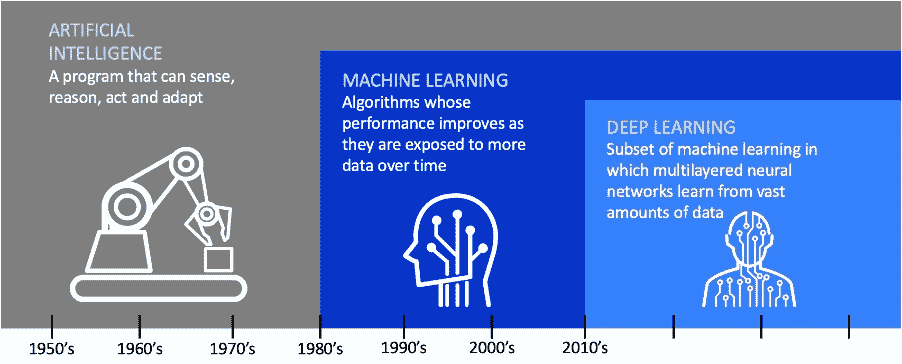
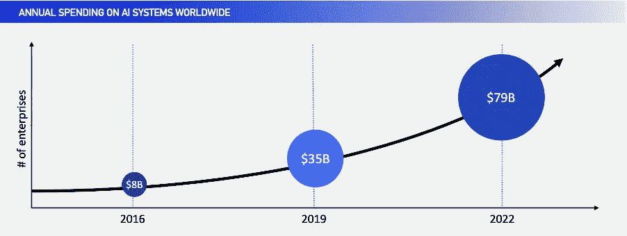
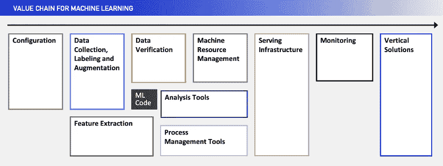
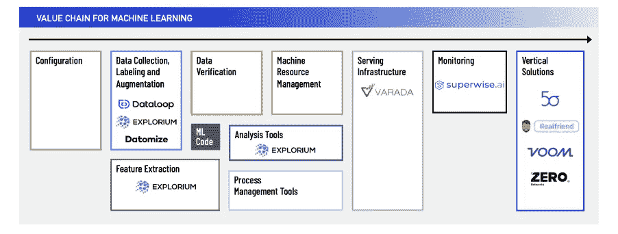

# 艾:不仅仅是一个流行词

> 原文：<https://towardsdatascience.com/ai-more-than-just-a-buzzword-845e5e320981?source=collection_archive---------55----------------------->

## **F2 方式**

当我们想到人工智能(“ *AI* ”)时，脑海中会浮现出几样东西:大作*终结者 2* 中的*阿诺施瓦辛格*、*星球大战中的 C-3PO、*以及*西部世界*的世界。正如许多人所看到的那样，人工智能在这些电影和系列中显而易见——计算机或机器人使用源于人类的智能来学习如何独立“思考”，发展自己的身份。

AI 在帮助人类？来源:[giphy.com](https://giphy.com/gifs/TerminatorDarkFate-terminator-darkfate-judgmentday-S5DS5ayx32ULXBrc6Z?utm_source=iframe&utm_medium=embed&utm_campaign=Embeds&utm_term=https%3A%2F%2Fcdn.embedly.com%2Fwidgets%2Fmedia.html%3Fsrc%3Dhttps%3A%2F%2Fgiphy.com%2Fembed%2FS5DS5ayx32ULXBrc6Z%2Ftwitter%2Fiframe&%3Bdisplay_name=Giphy&%3Burl=https%3A%2F%2Fmedia.giphy.com%2Fmedia%2FS5DS5ayx32ULXBrc6Z%2Fgiphy.gif&%3Bimage=https%3A%2F%2Fi.giphy.com%2Fmedia%2FS5DS5ayx32ULXBrc6Z%2Fgiphy.gif&%3Bkey=a19fcc184b9711e1b4764040d3dc5c07&%3Btype=text%2Fhtml&%3Bschema=giphy)上映的《终结者:黑暗命运》

虽然这些电影和电视节目是虚构的(顺便说一下，也很棒)，但机器人背后的真相在屏幕上与现实生活中是一样的:
**通过人工智能，我们可以创造出机器，它们可以以比人类更快的速度执行无尽的任务，并且只受物理计算能力的限制。很酷吧？**

人工智能、机器学习(" *ML* ")和深度学习都是相关的，并随着时间的推移而演变，如下所示:

来源:[英伟达博客](https://blogs.nvidia.com/blog/2016/07/29/whats-difference-artificial-intelligence-machine-learning-deep-learning-ai/)

尤其是这些天，**人工智能正在改变我们世界的形状**，并在各行各业实现手工流程的自动化**。然而，为了建立最有效的模型，需要有一个坚实的基础。以机器学习为例。当考虑 ML 所能做的一切时，我们通常会考虑最终结果，即产品。然而，那台机器只有**的功能是作为访问数据、清理数据和从数据中学习**的结果。这让我想到了一个至关重要的话题:数据。**

## ****数据。****

**今年年初，数字世界由 44 zetta 字节的数据组成。截至 2019 年，超过 45 亿人使用互联网。统计数据说明了一切:有大量的数据，而且数量只会越来越大。然而，这些数据中的大部分仍未被利用。平均而言，[一家公司 73%的数据](https://www.inc.com/jeff-barrett/misusing-data-could-be-costing-your-business-heres-how.html)完全没有使用，这意味着公司正在失去分析其工作流各个方面的重要机会。**

**因此，每个组织都在成为数据组织。**理解这些大数据的唯一方法是利用人工智能。**
正因为如此，允许企业**检索、消化和分析**数据，并将这些数据转化为切实可行的解决方案的人工智能和人工智能的应用程序和框架变得比以往任何时候都更加重要。**

****

**作者照片，基于 Gartner 2019**

## ****人工智能价值链。****

**在过去的十年中，我们已经看到了软件开发工具的激增，这些工具使得构建软件更加容易和有效。AI 也开始效仿。AI 产品靠的是自己的价值链。ML 就是一个很好的例子:它的模型只和它们所基于的数据一样好；数据越可靠，模型就越精确。企业家们争先恐后地填补空白。正如软件开发工具一样，**针对 ML 价值链**某一特定方面的 AI 工具**正在各地**涌现。**

**也有令人难以置信的有趣的公司努力提供全面的 ML 平台，覆盖所有或几乎所有的价值链。这些公司提供垂直领域的解决方案，如医疗保健、零售、保险等。**

**我们认为 ML 的价值链如下:**

****

**作者照片，基于[机器学习系统中隐藏的技术债务](https://papers.nips.cc/paper/5656-hidden-technical-debt-in-machine-learning-systems.pdf)**

**请注意，专用于实际 ML 代码的类别有多小。无论一家公司是针对价值链上的一个特定问题，还是为垂直特定问题创建整体解决方案，人工智能公司都是热门。**

## ****我们的论文。****

****F2** 是一家专业的种子期风险投资基金**，支持以色列深度技术公司**，位于**大数据、人工智能和连接**的交界处。有助于构建和实施 ML 模型以及解决特定问题的价值链和框架还不够成熟。我们认为这不是一个问题，而是一个帮助发展和资助这种基础设施的机会。我们还认为，不同垂直行业的公司都有机会通过利用人工智能作为其核心技术的一部分来创建整体解决方案。**

## ****我们的公司如何适应。****

**根据这个论点，我们已经在人工智能领域领导了许多种子前和种子阶段投资 **，这些投资可以分为两大类:*适合 ML 价值链特定部分的框架公司*和*核心知识产权部分基于人工智能的垂直整体解决方案公司*。****

**以下是我们投资组合中的一些公司示例，这些公司瞄准了 ML 价值链的**特定方面** **:****

*   **[**Dataloop**](https://dataloop.ai/) :开发一个用于标注 ML 数据集的一站式平台。它包括一个数据管理环境，该环境包含自动注释功能和数据质量控制管理。**
*   ****Datomize** :通过先进的人工智能生成高质量的合成数据，可以在内部和云上使用。它通过支持有效的人工智能建模、第三方协作、测试和开发来增强研发和数据科学团队的能力，同时遵守最严格的隐私法规。**

*   ****:帮助监控和分析影响 ML 模型性能的关键数据点。****

****嗡嗡嗡嗡。来源:[giphy.com](https://giphy.com/gifs/artificial-intelligence-c6DcchsqBlGCY)的《人工智能》****

****以下是我们投资组合中使用人工智能为特定于垂直行业的问题提供解决方案的公司示例:****

*   ****[**【real friend】**](https://www.realfriend.ai/):开发一个聊天机器人，利用各种最先进的 ML 技术向房地产经纪人提供个性化服务，以便他们可以同时支持多个客户。****
*   ****[**零网络**](https://zeronetworks.com/) :确保每个用户和机器只利用他们应该利用的网络资源。这在规模上强制实施了一个密闭的、最低特权的网络姿态，以消除内部攻击媒介，并允许公司再次信任他们的网络。****

****以下是这些投资组合公司如何融入 ML 价值链:****

********

****作者照片****

## ******总而言之。******

****这是一个真正令人兴奋的时间来参与所有人工智能的事情。没有人知道什么样的趋势会引领这个行业，未来几年会发生什么样的变化。不过，我有信心，因为它有能力将人工智能应用于几乎任何垂直领域，所以对于改变游戏规则的创始人来说，这是一片蓝海。****

******如果你是一家说话和呼吸都是人工智能的早期初创企业，并且有远大的想法，我们愿意提供帮助！******

****联系我@**maor@f2vc.com******

****再见了，宝贝！****

****毛尔·弗里德曼****

******作者在 F2 Venture Capital 的投资团队中担任助理*****