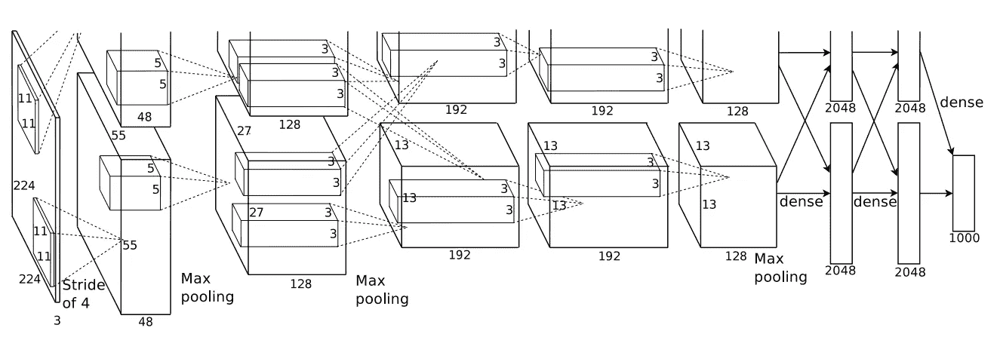

# 2020 年要读的 AI 论文

> 原文：<https://towardsdatascience.com/ai-papers-to-read-in-2020-ac0e4e91d915?source=collection_archive---------4----------------------->

## 阅读建议让你了解人工智能和数据科学的最新经典突破

照片由[阿尔方斯·莫拉莱斯](https://unsplash.com/@alfonsmc10?utm_source=medium&utm_medium=referral)在 [Unsplash](https://unsplash.com?utm_source=medium&utm_medium=referral) 拍摄

答人工智能是科学中发展最快的领域之一，也是过去几年最受欢迎的技能之一，通常被称为数据科学。这个领域有着深远的应用，通常按输入类型来划分:文本、音频、图像、视频或图形；或者通过问题公式化:有监督的，无监督的，强化学习。跟上每件事是一项巨大的努力，通常以令人沮丧的尝试而告终。本着这种精神，我提出一些阅读建议，让你了解人工智能和数据科学的最新和经典突破。

虽然我列出的大多数论文都是关于图像和文本的，但是它们的许多概念都是与输入无关的，并且提供了远远超出视觉和语言任务的洞察力。在每个建议旁边，我列出了一些我认为你应该阅读(或重读)这篇论文的理由，并添加了一些进一步的阅读材料，以防你想对某个给定的主题进行更深入的研究。

在我们开始之前，我想向音频和强化学习社区道歉，因为我没有把这些主题添加到列表中，因为我在这两方面的经验都很有限。

开始了。

# 排名第一的 AlexNet (2012)

> 克里日夫斯基、亚历克斯、伊利亚·苏茨基弗和杰弗里·e·辛顿。[“使用深度卷积神经网络的 Imagenet 分类”](http://papers.nips.cc/paper/4824-imagenet-classification-with-deep-convolutional-neural-networ) *神经信息处理系统的进展*。2012.

2012 年，作者提出使用 GPU 来训练大型卷积神经网络(CNN)，用于 ImageNet 挑战。这是一个大胆的举动，因为 CNN 被认为太重了，无法处理如此大规模的问题。令所有人惊讶的是，他们以大约 15%的前五名错误率赢得了第一名，而第二名的错误率为大约 26%，第二名使用了最先进的图像处理技术。

**原因 1:** 虽然我们大多数人都知道 AlexNet 的历史重要性，但并不是每个人都知道我们今天使用的技术在繁荣之前就已经存在了。你可能会惊讶于论文中介绍的许多概念是多么的熟悉，比如辍学和重新学习。

**原因#2:** 提议的网络有 6000 万个参数，完全不符合 2012 年的标准。如今，我们可以看到有超过十亿个参数的模型。阅读 AlexNet 的论文让我们对自那以后事情的发展有了更多的了解。

**延伸阅读:**跟随 ImageNet 冠军历史，可以阅读 [ZF 网](https://link.springer.com/chapter/10.1007/978-3-319-10590-1_53)、 [VGG](https://arxiv.org/abs/1409.1556) 、[盗梦空间-v1、](https://www.cv-foundation.org/openaccess/content_cvpr_2015/html/Szegedy_Going_Deeper_With_2015_CVPR_paper.html)和 [ResNet](http://openaccess.thecvf.com/content_cvpr_2016/html/He_Deep_Residual_Learning_CVPR_2016_paper.html) 论文。这最后一个实现了超人的性能，解决了挑战。在那之后，其他的比赛占据了研究人员的注意力。如今，ImageNet 主要用于迁移学习和验证低参数模型，例如:

AlexNet 结构的原始描述。上半部分和下半部分分别由 GPU 1 和 2 处理。模型并行的早期形式。来源:[Alex net 论文](http://papers.nips.cc/paper/4824-imagenet-classification-with-deep-convolutional-neural-networ)

# 排名第二的移动互联网(2017 年)

> Howard，Andrew G .等人[“移动互联网:用于移动视觉应用的高效卷积神经网络”](https://arxiv.org/abs/1704.04861) *arXiv 预印本 arXiv:1704.04861* (2017)。

MobileNet 是最著名的“低参数”网络之一。这种模型非常适合低资源设备和加速实时应用，如移动电话上的对象识别。MobileNet 和其他低参数模型背后的核心思想是将昂贵的操作分解成一组更小(更快)的操作。这种复合运算通常快几个数量级，并且使用的参数少得多。

原因 1: 我们大多数人都没有大型科技公司拥有的资源。理解低参数网络对于降低你自己的模型的训练和使用成本是至关重要的。根据我的经验，使用深度卷积可以在云推理中为您节省数百美元，而且几乎不会损失准确性。

**理由 2:** 众所周知，体型越大的模特越强壮。像 MobileNet 这样的论文表明，除了添加更多的过滤器之外，还有很多其他的东西。优雅很重要。

**延伸阅读:**到目前为止，MobileNet [v2](https://arxiv.org/abs/1801.04381) 和 [v3](https://arxiv.org/abs/1905.02244) 已经发布，在精度和尺寸上提供了新的增强。与此同时，其他作者设计了许多技术来进一步减小模型尺寸，如 [SqueezeNet](https://arxiv.org/abs/1602.07360) ，并以最小的精度损失[缩小常规模型。](https://arxiv.org/abs/1608.08710) [本文](https://ieeexplore.ieee.org/abstract/document/8050276)给出了几种模型尺寸与精度的综合总结。

# #3 你需要的只是关注(2017)

> “你所需要的只是关注。” *神经信息处理系统的进展*。2017.

介绍变压器模型的论文。在这篇论文之前，语言模型广泛依赖递归神经网络(RNN)来执行序列到序列的任务。然而，rnn 非常慢，因为它们很难并行化到多 GPU。相比之下，Transformer 模型仅基于关注层，关注层是捕捉任何序列元素相互之间的相关性的 CNN。与之前的 RNN 车型相比，所提出的配方取得了更好的效果和更快的速度。

**原因#1:** 如今，自然语言处理(NLP)文献中的大多数新颖架构都是从 Transformer 发展而来的。像 [GPT-2](https://www.ceid.upatras.gr/webpages/faculty/zaro/teaching/alg-ds/PRESENTATIONS/PAPERS/2019-Radford-et-al_Language-Models-Are-Unsupervised-Multitask-%20Learners.pdf) 和[伯特](https://arxiv.org/abs/1810.04805)这样的车型处于创新的最前沿。理解转换器是理解 NLP 中大多数后来的模型的关键。

**原因#2:** 大部分变压器模型都是亿万量级的参数。虽然关于 MobileNets 的文献提出了更有效的模型，但是关于 NLP 的研究提出了更有效的训练。结合起来，这两种观点为有效的训练和推理提供了最终的技术。

**原因#3:** 虽然变压器模型主要限于 NLP，但是所提出的注意机制具有深远的应用。像[自我关注甘](https://arxiv.org/abs/1805.08318)这样的模型展示了全局级推理在各种任务中的有效性。关于注意力应用的新论文每月都会出现。

**延伸阅读:**我强烈推荐阅读[伯特](https://arxiv.org/abs/1810.04805)和[萨根](https://arxiv.org/abs/1805.08318)的论文。前者是 Transformer 模型的延续，后者是 GAN 设置中对图像的注意机制的应用。

# #4 停止用你的头脑/改革者思考(~2020 年)

> 梅莉蒂，斯蒂芬。"[单头注意力 RNN:停止用你的脑袋思考](https://arxiv.org/abs/1911.11423)" *arXiv 预印本 arXiv:1911.11423* (2019)。
> 
> 基塔耶夫、尼基塔、祖卡斯·凯泽和安塞姆·列夫斯卡娅。[改革者:高效的变压器。](https://arxiv.org/abs/2001.04451)*arXiv 预印本 arXiv:2001.04451* (2020)。

变形金刚/注意力模型吸引了很多关注。然而，这些往往是资源密集型产品，不适合普通的消费类硬件。上述两篇论文都批评了这种架构，为注意力模块提供了计算上有效的替代方案。至于 MobileNet 的讨论，优雅很重要。

**理由# 1:**[停止用你的脑袋思考](https://arxiv.org/abs/1911.11423)《读起来是一篇该死的搞笑论文。这本身就是一个理由。

**理由#2:** 大公司可以迅速将研究规模扩大到一百个 GPU。我们，正常人，不能。缩放模型的大小并不是改进的唯一途径。我不能夸大那件事。阅读关于效率的文章是确保你有效利用现有资源的最好方法。

**延伸阅读:**由于这是 2019 年末和 2020 年，所以没有太多联系。考虑阅读 MobileNet 的文章(如果你还没有的话),了解其他关于效率的观点。

# #5 姿势估计的人类基线(2017)

> 肖，宾，吴，魏。人体姿态估计和跟踪的简单基线*【ECCV】欧洲计算机视觉会议论文集*。2018.

到目前为止，大多数论文都提出了新的技术来改善最先进的技术。相反，本文认为，一个简单的模型，使用当前的最佳实践，可以令人惊讶地有效。总之，他们提出了一个人体姿态估计网络，该网络仅基于一个主干网络，然后是三个去卷积操作。当时，他们的方法是处理 COCO 基准测试最有效的方法，尽管它很简单。

**原因 1:** 简单有时是最有效的方法。虽然我们都想尝试闪亮而复杂的新型架构，但基线模型可能编码更快，而且还能获得类似的结果。这篇论文提醒我们，并不是所有好的模型都需要复杂。

理由 2: 科学是一步一步来的。每一篇新论文都将最新技术向前推进了一步。然而，这不一定是一条单行道。有时往回走一点，转一个不同的弯是值得的。“停止用你的大脑思考”和“改革家”是另外两个很好的例子。

**原因#3:** 适当的数据扩充、培训计划和良好的问题表述比大多数人认为的更重要。

**进一步阅读:**如果对姿态估计感兴趣，你可以考虑阅读[这篇全面的最新综述。](https://nanonets.com/blog/human-pose-estimation-2d-guide/)

# #6 图像分类锦囊妙计(2019)

> 何，童，等[“卷积神经网络在图像分类中的应用”](https://arxiv.org/abs/1812.01187)*IEEE 计算机视觉与模式识别会议论文集*。2019.

很多时候，你需要的不是花哨的新模式，只是几个新花样。在大多数论文中，都会引入一两个新技巧来实现一两个百分点的提高。然而，这些在主要的贡献中经常被遗忘。本文收集了一组在文献中使用的技巧，并将其总结出来，供我们阅读时参考。

**原因#1:** 大多数技巧都很容易应用

理由 2: 你不知道大多数方法的几率很高。这些都不是典型的“使用 ELU”一类的建议。

**延伸阅读:**还有很多其他的招数，有些是针对问题的，有些不是。我认为值得更多关注的一个话题是类和样本权重。考虑阅读[这篇关于不平衡数据集的类权重的论文](http://openaccess.thecvf.com/content_CVPR_2019/papers/Cui_Class-Balanced_Loss_Based_on_Effective_Number_of_Samples_CVPR_2019_paper.pdf)。

# # 7 SELU 激活(2017)

> 克兰鲍尔，京特，等人[，《自规范化神经网络》](https://arxiv.org/abs/1706.02515) *神经信息处理系统的进展*。2017.

我们大多数人使用批量标准化层和 ReLU 或 eLU 激活函数。在 SELU 的论文中，作者提出了一种统一的方法:一种自我标准化输出的激活。实际上，这使得批量规范化层变得过时。因此，使用 SELU 激活的模型更简单，需要的操作更少。

**原因#1:** 在论文中，作者主要处理标准的机器学习问题(表格数据)。大多数数据科学家主要处理图像。读一篇关于纯密集网络的论文有点提神。

**原因#2:** 如果您必须处理表格数据，这是神经网络文献中关于该主题的最新方法之一。

**原因#3:** 这篇论文数学含量很高，并且使用了通过计算得出的证明。这本身就是一种罕见但美丽的东西。

**延伸阅读:**如果你想深入了解最流行的激活函数的历史和用法，我在 Medium 上写了一个关于激活函数的[指南。看看吧:)](/a-comprehensive-guide-on-activation-functions-b45ed37a4fa5)

# #8 本地特色包(2019)

> 布兰德尔，维兰德和马蒂亚斯·贝奇。[“在 imagenet 上，用局部特征包模型近似 CNN 的效果令人惊讶地好。”](https://arxiv.org/abs/1904.00760) *arXiv 预印本 arXiv:1904.00760* (2019)。

如果你把一幅图像分成拼图一样的小块，把它们打乱，然后给一个孩子看，它就不能识别原来的物体；CNN 可能会。在这篇论文中，作者发现，对图像的所有 33×33 块进行分类，然后对它们的分类预测进行平均，可以在 ImageNet 上获得接近最先进的结果。此外，他们用 VGG 和 ResNet-50 模型进一步探索了这一想法，表明 CNN 广泛依赖于本地信息，而很少进行全局推理

**原因 1:** 虽然许多人相信 CNN“看得见”，但这篇文章显示的证据表明，他们可能比我们敢打赌的人要笨得多。

理由 2: 我们偶尔会看到一篇对 CNN 的局限性及其可解释性有全新看法的论文。

**延伸阅读:**与其发现相关，对抗性攻击文献也显示了 CNN 的其他显著局限性。考虑阅读以下文章(及其参考部分):

 [## 用对抗性攻击破坏神经网络

### 我们使用的机器学习模型有内在缺陷吗？

towardsdatascience.com](/breaking-neural-networks-with-adversarial-attacks-f4290a9a45aa) 

# #9 彩票假说(2019)

> 弗兰克、乔纳森和迈克尔·卡宾。[《彩票假说:寻找稀疏的、可训练的神经网络》](https://arxiv.org/abs/1803.03635) *arXiv 预印本 arXiv:1803.03635* (2018)。

继续理论论文，Frankle *等人*发现，如果你训练一个大网络，剪枝所有低值权重，回滚剪枝后的网络，重新训练，你会得到一个性能更好的网络。彩票的比喻是把每一个重量看成一张“彩票”有了十亿张票，中奖是肯定的。但是，大部分票不会中奖，只有一对情侣会。如果你能回到过去，只买中奖的彩票，你就能最大化你的利润。“十亿票”是一个很大的初始网络。“训练”是运行彩票，看看哪些重量值高。“回到过去”是回滚到最初的未受训练的网络，并重新运行彩票。最终，你会得到一个性能更好的网络。

理由#1: 这个主意非常酷。

**原因#2:** 至于特征袋论文，这揭示了我们目前对 CNN 的了解是多么有限。看完这篇论文后，我意识到我们的数百万个参数是如何未被充分利用的。一个悬而未决的问题是多少。作者成功地将网络缩小到原来的十分之一，未来还可能缩小多少？

**原因 3:** 这些想法也给了我们更多的视角，让我们了解庞大的网络是多么低效。考虑一下前面提到的改革者的论文。它通过改进算法极大地减小了变压器的尺寸。通过使用彩票技术还能减少多少？

**延伸阅读:**权重初始化是一个经常被忽视的话题。根据我的经验，大多数人坚持默认设置，这可能并不总是最好的选择。 [《你所需要的只是一个好的 Init》](https://arxiv.org/abs/1511.06422)是关于这个主题的开创性论文。至于彩票假说，下面是一个容易阅读的评论:

 [## 打破彩票假说

### 从麻省理工学院 CSAIL 有趣的论文中提炼思想:“彩票假说:寻找稀疏的、可训练的…

towardsdatascience.com](/breaking-down-the-lottery-ticket-hypothesis-ca1c053b3e58) 

# #10 Pix2Pix 和 CycleGAN (2017 年)

> 用条件对抗网络进行图像到图像的翻译*IEEE 计算机视觉与模式识别会议论文集*。2017.
> 
> 朱，严军，等.【非配对循环一致对抗网络的意象翻译研究】*IEEE 计算机视觉国际会议论文集*。2017.

如果没有一些 GAN 文件，这个列表将是不完整的。

Pix2Pix 和 CycleGAN 是关于条件生成模型的两部开创性著作。两者都执行将图像从域 A 转换到域 B 的任务，不同之处在于利用成对和不成对的数据集。前者执行将线条画转换为完全渲染的图像等任务，后者擅长替换实体，例如将马变成斑马或苹果变成橙子。由于是“有条件的”，这些模型允许用户在一定程度上控制通过调整输入所产生的内容。

**原因#1:** 甘的论文通常只关注生成结果的纯粹质量，而不强调艺术控制。诸如此类的条件模型为 GANs 在实践中变得有用提供了途径。例如，成为艺术家的虚拟助理。

**原因#2:** 对抗性方法是多网络模型的最佳范例。虽然生成可能不是你的事情，但阅读多网络设置可能会启发一些问题。

**原因# 3:**cycle gan 的论文特别展示了有效的损失函数如何在解决一些难题时创造奇迹。聚焦损耗论文给出了类似的想法，它通过用更好的损耗代替传统的损耗，大大改进了物体探测器。

**延伸阅读:**AI 成长快，gan 成长更快。如果你从来没有过，我强烈推荐你编写一个 GAN。[这是关于此事的官方 Tensorflow 2 文档](https://www.tensorflow.org/tutorials/generative/dcgan)。GANs 的一个不太为人所知的应用是[半监督学习](https://arxiv.org/abs/1905.06484)。

有了这十二篇论文和它们的进一步阅读，我相信你已经有足够的阅读材料可以看了。这当然不是伟大论文的详尽列表。但是，我尽我所能选择了我看过和读过的最有见地和最具开创性的作品。请让我知道，如果有任何其他文件，你认为应该在这个名单上。

好读书:)

**编辑:写完这个列表，我又编了第二个，里面有 2020 年多读的十篇 AI 论文，第三个是关于 GANs 的。如果你喜欢阅读这个列表，你可能会喜欢它的延续**

 [## 2020 年再看 10 篇人工智能论文

### 额外的阅读建议，让你跟上人工智能和数据科学的最新和经典突破

towardsdatascience.com](/ten-more-ai-papers-to-read-in-2020-8c6fb4650a9b)  [## 甘 2020 年要读的论文

### 生成性对抗网络的阅读建议。

towardsdatascience.com](/gan-papers-to-read-in-2020-2c708af5c0a4) 

随意评论或者[联系我](https://www.linkedin.com/in/ygorreboucas/)。如果你是中新，我强烈推荐[订阅](https://ygorserpa.medium.com/membership)。对于数据和 IT 专业人员来说，中型文章是 StackOverflow 的完美搭档，对于新手来说更是如此。注册时请考虑使用[我的会员链接。](https://ygorserpa.medium.com/membership)

感谢阅读:)