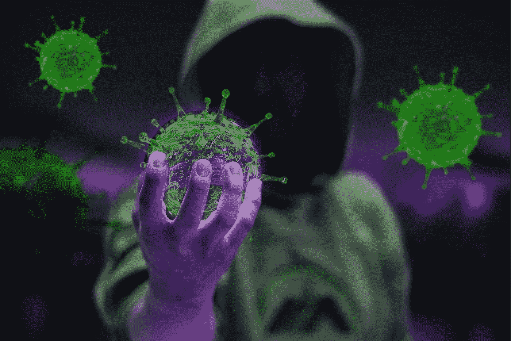

# 人工智能如何在这次疫情中扮演关键角色

> 原文：<https://towardsdatascience.com/ai-played-critical-role-pandemic-5442a5bb9076?source=collection_archive---------51----------------------->

## 需求预测、药物发现、弥合服务差距和诊断

图片由来自 [Pixabay](https://pixabay.com/?utm_source=link-attribution&utm_medium=referral&utm_campaign=image&utm_content=4985942) 的[Fernando zhimaicela](https://pixabay.com/users/fernandozhiminaicela-6246704/?utm_source=link-attribution&utm_medium=referral&utm_campaign=image&utm_content=4985942)拍摄

冠状病毒已经影响了全球的每一个人。人们失去了他们的亲人，国家关闭，医疗专业人员夜以继日地工作，人们失去了工作。

因为人工智能已经成为几年来最热门的话题之一。在这样的时代，它有什么相关性，它如何帮助人类战胜这场危机？

# 需求预测以减少供应缺口

健康度量和评估研究所(IHME)是华盛顿大学医学院的一个研究机构。他们发布了一组冠状病毒数据预测可视化图，白宫、联邦紧急事务管理局和医院正在使用这些数据来调动资源。

IHME 开发了一个预测医院病床和呼吸机数量需求的模型。它还预测了未来 4 个月全球因冠状病毒死亡的人数。

IHME 于 3 月 26 日发表了他们的分析。他们预测对医院服务的需求很可能会大大超过医院的能力。41 个州将需要比医院可提供的更多的 ICU 床位，其中 11 个州需要增加超过 50%的 ICU 床位。这些分析有助于政府和组织满足即将到来的需求，并实施战略来缩小这一供应缺口。

# 用于药物发现的人工智能研究

新冠肺炎高性能计算联盟是一个由科技公司、学术界、国家实验室和联邦机构组成的研究联盟。

研究界已经提供了他们的技术能力，致力于复杂的研究项目，以帮助对抗病毒。研究人员正在应用人工智能算法，构建机器学习模型、生成网络、[强化学习](/reinforcement-learning-value-function-57b04e911152?source=friends_link&sk=fe8b20f046c2c67a1941bb896e1a3658)；用于药物发现、发现分子&基因组表征和结构分析，以及模拟。

公司和机构正在提供超过 402 petaflops、超过 300 万个 CPU 内核和超过 40，000 个 GPU 的免费云计算资源。这些超级计算机为顶级科学家和研究人员提供了计算需求，以确保快速获得结果。

# 减少呼叫中心负荷的虚拟助理

全球各地的急救和医疗服务部门已经看到，出现冠状病毒症状的人的呼叫量有所增加。随着客户代表和社会工作者越来越多地被要求在家工作，公司和国家正在转向人工智能，以弥合由此产生的服务差距。

在意识到许多人都在问同样的一般性问题后，实现虚拟助手似乎是解决方案。哥本哈根使用了一个[虚拟助理机器人为人们](https://news.microsoft.com/transform/how-international-health-care-organizations-are-using-bots-to-help-fight-covid-19/)筛查冠状病毒；该机器人在工作的第一天就回答了 3 万个电话。这使得医疗保健专业人员不必回复查询，而是将时间集中在为患者提供护理上。

[微软医疗保健机器人](https://azuremarketplace.microsoft.com/en-us/marketplace/apps/microsoft-hcb.microsofthealthcarebot)提供自助症状检查器，其语言理解模型被调整为理解医疗和临床术语。这个自我评估机器人对于提供解决方案来帮助患者和临床团队抗击这场全球健康危机至关重要。

# 计算机视觉诊断冠状病毒

美国已经集体测试了一百万人，一些测试结果需要一个多星期才能出来。冠状病毒测试仍然是美国应对疫情最紧迫的问题之一——这需要快速准确的冠状病毒诊断。

阿里巴巴集团建立了一个能够根据 CT 扫描图像进行病毒诊断和分析的人工智能系统。一台 CT 机为每个病人生成 300 到 400 张图像，一个非常有经验的医生至少需要 10 分钟来诊断一个病人。人工智能系统可以在不到 30 秒的时间内进行诊断，准确率高达 96%。

这些[人工智能医疗成像系统使用计算机视觉](/radiologists-computer-vision-diagnose-covid-cecbcdf96e8f?source=friends_link&sk=0f0956f7c7950ee25071fd7c108d0eab)对病例进行分类，并检测改善的迹象。它作为一种分析和筛选工具，为医生做出决定提供意见。这些人工智能系统已经被 26 家医院使用，并在中国帮助诊断了超过 30，000 个病例，并且正在[帮助其他国家](https://www.bloomberg.com/news/articles/2020-03-19/alibaba-pitches-diagnostic-tool-to-europe-in-china-outreach-move)的路上。

John Kennedy highlighted that the Chinese word for crisis (危机) is made up of two components, danger and opportunity. In every crisis lies an opportunity, we have to harness this opportunity so that we can progress as a human race. This crisis would emerge innovative ways to apply and to advance artificial intelligence. I am optimistic about the future of AI and how it can change the way we live.

> 用中文写，“危机”这个词由两个字组成。一个代表危险，一个代表机遇。——约翰·肯尼迪

 [## 放射科医生如何使用计算机视觉诊断新冠肺炎

### 通过缩短 65%的评估时间，人工智能在对抗疾病传播方面发挥了关键作用

towardsdatascience.com](/radiologists-computer-vision-diagnose-covid-cecbcdf96e8f) 

***编者按:*** [*走向数据科学*](http://towardsdatascience.com/) *是一份以数据科学和机器学习研究为主的中型刊物。我们不是健康专家或流行病学家，本文的观点不应被解释为专业建议。想了解更多关于疫情冠状病毒的信息，可以点击* [*这里*](https://www.who.int/emergencies/diseases/novel-coronavirus-2019/situation-reports) *。*

