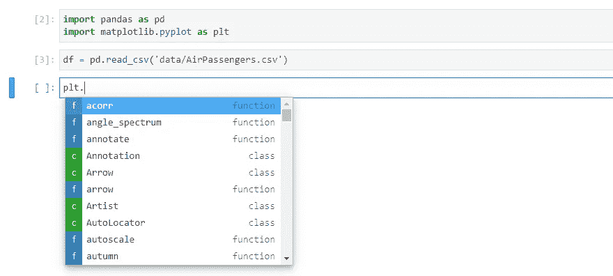
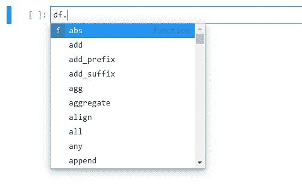
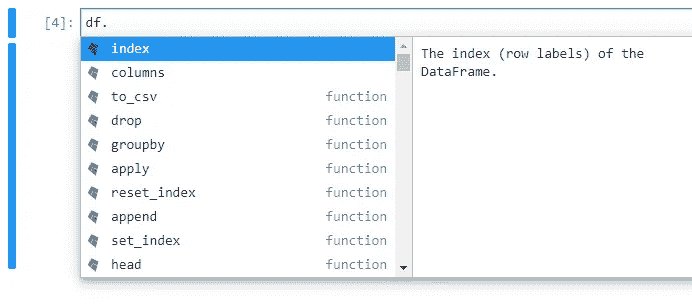
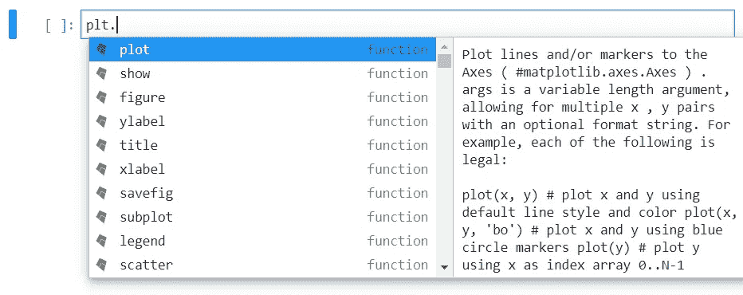

# JupyterLab 中人工智能驱动的代码完成

> 原文：<https://towardsdatascience.com/ai-powered-code-completion-in-jupyterlab-53e53850080c?source=collection_archive---------24----------------------->

## 启动 JupyterLab 中几乎无用的代码建议



JupyterLab 的原生代码完成很好…不太好。

作为一名数据科学家，你几乎肯定会使用一种 Jupyter 笔记本。希望您已经了解了 JupyterLab 的优点，它集成了侧边栏、标签等等。当它在 2018 年首次推出时，JupyterLab 很棒，但感觉它缺少一些东西。

现在你可以添加一个[可视化调试器](https://github.com/jupyterlab/debugger)，甚至还有一个名为 [nbdev](https://github.com/fastai/nbdev) 的库，它允许你创作完整的 Python 包并将它们推送到 PyPI。JupyterLab 已经成为数据科学家的完整 IDE。但是有一件事直到最近还不是最理想的，那就是代码完成。

尝试使用 JupyterLab 中内置的代码补全功能会得到如下结果:



当你真的想要一个完整数据帧的绝对值时。

[Kite](https://kite.com) ，一家为各种语言和 IDE 开发代码完成软件的公司，最近为 JupyterLab 发布了 Kite。现在你可以得到这样的东西:



这更有道理。

使用逻辑自动完成功能简化您的生活。它在本地运行，不会把你的代码发送到云端。



是的，我确实想要 plt.plot()。谢了。

它并不完美，当然也不了解你的想法。尽管对于默认的代码完成来说，这是一个很好的升级。

Kite for JupyterLab 让您离基于完整笔记本的 IDE 更近了一步。

# 如何为 JupyterLab 安装风筝

为 JupyterLab 安装 Kite 相当容易。

1.  首先，为桌面安装风筝。你可以在这里得到安装程序。版本适用于 Windows、Mac 和 Linux。
2.  请确保您的 JupyterLab 是 2.2 版或更高版本。这是 JupyterLab 的最新版本，因此您可能需要使用 *conda* 或 *pip 升级您的安装。*
3.  安装 JupyterLab 扩展。您需要像安装其他扩展一样安装 NodeJS。

```
pip install jupyter-kitejupyter labextension install "@kiteco/jupyterlab-kite"
```

# 我迄今为止的经验

我用 Kite 做 JupyterLab 已经一个星期了。这不是开创性的，但它确实让我的编码体验变得更好。完成速度也明显快于本地完成。

我使用的是 Kite 的免费版本，并且 100%在本地完成。对我来说，最好的建议并不总是在顶部，但通常是在前 5 位。作为数据科学家，我们使用许多方法，这是在需要时获得提醒的好方法。

编码快乐！

> 感谢阅读。你可以在这里找到更多关于我的信息。考虑订阅以便在我发布时收到通知。如果你想直接支持我的文章，你可以使用我的[推荐链接](https://robertritz.com/membership)注册成为媒体会员。