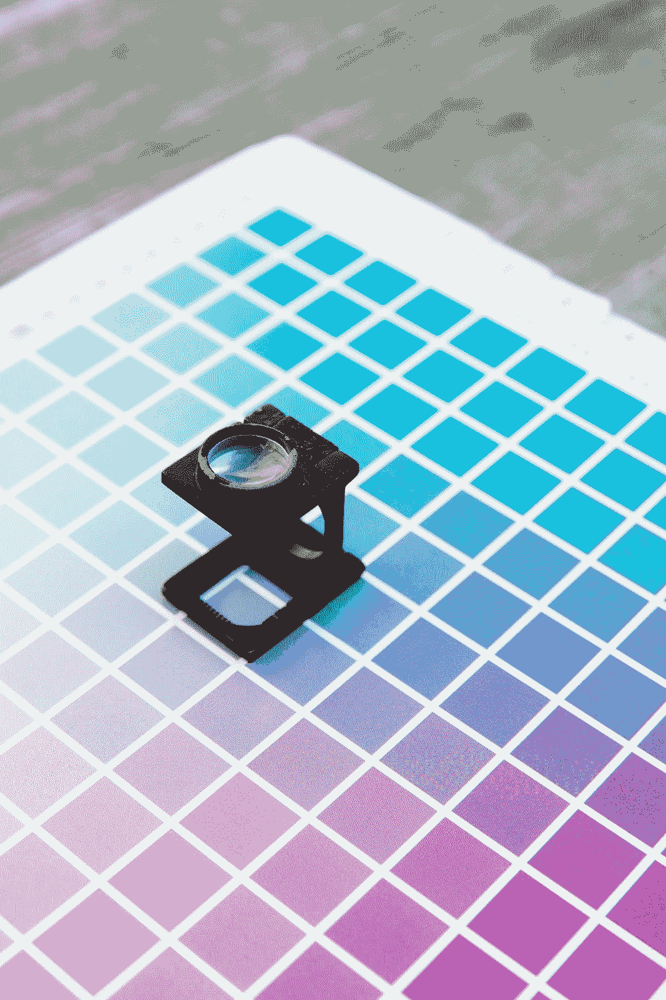
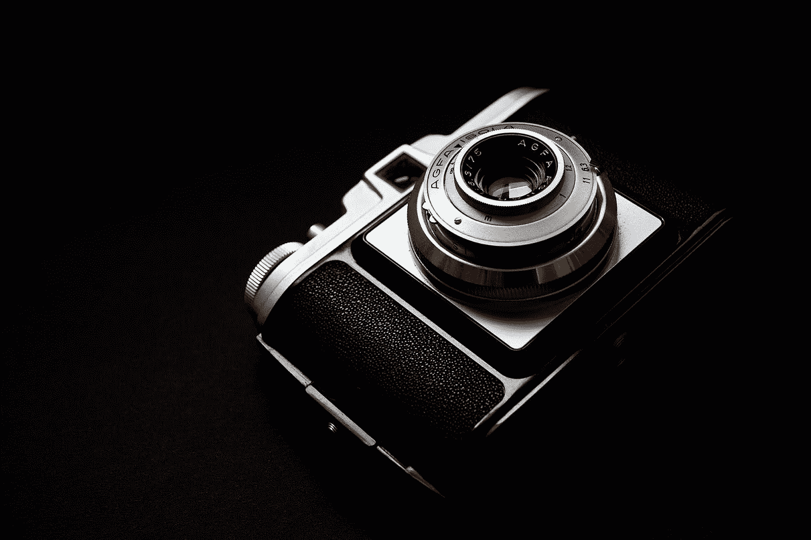

# 人工智能驱动的设计工具

> 原文：<https://towardsdatascience.com/ai-powered-design-tools-937836bffe85?source=collection_archive---------44----------------------->

## 创意、效率和设计的民主化

德克·克内梅尔和乔纳森·福利特

AI 会对设计的实践产生什么影响？我们与 Adobe 人工智能产品营销和战略主管塔蒂亚娜·梅希亚一起探讨了这个问题，她是《硅谷商业杂志》2018 年度最佳硅谷人工智能女性之一。Meija 将我们带入了 Adobe Sensei 的世界，该公司的人工智能和机器学习技术正在影响他们所有的关键软件应用程序。

30 多年来，Adobe 一直是设计人员软件工具的领先提供商。对于依赖 Adobe 软件的设计师来说，他们工作的核心材料从纸张、像素和代码到字体、颜色和布局。在软件成为工具集的一部分之前的几十年里，这些人被称为图形设计师。模拟过程是手动的、缓慢且费力的。平面设计师是以这些物理限制的速度进步的，而不是以他们思维的速度。

随着数字过程取代模拟和物理方法，设计过程发生了巨大的变化。“我记得在大学时，我走进暗室处理我的照片，”梅希亚说。“我必须非常仔细地思考我的意图是什么。我想让它看起来梦幻。我希望有些部分比其他部分更突出。通常，它需要多种方法。所以，如果你想到拍摄照片并把它变成艺术或一种表达的活动，现在我们大部分都是用数字方式做的。在某种程度上，这就是自动化。”随着设计转向数字化，有了像 [Photoshop](https://www.adobe.com/products/photoshop.html) 和 [Illustrator](https://www.adobe.com/products/illustrator.html) 这样的工具，事情开始加速。制作电脑从手工练习转移到了鼠标、显示器和键盘。随后的创新和改进使得这个速度越来越快。

图 01:制作一个从艺术和手工艺练习转移到鼠标，显示器和键盘的比较。
[图片:[由马库斯·斯皮斯克在 Unsplash](https://unsplash.com/photos/hqCEQTc5gZA) 上拍摄]

随着软件和互联网不仅发展了工具，还发展了应用设计的媒体，出现了一系列复杂的标题和数字原生标识符。这些现在通常被概括在一个更广泛的学科中，包括研究人员、工程师和设计师之外的其他专业，称为用户体验。自从十多年前移动计算兴起以来，这种特殊的设计职业已经爆炸式增长。这体现在 Adobe 自身的成长上。2005 年，也就是 iPhone 发布的前一年，Adobe 的年收入不足 30 亿美元。到 2018 年，这一数字上升到 90 多亿美元。虽然这是各种因素的产物，但它也反映了世界上有多少人正在使用这些数字设计工具。

鉴于 Adobe 的规模、影响力和作为数字设计软件市场领导者的稳固地位，他们也在机器学习和人工智能方面进行大量投资以改善其产品也就不足为奇了。一方面，他们的软件的既定性质对什么样的解决方案可以实际应用和商业化提供了一些限制，另一方面，他们的经验、产品成熟度以及应用和功能的多样性为探索这些新技术的潜力提供了令人信服的基础。“Adobe Sensei 是我们的人工智能和机器学习技术，它用于创建和交付数字体验，”梅希亚说。“我们正在考虑如何让我们的用户更容易、更好、更快地做他们最擅长的事情。”

“如果我们考虑人工智能和机器学习，我们已经在这方面工作了 10 多年。“我们的第一个机器学习功能实际上是 Photoshop 中的红眼消除，”梅希亚说。像红眼减少这样的功能，在 15 年前是照片编辑应用程序中的神奇选项，现在已经自动化，并被视为理所当然。我们已经从慢速和模拟，到慢速和数字，到快速和数字，到现在，在许多情况下，自动。由于这些进步，设计在过去 30 年左右的时间里发生了翻天覆地的变化。

图 02:随着摄影从模拟转向数字，过程中的许多任务都实现了自动化。
【图片:[托马斯·斯蒂芬在 Unsplash](https://unsplash.com/photos/ygW2Hn3PTSI) 上拍摄

## **提高创意过程的效率**

Adobe 强调，借助 Sensei 的人工智能，他们希望最大限度地减少设计实践的单调乏味。唤醒人工智能可以开始处理一些经常需要入门级设计师的机械生产杂务。这方面的例子可能包括费力地从照片背景中剪切出一个复杂的对象，或者创建一组适合各种社交媒体风格的图形。在这种人工智能驱动的功能的帮助下，该软件不再需要以细节为导向的设计师来执行这些任务，而是将他们的时间花在做其他事情上。“我还没有遇到过一次就做对的设计师，”梅希亚说。“他们喜欢反复思考这个问题。人工智能让你能够做的是……更快地找出你试图做的事情。”

这种加速给了设计师解决更多问题的机会，甚至是向价值链上游移动，解决不同类别的问题。“人工智能要做的事情之一是让那些刚开始的职业生涯变得有趣得多，”梅希亚说。人工智能将比几乎任何其他创造性职业更彻底地改变设计职业。设计师将能够专注于更高层次的上下文，例如解决与系统相关的问题，而不是人们以一般方式思考“设计师”时经常想到的像素。

## **寻找隐藏模式**

Adobe 现在让设计师更容易找到合适的库存摄影的方法是一个很好的微观案例，研究人工智能和机器学习如何增强创造性工作——无论是在设计还是其他专业领域。长期以来，股票摄影一直被元数据“标记”，以便人们更容易搜索。但凭借人工智能阅读和解释图像的能力，它可以用更广泛的术语来标记图像，从而实现精确的搜索。“我们正在做的事情之一是让人们更容易谈论他们想要什么和他们想要什么，并以直观的方式找到它，”梅希亚说。在如何对照片进行分类的粒度特异性，以及视觉搜索等更先进和用户友好的工具之间，机器学习层正在将智能注入到既节省时间又为最终的创意选择增加质量和价值的过程中。

梅希亚说:“我们正在寻找模式，我们正在利用计算机视觉来帮助丰富信息，这样，对用户来说，它就像魔术一样。”。“因此，你可以搜索‘family ’,然后拖放你想要匹配的配色方案。现在你有了所有家庭的彩色照片。”

或者，也许你可以输入你在现实世界中捕捉到的软件图像，这些图像为你带来了创造性的灵感，并且——受到机器读取图像的能力以及系统中已经存在的大量现有和经过良好审查的图像的支持——人工智能可以将你与更多更好的资产联系起来。诸如此类的功能将使设计者能够在解决问题、寻找灵感和阐明解决方案的空间中工作，减少手动中间步骤。

## **自动化和设定创意意图**

这些人工智能解决方案将切实影响设计师的工作流程，特别是当涉及到跨所有太多形式的数字媒体的缩放工作时。“设计师设定创意意图。他们知道自己想做什么。他们甚至可能创造出第一个，”梅希亚说。“但即使你考虑制作或后期制作，创造变化，这也是人工智能非常强大的地方。…能够快速做到这一点意味着您可以在 it 上花费更多时间，即使生产压力增加也是如此。”

图 03:人工智能驱动的软件解决方案将切实影响设计师的工作流程。
【图片:[由 Lubos Volkov 为 Unsplash](https://unsplash.com/photos/jJT2r2n7lYA) 上的 UX 店拍摄

“因此，当我们考虑自动化时，最容易利用人工智能的事情是那些容易定义和重复的事情，”梅希亚说。“因此，如果你考虑为一个电子商务网站制作图像，例如，你可能会得到许多不同的输入，但你希望它具有某种美感，甚至可能是相同的背景颜色，等等，这些事情通常是一系列步骤——这将是你可以利用人工智能的事情。即使在创作中，它也会让一些更独立的作品变得更容易。因此，你在创意总监模式下获得的创意更多，而不是制作助理。”

对于创意专业人士，尤其是设计师来说，人工智能在早期的影响将主要是面向生产的。这包括从设计制作到撰写公式化的股票简介，再到自动化最常见的客户服务互动。虽然从字面上看，这将使一些工作过时，但这并不一定意味着特定职业的机会，如设计工作，将变得更加有限。回顾最近的设计历史，即使软件将某些元素自动化，使曾经需要几小时或几天的任务现在只需要几分钟或几小时，最终结果是越来越多的设计在世界上开花结果。苹果公司等公司展示了更好的设计对公司利润和成功的不可思议的影响，使设计成为希望竞争的公司更高的战略优先事项。因此，设计行业蓬勃发展。没有理由相信这些新的进步会有任何不同，即使具体的任务和工作已经过时。机会将会改变。设计师只需要提前思考并为此做好准备。

## **回路中的人类**

人工智能在狭窄和有限的环境中是伟大的，在更大或更多面的环境中是可怕的——特别是在复杂、动态和始终处于运动状态的环境中，如人类、社会和文化。设计师的核心洞察力一方面引领新的趋势和时尚，另一方面为特别复杂的情况提供精确的出色解决方案，这些都不会很快被机器实现。这是设计师在准备未来成功时应该集中时间、精力和专业知识的地方——不是在制造和装配上，机器将越来越多地比我们做得更好，而是在解决问题的活动上，如研究、分析、策略和解决方案。在未来的几年甚至几十年里，有哪些任务需要人们去完成？“打破模式，看到新的模式，这是人类特有的火花，”梅希亚说。

梅希亚说:“我们委托进行了一些研究，并进行了 100 多次定性采访，询问设计师们他们对什么感到兴奋，他们觉得可以在哪里使用(人工智能工具)，他们关心什么。”。

> “(他们)最大的担心是，它会变得同质化。如果每个人都能使用这些工具，我们会不会开始看到艺术看起来都一样？”

虽然这是一个合理的担忧，但我们已经在模拟世界中看到了这种趋势。尽管如此，新的风格和想法找到了他们的市场，审美世界继续发展。最终，是市场和创造者引导我们走向或远离一致性。

## **民主化设计**

在我们的谈话中，梅希亚提出了一个重要的商业模式演变:个人设计顾问，或代理业务，目前依赖于工作流，他们的能力实施简单的，以生产为导向的现有资产的更新，让他们忙碌，计费和财务上可行。这将越来越受到损害，可能不会被内部设计师和创意人员取代，而是被我们通常想象不到的负责监督资产重用和格式化的人取代——比如营销人员和产品经理。

> “我认为人工智能是一个必要而重要的工具，它将帮助我们应对和满足所有这些内容速度的需求，全天候的需求，以及从人群中脱颖而出的需求，”梅希亚说。“这也将使一些创意民主化，这意味着不是每一个变化都需要回到设计师那里。”

人工智能驱动的软件将很容易取代最公式化和程序化的任务，在这个过程中，商业人士可以实现曾经被认为是创造性的过程，要求有创造力的个人通过做更多实际上有创造性的事情来赚钱。Adobe 软件的结构已经说明了现在和将来任务和角色的混合。广泛的 Adobe 工具套件不仅包括面向设计师的模块，还包括面向更广泛的创意和商业专业人士的模块。在同一个生态系统中运行，一个日益一体化的生态系统，将彼此带入彼此的工作流程和工具，预示着一个流动的未来，在这个未来，机器趋向于单调乏味，而创意者在创作过程的前端越来越多地接受挑战。

我们正在进入一个时代，在这个时代，创造力将变得越来越容易获得和民主化。Adobe 的软件也引入了非设计师，让他们和设计师一起工作。而且，随着时间的推移，越来越多的更简单或常规的设计任务将变得自动化，不需要设计师来完成。Adobe 的人工智能提供了另一个重要的证据，表明当前和下一代机器学习工具将使非专业人士——没有受过写作或设计等方面训练的人——更容易开始将他们的沟通或创作能力专业化，而以前需要请作家或设计师来做。这为公司和个人带来了很多可能性，我们期待在本系列的后续文章中分享这些可能性。

[*Creative Next*](http://www.creativenext.org) *是一个播客，探索人工智能驱动的自动化对创意工作者，如作家、研究人员、艺术家、设计师、工程师和企业家的生活的影响。本文伴随* [*第三季第三集——AI 驱动的设计工具*](https://creativenext.org/episodes/ai-powered-design-tools/) *。*