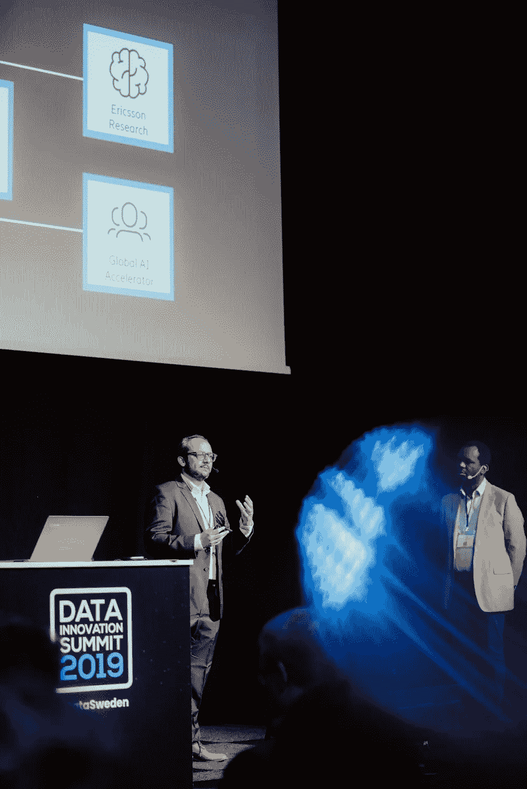

# 人工智能驱动的未来电信网络:爱立信案例研究

> 原文：<https://towardsdatascience.com/ai-powered-telecom-network-of-tomorrow-ericsson-case-study-68a7653d6d28?source=collection_archive---------50----------------------->

## 人工智能推动电信行业的变革

图片由 [Unsplash](https://unsplash.com/photos/OKOOGO578eo) 上的 [Anastasia Dulgier](https://unsplash.com/@dulgier) 拍摄

我们见证了电信行业每天都在发生变化，人工智能是其主要驱动力。今天的电信网络将人们联系在一起。在 5G 和[物联网](https://read.hyperight.com/iot-bridging-the-real-and-digital-world-or-creating-turbulence/)的帮助下，未来的电信网络不仅将连接人，还将连接物和工厂，并提供身临其境的视频用例。所有这些创新需求都给电信网络带来了压力，以支持这些用例。爱立信自动化和人工智能开发负责人 Gaurav Dixit 在 2019 年 [**数据创新峰会**](https://datainnovationsummit.com/) 上发表演讲时强调，他们将鼓励这些未来电信网络的设计、创建和运营发生根本性转变。Gaurav Dixit 深入探讨了爱立信如何通过[部署人工智能和自动化技术](https://www.youtube.com/watch?v=_PFjcHFYEmw)来应对 5G 给电信和 it 网络带来的挑战，从而转变其服务和产品组合。

Hyperight AB 在[数据创新峰会上的照片](https://datainnovationsummit.com/#gallery) /版权所有

## 爱立信如何部署人工智能和自动化技术

爱立信一直是采用新的颠覆性技术并将其集成到服务组合中的领导者。“我们正在改变自己，并为客户带来好处”，Gaurav 解释道。

爱立信并不认为 5G 架构是一个单一的人工智能堆栈。Gaurav 解释说，他们在每个架构层中都嵌入了人工智能，作为贯穿其整个产品和服务套件的端到端联合人工智能。从计费和收费到管理和协调，再到 5G 接入和网络服务，所有组件作为一个实体协同工作，以卓越的客户服务为客户提供 5G 网络的最大优势。

但如果人工智能和自动化是解决方案，那么肯定有一个问题需要解决。Gaurav 解释说，他们的最终目标是通过提供最先进的**网络性能**提供卓越的**终端消费者体验**，这反过来将通过利用 5G 和物联网支持的新用例带来**新收入**，从而通过降低 OPEX 带来**效率提升**。

因此，这是一个相互依赖的组件链，从人工智能技术开始，到卓越客户体验的最终目标结束。

由 [manolofranco](https://pixabay.com/users/manolofranco-1029720/) 在 [Pixabay](https://pixabay.com/photos/tower-communications-repeater-sky-807621/) 上拍摄的照片

# 通过提供人工智能支持的服务和产品获得的经验教训

几年来，爱立信一直在他们的产品组合中部署人工智能和自动化技术，他们可以深入了解他们在这一过程中吸取的一些经验教训。

## 获取数据

“数据对于人工智能技术就像空气对于人类一样”，Gaurav 描绘道。因此，对数据的访问，以及正确的数据质量、正确的合同权利、数据管理和治理——这是采用人工智能的第一步，也是最重要的一步。

视频由[hyperlight AB](https://hyperight.com/)—[支持人工智能的零接触、实时、电信& IT 网络设计— Kai Chaza & Gaurav Dixit，爱立信](https://www.youtube.com/watch?v=_PFjcHFYEmw)

## 应用和平台

下一步要考虑的是正确的应用程序和平台，因为正如 Gaurav 所说，数据必须存储在某个地方。爱立信选择的平台是一个基于云的平台，用于提供灵活和可扩展的服务。

根据经验，Gaurav 说这两个技术部分只占所有工作的 40%。这座冰山的其余 60%属于 ***流程*** 和 ***人员*** 的其他组成部分，因为他们是变革管理工作的一部分，这意味着从根本上改变人们的工作方式和评估方式。随着新技术的引入，需要新的能力，人们需要重新掌握技能，这也需要文化的改变。

图片由[卡米洛·希门尼斯](https://unsplash.com/@coolmilo)在 [Unsplash](https://unsplash.com/photos/qZenO_gQ7QA) 上拍摄

## 爱立信如何应对技术带来的变化

Gaurav 提到了爱立信成功的人工智能和自动化应用的三大支柱:

*   业务和数据生态系统——跨产品和服务组合的端到端联合人工智能。如前所述，他们将人工智能嵌入到每一层，并将其用于预测客户行为、动态编排、预测事件等。
*   爱立信研究中心——是 2G、3G、4G 和 5G 发明的地方。一个容纳 750 名研究人员的大脑之家，其中 100 名研究人员从事人工智能相关技术的工作，他们利用这些技术来解决客户问题。
*   能力-卓越中心或全球人工智能加速器-卓越中心拥有 300 名数据科学家，并提供他们需要的能力，以扩展他们与研究一起创建的解决方案。

照片由[像素](https://www.pexels.com/photo/adult-app-channel-connected-221181/)上的 [Pixabay](https://www.pexels.com/@pixabay) 拍摄

## 一切是如何协同工作的？

正如 Gaurav 之前提到的，第一个也是最终的指导方针是他们的客户。“一切从顾客开始”，Gaurav 强调说。他们以用例驱动、以客户为中心的快速原型方式工作。他们直接与客户交谈以发现他们的痛点，并通过研究寻找解决痛点的方法，与客户一起在业务部门内测试可能的解决方案，并在全球人工智能加速器的帮助下进行扩展。

## 人工智能用例

爱立信的托管服务业务部门在三个部门有几个经过验证的人工智能用例:网络运营、it 运营以及设计和优化。

举例来说，Gaurav 解释了现场调度优化用例，其中涉及到技术人员前往缺陷现场进行修复，并花费大量资金。在与一位客户交谈后，他们发现 10%的现场派遣是误报。为了解决这个问题，他们分析了数据，现在能够预测 10 个不必要的现场调度员中的 9 个。该解决方案直接影响客户底线，并节省不必要的成本。

至于必要的调度，通过逻辑树，他们可以预测是否有人需要爬网络塔，以及他们需要什么设备，从而节省宝贵的资源。

由[拍摄的照片](https://pixabay.com/users/free-photos-242387/)在 [Pixabay](https://pixabay.com/photos/earth-lights-environment-globe-1149733/) 上

## 人工智能是一个旅程，而不是目的地

人工智能的采用本身并不是目标，它是一个旅程，应该如此对待。爱立信已经在这条路上走了几年，可以自豪地说，他们已经实现了人工智能和机器学习用例的产业化。至于未来的目标，Gaurav 说他们的目标是机器推理，这是类似人类知识的自动化。

我们已经在体验未来的网络，因为商用 5G 网络已经在世界各地上线，连接更多的物联网设备，用户已经开始感受到好处。

*本文原载于 Hyperight.com***。**