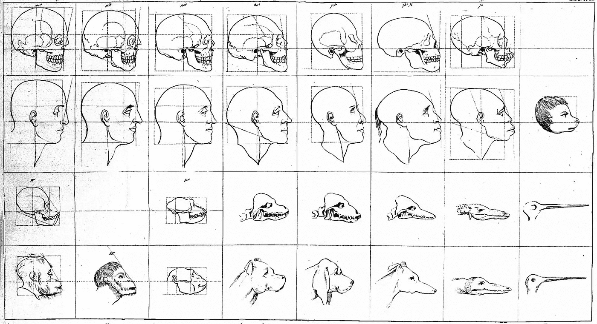
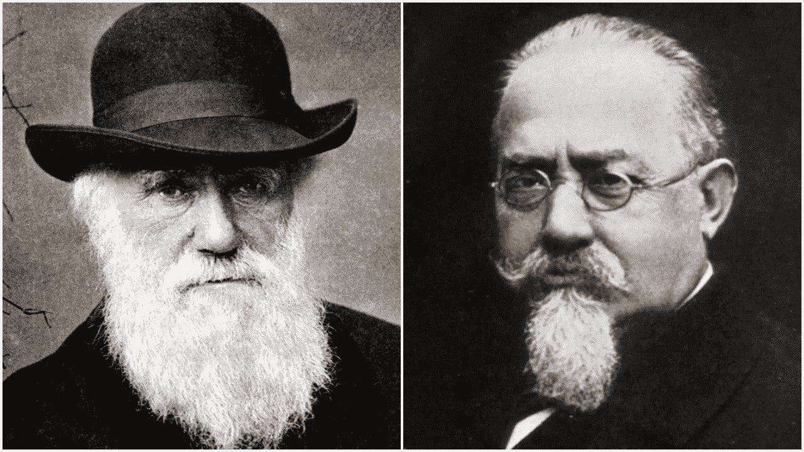

# 人工智能伪科学和科学种族主义

> 原文：<https://towardsdatascience.com/ai-pseudoscience-and-scientific-racism-693f1444c959?source=collection_archive---------40----------------------->

## 最近通过面部特征预测犯罪的尝试让人回想起不道德和种族主义伪科学的悠久传统

来源:[维基共享资源](https://commons.wikimedia.org/wiki/File:Faces_demonstrating_points_of_physiognomy,_Lavater,_1806-1809_Wellcome_L0019189.jpg)

***更新(2020 年 6 月 30 日):****[*文章《从面部图像中发现犯罪倾向和性别偏见的影响》被撤回*](https://journalofbigdata.springeropen.com/articles/10.1186/s40537-020-00323-8) *，因为作者“在进行这项使用人类生物特征数据的研究之前，没有寻求伦理委员会的批准。”这是我指出的关于最初研究的许多问题之一。**

*本月早些时候，哈里斯堡大学即将发表的一篇论文引起了轩然大波。题为“使用图像处理预测犯罪行为的深度神经网络模型”的论文[承诺](https://web.archive.org/web/20200506013352/https://harrisburgu.edu/hu-facial-recognition-software-identifies-potential-criminals/):*

> *该软件有 80%的准确率，并且没有种族偏见，仅根据一张人脸照片就可以预测一个人是否是罪犯。该软件旨在帮助执法部门预防犯罪。*

*这种说法是绝对荒谬的，这将在下面讨论。*

*来自不同研究者的广泛批评导致论文被撤回。来自 2016 年的另一篇论文做出了类似的承诺——它也受到了广泛的批评，导致作者们对他们关于 arXiv 的原始论文做出了回应。*

*然而，几个月前在 2020 年 1 月发表的另一篇论文基本上躲过了类似的关注和愤怒。哈希米和霍尔在*大数据期刊* 上发表的[“从面部图像中检测犯罪倾向和性别偏见效应”](https://journalofbigdata.springeropen.com/articles/10.1186/s40537-019-0282-4)声称:*

> *本文探索了深度学习在区分犯罪和非犯罪人脸图像方面的能力。。。CNN【卷积神经网络】实现了 97%的十倍交叉验证准确率。*

*声称从一个人的照片预测犯罪有 97%的准确性是一个大胆的说法。正如我们将看到的，由于其概念和执行方面的问题，这种说法是完全没有根据的。*

*这将通过研究的伪科学框架以及实验的实际问题来展示，包括通过训练深度学习模型来复制类似结果的尝试。事实证明，我们可以得到类似的优秀结果，这与“犯罪行为”无关，而是与基本的实验误差有关。*

## *什么是犯罪？*

*犯罪是一种社会现象。这意味着，我们所谓的“犯罪”或“犯罪行为”实际上是一个不断变化的社会定义，取决于我们所指的时间和地点。它与生物学无关，除了社会对它的定义之外，它没有更高的、不变的定义。*

*赌博和卖淫在加州是犯罪行为，但在内华达州却是合法行业。大麻销售和消费在加州是合法的，但直到最近才是这样，它仍然是一项联邦罪行。*

*但有人可能会说，这些是没有受害者的犯罪。谋杀呢？*

*如果你在邻居的房子里放置了一枚炸弹，炸弹爆炸并炸死了他们，你可能会被判犯有纵火罪和谋杀罪。但是，如果总统向伊拉克宣战并轰炸巴格达的整个街区，这可能不被认为是犯罪行为(根据美国法律),尽管我们中的一些人会认为这在道德上是令人反感的。*

*过去奴隶主杀死他们的奴隶是合法的，整个经济和文化都将这种权力的不平衡视为社会的基本权利。现在在美国，奴役他人是一种犯罪。一个被绑架、关押了一段时间并遭受残暴对待的人，无论在道德上还是法律上，杀死绑架者以重获自由都是完全正当的。在这种情况下，一个本来不会杀人的人可能会愿意杀人。*

*换句话说，犯罪没有什么天生的生物学特征。这和你的基因无关，更和你的脸无关。*

*没有任何机器学习算法，即使是一个真正好的卷积神经网络，也无法根据一张照片或关于一个人的其他生物信息来预测犯罪，因为“犯罪”与你的关系不大，而是与社会如何判断和回应你的行为有关。*

*这是否意味着，如果有人杀了另一个人，我们只是举起双手说，“嗯，这只是一个社会构造！”不，当然不是。但是我们必须把它放在背景中，看看造成了什么样的社会危害。在某些情况下，杀人是不人道和不道德的，而在其他情况下，这可能是一种自卫行为，唯一的区别可能不是行动，而是发生的社会。*

*这里的要点是，“犯罪”是一个非常模糊和宽泛的概念，我们可能认为是犯罪(或非犯罪)的行为会随着时间的推移而变好或变坏。*

*哈希米和霍尔如何解决这些含糊不清的问题？他们根本没有解决这些问题。事实上，他们甚至没有建立一个数据集，即使使用美国使用的最基本和广泛接受的定义，也能始终正确地将人脸标记为罪犯或非罪犯。*

## *在被证明对数据科学有用之前是无辜的*

*哈希米和霍尔使用两组人脸来训练他们的模型。首先，他们的“犯罪”脸是从国家标准和技术研究所(NIST)提供的一组面部照片中收集的。他们的“非犯罪”面孔是从许多普通的非 mughsot 来源收集的，这些来源由各个大学的面部识别研究人员管理。*

*问题是，面部照片不一定描绘罪犯。这些人已经被逮捕，但不一定被判有罪。这是警方认为有罪的人的数据库，或者在某些情况下，警方只是想逮捕的人。*

*另一方面，这也引发了伦理问题，即面部照片中的人是否同意将他们的图像用于此类目的。警察定期拍摄面部照片并公之于众，以此来羞辱那些被他们逮捕的人，而许多记者未经允许就转载了这些照片，这让他们名誉扫地。再说一次，如果一个人被定罪的话，面部照片是在他被定罪之前拍摄的。目前还不清楚他们中是否有人被判有罪，或者是否同意广泛传播他们的照片。*

*另一方面，哈希米和霍尔的非罪犯通用图像数据库并不一定描绘出 T2 没有被定罪的人。我们对此一无所知。事实上，除了统计学上的可能性之外，没有任何理由可以解释为什么面部照片组的人在普通数据库中没有他们的脸。*

*一项[司法部的研究](https://www.brennancenter.org/our-work/analysis-opinion/just-facts-many-americans-have-criminal-records-college-diplomas)估计，美国三分之一的工作年龄成年人有被捕记录。从统计数据来看，很多“非罪犯”很有可能在他们一生中的某个时候被指控，有些被判有罪，尽管他们在实验中使用的照片会显示他们比照大头照时快乐得多。*

*这是一个惊人的疏忽。一个人不需要成为社会学家就能从数据中理解这个问题。人们只需要对什么是犯罪有一个最天真的定义。*

*尽管如此，哈希米和霍尔声称已经训练了一个模型，可以准确预测一个图像是来自面部照片组还是非面部照片组，准确率达到 97%。他们是怎么做到的？*

*他们论文中的一条评论指出了这两个数据集之间的许多差异，神经网络可以从中发现这些差异，而这些差异与犯罪或逮捕无关:*

> *犯罪类别的所有图像来自 NIST 数据集，非犯罪类别的所有图像来自其他来源的五个数据集。*
> 
> *所有标记为罪犯的图像都是打印图像的照片，并且是用相同的照相机型号以受控的方式拍摄的，所有标记为非罪犯的图像都是由各种照相机拍摄的活人的照片。*
> 
> *所有标记为罪犯的图像都是(无损)PNG 格式，所有标记为非罪犯的图像都是(有损)JPG 格式。*
> 
> *所有标记为罪犯的图像开始都是灰度的；调查人员将所有标记为非犯罪的图像从彩色转换成灰度。*

*哈希米和霍尔注意到，“这种与面部结构无关的差异，虽然在大多数情况下可以忽略不计，但可能在训练分类器和帮助分类器区分这两个类别方面略有贡献。”*

*但即使在这里，他们也只是具体提到前两点(不同的来源)，而不是最后两点。*

*这最后两点几乎肯定被神经网络检测到，并且很可能是 97%命中率的主要原因。我们可以在实践中证明这一点*

## *重现结果*

**

*笔迹样本来自 MNIST 数据库，来源:[维基百科](https://en.wikipedia.org/wiki/MNIST_database#/media/File:MnistExamples.png)*

*在与 Hashemi 和 Hall 相似的条件下建立一个神经网络并训练一个简单区分 jpg 和 png 的模型是非常容易的。*

*一个下午，我就这样做了，由此产生的 [Jupyter 笔记本可以在这里找到](https://github.com/scottdjohnson/MathScienceNotebooks/blob/master/Challenging%20_Criminal%20tendency%20detection%20from%20facial%20images_.ipynb)。*

*从弗朗索瓦·乔莱(Franç ois Chollet)的《用 Python 进行深度学习》(Deep Learning with Python )一书中的一个样本项目开始，我能够建立一个神经网络来区分“犯罪”和“非犯罪”图像。*

*我没有使用面部照片，而是使用了通过 Keras Python 库检索的手写数字图像的 MNIST 数据库。*

*首先，我随机将每张图片标记为罪犯(0)或非罪犯(1)，然后我训练一个模型来预测这种任意定义的犯罪行为。注意，每个图像都被赋予了犯罪标记*，而不管图像*的内容如何，也就是说，不管图像中显示的是什么数字。因此，一张照片中手写的“7”被标记为“罪犯”，而另一张照片中的“7”被标记为“非罪犯”*这完全是任意和随机的*，而且不知道笔迹是否来自有犯罪前科的人。*

*该模型成功地正确确定了我指定的“犯罪”和“非犯罪”的手写数字，只有大约 50%的时间，不比随机猜测或扔硬币好。这是我们所期望的，因为这些名称是任意的。*

*但是在我把我所有的“罪犯”图像转换成 PNG 和“非罪犯”图像转换成 JPG 之后，我训练的最终模型在 99%的时间里都成功了！*

*这是一个怪异而武断的实验吗？是的，但并不比试图从一个人的脸上发现犯罪更重要。事实上，我的实验的一个版本可以用来尝试从笔迹中发现犯罪行为。从监狱里的人身上提取笔迹样本，从没有犯罪记录的人身上提取样本，我们可以以同样的准确度重现上面的结果——只要“犯罪”样本是 png，而“非犯罪”样本是 jpg。当然，除了笔迹样本，我们也可以使用人脸。*

*换句话说，哈希米和霍尔构建的可能只不过是一个复杂的 PNG vs JPG 图像格式检测器。他们碰巧训练他们的人脸图像，而我碰巧训练我的手写数字图像。他们用卷积神经网络实现了 97%的准确率，用标准前馈神经网络实现了 89%的准确率——后者类似于我如何以 99%的准确率训练我的模型。*

*那么问题就不是为什么他们如此成功，而是为什么他们的模式表现如此糟糕。*

*抛开所有这些问题不谈，他们的实验及其概念本身仍然存在固有的种族问题。*

*例如，[联邦调查局的统计数据显示](https://abc7news.com/police-arrests-bay-area-systematic-racism/6243588/)在旧金山湾区，黑人被逮捕的可能性是白人的四倍。在许多其他大城市和大都市区也是如此。*

*然而，哈希米和霍尔指出，“由于我们的数据集很小，从低质量的面部图像中识别种族很困难，有时还带有主观性，因此没有对种族进行控制。”按照描述训练的模型可以很容易地将深色皮肤的人与犯罪联系起来，因为他们在面部照片数据集中的出现率不成比例地高，除此之外别无其他。*

*这只会反映刑事司法系统中现存的种族主义，并进一步助长种族主义，而不是告诉我们任何关于固有犯罪的事情*。*此类实验还强化了警察和陪审团在认为某人“看起来有罪”时通常会做出的种族主义假设*

## *科学种族主义的回归*

**

*查尔斯·达尔文(左)是一名真正的科学家，凯撒·朗普罗索(右)是一名伪科学家。来源:[维基共享](https://commons.wikimedia.org/wiki/File:Charles_Darwin_1880.jpg)和[维基百科](https://en.wikipedia.org/wiki/Cesare_Lombroso#/media/File:Lombroso.JPG)*

*这个实验可以追溯到 19 世纪和 20 世纪早期的科学种族主义。与其说它是科学的，不如说它是一种种族主义的形式，用声称基于达尔文进化论但实际上没有任何科学依据的虚假科学理论来证明。*

*这些理论证明了一些种族主义政策的合理性，包括对移民的限制和对非白人比例过高的穷人和其他“不受欢迎的人”的强制绝育。这项工作的大部分起源于美国，并成为希特勒和第三帝国的灵感。*

*在第二次世界大战的恐怖之后，这些在学术界有所耳闻的理论变得完全不可信。哈希米和霍尔似乎没有得到消息，而是把他们的工作放在切萨雷·龙勃罗梭的传统。*

*“这项研究是由隆布罗索的研究引发的，”他们在介绍中不加批判地指出，“该研究表明，罪犯可以通过他们的面部结构和情绪来识别。”*

*事实上，隆布罗索的作品未能展示这些东西，已经完全被抹黑了。已故的进化生物学家史蒂芬·杰·古尔德在他的经典著作《人类的错配》中用了一章的大部分时间来揭露隆布罗索的理论，并用基于隆布罗索自己扭曲的思维的文字来描述它:*

> *罪犯是我们中间的进化倒退。祖先的细菌潜伏在我们的遗传中。在一些不幸的人身上，过去的事情又重现了。这些人天生就像正常的猿或野蛮人一样，但这种行为在我们的文明社会中被视为犯罪。幸运的是，我们可以识别天生的罪犯，因为他们具有解剖学上的特征。*

*根据 2014 年一篇[连线*文章:*](https://www.wired.com/2014/11/fantastically-wrong-criminal-anthropology/)*

> *隆布罗索采用了达尔文最近发表的进化论，并加入了一个可怕的转折，这个转折将会影响几十年。你很难找到他的论点的优点，即罪犯实际上表达了我们祖先的身体素质，使他们更接近猿类而不是人类的性情。或者看看伴随他的假设而来的种族主义旋风带来了什么好处。或者把有大耳垂的人描绘成天生的罪犯。*

*这些犯罪迹象包括他在非洲人和亚洲人身上发现的一些特征，但甚至在一些欧洲人身上发现缺失的耳垂和钩状鼻子也是犯罪的迹象。*

*哈希米和霍尔文章的基础根植于伪科学和科学种族主义，因此应该被拒绝。*

*人们不禁要问，什么样的同行评审过程会让这么多这样的问题出现在大数据杂志的一篇文章中。*

*然而，更令人担忧的是这种研究在学术界的未来，以及它对每天与已经存在偏见的刑事司法系统打交道的活生生的人可能造成的伤害。*