# 人工智能-研究进化

> 原文：<https://towardsdatascience.com/ai-research-evolution-107c7434d1f2?source=collection_archive---------60----------------------->

## 疫情快照

**趋势**

人工智能(AI)已经出现指数级增长。人工智能领域的研究论文申请也紧随其后，arxiv.org 的研究论文申请超过 3 万篇。

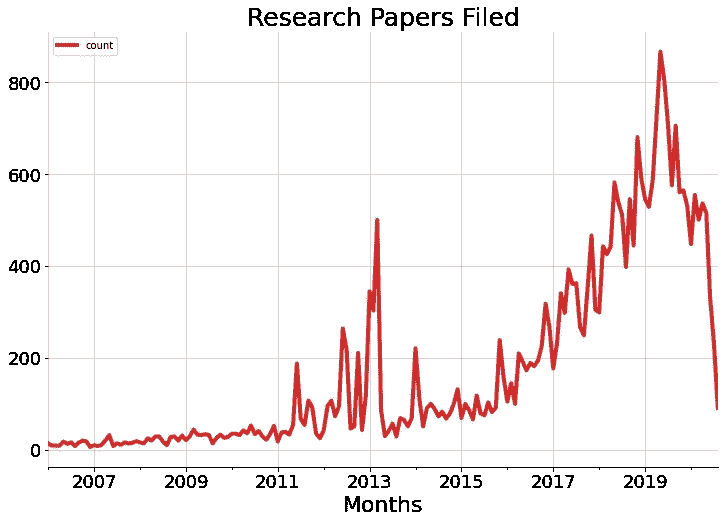

疫情也影响了人工智能研究，这可以从最近几个月提交的论文数量下降中看出来

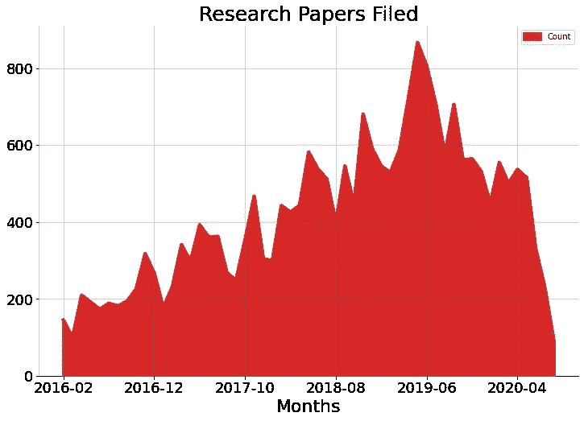

然而，以医疗保健为重点的研究在疫情期间出现了激增。

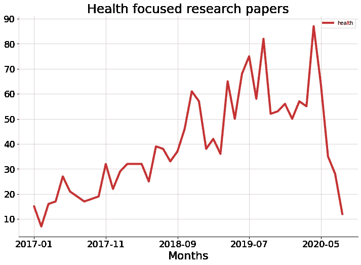

**学科**

人工智能研究这些年来已经变得非常多学科化，如下图所示。除了人工智能和机器学习的核心学科，计算机视觉研究多年来一直占据主导地位，包括图像和视频处理。神经计算、机器人、信号处理和语言等学科也有大量研究。

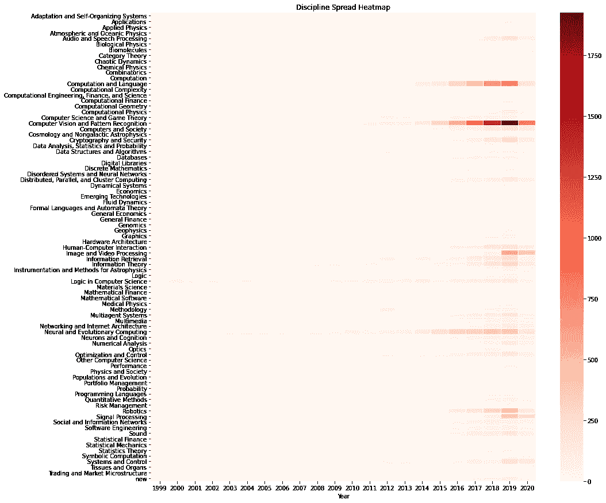

在疫情期间，其中一些地区继续占主导地位。这里有几个最重要的归档原则。

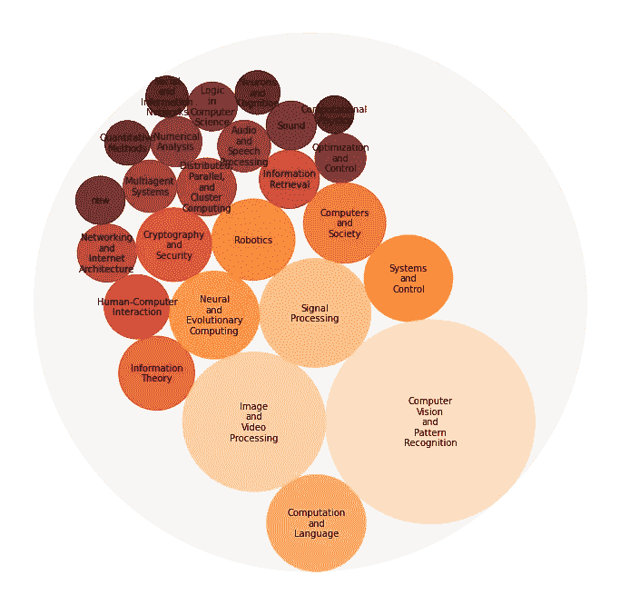

然而，在疫情期间，某些生物/医学学科出现了人工智能主导的研究热潮。围绕生物分子、组织和器官、分子网络、医学/生物物理学和基因组学的研究已经起步。

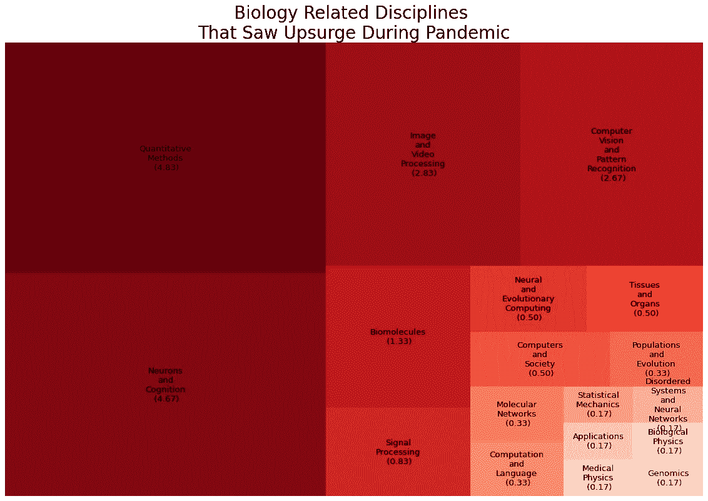

**概念**

多年来，CNN(卷积神经网络)、RNNs(递归神经网络)、GANs(生成对抗网络)和其他使用 GPU 的算法占据主导地位。

多年来的几大概念

在疫情期间，医学研究的成果集中在 X 射线、CT 扫描、脑电图、3D 图像分析和 RNA 聚焦方法上。用于查询期刊以更快获得答案或模式的问答系统也出现了热潮。可解释的人工智能(XAI)已经占据了优先地位，尤其是在医疗诊断方面。

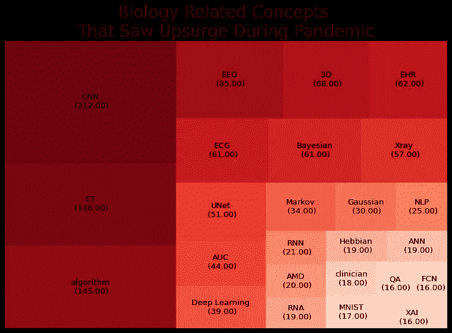

**疾病**

这些年来，人工智能应用于的疾病也发生了变化。癌症研究是主要焦点。最近几个月，肺炎相关的研究有所增加。糖尿病仍然是多年来的一个主要关注领域。

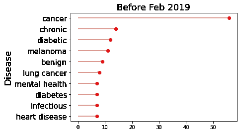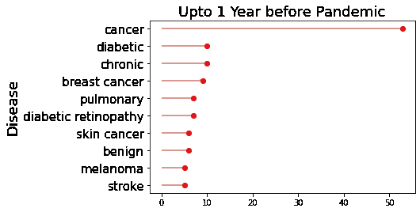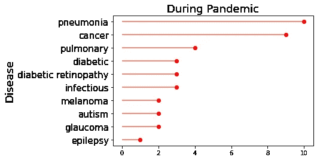

**未来**

人工智能的核心学科继续出现热潮，一些概念也是如此，如使用 CNN、RNNs、强化学习和其他架构的算法。计算机视觉和模式识别以及视频、音频、语音信号处理趋势。然而，随着我们走向未来，一些领域正在获得更多的关注。人工智能在语言、加密和安全、人机交互以及网络和互联网架构方面值得关注。

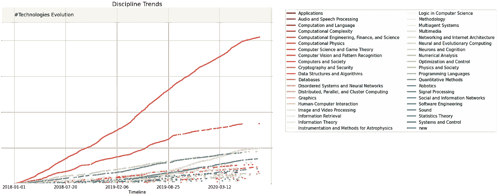

似乎人工智能的研究正指向一种感知。安全了。健康。网络化。人类相连。口语和解释世界。