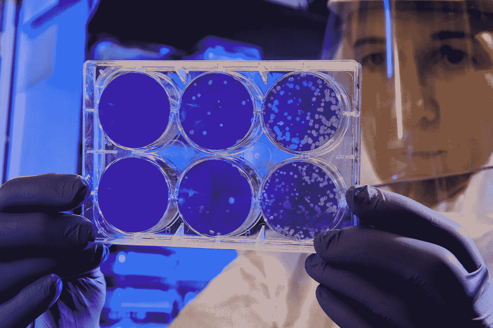
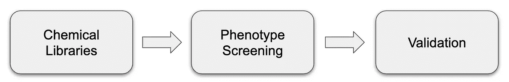
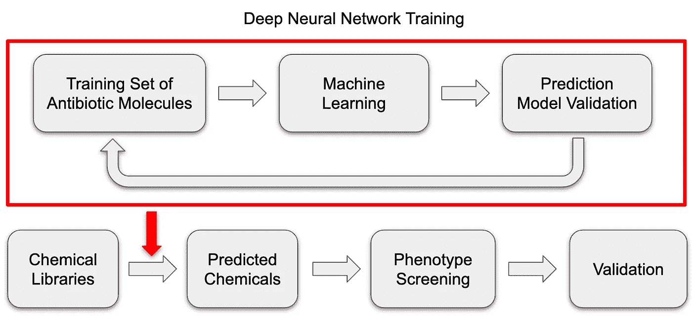

# 人工智能彻底改变了抗生素的发现——从青霉素到海星

> 原文：<https://towardsdatascience.com/ai-revolutionizes-antibiotic-discovery-from-penicillin-to-halicin-d561afb51a91?source=collection_archive---------31----------------------->

[疾控中心](https://unsplash.com/@cdc?utm_source=unsplash&utm_medium=referral&utm_content=creditCopyText)在 [Unsplash](https://unsplash.com/s/photos/science?utm_source=unsplash&utm_medium=referral&utm_content=creditCopyText) 拍摄的照片

## 麻省理工学院的研究人员通过训练深度神经网络发现了一种强大的抗生素。

每个人可能对青霉素都不陌生——据说这种抗生素在第二次世界大战期间挽救了 12-15%伤口感染的生命。自 1928 年被苏格兰科学家亚历山大·弗莱明发现以来，它已经帮助人类抗击细菌感染引起的疾病近 100 年了。无法估计它拯救了多少百万人的生命。

然而，已经在地球上存在了几十亿年的细菌足够聪明，在广泛使用青霉素后，通过产生耐药性来逃避这种攻击。除了耐药性感染的问题，青霉素并不是对所有的细菌都有效，可能会在大约 10%的人群中引起严重的过敏反应。因此，科学家们一直在集中开发用于治疗感染的其他抗生素，希望找到具有更广活性谱和更好耐受性和安全性的新型抗生素。

但是我们怎样才能发现新的抗生素呢？

## 传统方法

历史上，科学家大多筛选自然来源，如霉菌、土壤微生物和植物提取物，以确定具有抗生素特性的化学物质。随着合成化学的进步，抗生素发现的现代方法包括筛选文库，该文库可由数万至数十万种合成化合物组成，这些化合物基于具有已知抗菌作用的天然化学物质和支架的半合成衍生物。一般工作流程总结如下。

抗生素发现的常规方法

然而，正如一些麻省理工学院的研究人员在他们最近在生命科学最负盛名的期刊之一的《细胞》杂志上发表的文章中指出的那样，传统方法存在一些明显的缺点，阻碍了新抗生素的突破性发现。

*   **去重问题。**去复制是一个消除之前已经研究过的活性物质的过程。从这些化学库中发现抗生素的不同筛选揭示了相同的分子。
*   更多的化学物质，更多的失败。自 20 世纪 80 年代实施以来，高通量筛选合成工程产生的数百万分子的化学库并未产生任何新的临床抗生素。这些库中的分子不仅化学多样性有限，而且进行这些筛选的成本也高得惊人。

## 人工智能方法

鉴于传统方法的这些缺点，麻省理工学院的研究人员利用人工智能(AI)的巨大进步，发现了具有潜在临床适用性的新抗生素。下图显示了这种人工智能方法是如何工作的。

抗生素发现的人工智能方法

具体来说，这些研究人员首先建立了一套训练分子，能够抑制一种常见细菌大肠杆菌的生长。他们通过指定分子特征，优化超参数和集成来增强他们的模型，这导致了通过迭代模型重新训练的最终深度神经网络。与传统方法相比，这种人工智能方法允许研究人员分析性地筛选超过 1 亿种化学物质，其中许多化学物质的分子结构与已知的抗生素不同。被筛选的化学物质的数量大约是常规方法的 100 倍，常规方法在如此大的规模下要昂贵得多。

利用这个模型，这些研究人员能够在[药物再利用中心](https://www.broadinstitute.org/drug-repurposing-hub)发现一种最初称为 SU3327 的激酶抑制剂，他们将其重命名为 halicin。他们发现，halicin 在小鼠中表现出广谱(即杀死多种细菌)抗生素活性，这表明它可能是一种具有潜在临床适用性的有前途的候选药物。从 [ZINC15 数据库](https://zinc15.docking.org/)中，研究人员确定了 23 种候选化学物质，其中 8 种具有抗菌活性，其中两种特别强。

## 结束语

我们的生活依赖于抗生素，特别是当许多种细菌已经进化到具有抗生素抗性菌株的时候。因此，发现新的抗生素来进一步增加我们的抗生素库是至关重要的。这种人工智能方法彻底改变了抗生素的发现，使科学家能够以非常高的预测精度快速筛选更多的化学物质。像 Halicin 一样，使用这种人工智能方法将会发现更多的抗生素。

我相信，用不了多久，我们就会看到，Halicin 和其他人工合成的抗生素可以用于临床。

## 参考

[维基百科上的青霉素](https://en.wikipedia.org/wiki/Penicillin)

[抗生素发现的深度学习方法](https://www.cell.com/cell/pdf/S0092-8674(20)30102-1.pdf)

[抗生素时间表](https://en.wikipedia.org/wiki/Timeline_of_antibiotics)