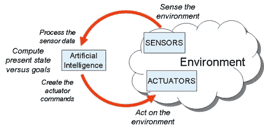

# 人工智能、传感器和机器人

> 原文：<https://towardsdatascience.com/ai-sensors-and-robotics-882caae34df9?source=collection_archive---------30----------------------->

贝洛奥里藏特，MG，巴西，照片由— [@danielmonteirox](https://unsplash.com/@danielmonteirox) 拍摄

## 从感知到机器和行动的意义

本文简要介绍了人工智能(AI)、传感器和机器人之间的关系。它并不意味着全面，而是探索基本概念。

许多类似人类的操作可能需要某种程度的人工智能或机器学习来以所需的方式操作。然而，许多机器人只为一个设定的任务编程，并给出一些不同的可能性。

然而，要帮助机器理解其空间环境——就感知、语音识别或学习而言，这可以通过感官输入来实现。

我之前讨论过摄像头，但它也可以是麦克风、无线信号等等。

机器必须识别一组人类行为指示，或者从它所处的环境中获取信息来决定行动。是热还是冷，是人还是机器，是车还是人，等等。识别对象是一个方面，还有一个方面是理解哪组事件应该触发给定的动作。

这三者如果分开，可能有不同的用途。人工智能可以被编程，机器人学涉及与物理相关的广泛方面。

你可以看到 OpenAI 团队训练的机器人手几乎不可思议的动作。

OpenAI 然后训练了一个神经网络，通过使用强化学习在模拟中解决魔方。[域](https://arxiv.org/abs/1703.06907) [随机化](https://arxiv.org/abs/1710.06537)使仅在模拟中训练的网络转移到真实的机器人。这种*自动领域随机化* (ADR)，在模拟中不断产生越来越困难的环境。

他们专注于“机器要掌握”的挑战性问题。

1.  感知。
2.  灵巧的操作。

除此之外，他们还提到了元学习的概念。

> “我们相信[元学习](https://en.wikipedia.org/wiki/Meta_learning_(computer_science))，或者说学会学习，是构建通用系统的一个重要前提，因为它能使系统快速适应环境中不断变化的条件。”

机器人和人工智能服务于不同的目的。

然而，当需要复杂的操纵时，这些场在这些类型的环境中更接近。

机器人学涉及建造机器人，而人工智能处理编程智能或使计算机像人一样工作。

> **“机器人学**是信息工程、计算机工程、计算机科学、机械工程、电子工程等工程和研究领域的交叉学科。机器人学涉及机器人的设计、建造、操作和使用。”

在某种程度上，目标是开发能够代替人类和复制人类行为的机器。

然而，机器人需要电机和传感器来激活和执行基本操作。

传感器已经变得非常便宜，而且更容易集成到不同的系统中，无论是工业规模的还是私人的。

因此，随着廉价传感器的不断增加以及结合先进软件的可能性，已经产生了有趣的结果。另一个例子是波士顿动力公司，他们 2012-2019 年的精彩片段展示了该领域正在取得的惊人进展。

他们的现货模式是最近推出的，一直很受欢迎。

这种形式的感官智能似乎已经足够了，但据说我们需要更多的这种类型的机器人在我们的家中操作。

我们仍然让吸尘器进入我们的家。

虽然还处于早期阶段，但也可能有其他设备。

显然，在冠状病毒封锁期间，对健康机器人的需求激增:

 [## 封锁期间对健康设备的需求激增|日本时报

### 健身追踪设备正在销售一空，家庭健身课程从未如此受欢迎，机器人技术人员也在…

www.japantimes.co.jp](https://www.japantimes.co.jp/news/2020/04/02/business/tech/health-gadgets-corona/#.Xo4-WNMzbUo) 

除此之外，机器人越来越多地用于远程医疗。

 [## 美国能从中国使用机器人和远程医疗抗击冠状病毒中学到什么

### 今年 1 月，一名感染新型冠状病毒的乘客登上钻石公主号游轮后，病毒…

www.cnbc.com](https://www.cnbc.com/2020/03/18/how-china-is-using-robots-and-telemedicine-to-combat-the-coronavirus.html) 

在某种程度上，也有机器人和无人机被用来帮助对抗冠状病毒传播的奇怪战斗。

 [## 机器人和无人驾驶飞机现在被用来对抗新冠肺炎

### 随着冠状病毒(新冠肺炎)从中国传播到其他国家，机器人和无人机被部署来提供关键的…

www.forbes.com](https://www.forbes.com/sites/bernardmarr/2020/03/18/how-robots-and-drones-are-helping-to-fight-coronavirus/#7de5eb972a12) 

一个名为 [*TerraHawk*](http://www.terrahawk.org/software.php) 的博客用一个插图描述了它，鉴于上面所讨论的内容，我发现这个插图很有帮助。

图片由 [Terrahawk 软件](http://www.terrahawk.org/software.php)提供

> 或者说，理解是人们赋予集体经历意义的过程。它被定义为“正在进行的合理图像的回溯开发，使人们正在做的事情合理化。"

通过这种方式，机器被编程来尝试理解环境以采取适当的行动。

这里是#500daysofAI，您正在阅读的是第 310 篇文章。500 天来，我每天都在写一篇关于或与人工智能相关的新文章。我 300-400 天的重点是关于人工智能、硬件和气候危机。