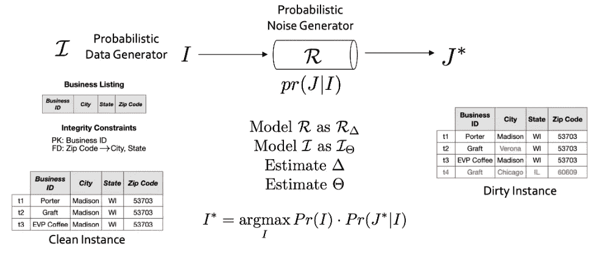
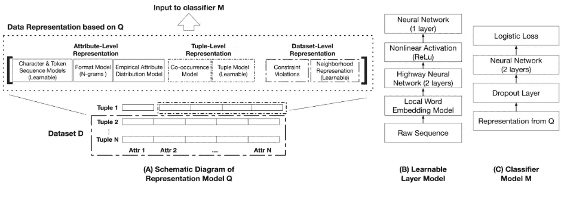
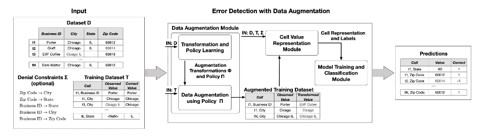
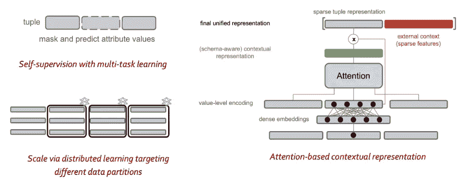
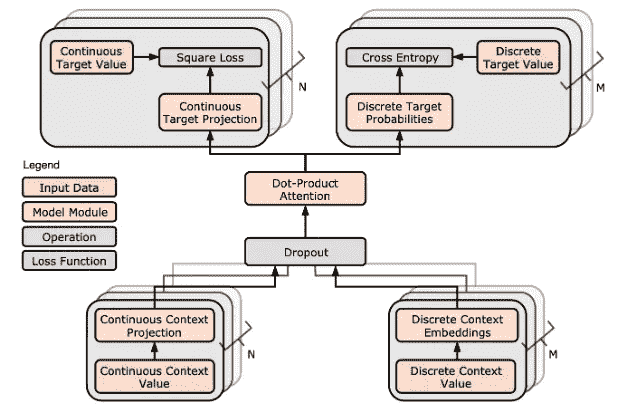

# AI 不应该留下结构化数据！

> 原文：<https://towardsdatascience.com/ai-should-not-leave-structured-data-behind-33474f9cd07a?source=collection_archive---------28----------------------->

## 人工智能如何解决臭名昭著的数据清理和准备问题

[用于自动化结构化数据准备的可扩展预测引擎](https://www.youtube.com/watch?v=z2RQz9zdpy0) | Ihab 易勒雅斯

从自然语言理解和自动知识库构建到图像和视频的分类和生成，AI 和深度学习在处理非结构化数据方面一直大放异彩。然而，被困在产品存储库、交易日志、ERP 和 CRM 系统等业务应用程序中的结构化数据正被抛在后面！表格数据仍由老一代数据科学技术处理，如基于规则的系统或决策树。这些方法使用手工制作的功能，维护起来很繁琐，并且需要大量手动标记的数据。尽管人工智能的最新进展允许从非结构化数据中挖掘巨大价值，但如果不同样关注结构化数据在推动业务、收入、健康、安全甚至治理方面的价值，那将是失职。

与非结构化数据相比，结构化数据的主要挑战之一是消费应用程序对数据质量的高度敏感性。我们可能仍然可以观看分辨率不完美的视频，或者在稍微模糊的图像中识别物体。然而，在大型企业或制药公司中，描述产品的大小、价格和数量属性的错误可能会带来灾难性的后果，使数据质量成为释放结构化数据资产价值的障碍。虽然数据管理界花了几十年时间试图解决这个问题，但进展甚微。这主要是由于问题的复杂性，基于规则和逻辑的系统处理问题的严重局限性，以及试图让人类参与数据清理和准备周期的高昂成本。现在，很明显，只有很少或没有人工交互的自动解决方案才是解决这个问题的唯一可行和可扩展的解决方案。

这就是为什么该问题适合于一种机器学习解决方案，它能够捕捉表征企业数据的不同上下文，并从大型数据集模型中学习，这些数据集模型可以预测数据质量，甚至建议数据修复以提高数据质量。用于数据准备和清理的 ML 解决方案将解决结构化数据的长期问题:

●它可以组合所有信号和上下文，包括业务规则、约束(如功能依赖和键)以及数据的统计属性；

●它避免了规则爆炸以覆盖边缘情况。在许多情况下，管理这些规则可能比管理他们试图清理的嘈杂数据更具挑战性，也更昂贵；最后，

●它可以传达一种“信心”的概念，所提供的预测将由正确的质量保证流程使用，或者有助于明智地让人类仅参与“困难”情况的处理。

然而，由于这种数据的本质(稀疏性、异构性以及丰富的语义和领域知识)，构建 ML 解决方案并不明显。从积极的方面来看，诸如模式(列名、类型、域和各种完整性约束)之类的工件编码了关于语义和各种数据片段之间可能的交互的重要信息；*我们不能让两个人住在同一个邮政编码但在两个不同的城市*和*项目的总预算不能超过计划的费用*是可以明确提供的示例约束。这种“结构”使得数据的价值超出了机器学习模型可以挖掘和利用的统计属性。

另一方面，结构化数据可能是异构的，结合了来自不同领域的信息，如文本、分类、数字甚至图像数据。也可以很稀疏。假设一个表有 100 列，每一列从 10-1000 个可能值(例如，制造商的类型、大小、价格等)的域中取值，还有几百万行描述企业的产品。可以想象可能组合的空间有多“空”，只有一小部分组合是有效的。在没有任何结构、领域知识和约束的情况下，很难了解这些数据是如何生成的，或者有多准确。因此，我们看到了构建用于清理和准备结构化数据的可伸缩 ML 解决方案的三个主要挑战:

●背景知识应如何表示为模型输入，以帮助解决数据稀疏性和异构性问题？例如，在预测某一列中的值时，我们如何将关键约束、函数依赖、拒绝约束和其他复杂的完整性逻辑传达给 ML 模型以供考虑？

●如何从有限(或没有)的训练数据和肮脏的观察中学习？以“错误检测”模型为例，该模型应该发现各种错误，包括打字错误、缺少值、不正确的值、矛盾的事实、移位的数据等。用非常有限的可用错误示例和可用数据中存在的这些错误来训练这样的模型是一个需要克服的挑战

●如何扩展到数百万个随机变量？将问题直接建模为所有相互作用的数据之间的大规模联合可能性分布将会失败！

我们建立了 inductiv，这是一个针对结构化数据的人工智能平台，专门用于建立描述数据如何产生以及如何被“污染”的模型。然后，这些模型被用于各种服务，例如错误检测、预测缺失值的错误校正、使用额外的列进行丰富以及融合数据片段。Inductiv 建立在学术开源项目 holo clean([www . holo clean . io](http://www.holoclean.io/))的基础上，该项目是我们在 2017 年由滑铁卢大学、威斯康星大学麦迪逊分校和斯坦福大学合作启动的。

# 作为人工智能问题的数据清洗

HoloClean 采用了众所周知的[噪音通道](https://en.wikipedia.org/wiki/Noisy_channel_model)模型来解释数据是如何产生的，又是如何被“污染”的。完整的研究论文可以在[这里](https://cs.uwaterloo.ca/~ilyas/papers/DeSaICDT2019.pdf)找到。然后，HoloClean 利用所有已知的领域知识(例如规则)、数据中的统计信息以及可用的可信来源来构建复杂的数据生成和错误模型。然后，使用这些模型来发现错误，并建议最有可能的值来进行修复。

图 1:根据一个生成过程，数据是干净的，我们观察的是被污染的版本。建模和参数化这些过程允许我们将清洗表示为推理问题

虽然该模型通过将清理和检测公式化为推理问题来提供帮助，但是提供具有足够表达能力的模型的可扩展解决方案是真正的挑战。

# 构建错误检测解决方案

在[我们的论文](https://cs.uwaterloo.ca/~ilyas/papers/HeidariSIGMOD2019.pdf)中，我们讨论了如何使用很少的例子来检测错误，并解决了之前提到的一些挑战:

● ***车型。*这些属性对应于描述控制数据集的分布的属性级、元组级和数据集级特征。图 2 中描述的模型学习捕获这些多级特征的表示层，以学习二进制错误检测分类器。**

● ***数据不平衡。*** 由于错误是罕见的，并且以不同的类型出现，当面对不平衡数据集时，ML 算法往往产生不令人满意的分类器。少数类的特征被当作噪音，常常被忽略。因此，与多数阶级相比，少数阶级被错误分类的可能性很高。提出的模型的一部分是一个“数据扩充”过程(图 3 ),它根据一个已知的错误生成策略制造许多“假”错误。使用几个错误示例来学习策略参数。虽然有限数量的示例不足以训练错误检测分类器，但是它们足以学习可能错误的分布。

图 2:具有多级特性的错误检测模型

图 3:生成错误示例的策略用于解决训练数据类不平衡的问题

# inductiv 引擎:面向结构化数据的现代人工智能

人们可以很快意识到，诸如准备、清理、错误检测和缺失值插补之类的数据问题都是可扩展的统一推理机的应用，该推理机能够模拟“结构化”数据是如何生成的以及错误是如何引入的。更重要的是，由于我们在这篇文章和附带的谈话中提到的各种原因，这个核心需要纳入现代机器学习原则，例如:

●数据扩充和数据编程，用于生成培训数据

●学习目标列/值建模中涉及的各种上下文的表示，例如学习异构数据类型的嵌入空间

●自我监督，尽可能利用所有数据，使用一些技术，如使用其他值重建一些观察数据值

●合并领域知识和规则的方法，用于扩展表示，以馈入表达模型

●针对数据分区和学习本地模型的系统风格优化，允许可扩展部署和容纳具有多种数据分布的数据集

inductiv 引擎将我们之前的所有成果整合在一个统一的 AI 核心中。该引擎生成的预测可由各种数据准备服务使用。图 4 描绘了覆盖前述原则的核心的这些主要组件，包括基于注意力的上下文表示机制、分布式学习、数据切片和具有多任务学习的自我监督，以处理不同的数据类型(例如，数字数据的回归和分类数据的分类)。在我们的 [MLSys 2020 论文](https://cs.uwaterloo.ca/~ilyas/papers/WuMLSys2020.pdf)中，我们提出了一种基于注意力的学习架构，用于混合类型结构化数据中的缺失值插补(图 5)。

图 Inductiv 统一推理引擎中的核心组件

图 5:具有基于注意力的上下文表示和多任务学习的示例架构

# 结论

当今重要数据的很大一部分是结构化的，但它存在严重的质量问题，损害了其价值。现代人工智能原则帮助我们将这个臭名昭著的质量问题视为一个统一的预测任务，围绕规模、异构性、稀疏性以及整合已知的语义和领域知识提出了一系列新的挑战。我们在构建第一个用于结构化数据的可扩展人工智能 inductiv 引擎时解决了这些挑战。

肖恩·林在 [Unsplash](https://unsplash.com?utm_source=medium&utm_medium=referral) 上的照片