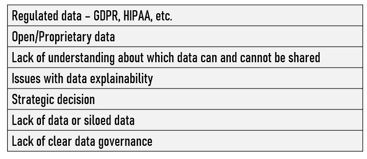
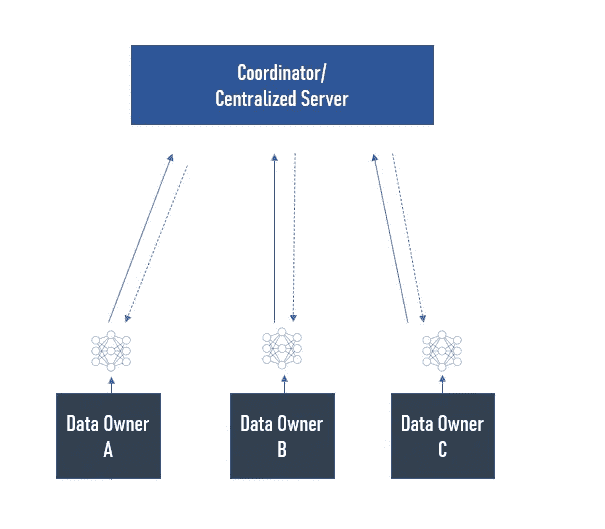

# 垂直联邦学习和数据共享时代的人工智能策略

> 原文：<https://towardsdatascience.com/ai-strategy-in-the-age-of-vertical-federated-learning-and-data-sharing-9e9fff4bebc5?source=collection_archive---------41----------------------->

## 使用垂直联合学习创建与竞争对手的数据共享联盟

迈克·科诺诺夫在 [Unsplash](https://unsplash.com/s/photos/business?utm_source=unsplash&utm_medium=referral&utm_content=creditCopyText) 上拍摄的照片

你可能知道，数据共享对于大规模机器学习(ML)来说是一个挑战。此外，缺乏数据通常是 ML 项目中的一个问题。联合学习试图为孤立和非结构化数据、数据缺乏、隐私、数据共享监管以及数据联盟激励模型等问题带来解决方案。

最近，我有机会与我们的一些竞争对手一起监督基于“数据共享联盟”的垂直联合学习的实施。

我们与竞争对手建立数据共享联盟的战略需求可以用两个原因来解释。第一，我们在很多项目中受限于自己的数据。其次，外国科技公司将很快需要满足欧盟关于人工智能和与较小竞争对手共享数据的新要求。

在这篇文章中，我将分享我在确定具体用例以及利用联合学习来使我们和我们的竞争对手在创建新的商业模型时，在不共享任何原始数据的情况下训练机器学习模型的经验。

# 今天的现实

大多数公司都采用相同的集中式机器学习方法。具体来说，开发精确模型的过程通常从从多个来源(运营数据、遗留系统、社交媒体、CRM、物联网数据等)收集尽可能多的数据开始，然后在收集的池化数据上开发机器学习模型。

这种方法包含几个挑战，削弱了人工智能系统的潜力。事实上，**只有一小部分可能的可用数据目前是可访问的**，因此限制了机器学习模型达到高精度。

如果我们能够提高在公司之间共享数据的能力，我们就可以开发新的用例，或者提高现有 ML 解决方案的准确性。当谈到这个问题时，你们中的一些人可能会想到开放数据，但是，这种解决方案通常质量有限、无结构或不一致。其他解决方案可能包括合成数据或数据增强技术...

***限制数据共享的原因***

**在大多数情况下，组织更愿意严格控制他们的数据**而不是与第三方合作或交易，更不是与竞争对手合作或交易。尽管他们可能偶尔会与第三方签订合同来帮助加速开发，但数据伙伴关系或联盟仍然非常罕见。

# 为什么我们需要更多的数据共享

人们往往关注组织如何利用自己的数据，而最大的机会在于**合并多个数据集**，包括内部和外部数据集。

例如，利用竞争对手数据的能力可能会改变游戏规则。事实上，使这些数据可用于特定目的可以为多个组织和最终用户释放价值。**此外，在人工智能背景下，**与竞争对手的共同努力合作可以改善内部机器学习模型。**这就是为什么竞争对手之间的数据共享至关重要。**

**到目前为止，我们的目标是尝试想象我们不仅可以利用自己掌握的数据创造出什么。**这种新方法要求我们设想新的业务模型、用例、合作伙伴和框架。

> 根据用例的不同，我们迫切需要更多的数据来训练我们的模型。例如，我目前在医疗保健领域工作。可想而知，这个特定行业的数据采集是极其困难的。因此，我们倾向于在严格治理下收集的小数据集上工作。使用垂直联合学习架构的数据共享联盟将对我们有很大帮助。

我们设想未来不同的公司将在不披露数据的情况下共同建立模型，并分享更准确的机器学习模型或新用例的好处，以改善内部流程或客户体验。**我们的想法是不仅使用共享数据来改进现有的应用程序，而且“共同创造”应用程序，否则这是不可能的。**

这种转变完全符合机器学习的本质。正如你们大多数人所知，机器学习领域本质上是一个协作领域。因此，看到一些大型科技公司最近在数据共享方面的转变，我并不感到惊讶。

我们还认为，FL 将改变价值链中的权力动态，减少对单个数据垄断的依赖，并为公司创造额外收入。没有使用他们的数据的公司可以有一个新的替代方法来产生收入。

**最后，构建垂直联合学习的最佳策略取决于许多因素，包括:**

# 联合学习

我不会过多地讨论细节，因为其他文章已经完美地涵盖了联邦学习的技术方面。如前所述，FL 的主要思想是你可以分散机器学习过程，这样你仍然可以尊重隐私，但获得统计能力和额外的数据。

纵向联合学习可以被看作是“一个 B2B 模型，其中多个组织加入一个联盟，建立和使用一个共享的 ML 模型。在构建模型的同时，确保没有本地数据离开任何站点，并根据业务需求维护模型性能。”FL 确保全面的数据保护，并对分享其知识的公司给予奖励。

事实上，该联盟可以将部分收入分配给数据所有者作为激励。实际上，为所有参与者/竞争者建立一个收入模型可能非常复杂。我们已经开发了一个专门为垂直联合学习开发的收益共享方案。

显然，所有参与者都从他们本地应用程序的全局模型中受益。此外，“联合学习也有利于跨境数据模型，在许多情况下，立法要求数据存储在特定的司法管辖区和跨机构的合作伙伴关系中。” [2](http://cornichegrowthadvisors.com/federated-learning-changes-the-data-sharing-game-in-ai/)

> 我希望一些初创公司和/或顾问成为 FL 领域的专家，并开发一个框架来帮助组织选择用例，确定合作伙伴，并与他们讨论数据协作的理想设置(收入模型，数据治理，...).

**重点提一下纵向联邦学习** **和联邦迁移学习**的区别。第一个是指我们有许多重叠的实例，但重叠的特征很少。两个不同的公司(不在同一行业，例如，银行和零售商)可能或多或少拥有相同的客户，但每个公司都拥有不同的数据集/要素。在这种情况下，垂直联合学习合并特征以创建用于机器学习任务的更强大的特征空间，并使用同态加密来提供对数据隐私的保护。

f1 的一个已知问题是对手可以从设备发送的模型更新中推断出本地训练数据。为了缓解这个问题，我们依赖同态加密(HE)。他允许数据在为训练模型进行处理时保持加密。

> **同态加密:**一种加密形式，允许对密文执行特定类型的计算，并获得加密结果，即对明文执行操作的结果的密文。( [3](https://www.sciencedirect.com/topics/computer-science/homomorphic-encryption) )

**尽管 FL 有这些积极因素，但仍存在许多挑战。**例如，孤岛式非结构化数据、隐私、数据共享监管和使用 FL 的数据联盟激励模型。我还可以提到基于 FL 的解决方案的成熟和来自 C 级高管的内部支持…(与竞争对手共享敏感数据仍然是一些难以向经理解释的事情)

# 使用 FL 的用例

为了帮助你更好地理解联合学习的具体应用，我在下面选择了三个“成熟的用例”:

**智慧零售
实际上，这三个数据特性可能会在三个不同的部门或公司之间进行拆分。**

*   购买力可能与用户的银行储蓄有关
*   个人偏好可以来自社交媒体
*   可以在电子商店上收集产品信息

根据来自微众银行和香港大学的几位研究人员的说法，我们正面临两个问题。首先，这些不同组织之间的数据壁垒很难打破。因此，不能直接聚合数据来训练模型。其次，三方存储的数据通常是异构的，传统的 ML 模型无法直接作用于异构数据。

联邦学习和迁移学习为这些问题带来了解决方案。事实上，通过利用 FL 的特性，可以在不导出公司数据的情况下为三方构建 ML 模型，从而保护数据隐私和数据安全。同时，我们可以使用迁移学习来解决数据异构问题，并突破传统人工智能技术的限制。

**金融** 另一个有趣的用例与多方借贷的检测有关。当某些用户从一家银行借款以支付另一家银行的贷款时，就会发生这种情况。

根据来自微众银行( [5](https://www.fedai.org/static/flwp-en.pdf) )的相同研究人员的说法，为了在不暴露用户列表的情况下找到这些用户，银行可以使用垂直联合学习。事实上，我们可以利用联合学习的加密机制，在每一端加密用户列表，然后在联合中取加密列表的交集。

**智能医疗保健** 医疗保健是另一个受益于垂直联合学习的领域。医疗报告等数据是隐私和敏感的(理由充分！).在现实中，医疗数据集很难收集，只能在孤立的医疗机构和医院中找到。根据我的经验，我可以告诉你，数据源的不足和标签的缺乏往往意味着 ML 模型的弱性能(低精度，过拟合等。)，尽管有数据增强技术。理想情况下，如果所有医疗机构和制药集团形成数据联盟并共享其数据以创建大型医疗数据集，则训练的 ML 模型的性能将得到显著提高。

我相信 FL 是大规模生产系统的一个很好的选择，但对于研究项目，我仍然对整体效率持怀疑态度(除了在医学领域)。**联合学习并不适用于所有的机器学习项目。**

**这种方法的成功很大程度上取决于您的用例。**最后，在无法看到数据的情况下调试 FL 系统的复杂性是不可低估的。

## 关于联合学习的更多信息，我推荐以下链接:

*   [欧洲大型科技公司将面临更多数据共享要求，AI](https://www.wsj.com/articles/big-tech-to-faces-more-restrictions-in-europe-on-data-ai-11582111937)
*   [公平感知的联邦学习激励方案](https://dl.acm.org/doi/pdf/10.1145/3375627.3375840)
*   [用 Shapley 值解释联合学习](https://arxiv.org/ftp/arxiv/papers/1905/1905.04519.pdf)
*   [联邦学习的进展和开放问题](https://hal.inria.fr/hal-02406503/file/1912.04977.pdf)
*   [联邦机器学习:概念和应用](https://arxiv.org/pdf/1902.04885.pdf)