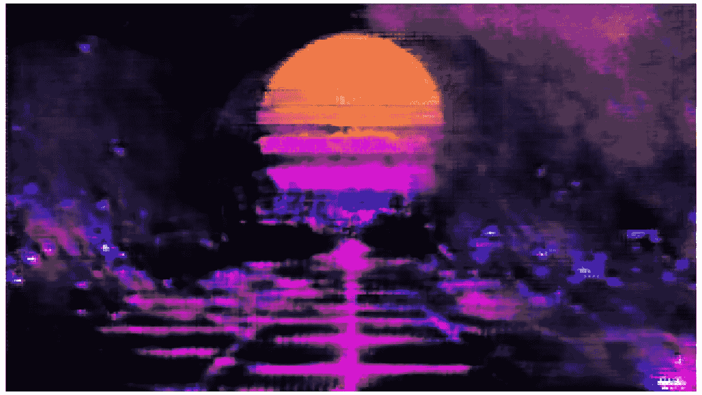
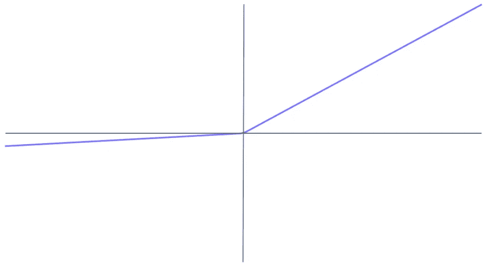
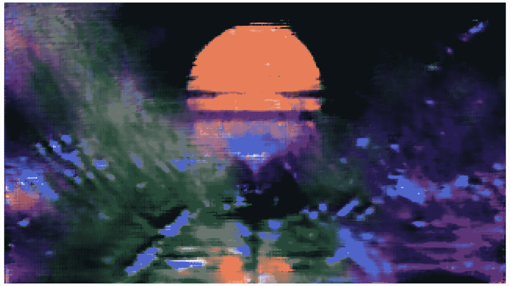
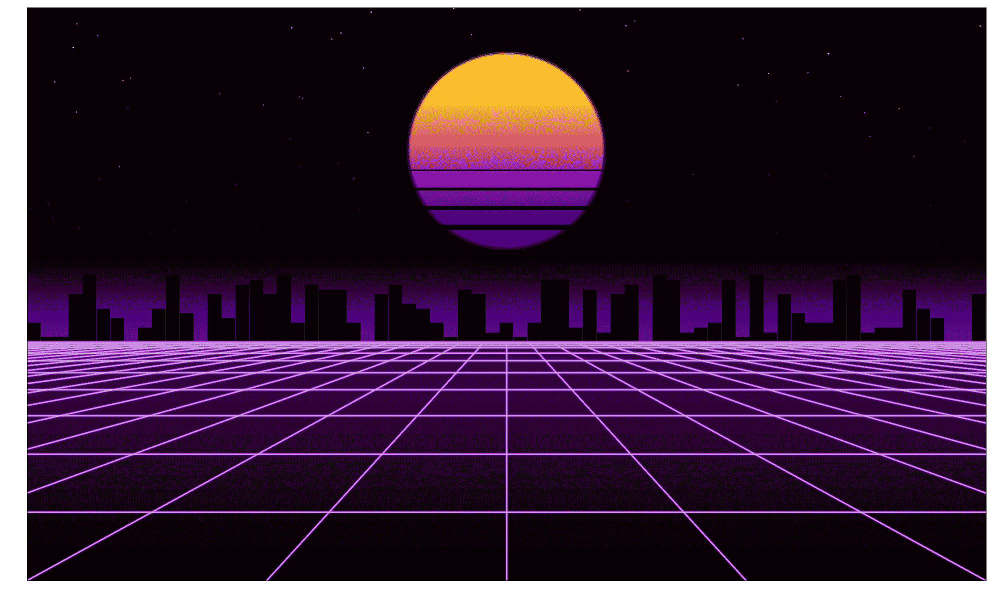

# 人工合成波

> 原文：<https://towardsdatascience.com/ai-synthwave-51da9251a1b7?source=collection_archive---------38----------------------->

## 用 GANs 从 YouTube 生成合成波图像

使用经过合成波成像训练的 DCGAN 生成图像

G 世代对抗网络(GANs)，或者像 Yann Lecun 喜欢叫它们的那样， [*【自切片面包以来最酷的东西】*](https://www.quora.com/What-are-some-recent-and-potentially-upcoming-breakthroughs-in-unsupervised-learning)*简直就是现象级的。*

*我长久以来一直迷恋于这些神秘的网络，它们能够实现我只能称之为魔法的东西。*

*作为这些网络的忠实粉丝，我想创造一些有趣的东西。你们中的许多人可能对 synthwave 类型很熟悉。这是一部独特的怀旧 70 年代和 80 年代科幻电影，非常有趣。*

*Synthwave 也是我在工作或学习时最喜欢听的音乐类型之一，所以我经常被 YouTube 上这种类型简单迷人的视觉效果所吸引。*

*自然地，GANs 和 synthwave 看起来是一个很酷的组合。synthwave 从科幻中汲取了大量灵感，而 GANs 实际上也是科幻。*

*在本文中，我们将分解如何从 YouTube 中抓取图像数据，以及如何将这些数据输入并设置一个深度卷积 GAN (DCGAN)。*

*这段代码也适用于任何范围的 YouTube 视频。当然，图像的复杂性和您想要的结果都是代码可直接转移的重要因素。*

# *刮削和预处理*

*首先当然是数据。幸运的是，YouTube 上有很多 synthwave 视频。在选择了一些 synthwave 可视视频之后，我们可以使用`pytube`库来下载它们。*

*视频下载后，我们使用`opencv`库从每个视频中提取数千帧，存储在本地以备训练时提取。*

## *处理*

*一旦我们有了所有的图像文件，我们可以循环通过每一个，导入和下采样每一个图像…下采样的程度将取决于计算能力，以及你想从这个过程中得到什么。在我们的 GAN 中，每个像素都会增加我们网络的规模。*

***

原始图像的 360p 分辨率(左)和该图像的二倍下采样(右)|照片由 [Lorenzo Herrera](https://unsplash.com/@lorenzoherrera?utm_source=unsplash&utm_medium=referral&utm_content=creditCopyText) 在 [Unsplash](https://unsplash.com/s/photos/synthwave?utm_source=unsplash&utm_medium=referral&utm_content=creditCopyText) 上拍摄* 

*单个 360 x 640 RGB 图像由`360*640*3 = **691200**`个值组成，通过因子**两个**的下采样给我们一个**四倍**的减少量`180*320*3 = **172800**`。这大大降低了复杂性，因此也降低了运行时间。*

*如果您的网络太大(这不一定是由于输入图像的大小，但可能是)，您将收到`Error: OOM when allocating tensor`。*

*然后我们需要将数据格式化成 TensorFlow 可读的格式。*

*使用 [TensorFlow 数据集对象](https://www.tensorflow.org/api_docs/python/tf/data/Dataset)，这很容易。我们首先混洗数据，这样我们就不会同时将同一组图像输入到鉴别器中。然后我们对数据进行批处理，这意味着在我们更新网络权重之前，网络将会看到`batchsize`个样本。*

*我见过使用 GANs 生成图像时，最常见的批量范围是 16 到 64。*

*还有建议使用鉴别器的`[SGD](https://github.com/soumith/ganhacks)` [优化功能，这实际上会在单个训练示例后更新权重。尽管如此，我们还是使用了`Adam`和一个`batchsize = 64`。](https://github.com/soumith/ganhacks)*

# *DCGAN*

*我们使用[深度卷积 GAN](https://arxiv.org/pdf/1511.06434.pdf) 架构。[Simplex Mundi tis](https://en.wikisource.org/wiki/Oxford_Book_of_English_Verse_1250-1900/Simplex_Munditiis)专为最大化结果和最小化复杂性而设计。*

*与典型的卷积神经网络(CNN)或递归神经网络(RNN)设置不同，GANs 要求我们将 TensorFlow 设置到稍低的级别。*

*这意味着我们将把代码分成四个关键部分:*

*   ***发电机设置** —包括架构设置、损耗计算和优化器。*
*   ***鉴别器设置**——包括同上。*
*   ***步骤** —在训练、噪声生成、模型预测、损失和权重更新期间，我们对每一次迭代采取的过程。*
*   ***Fit** —训练控制器功能，包括可视化和模型检查点保存。*

*模型架构本身就挺有意思的。DCGAN 几乎只使用 CNN(没有最大池，最小密集连接的 nn)。*

*我们将在接下来的章节中进行更深入的探讨，但简而言之——发生器和鉴别器是两个独立的、几乎相反的 CNN。*

*生成器生成图像，鉴别器识别假图像(由生成器生成)和真图像(我们从 YouTube 检索)。*

*通过竞争，我们产生了一个图像生成器。能够骗过 CNN(鉴别者)。*

## *发电机*

*生成器存储在一个创造性地命名为`Generator`的类中。在这里，我们将有三种方法— `dcgan`、`optimiser`和`loss`。*

*我们的第一个方法，`dcgan`，包含模型设置。我们将构建这个来产生大小为 360 * 640 的 RGB 图像(一个`640, 360, 3`的数组形状)。*

*我们首先初始化一个 TensorFlow `Sequential`模型。在这之后，我们简单地使用`add`方法添加每个连续的层。有三个层段，输入`Dense`和`Reshape`，后面是两个`Conv2DTranspose`段。*

*输入部分采用我们的`latent_units`，它只是一个输入层的噪声，我们将其输入到发生器，并将其输入到一个密集连接的神经网络。然后，这些 NN 激活被整形以适合下面的转置卷积层。*

**

*泄漏激活功能*

*在每个 NN 层之后，我们包括一个`BatchNormalization`和`LeakyReLU`层。`BatchNormalization`确保模型权重正常化，从而降低渐变消失或爆炸的几率。`LeakyReLU`是我们的激活功能。*

*最后的`Conv2DTranspose`层产生我们生成的图像。我们在这里使用一个`tanh`激活函数[，在开发 GANs 时，推荐使用](https://github.com/soumith/ganhacks)而不是`sigmoid`。*

*我们的发电机优化器和损耗分别用`optimiser`和`loss`定义。发电机的损耗通过`fake_preds`——鉴频器的输出来计算。*

*在鉴别器错误地将所有假图像`0`预测为真实图像`1`的情况下，发电机损耗被最小化。因此我们在二元交叉熵计算中使用了`tf.ones_like`。*

## *鉴别器*

*鉴别器与我们的生成器非常相似，但是我们没有使用`Conv2DTranspose`层，而是使用普通的`Conv2D`。我们还包括一个`Dropout`层，它赋予每个值在任一时刻被屏蔽的 50%的概率。帮助我们防止过度拟合并鼓励一般化。*

*我们使用相同的优化器和相似的损失函数。在这种情况下，当鉴别器成功地将真实图像识别为`1`并将虚假图像识别为`0`时，损失被最小化。*

## *步骤*

*`step`和`fit`都包含在`Train`类中，我们用生成器`G`和鉴别器`D`模型对其进行初始化。*

*对于每个步骤/迭代，我们必须做几件事:*

*   *生成`noise` —使用大小的正态分布`batchsize, latent_units`，在我们的例子中是`64, 100`。*
*   *通过处理`noise`到`G.model`生成`fake_images`。*
*   *通过处理`real_images`和`fake_images`到`D.model`进行预测。*
*   *计算`G_loss`和`D_loss` —将`real_output`和`fake_output`输入到我们在每个类中定义的`loss`函数、`G.loss`和`D.loss`中。*
*   *计算`G`和`D`梯度——使用每个模型的`tf.GradientTape`,我们输入模型损失和可训练变量。*
*   *最后，我们使用`opt.apply_gradients`应用渐变更新。*

*在代码中，这看起来像:*

*请注意，`self`正在被使用，因为这是一个在`Train`类内部的方法。在该方法的最后，我们将发生器和鉴别器损耗的平均值添加到我们的`history`数据帧中，我们稍后将使用该数据帧来可视化损耗。*

## *合适的*

*这是我们最后的主要方法，它作为我们刚刚讨论过的所有代码的控制器。*

*与以前的代码相比，这部分更容易掌握。首先，我们创建`gen_noise`作为我们用来生成可视化效果的唯一噪声轮廓。这不是在培训中使用的，它只是为了让我们直观地衡量发电机如何随着时间的推移而发展。*

*我们将`gen_noise`输入生成器`G.model`，它给我们一个生成的图像数组`gen_image`。这个数组被格式化，转换成 PIL 图像对象，然后保存到文件中。*

*用`sns.lineplot`显示发生器和鉴别器的损耗，然后保存到文件中。两个损失值也会打印到控制台。*

*最后，我们使用`save_weights`方法每 500 个时期保存一次模型权重。*

**

*生成的图像*

*虽然仍处于早期阶段，但看到那些从 GAN 生成的图像中出现的迈阿密复古太阳的第一张图像是一种惊人的体验。*

*这是一个正在进行的项目，有很大的改进空间。但是 gan 很有趣，对于任何考虑看一看它们的人，我强烈推荐它。*

*如果有什么不清楚的，随时问我。如果你有改进的建议，请告诉我！我将在下面的参考资料中留下涵盖所有 GAN 代码部分的资源链接。*

*感谢阅读！*

# *参考*

*Aviv Elbag，[生成式对抗网络(GANs)完整编码示例教程在 Tensorflow 2.0](https://www.youtube.com/watch?v=tX-6CMNnT64) ，YouTube*

*[深度卷积生成对抗网络教程](https://www.tensorflow.org/tutorials/generative/dcgan)，TensorFlow*

*Soumith Chintala，[如何训练一个 GAN？让 GANs 发挥作用的技巧和诀窍](https://github.com/soumith/ganhacks)，GitHub*

**

*在 Matplotlib 中构建的 Synthwave 图*

*这个想法源于我做的一个早期项目，在那里我使用 Matplotlib 构建了你在上面看到的 Synthwave visual。如果你有兴趣了解这些，你可以在这里阅读:*

* [## 用 Matplotlib 创建 Synthwave

### 正确使用 Matplotlib 创建复古的 Synthwave 视觉效果

towardsdatascience.com](/creating-synthwave-with-matplotlib-ea7c9be59760)*