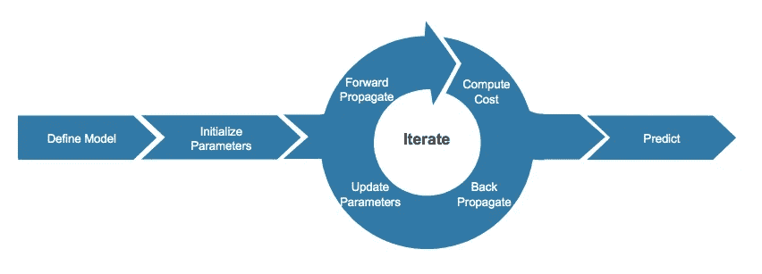

# 艾:往引擎盖下看一眼。第 2 部分，用传统的方法创建一个两层的神经网络

> 原文：<https://towardsdatascience.com/ai-taking-a-peek-under-the-hood-part-2-creating-a-two-layer-neural-network-the-old-fashioned-way-568ce2cf6d06?source=collection_archive---------75----------------------->


图片来源:马太·亨利

在深入本系列这一部分的新内容之前，我们先快速回顾一下本系列第 1 部分中所涉及的内容，以便让后续读者耳目一新，并为新读者提供背景知识。如前所述，人工智能只是数学。为我们今天看到的所有人工智能功能提供动力的数学算法是神经网络。

神经网络有三种一般形式:

1.  标准神经网络(通常用于二元分类和点估计或回归型问题)。
2.  卷积神经网络(一般用于图像识别)。
3.  递归神经网络(通常应用于涉及序列数据的问题，如文本和语音识别、理解或预测)。

今天我们将构建一个标准的两层神经网络(一个隐藏层，一个输出层)。数学将被解释并且 python 代码将被提供。这将使你不仅能准确理解标准神经网络的工作原理，还能让你自己构建它们。

首先，在打开每个步骤之前，让我们快速看一下涉及的步骤。请注意，我们将不涉及数据争论、清理或转换，因为这在数据集和应用程序之间可能有很大差异。也就是说，值得指出的是，标准化输入数据对于关系识别以及最小化计算成本非常重要。

# 步骤:

1.  定义模型结构(如输入要素的数量)
2.  初始化模型的参数
3.  计算电流损耗(又名“正向传播”)
4.  计算当前梯度(又名“反向传播”)
5.  更新参数(梯度下降)
6.  根据保留数据进行预测

步骤 3-5 在一个循环中执行，该循环取决于我们执行的迭代次数。我们执行的迭代次数是我们在步骤 1 中定义模型结构时做出的决定。下图说明了这一过程。



# 步骤 1:定义模型结构

定义您的模型结构包括您要构建的神经网络的类型，以及神经网络的超参数。超参数是层数、每层的节点数、每层中的激活函数、alpha(学习速率——这对梯度下降很重要，因为它决定了我们更新参数的速度)和迭代次数。这些超参数将影响我们的参数“w”和“b”(权重和偏差)，它们是在网络的每个节点内计算的。权重和偏差又是应用于网络每个节点的激活函数的输入。

这部分既是艺术也是科学。在某个领域拥有丰富经验的数据科学家将获得直觉，知道哪组超参数最适合他们的业务问题，但这通常不能跨问题和领域转移，需要手动试错。你可以在谷歌上搜索大量的“经验法则”来给你一个关于起点的好主意，但这不会消除尝试不同组合来为你的业务问题提出最佳模型的需要。

需要记住的一点是，正如本系列第 1 部分中所讨论的，深度神经网络往往工作得更好，并且还可以减少网络中所需的节点总数。为了说明为什么深度神经网络通常会更好地工作，我们以面部识别为例。在建立一个执行面部识别的神经网络时，你需要几个层次来将任务分成易于管理的块。第一个隐藏层将关注更简单、更小的任务，例如检测边缘。第二个隐藏层将建立在这些边缘上，以检测面部部分(如鼻子、眼睛、嘴唇等。).第三层将把这些碎片放在一起以识别整张脸。最后，你的输出图层会告诉你这是不是你要找的脸(作为一个概率)。这就是为什么有时你的手机或电脑能识别你，有时却不能。如果算法以一定的概率确定实际上是你，该软件被编程为解锁你的设备。这个由网络输出的概率根据照明、你面对屏幕的角度、你是否戴着眼镜等等而变化。

也就是说，让我们开始定义我们的神经网络的结构。

在下面的代码中，我们将定义 3 个变量:

*   n_x:输入层的大小
*   n_h:隐藏层的大小(隐藏层中有多少个神经元——我们将设置为 4 个神经元)
*   n_y:输出层的大小

```
def layer_sizes(X, Y):
    """
    Arguments:
    X -- input dataset of shape (input size, number of examples)
    Y -- labels of shape (output size, number of examples)

    Returns:
    n_x -- the size of the input layer
    n_h -- the size of the hidden layer
    n_y -- the size of the output layer
    """

    n_x = X.shape[0] # size of input layer
    n_h = 4 #neurons in hidden layer
    n_y = Y.shape[0] # size of output layer

    return (n_x, n_h, n_y)
```

# 步骤 2:初始化模型参数

初始化我们的模型参数意味着初始化我们的参数“w”和“b ”,在我们开始迭代每个节点内的计算和优化过程以识别我们的输入数据和预测(输出)变量之间的真实关系之前，以某个值开始。

权重(“w”)将被初始化为非常小的随机值，而偏差(“b”)将被初始化为 0。我们希望权重值较小，以便它们开始时接近双曲正切函数或 sigmoid 函数的中心，这样可以加快学习速度。如果我们将它们初始化为较大的值，那么我们将在曲线斜率很小的函数尾部附近开始优化，这将会减慢我们随后的梯度下降(优化)。它们需要随机的原因是它们不完全相同。节点必须计算不同的函数，以便它们有用。点击[此处](https://www.researchgate.net/figure/Nonlinear-function-a-Sigmoid-function-b-Tanh-function-c-ReLU-function-d-Leaky_fig3_323617663)查看 sigmoid、tanh、ReLU 和 Leaky ReLU 函数的对比。

从这些图像中，您可以看到，靠近双曲正切函数或 sigmoid 函数的尾部(由大值产生)意味着几乎没有斜率。用小的值初始化并不总是能消除这个问题，这也是 ReLU 函数能提高处理时间的原因之一。

让我们看一下代码:

```
def initialize_parameters(n_x, n_h, n_y):
    """
    Argument:
    n_x -- size of the input layer
    n_h -- size of the hidden layer
    n_y -- size of the output layer

    Returns:
    params -- python dictionary containing your parameters:
                    W1 -- weight matrix of shape (n_h, n_x)
                    b1 -- bias vector of shape (n_h, 1)
                    W2 -- weight matrix of shape (n_y, n_h)
                    b2 -- bias vector of shape (n_y, 1)
    """

    np.random.seed(2) #set up a seed so that your output is consistent

    W1 = np.random.randn(n_h,n_x)* 0.01
    b1 = np.zeros((n_h,1))
    W2 = np.random.randn(n_y,n_h) * 0.01
    b2 = np.zeros((n_y,1))

    assert (W1.shape == (n_h, n_x))
    assert (b1.shape == (n_h, 1))
    assert (W2.shape == (n_y, n_h))
    assert (b2.shape == (n_y, 1))

    parameters = {"W1": W1,
                  "b1": b1,
                  "W2": W2,
                  "b2": b2}

    return parameters
```

请注意，断言语句是为了确保我们的权重和偏差矩阵是符合我们的神经网络规范的正确维度(本文不涉及细节)。

# 步骤 3:正向传播

前向传播是指我们在网络中从输入层移动到输出层，在此过程中计算每个节点中的几个重要值。在每个节点中，我们将执行以下计算:

*   Z = w^T x + b (w 转置乘以 x + b)
*   并且计算激活函数 a = σ(Z)(在这个例子中使用 sigmoid 函数)

重要的是将其矢量化以加快处理速度，而不是在 Python 中专门作为循环来执行这一步骤。为此，我们将通过以下方式将 Z 计算为矢量:

1.  把我们所有的 W 堆成一个矩阵(每个 W 是一个向量，但是我们转置它们，每个转置的向量变成一行。因此将它们堆叠在一起形成矩阵)，
2.  然后简单地把 b 向量加到 W 矩阵上。

就选择你的激活功能而言，这实际上取决于你试图解决的问题。但是，在隐藏层中，您可能希望选择一个加速处理的函数(例如 tanh 或 ReLU)，而在输出层中，您需要选择一个与业务问题相关的激活函数。例如，如果您正在进行二进制分类，sigmoid 函数是有意义的，因为它会给出一个介于 0 和 1 之间的值，然后您只需设置您的接受阈值(任何> = 0.5 的值是否等于 1，或者是其他值？).

在查看代码之前，还有一点需要注意。在优化(梯度下降)部分，我们将需要能够计算我们的激活函数的导数(斜率)。因此，我们将在正向传播期间将这些值存储为“缓存”。

```
def forward_propagation(X, parameters):
    """
    Argument:
    X -- input data of size (n_x, m)
    parameters -- python dictionary containing your parameters (output of initialization function)

    Returns:
    A2 -- The sigmoid output of the second activation
    cache -- a dictionary containing "Z1", "A1", "Z2" and "A2"
    """
    # Retrieve each parameter from the dictionary "parameters"

    W1 = parameters["W1"]
    b1 = parameters["b1"]
    W2 = parameters["W2"]
    b2 = parameters["b2"]

    # Implement Forward Propagation to calculate A2 (probabilities)

    Z1 = np.dot(W1,X) + b1
    A1 = np.tanh(Z1)
    Z2 = np.dot(W2,A1) + b2
    A2 = sigmoid(Z2)

    assert(A2.shape == (1, X.shape[1]))

    cache = {"Z1": Z1,
             "A1": A1,
             "Z2": Z2,
             "A2": A2}

    return A2, cache
```

通过一次正向传播计算了权重、偏差和激活值之后，我们需要计算成本(所有训练示例的平均损失)。请记住，损失本质上是误差(预测值和真实值之间的差异)。

这是我们将通过向前和向后迭代来最小化的，通过迭代生成新值，计算成本，然后更新我们网络中的值，直到模型收敛或我们满足我们指定的迭代次数。

```
def compute_cost(A2, Y, parameters):
    """

    Arguments:
    A2 -- The sigmoid output of the second activation, of shape (1, number of examples)
    Y -- "true" labels vector of shape (1, number of examples)
    parameters -- python dictionary containing your parameters W1, b1, W2 and b2

    Returns:
    cost -- cross-entropy cost 

    """

    m = Y.shape[1] # number of example

    # Compute the cross-entropy cost

    logprobs = np.multiply(np.log(A2),Y) + np.multiply(np.log(1 - A2),1 - Y)
    cost = - np.sum(logprobs) * (1 / m)

    cost = float(np.squeeze(cost))  # makes sure cost is the dimension we expect. 

    assert(isinstance(cost, float))

    return cost
```

# 步骤 4:反向传播

当进行反向传播时，我们需要能够计算激活函数的导数。对于任何给定的 Z 值，该函数将具有对应于该值的某个斜率。目标是使用梯度下降来寻找凸函数的全局最小值。点击[阅读更多关于梯度下降的信息。](https://machinelearningmastery.com/gradient-descent-for-machine-learning/)

我们将计算以下导数(斜率):

*   dZ[2] = A[2]-Y
*   dW[2] = 1/m dZ[2] A[2]T
*   db[2] = 1/m np.sum(dZ[2]，axis =1，keepdims = True)
*   dZ[1] = W[2]T dZ[2] * g[1]' (Z[1])
*   dW[1] = 1/m dZ[1] XT
*   db[1] = 1/m np.sum(dZ[1]，axis =1，keepdims = True)

注意[2]指的是神经网络的第二层，而[1]指的是第一层(在这种情况下，这是我们的隐藏层)，' T '代表转置。如你所见，我们从神经网络的末端开始，然后回到起点(因此有术语“反向传播”)。

```
def backward_propagation(parameters, cache, X, Y):
    """

    Arguments:
    parameters -- python dictionary containing our parameters 
    cache -- a dictionary containing "Z1", "A1", "Z2" and "A2".
    X -- input data of shape (2, number of examples)
    Y -- "true" labels vector of shape (1, number of examples)

    Returns:
    grads -- python dictionary containing your gradients with respect to different parameters
    """
    m = X.shape[1]

    # First, retrieve W1 and W2 from the dictionary "parameters".

    W1 = parameters["W1"]
    W2 = parameters["W2"]

    # Retrieve also A1 and A2 from dictionary "cache".

    A1 = cache["A1"]
    A2 = cache["A2"]

    # Backward propagation: calculate dW1, db1, dW2, db2\. 

    dZ2 = A2 - Y
    dW2 = 1 / m *(np.dot(dZ2,A1.T))
    db2 = 1 / m *(np.sum(dZ2,axis = 1,keepdims = True))
    dZ1 = np.dot(W2.T,dZ2) * (1 - np.power(A1, 2))
    dW1 = 1 / m *(np.dot(dZ1,X.T))
    db1 = 1 / m *(np.sum(dZ1,axis = 1,keepdims = True))

    grads = {"dW1": dW1,
             "db1": db1,
             "dW2": dW2,
             "db2": db2}

    return grads
```

我们现在需要使用刚刚计算的导数来更新 W1、b1、W2 和 b2 的值。正如在本系列的[第 1 部分](https://www.linkedin.com/pulse/ai-taking-peek-under-hood-part-1-introduction-neural-simon-campbell/)中提到的，这是深度学习的“学习”部分。这种更新是通过取向前传播中确定的值减去学习率(我们选择的超参数)乘以来自上面确定的当前迭代的线的梯度(或斜率)来完成的。

```
def update_parameters(parameters, grads, learning_rate = 1.2):
    """

    Arguments:
    parameters -- python dictionary containing your parameters 
    grads -- python dictionary containing your gradients 

    Returns:
    parameters -- python dictionary containing your updated parameters 
    """
    # Retrieve each parameter from the dictionary "parameters"

    W1 = parameters["W1"]
    b1 = parameters["b1"]
    W2 = parameters["W2"]
    b2 = parameters["b2"]

    # Retrieve each gradient from the dictionary "grads"

    dW1 = grads["dW1"]
    db1 = grads["db1"]
    dW2 = grads["dW2"]
    db2 = grads["db2"]

    # Update rule for each parameter

    W1 = W1 - learning_rate * dW1
    b1 = b1 - learning_rate * db1
    W2 = W2 - learning_rate * dW2
    b2 = b2 - learning_rate * db2

    parameters = {"W1": W1,
                  "b1": b1,
                  "W2": W2,
                  "b2": b2}

    return parameters
```

在预测之前，让我们将这些函数放在一起，创建我们的标准神经网络模型。在本例中，我们将迭代次数设置为 10，000 次。

```
def nn_model(X, Y, n_h, num_iterations = 10000, print_cost=False):
    """
    Arguments:
    X -- dataset of shape (2, number of examples)
    Y -- labels of shape (1, number of examples)
    n_h -- size of the hidden layer
    num_iterations -- Number of iterations in gradient descent loop
    print_cost -- if True, print the cost every 1000 iterations

    Returns:
    parameters -- parameters learnt by the model. They can then be used to predict.
    """

    np.random.seed(3)
    n_x = layer_sizes(X, Y)[0]
    n_y = layer_sizes(X, Y)[2]

    # Initialize parameters

    parameters = initialize_parameters(n_x,n_h,n_y)
    W1 = parameters["W1"]
    b1 = parameters["b1"]
    w2 = parameters["W2"]
    b2 = parameters["b2"]

    # Loop (gradient descent)

    for i in range(0, num_iterations):

        # Forward propagation. Inputs: "X, parameters". Outputs: "A2, cache".
        A2, cache = forward_propagation(X,parameters)

        # Cost function. Inputs: "A2, Y, parameters". Outputs: "cost".
        cost = compute_cost(A2, Y, parameters)

        # Backpropagation. Inputs: "parameters, cache, X, Y". Outputs: "grads".
        grads = backward_propagation(parameters, cache, X, Y)

        # Gradient descent parameter update. Inputs: "parameters, grads". Outputs: "parameters".
        parameters = update_parameters(parameters, grads)

        # Print the cost every 1000 iterations
        if print_cost and i % 1000 == 0:
            print ("Cost after iteration %i: %f" %(i, cost))

    return parameters
```

# 第六步:预测

为了对保留数据进行预测，您将运行优化模型的正向传播。在本例中，我们预测了一个二进制分类，其中输出图层中激活返回的任何大于 0.5 的值都被分类为 1，因此任何小于或等于 0.5 的值都被分类为 0。

```
def predict(parameters, X):
    """
    Using the learned parameters, predicts a class for each example in X

    Arguments:
    parameters -- python dictionary containing your parameters 
    X -- input data of size (n_x, m)

    Returns
    predictions -- vector of predictions of our model (red: 0 / blue: 1)
    """

    # Computes probabilities using forward propagation, and classifies to 0/1 using 0.5 as the threshold.

    A2, cache = forward_propagation(X,parameters)
    predictions = (A2 > 0.5)

    return predictions
```

最后，您可以按如下方式检查神经网络的准确性:

```
predictions = predict(parameters, X)

print ('Accuracy: %d' % float((np.dot(Y,predictions.T) + np.dot(1-Y,1-predictions.T))/float(Y.size)*100) + '%')
```

# 结束语:

在上面的内容中，我们介绍了构建两层标准神经网络的理论、数学和代码(一个隐藏层，一个输出层)。我希望这有助于增强您对日常遇到的人工智能应用程序的理解，同时为您提供一个强有力的起点，为二进制分类问题构建您自己的人工智能应用程序。网上有大量很棒的内容，你可以更深入地探讨其中的许多话题。我个人从吴恩达在 Coursera 上的神经网络和深度学习课程中学到了所有这些，你可以在这里找到。