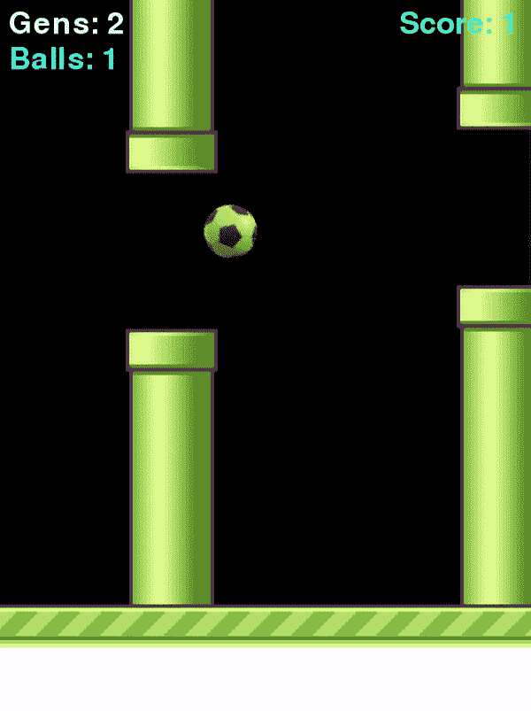
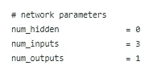
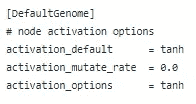
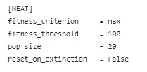

# 人工智能自学玩游戏

> 原文：<https://towardsdatascience.com/ai-teaches-itself-to-play-a-game-f8957a99b628?source=collection_archive---------49----------------------->

## 使用 Pygame 构建了一个简单的游戏，并应用 NEAT(增强拓扑的神经进化)算法来训练 AI。



这篇文章是关于教 AI 如何玩一个我用 pygame 库做的简单游戏。游戏是这样的，球应该继续在管子之间的缝隙中滚动，如果球碰到了任何一根管子，我们就输了。当一个球成功通过管道之间的缝隙时，分数将增加 1。

上面的 Gif 图像显示了神经网络如何一代又一代地改进的训练过程，并且可以使用下面的三个值在游戏窗口中看到进度状态。

*   **分数:**分数/成功穿越的管道数。
*   **一族**:算法正在学习的世代/突变数。
*   **球:**表示当前世代中存活的球数。

构建游戏界面的完整代码和相关文件都在我的 [**Git repo**](https://github.com/Msanjayds/AI_KISS/tree/master/1.%20AI/RollingBall) **里。**

现在让我们使用*整齐的*(扩充拓扑的神经进化)来进行训练部分。NEAT 是一种创建人工神经网络的进化算法，该算法的详细描述是 [**这里的**](https://neat-python.readthedocs.io/en/latest/neat_overview.html) 。这里的基本思想是网络不依赖于固定的结构，NEAT 允许它通过遗传算法进化。因此，当需要完成手头的任务时，它通过添加节点、连接和层来自己构建最佳网络。

一旦我们准备好一个游戏，我们将下面的输入/参数输入到 NEAT 算法中，以创建一个完成任务的最佳神经网络，在我们的例子中，是将球滚动通过间隙。

我们通过一个 [**配置文件传递所有这些参数。**](https://github.com/Msanjayds/AI_KISS/blob/master/1.%20AI/RollingBall/config.txt)

***网络的输入:*** 告诉 NEAT 算法网络可以期望什么样的输入，我们需要什么样的输出。



*   由于这是一个简单的游戏，我已经将隐藏层的数量设置为 0，如果需要，我们可以尝试另一个数量。
*   我正在为网络传递 3 个输入。球在 Y 轴上的位置、球和顶部管道之间的距离以及球和底部管道之间的距离。
*   **Num_Output** s:设置为 1，即输出单节点。基于输出节点的值，我们决定跳转或不跳转。

```
# we used tanh activation function so result will be between -1 & 1\. if over 0.5 jumpif output[0] > 0.5: 
   ball.jump()
```

***激活功能*** :



*   **激活默认值:**使用哪个激活函数来确定输出值，在本例中，我使用了 Tanh。我们可以使用其他激活函数，如 sigmoid/relu 等。
*   **Activation_mutate_rate** :变异时选择其他激活函数的概率。
*   **激活选项:**突变/育种过程中随机使用的其他激活功能。

***适应度参数*** *:* 评价网/球像距离多好的方式。



*   **Fitness_criterion:** 可以有最小值/最大值/平均值。这告诉了 NEAT 如何挑选最好的网/球。体能分最高的球是最好的。
*   **Fitness_threshold** :停止训练前达到的最大体能分数。
*   **Pop_size:** 任意值，我们可以随便玩。它表示每一代有多少个球。用 20 个成员/球开始零代，测试它们，选择最好的，繁殖/变异它们以产生下一代的 20 个球，并继续该过程。
*   **灭绝时重置:**如果这个评估为`True`，当 a 中的所有物种(球)同时因停滞而灭绝时，会产生一个新的随机种群。

在 neat 中，我们将群体成员称为基因组/物种，一旦基因组的属性如上所述被设置，NEAT 开始通过创建球的群体来构建网络，我们将其设置为 20。每个球都与控制它的完全随机的神经网络相关联&每个网络都有自己的随机权重和偏好。所以我们测试了每一个神经网络，通过评估它们的适应性来看它们做得有多好。健康取决于我们玩什么任务/游戏，在这种情况下，球前进了多远。在游戏中，每通过一个管道，我们就给它的健康值加 1。

在第一代结束时，当所有的球都用完了，尼特看到他们中哪个表现最好。然后，它挑选上一代球/网络中的最佳球/网络(得分最高的两个或三个)，对它们进行变异和繁殖，以创建一组新的种群。在这篇 [**论文**](https://neat-python.readthedocs.io/en/latest/) 中详细解释了这些神经网络实际上是如何繁殖和变异的。

现在我们将拥有上一代最好物种/球的后代。所以我们希望这些下一代物种/球比上一代表现得更好。neat 实际上做的是，更新权重，随机添加/删除节点和连接，直到它找到一个最适合我们正在解决的问题的架构。它从一个简单的网络开始，必要时会变得复杂。我们需要继续这个过程，直到我们对表现满意为止。

经过几代人的慢慢学习和变得更好，它终于学会了一种前进而不碰壁的模式。在这种情况下，使用当前的参数集，在第四代中，AI 开始表现得更好，并达到了一个从未失败的点，正如我们在上面的 gif 图像中看到的那样。

一旦分数达到我们设置的健身阈值，那么我们可以通过使用 pickle 保存与该球相关联的神经网络来退出训练。然后用一个球和我们保存的最好的网络创建一个游戏。现在，它可以无缝地演奏，永远不会碰到管子。

感谢阅读，快乐学习。:-)