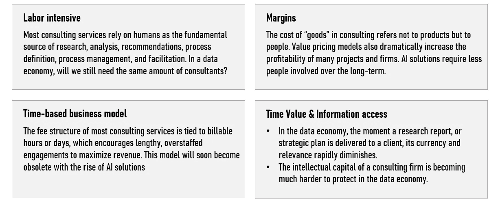
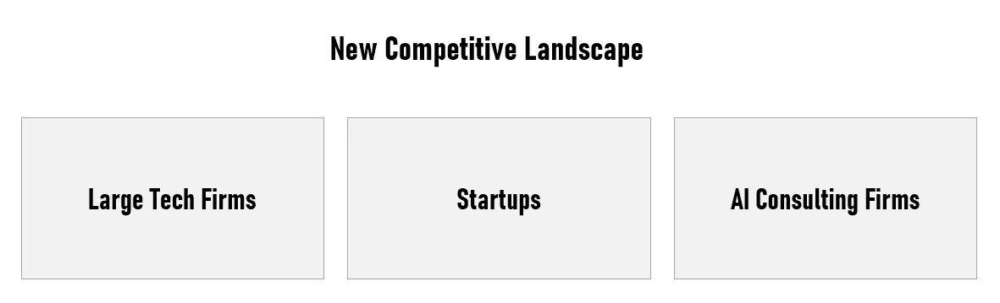
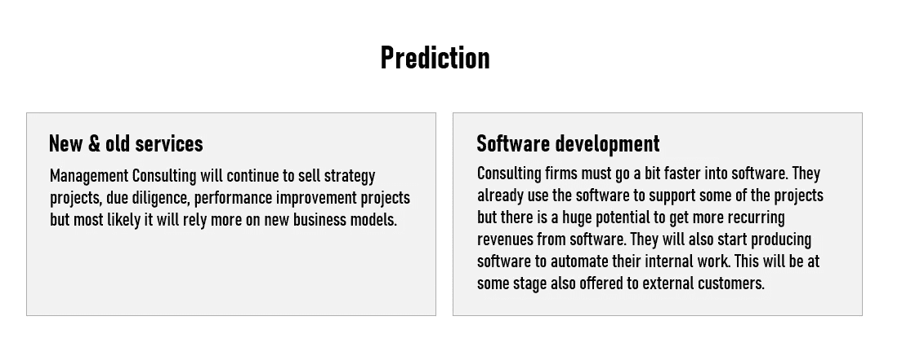

# 人工智能&咨询的未来:数据科学家会成为顾问吗？

> 原文：<https://towardsdatascience.com/ai-the-future-of-consulting-will-data-scientists-become-consultants-f6938ab14bcc?source=collection_archive---------6----------------------->

## 了解管理咨询公司如何通过创造新的商业模式来适应新的竞争对手，如谷歌、微软和初创公司…

[来源](https://images.unsplash.com/photo-1526628953301-3e589a6a8b74?ixlib=rb-1.2.1&ixid=eyJhcHBfaWQiOjEyMDd9&auto=format&fit=crop&w=1990&q=80)

在为一家领先的咨询公司开发人工智能部门工作后，我意识到大多数顾问一直告诉他们的客户投资人工智能，而他们自己的公司在跟上人工智能方面落后了...

在这篇文章中，我将分享我在为一家咨询公司建立内部 AI 技能、雇用数据科学家和开发与 AI 相关的新商业模式方面的经验。

我还将分享我对咨询公司的未来的看法，咨询公司可能会受到科技公司的威胁，数据科学家和顾问之间的界限模糊。

***谷歌、微软能否接下麦肯锡、BCG、贝恩的班？***

# 获取信息和更好的数据分析

顾问根据研究提供昂贵的有见地的建议和指导。然而，咨询服务付费的重要部分是**数据分析和展示**。顾问收集、清理、处理和解释来自不同组织部门的数据，这取决于他们的任务。

事实上，数据挑战确保了数据人机界面的必要性。然而，关键数据经常丢失或难以访问。这些问题造成了一种情况，即寻求关键战略问题的数据驱动答案的公司需要专家(顾问)来创建、组合、清理、分析和解释数据。

> **在越来越多的项目中，我们倾向于需要更多的数据科学家和更少的顾问。**

顾问工作的这一特定方面可以通过机器学习(ML)算法在一定程度上实现自动化。ML 模型可以通过从数据中检测模式和推断规则来理解复杂的情况，这一过程即使对于最大和最聪明的咨询团队来说也是非常困难的。

> **预测 n 1:** 决策者可以利用智能设备(Alexa…)询问类似这样的问题:“在我们的关键市场上，谁对我来说是最大的风险？”，“我们应该如何分配我们的资本来与亚马逊竞争？”或者“我应该如何重组我的董事会？”

> 在互联网时代，答案很便宜，人工智能可以降低整个咨询价值链的利润率。

我们可以说，人工智能时代的管理顾问不是在提供信息，也不是在进行分析。相反，他们正在理解大多数公司已经获得的信息和分析。根据我的观察，他们通常会将分散的信息连接起来，形成一个连贯的叙述或指南。

此外，越来越多的信息正在改变这种状况。今天，曾经被严密保护的信息已经被互联网商品化了。**如今，真正的附加值是通过您已经掌握的数据创造新的竞争优势。**

除了已经存在的初始分析活动的自动化，算法还可以获得更高附加值的部分，即洞察力整合和战略制定。

随着基于人工智能的解决方案的民主化，咨询公司面临的风险是，他们的**客户为其付费的意愿大幅降低。有人可能会说，真正的价值来自数据科学家，而不是无法识别数据中隐藏模式的纯粹顾问。**

## 面临风险的商业模式…

对于下面提到的元素，人工智能可能真的会威胁到大多数咨询公司的商业模式:

## 今天的情况

根据我的经验(取决于行业和业务问题)，大多数咨询任务都与业务问题有关，这些问题可以通过**聚类、排名和分类/预测算法来解决。**

例如，客户流失预测非常普遍，回归模型被证明非常有效。而且，协同过滤或者排名问题非常普遍。**如果业务问题很清楚，数据可用且相关，预期也很现实，那么数据科学家已经可以通过机器学习算法为许多业务问题提供解决方案。**

# 人工智能提供商 vs 管理咨询公司

随着 AI 的日益民主化(无代码/低代码 AI 解决方案、创业公司等。)，管理咨询公司将面临越来越多的竞争对手。

## 来自大型科技公司的竞争

它始于所有三大科技公司，它们提供预先训练的模型，企业客户可以用这些模型来构建人工智能系统。

事实上，有大量工具可以帮助主流公司构建任何东西，从推荐引擎到语音识别和翻译系统、客户服务机器人等等。**在这些情况下，内部顾问和数据科学家团队会更适合。**

出于几个原因，大型科技公司更适合为需要人工智能帮助的主流公司服务。**你们中的一些人可能会想，这样的服务仍然需要大量的定制和技术工作来使它们变得有用……**

事实上，科技公司已经在试图通过提供咨询服务来填补这一空白。谷歌开设了一个“高级解决方案实验室”,部分是咨询服务，部分是技术训练营。来自客户公司的整个团队可以获得机器学习技能，并与谷歌工程师一起构建定制系统。**科技公司正在演变，不再仅仅关注技术基础设施，还关注战略和人才。**

> 科技公司将越来越多地与管理咨询公司竞争，后者收取高额费用帮助客户应对技术中断。

**在现实中，多面手知道自己很脆弱。根据不同的使用案例，许多客户向科技公司寻求建议，而科技公司本身就是人工智能的先驱用户。如果咨询公司不能有效地做出反应，更专业的提供商可能会向价值链上游移动，不仅成为数据/分析提供商，还会为整体业务战略提供建议。**

## 来自创业公司的竞争

初创公司也对咨询公司构成了威胁。事实上，许多公司提供帮助清理和标记数据等服务，并承担大型科技公司尚未提供的特定任务。在某些情况下，数据科学家可以完美地为精确的业务问题带来答案，而不需要管理顾问。

对于大公司来说，外包大部分人工智能工作是有意义的。这些初创公司通常在使用机器学习的特定业务领域开发了咨询公司尚不具备的强大专业知识。这些初创公司通常会开发个性化的解决方案，这些解决方案与客户的业务相结合，并且可以持续使用，即使顾问离开后也是如此。

## 来自独立人工智能公司的竞争

另一个值得一提的新竞争来自独立的人工智能咨询公司。事实上，越来越多的公司开发了帮助公司集成、开发或扩展人工智能项目的服务。这些公司通常拥有规模优势(敏捷、价格等)。).

# 人工智能、SaaS 和新的商业模式

我相信，许多咨询公司已经在试图通过培训顾问、雇佣数据科学家、开发人工智能和 SaaS 产品以及创造新的商业模式来适应这种变化。

***公司文化&培训***首先从培训和公司文化说起。事实上，我认为现代管理顾问不能再依赖于顶尖学校的毕业生和某个特定领域的专家。**所有顾问必须精通远程技术/数据。**

***新的数据能力***显然，BCG 或麦肯锡等市场领导者已经在早期投资了具有机器学习经验的分析初创公司，或雇佣了许多数据科学家，并创建了新的数据驱动部门(例如 BCG Gamma)以**为客户带来新的数据能力。**

***成为技术提供商***咨询公司已经开始开发他们的专有软件(通常使用 SaaS 或 AIaaS 模型)，因为许多客户有类似的需求(例如:定价策略)，这些解决方案通常可以根据客户的需求进行定制。事实上，如果你已经与该公司合作过，并且完全了解业务问题，推广你的 SaaS 解决方案是很容易的… **独特解决方案的开发为咨询公司创造了新的收入来源。这种新的商业模式非常适合没钱投资自己的人工智能开发的客户。**

的确，当诊断和推荐任务频繁出现在日常工作中时，客户会有更大的动力投资于软件提供商，因为“随需应变的大脑”消失了。此外，对利用实时数据的工具的依赖改变了咨询顾问的需求。

***生态系统创建***越来越多的咨询公司试图通过与特定机构、创业公司或其他与人工智能相关的组织合作，建立人工智能生态系统。目标是改善品牌形象，确立自己的领导地位，聘请技术专家并推广他们的解决方案。对于最先进的咨询公司来说，这将涉及创建一个拥有人工智能专业知识的“实验室”，或许还有一个孵化器。

***与 AI 经济相关的新服务***
我看到咨询公司对新兴的**零工经济**和**在线培训**进行了大量投资。

# 我的预测

我相信，基于技术的咨询解决方案将获得更大的市场，咨询行业的人才争夺战将比今天更加激烈。此外，我希望看到更多的数据科学家也成为顾问。

我还预计，由于人工智能的民主化和客户忠诚度的下降，竞争将变得更加激烈。客户希望根据他们的具体需求更容易购买咨询服务。

> 人工智能提供商将越来越多地与管理咨询公司竞争。

但是，我希望客户继续从使用管理咨询公司而不是供应商本身(例如，Google、AWS、SAP)中受益，因为管理咨询公司可以提供:

*   客观性
*   将人工智能转型与整体业务战略联系起来的能力，以及如何扩展人工智能项目的知识
*   关于业内其他公司如何因人工智能而转型的知识。

显然，咨询可能会变得不那么劳动密集型。我想在未来的 20 年里，我们将会看到以下事情的展开:

**顾问会被数据科学家完全取代吗？**在某些形式上，是的。但当面临变化和变异的任务时，人工智能和机器学习仍将苦苦挣扎。**由于这个原因，我认为在可预见的未来，顾问是不可替代的。然而，我们可能需要更少的顾问和更多的数据科学家……**

数据科学家面临的最大问题是，他们仍然纠结于项目的实际有形价值，对于非科学家或纯粹关注结果而非发现的人来说，这更难衡量。出于这个原因，我希望看到由数据科学家(他们中的一些人也可能是顾问)和专家顾问组成的团队。

根据我作为人工智能顾问的经验，我发现 ML 算法可能会产生非常强大、有见地的分析，但在将这些分析转化为具体的商业决策时，往往会缺少一个环节。在这些情况下，专家顾问的需求是强制性的。

此外，由于现实和环境的原因，人工智能系统无法覆盖太多不断变化的元素。

最后，即使你构建了完美的人工智能解决方案，你仍然有一个客户需要理解解决方案的问题。**咨询的很大一部分是在组织中实施正确的解决方案。**

# 我推荐这些文章以获取更多信息:

*   [https://digital . HBS . edu/platform-digital/submission/BCG-digitally-disrupting-or-disrupted/](https://digital.hbs.edu/platform-digit/submission/bcg-digitally-disrupting-or-disrupted/)
*   [https://www . economist . com/special-report/2018/03/28/ai-providers-将日益与管理咨询公司竞争](https://www.economist.com/special-report/2018/03/28/ai-providers-will-increasingly-compete-with-management-consultancies)