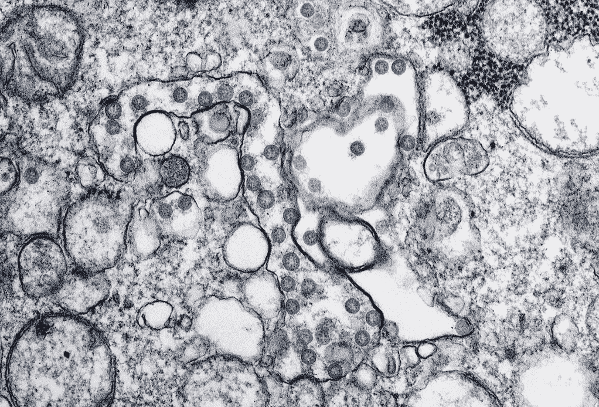
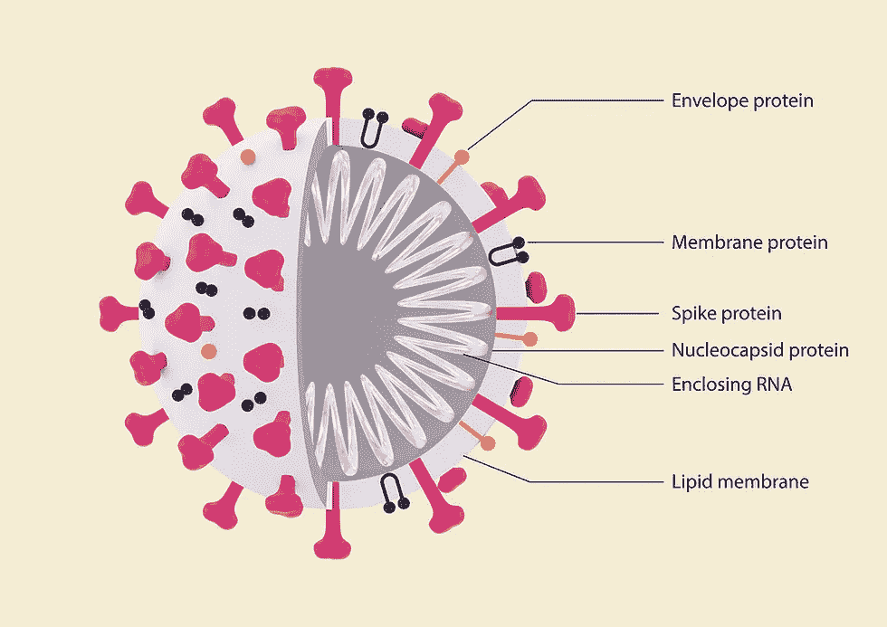
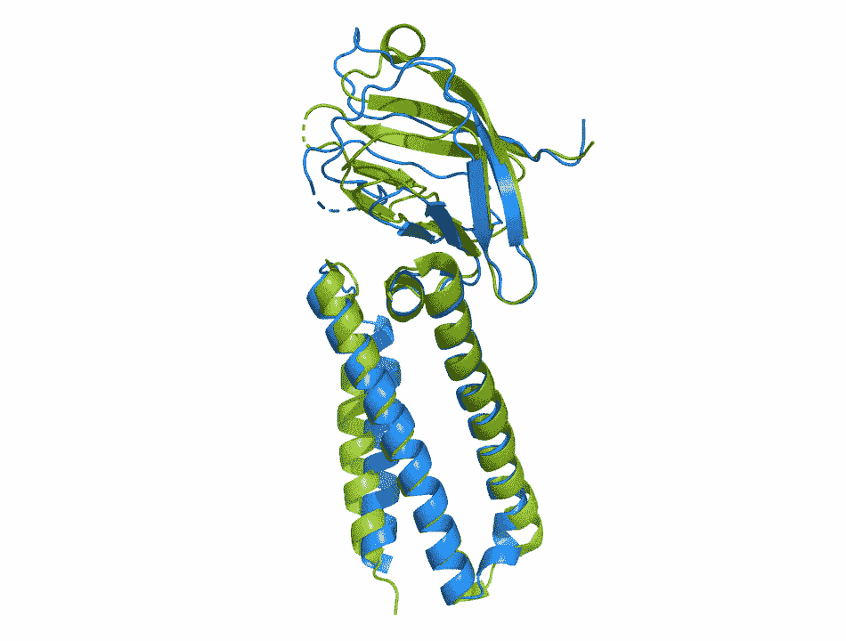
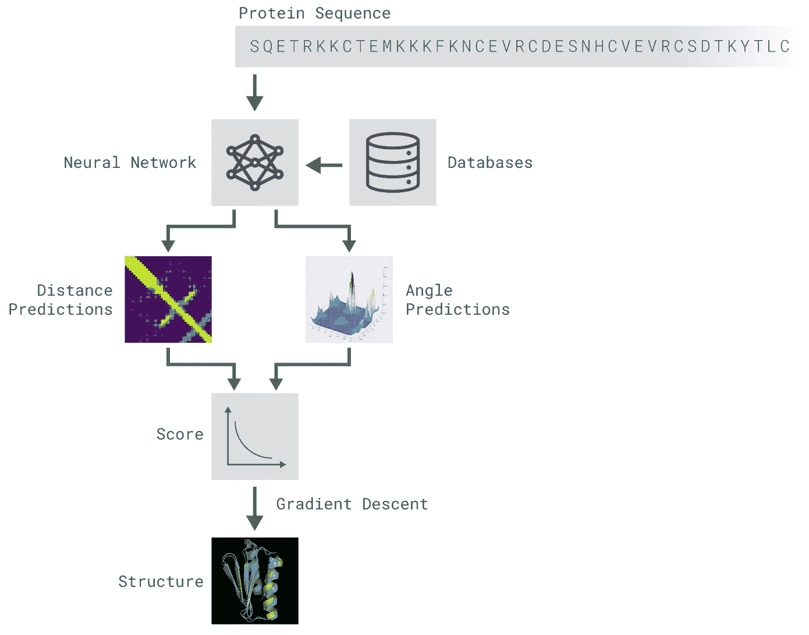
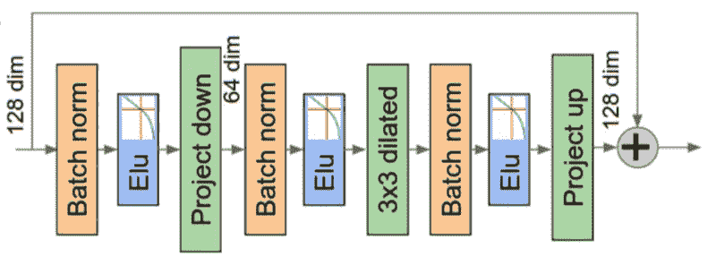
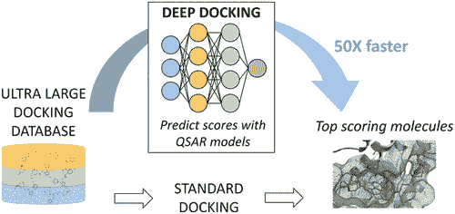
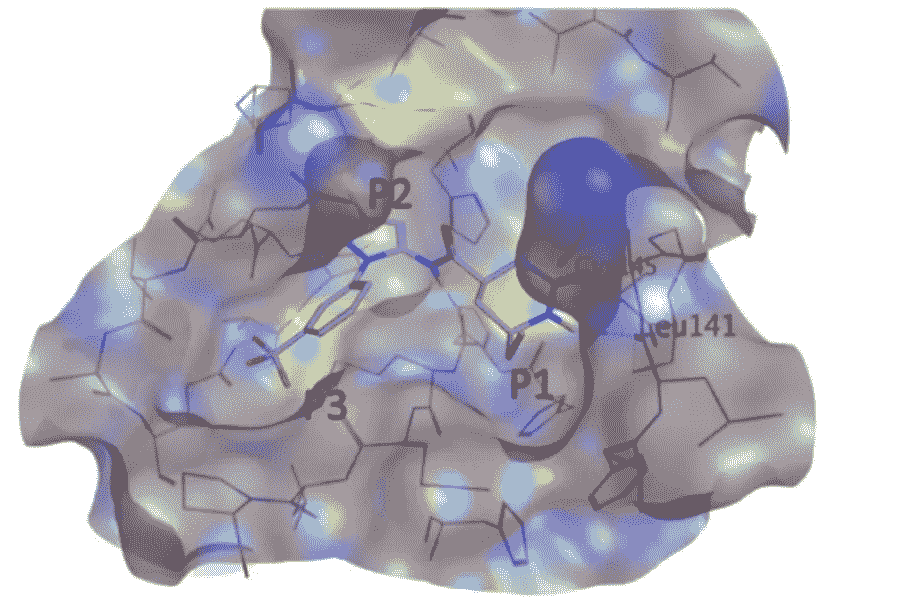
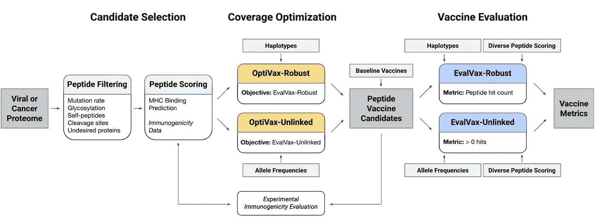

# 人工智能&寻找疫苗

> 原文：<https://towardsdatascience.com/ai-the-quest-for-a-vaccine-6c0b01dbed15?source=collection_archive---------40----------------------->

## 生物学的深度学习

## 人工智能如何改变冠状病毒疫苗的研究

尽管缺乏足够数量的数据带来了挑战，但最近开发并使用了几种基于人工智能的工具来解决当前疫情带来的许多挑战。在过去的 8 个月里，人工智能模型已经被用于生物医学图像分类，用于使用 CT 扫描& x 射线图像的[临床诊断](https://www.nature.com/articles/s41591-020-0931-3)，以及通过跟踪当地新闻和社交媒体账户预测热点 &疫情的[。然而，这篇文章讨论了人工智能在生物医学研究中的应用的最新进展，以快速、廉价地发现治疗新型冠状病毒感染的药物和疫苗。](https://www.techrepublic.com/article/artificial-intelligence-is-predicting-coronavirus-outbreaks-before-they-start/)

> 在这篇文章中，没有预先理解病毒学或药物发现。

对于那些没有足够生物学背景的人，我首先讨论病毒在宿主细胞中的结构和作用模式，然后详细描述人工智能在新型冠状病毒研究中的三个具体应用，我个人认为这是最有趣和最有希望的，可以加速我们对治愈方法的探索。

技术给湿实验室的研究人员带来了巨大的挑战。当前疫情带来的前所未有的紧急情况正在推动生物医学研究人员和计算机科学家之间新的研究合作。因此，人工智能在生物医学研究中的应用是一个快速发展的领域，我在这里的目的是提供一个简要的概述，而不是对该领域的广泛调查。对于深度学习的新手，可以参考我之前关于卷积神经网络内部工作的文章。

 [## 卷积神经网络如何解释图像

### 关键构建模块的直观指南

towardsdatascience.com](/how-convolution-neural-networks-interpret-images-1f99913070b2) 

## 病毒如何在宿主细胞中繁殖

病毒由两种基本成分组成，蛋白质和核酸(RNA 或 DNA)。蛋白质形成保护壳(通常不止一个),有助于安全地将封装的核酸(即病毒基因组)从一个细胞转移到另一个细胞。一旦病毒基因组(在 SARS-CoV2 的情况下为 RNA)被成功转移到宿主细胞中，它通过利用宿主细胞可利用的资源进行快速复制以在宿主中定居。这种对宿主必需资源的剥夺，最终导致细胞死亡和病毒颗粒的释放，然后病毒颗粒继续感染和定居邻近的细胞。

**图一。**(左)**新型冠状病毒成像:冠状病毒颗粒被染成蓝色的透射电镜图像([来源](https://phil.cdc.gov/Details.aspx?pid=23354))。(右) **SARS-CoV2 结构**:显示**关键结构蛋白**和**病毒基因组**的图示。刺突蛋白 **S** ，包膜蛋白 **E** ，膜糖蛋白 **M** ，核衣壳蛋白 **N** 以及病毒基因组，RNA[来源](https://doi.org/10.1515/tjb-2020-0218)。**

**虽然过去人工智能已经在药物发现和疫苗开发的一些领域中与实验研究结合使用，但当前疫情强加的紧急情况使得人工智能在加速寻找理想的新型冠状病毒疫苗候选物方面不可或缺。这篇文章描述了人工智能在药物发现方面的三个应用:**

1.  ****蛋白质折叠问题:**如何使用深度学习算法，仅用氨基酸序列作为输入，通过计算预测与新型冠状病毒相关的蛋白质的复杂三维结构。**
2.  ****药物筛选问题**:基于神经网络的方法如何帮助筛选超过 10 亿种化合物，以确定那些可以成功靶向与新型冠状病毒发病机制相关的特定蛋白质的化合物。**
3.  ****疫苗覆盖率问题**:如何使用基于机器学习的模型来计算设计疫苗候选物，使其在不同人群中具有最佳覆盖率。**

**在这一点上，我必须澄清，本文中描述的计算工具旨在通过预测一些关键实验技术的结果来加速现有的药物发现渠道，而不是传统实验研究的替代方案。这些计算工具的结果仍然需要使用传统的[湿实验室](https://en.wikipedia.org/wiki/Wet_lab)技术进行验证。尽管许多计算生物学家和生物信息学家相信机器人技术和深度学习将在十年内淘汰湿实验室技术，但在我们意识到这一点之前，我们还有很长的路要走。**

# **蛋白质结构预测**

**蛋白质本质上是由 20 种不同类型的氨基酸组成的线性序列，折叠成独特的 T2 三维结构。氨基酸的特定序列决定了结构，而结构又决定了蛋白质的功能。除了上面图 1 所示的四种结构蛋白之外，还有几种非结构蛋白在[病毒致病](https://en.wikipedia.org/wiki/Viral_pathogenesis)中发挥关键作用，以及人类受体蛋白帮助[病毒](https://en.wikipedia.org/wiki/Viral_entry)进入人类细胞，所有这些都是疫苗开发的合适目标。因此，确定它们的确切原子结构是开发针对这些蛋白质之一的疫苗的必要前提。虽然用于确定蛋白质结构的实验技术可能非常昂贵和耗时，但导致蛋白质折叠模式和三维结构的非常复杂的相互作用现在可以使用高级的非常深度的学习模型来表征。[蛋白质折叠问题](https://science.sciencemag.org/content/338/6110/1042) 代表了分子生物学研究的[圣杯。问题很简单，给定蛋白质的氨基酸序列，你能预测它的三维结构吗？](https://www.newyorker.com/tech/annals-of-technology/the-promise-of-designer-protein-in-the-fight-against-covid-19)**

> **虽然科学家已经与它斗争了 70 多年，但计算机科学家最近在为蛋白质折叠问题提供有意义的解决方案方面取得了非常重大的进展。**

**2020 年 1 月 [Deep Mind](https://deepmind.com) 推出了 [Alphafold](https://www.nature.com/articles/s41586-019-1923-7.epdf?author_access_token=Z_KaZKDqtKzbE7Wd5HtwI9RgN0jAjWel9jnR3ZoTv0MCcgAwHMgRx9mvLjNQdB2TlQQaa7l420UCtGo8vYQ39gg8lFWR9mAZtvsN_1PrccXfIbc6e-tGSgazNL_XdtQzn1PHfy21qdcxV7Pw-k3htw%3D%3D) ，这是一个基于神经网络的框架，仅使用氨基酸序列作为输入来预测蛋白质结构。Alphafold 已经被用于预测[新型冠状病毒刺突蛋白](https://www.nature.com/articles/s41586-020-2180-5)(已知介导细胞进入)和其他几种相关蛋白的结构。已经发现[预测的结构](https://deepmind.com/research/open-source/computational-predictions-of-protein-structures-associated-with-COVID-19)非常接近随后使用实验技术确定的结构。下面显示的是蛋白质 [ORF3a](https://www.nature.com/articles/s41423-020-0485-9) (一种与诱导细胞死亡有关的新型冠状病毒相关蛋白)的实验结构与使用 AlphaFold 计算预测的结构的比较。**

****

****图二。****ORF3a 蛋白**的 AlphaFold 预测结构为蓝色，随后实验确定的结构为绿色，显示两种结构非常匹配。[来源](https://deepmind.com/research/open-source/computational-predictions-of-protein-structures-associated-with-COVID-19)**

**在下面所示的*从头*建模工作流程中，使用 ResNet 深度学习模型预测不同氨基酸残基之间的距离和边际扭转角的概率分布，该模型对[蛋白质数据库](https://www.rcsb.org)中可用的约 30，000 个实验确定的蛋白质结构进行训练。然后通过梯度下降或模拟退火进行优化以服从 ResNet 预测，从而获得最终结构。**

****

*****图 3*** *。AlphaFold 的全新*建模工作流程，仅使用氨基酸序列作为输入来预测蛋白质结构。[来源](https://deepmind.com/blog/article/AlphaFold-Using-AI-for-scientific-discovery)**

**AlphaFold 神经网络由 220 个残差块组成，如下所示，每个块包括一系列卷积和批处理层；两个 1 × 1 投影层；一个 3 × 3 扩展卷积层和三个指数线性单位(ELU)非线性。更多细节可以在[原始出版物](https://www.nature.com/articles/s41586-019-1923-7.epdf?author_access_token=Z_KaZKDqtKzbE7Wd5HtwI9RgN0jAjWel9jnR3ZoTv0MCcgAwHMgRx9mvLjNQdB2TlQQaa7l420UCtGo8vYQ39gg8lFWR9mAZtvsN_1PrccXfIbc6e-tGSgazNL_XdtQzn1PHfy21qdcxV7Pw-k3htw%3D%3D)中找到。经过培训的网络和用户说明可以在[这里](https://github.com/deepmind/deepmind-research/tree/master/alphafold_casp13)找到。**

****

****图四。**作为 ResNet 模型的一部分使用的单块深度残差卷积网络。[来源](https://www.nature.com/articles/s41586-019-1923-7.epdf?author_access_token=Z_KaZKDqtKzbE7Wd5HtwI9RgN0jAjWel9jnR3ZoTv0MCcgAwHMgRx9mvLjNQdB2TlQQaa7l420UCtGo8vYQ39gg8lFWR9mAZtvsN_1PrccXfIbc6e-tGSgazNL_XdtQzn1PHfy21qdcxV7Pw-k3htw%3D%3D)**

**这种预测与病毒生命周期相关的关键蛋白质结构的能力将加速针对这些蛋白质的新型候选疫苗的设计和筛选。除了预测病毒蛋白质的结构，AlphaFold 还将有助于可视化许多潜在药物和疫苗与目标蛋白质的相互作用。**

# **药物筛选的深度对接**

**传统的药物发现渠道是极其费时和费钱的，因为它们需要对成百上千甚至上千的潜在药物分子进行人工筛选，以得到一种既有疗效又安全的药物分子。**深度** [**对接**](https://en.wikipedia.org/wiki/Docking_(molecular)) 是[最近提出的基于](https://pubs.acs.org/doi/abs/10.1021/acscentsci.0c00229)神经网络的平台，用于**加速虚拟筛选**潜在药物分子，方法是**预测数据库中特定药物分子与潜在药物靶标选择的相互作用程度**。**

****

****图 5。**深度对接工作流程。[来源](https://pubs.acs.org/doi/pdf/10.1021/acscentsci.0c00229)**

**这个模型[已经被](https://onlinelibrary.wiley.com/doi/epdf/10.1002/minf.202000028)应用于估计来自 [ZINC15 化学品数据库](https://en.wikipedia.org/wiki/ZINC_database)的超过十亿种潜在药物化合物与[新型冠状病毒主蛋白酶(MPro)](https://science.sciencemag.org/content/368/6489/409) 的相互作用。下面显示的是排名第一的药物化合物 ZINC000541677852(洋红色)与 MPro 蛋白(灰色密度图)的相互作用。**

****

****图六。**zinc 000541677852 与新型冠状病毒主蛋白酶的相互作用[来源](https://onlinelibrary.wiley.com/doi/epdf/10.1002/minf.202000028)**

**除了上面图 6 中显示的药物化合物，本研究中还鉴定了 1000 种其他潜在的候选药物。这种通过计算筛选数百万种潜在药物来靶向特定蛋白质的能力，有能力真正改变药物发现渠道。必须非常谨慎地对待这种计算研究的结果，并且需要大量进一步的实验研究来确定所提出的药物的功效。**

# **具有最佳覆盖率的疫苗设计**

**疫苗通过激活宿主细胞的自然免疫反应来发挥作用。为了阻止这种反应，疫苗通常由病毒蛋白本身组成。这些肽然后结合[主要组织相容性复合物(MHC)](https://en.wikipedia.org/wiki/Major_histocompatibility_complex)I 类和 II 类蛋白质，当该复合物(MHC +肽)展示在细胞表面时，它们有助于激活 T 细胞免疫反应。这个过程被称为[抗原呈递](https://en.wikipedia.org/wiki/Antigen_presentation)。疫苗产生的免疫反应取决于抗原呈递过程中展示的肽序列、MHC 蛋白序列以及两者之间的相互作用。[本视频](https://www.youtube.com/watch?v=t81EjpkCiss&t=35s)对此过程进行了清晰的解释。**

**在目前正在进行临床试验的 [41 种候选疫苗](https://www.who.int/publications/m/item/draft-landscape-of-covid-19-candidate-vaccines)中(截至 2020 年 9 月 30 日)，至多有少数可能在治疗新型冠状病毒方面既安全又有效。成功的方法肯定不会在所有人群中表现出相同的效果，因为负责 MHC 蛋白的基因在不同人群中表现出显著的差异。这在疫苗设计问题中引入了另一个变量。除了安全有效之外，这种疫苗还具有广泛的覆盖面。**

**最近，麻省理工学院的[研究人员使用了一种基于机器学习的方法，来设计在不同人群(黑人、亚洲人和白人血统)中具有最佳功效的疫苗。](https://www.cell.com/cell-systems/pdfExtended/S2405-4712(20)30238-6)**

****

****图七。**基于机器学习的 OptiVax 和 EvalVax 系统，用于优化候选疫苗并评估其疗效。[来源](https://www.cell.com/cell-systems/pdfExtended/S2405-4712(20)30238-6)**

**使用 OptiVax-Unlinked 和 Opti-Vax-Robust 将两个评估度量(EvalVax-Unlinked 和 EvalVax-Robust)用作组合优化问题的目标函数。上面图 7 中总结的是三步过程，其中首先筛选具有所需特性的肽(蛋白质片段)。然后通过两步 OptiVax 优化对这些进行免疫原性评分，该优化在第一步中鉴定所有可能衍生自病毒蛋白的肽片段，其可能潜在地产生疫苗。在最后一步，候选疫苗针对导致 MHC 蛋白序列地理变异的 HLA 等位基因频率进行优化。该系统提供的疫苗将有效地为不同地理区域和种族的人群提供免疫力。提议的疫苗显示为新型冠状病毒 MHC 类制剂提供了 93.21%的人群覆盖率，为 MHC 类制剂提供了 97.21%的覆盖率。关于优化算法的更多细节可以在[原始出版物](https://www.cell.com/cell-systems/pdfExtended/S2405-4712(20)30238-6)的末尾找到。**

# **结论**

**在这篇文章中，我试图解释在我看来人工智能在新型冠状病毒生物医学研究中最重要和最有前途的三种干预。首先，我们讨论了人工智能如何以非常高的精度预测蛋白质结构。然后，我们讨论了如何使用简单的神经网络从非常大的数据集筛选任何感兴趣的蛋白质的抑制剂。最后，我们讨论了如何使用机器学习来设计覆盖更广泛人群的疫苗。除了文章中提到的，下面是主要出版物的列表。感谢阅读。**

# **阅读清单**

1.  **人工智能-实现了对新冠肺炎患者的快速诊断。[链接](https://www.nature.com/articles/s41591-020-0931-3)**
2.  **新型冠状病毒刺突糖蛋白的结构、功能和抗原性。[链接](https://www.sciencedirect.com/science/article/pii/S0092867420302622)**
3.  **新型冠状病毒冠状病毒视觉指南。[链接](https://www.scientificamerican.com/article/a-visual-guide-to-the-sars-cov-2-coronavirus/)**
4.  **人工智能可以帮助下一个疫情——但不是这个**
5.  **利用深度学习的潜力改进蛋白质结构预测。[链接](https://www.nature.com/articles/s41586-019-1923-7)**
6.  **生物学和医学中深度学习的机遇和障碍。[链接](https://royalsocietypublishing.org/doi/pdf/10.1098/rsif.2017.0387)**
7.  **蛋白质结构预测的分水岭时刻[链接](https://www.nature.com/articles/d41586-019-03951-0?fbclid=IwAR2vBESO1G3v_2loZ1tamQ0gR46-B0amyx-t0z9wOrsOAsaDtIzZFpZO_1Q)**