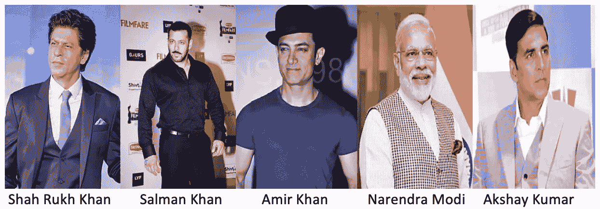
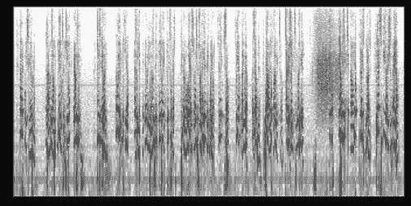

# 人工智能检测语音中的说话者

> 原文：<https://towardsdatascience.com/ai-to-detect-speaker-in-a-speech-a1dae5b597b0?source=collection_archive---------32----------------------->

## 利用人工智能从语音数据中检测讲话者


图片由[上的](https://images.unsplash.com/photo-1524678606370-a47ad25cb82a?ixlib=rb-1.2.1&ixid=eyJhcHBfaWQiOjEyMDd9&auto=format&fit=crop&w=2250&q=80)[图标 8](https://unsplash.com/@icons8) 打开

随着[人工智能](https://en.wikipedia.org/wiki/Artificial_intelligence)的进步，人们可以提出许多有趣和有益的人工智能应用。这些人工智能应用在健康、零售、金融和其他各种领域都很有帮助。主要的想法是不断思考我们如何利用这些先进的技术，并提出有趣的用例。

通过这篇博文，我打算介绍一个人工智能应用，在这个应用中，人们可以从说话者的声音中检测出说话者。我还将解释我创建这个数据集的过程。代码和数据集在这里[可用](https://github.com/samread81/Identify-Celebrity-AI)。有几篇博客文章围绕这个话题，但这篇文章在两个方面有所不同，首先，它将提供一个清晰的指南，说明如何使用一些最佳实践有效地检测说话者，而不陷入陷阱；其次，在最后，我将涵盖一些真正有趣的用例/应用，它们可以从这篇文章中扩展出来。 那么，我们开始吧。

# 创建数据集

我创建了一个由来自印度的 5 位名人/流行人物组成的数据集。



由来自印度的 5 位名人/流行人物创建的数据集。图片来源~ [维基百科](https://en.wikipedia.org/wiki/Main_Page)

我从 [Youtube](https://en.wikipedia.org/wiki/YouTube) 上截取了这些名人的许多演讲/采访，并将它们转换成一个 [Mp3 文件](https://en.wikipedia.org/wiki/MP3)。

此外，我使用流行的 [Librosa Python 库](https://librosa.github.io/librosa/generated/librosa.feature.melspectrogram.html)将这些 MP3 文件转换成[频谱图](https://en.wikipedia.org/wiki/Spectrogram)。我从 mp3 剪辑中以 90 秒的间隔重复创建了这些光谱图。

```
def generate_spectogram(file,path,jump = 90):
    total_time = librosa.get_duration(filename=file)
    till = math.ceil(total_time/jump)
    for i in range(till):
        x , sr = librosa.load(file,offset=i*jump,duration=jump)
        X = librosa.stft(x)
        Xdb = librosa.amplitude_to_db(abs(X))
        librosa.display.specshow(Xdb, sr=sr, x_axis='time', y_axis='log',cmap='gray_r')
        plt.savefig(file_save,dpi=1200)
```

这些光谱图看起来像:



声音的声谱图

有一本关于歌词和音乐流派分类的好书。

[](/music-genre-classification-with-python-c714d032f0d8) [## 用 Python 进行音乐流派分类

### 音乐就像一面镜子，它告诉人们你是谁，你关心什么。你就是你所流的。

towardsdatascience.com](/music-genre-classification-with-python-c714d032f0d8) 

> 一旦我们将音频片段转换成图像，我们就可以训练一个监督的[卷积神经网络(CNN)](https://en.wikipedia.org/wiki/Convolutional_neural_network) ，模型。

# 一些挑战

开发这样一个应用程序本身也有一些挑战。这些挑战是

1.  我们的数据集包含了非常相似的人的声音。检测枪声和狗叫声并不是一件非常困难的事情，因为它们是不同的声音。在我们的例子中，区分一个人的声音和另一个人的声音是一个更困难的问题。
2.  我们从这些名人的 Youtube 演讲/采访中创建了一个数据集，所以很多时候会有背景噪音或其他人/采访者在中间说话或人群鼓掌。
3.  该数据集每人最多有 6-7 个片段，这妨碍了准确性。更丰富的数据集将在准确检测个人方面提供更好的准确性和信心。

# 培训此类模型的最佳实践

在训练这个应用程序时，有些事情对我来说不太好，而有些事情却像魔法一样提高了模型的性能。在这一节中，我将指出训练这种模型的最佳实践，而不会落入陷阱。

1.  用黑白光谱图而不是彩色光谱图训练模型。这增加了我的模型准确性。一个原因可能是不太复杂的数据使模型更容易学习。这可以通过更改库的“cmap”属性来实现。`librosa.display.specshow(Xdb, sr=sr, x_axis=’time’, y_axis=’log’,cmap=’gray_r’)`
2.  从谱图中移除所有类型的标签或记号，不需要的文本只会混淆模型。
3.  允许 Resnet 或 Vgg 架构(或任何其他选择的架构)训练每个单独的层，而不仅仅是训练最后几层，可以提高性能。一个原因可能是 Imagenet 数据与光谱图非常不同。给予每一层单独训练的杠杆作用提高了模型的性能。
4.  在这些人/名人的完全不同的剪辑/视频上测试模型的性能。原因是来自相同剪辑甚至来自不同时间帧的频谱图可能包含相同类型的噪声、背景或记录设备。我们希望模型总体表现良好。
5.  该模型的准确性可以通过由说话人的不同剪辑来丰富训练数据来提高。这使得模型能够一般化。
6.  为模型提供高质量的生成光谱图进行训练。这可以通过在保存绘图时更改 dpi 属性来实现。

```
plt.savefig(file_save,dpi=1200)
```

# 模型训练和准确性

我用 FastAI 库训练了模型。我用一个 [ResNet 架构](https://en.wikipedia.org/wiki/Residual_neural_network)来训练一个 [CNN](https://en.wikipedia.org/wiki/Convolutional_neural_network) 模型。创建的数据集和代码在[这里](https://github.com/samread81/Identify-Celebrity-AI)可用。

当在有限的训练集上训练时，该模型对完全看不见的测试数据(来自不同剪辑)给出了大约 80–85%的准确度。可以通过丰富训练数据集来提高模型性能。

# 其他有趣的可能用例

这样一个经过适当训练的应用程序可以在以下方面发挥作用

1.  自动标记视频/音频中的扬声器。
2.  检查一个人模仿一个名人有多好，比较该名人的模型得出的分数。
3.  创建一个应用程序，从随机歌曲中猜测歌手，并比较人工智能的检测能力。它喜欢玩对抗人工智能。
4.  在犯罪调查中，从被窃听的电话对话中高置信度地检测人/说话者是有用的。

# 结论

通过这篇博文，我介绍了一个人工智能应用，在这个应用中，人们可以从说话者的声音中检测出说话者。我还强调了训练这种模型的最佳实践和其他有趣的用例。创建的数据集和代码在这里[可用](https://github.com/samread81/Identify-Celebrity-AI)。

> 如果你有任何疑问，请联系我。我也很有兴趣知道你是否有一些有趣的人工智能应用/用例。

***我的 Youtube 频道获取更多内容:***

[](https://www.youtube.com/channel/UCg0PxC9ThQrbD9nM_FU1vWA) [## 阿布舍克·蒙戈利

### 嗨，伙计们，欢迎来到频道。该频道旨在涵盖各种主题，从机器学习，数据科学…

www.youtube.com](https://www.youtube.com/channel/UCg0PxC9ThQrbD9nM_FU1vWA) 

> ***关于作者-:***
> 
> Abhishek Mungoli 是一位经验丰富的数据科学家，拥有 ML 领域的经验和计算机科学背景，跨越多个领域并具有解决问题的思维方式。擅长各种机器学习和零售业特有的优化问题。热衷于大规模实现机器学习模型，并通过博客、讲座、聚会和论文等方式分享知识。
> 
> 我的动机总是把最困难的事情简化成最简单的版本。我喜欢解决问题、数据科学、产品开发和扩展解决方案。我喜欢在闲暇时间探索新的地方和健身。关注我的 [**中**](https://medium.com/@mungoliabhishek81) 、**[**Linkedin**](https://www.linkedin.com/in/abhishek-mungoli-39048355/)**或**[**insta gram**](https://www.instagram.com/simplyspartanx/)**并查看我的[往期帖子](https://medium.com/@mungoliabhishek81)。我欢迎反馈和建设性的批评。我的一些博客-********

*   ******每个数据科学家都应该避免的 5 个错误******
*   ******[以简单&直观的方式分解时间序列](/decomposing-a-time-series-in-a-simple-and-intuitive-way-19d3213c420b?source=---------7------------------)******
*   ******[GPU 计算如何在工作中真正拯救了我？](https://medium.com/walmartlabs/how-gpu-computing-literally-saved-me-at-work-fc1dc70f48b6)******
*   ******信息论& KL 分歧[第一部分](/part-i-a-new-tool-to-your-toolkit-kl-divergence-5b887b5b420e)和[第二部分](/part-2-a-new-tool-to-your-toolkit-kl-divergence-736c134baa3d)******
*   ******[使用 Apache Spark 处理维基百科，创建热点数据集](/process-wikipedia-using-apache-spark-to-create-spicy-hot-datasets-1a59720e6e25)******
*   ******[一种基于半监督嵌入的模糊聚类](/a-semi-supervised-embedding-based-fuzzy-clustering-b2023c0fde7c)******
*   ******[比较哪种机器学习模型表现更好](/compare-which-machine-learning-model-performs-better-4912b2ed597d)******
*   ******[分析 Fitbit 数据，揭开疫情封锁期间身体模式变化的神秘面纱](/analyzing-fitbit-data-to-demystify-bodily-pattern-changes-amid-pandemic-lockdown-5b0188fec0f0)******
*   ******[神话与现实围绕关联](/myths-and-reality-around-correlation-9b359456d8e1)******
*   ******[成为面向商业的数据科学家指南](/a-guide-to-becoming-business-oriented-data-scientist-51da5c829ffa)******