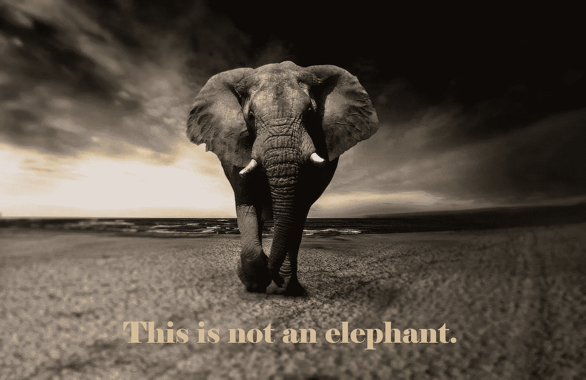
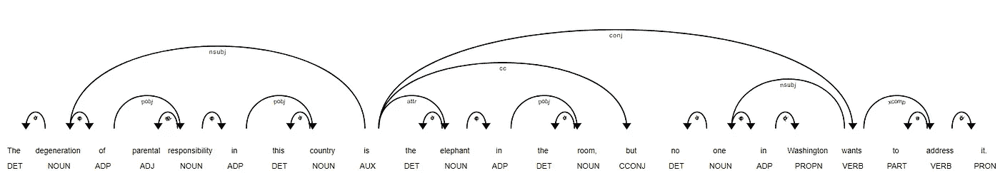
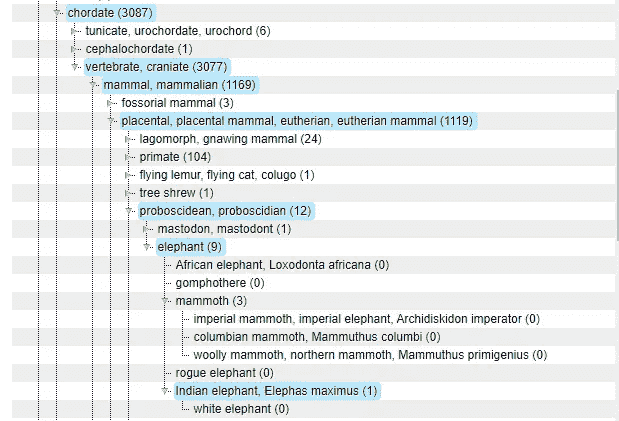
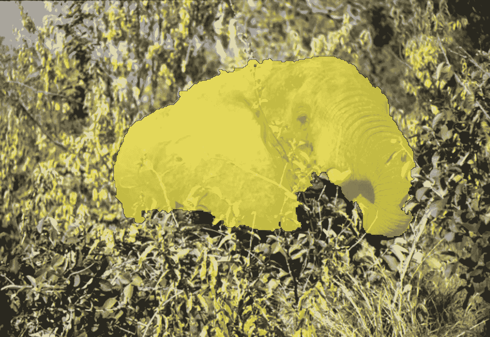
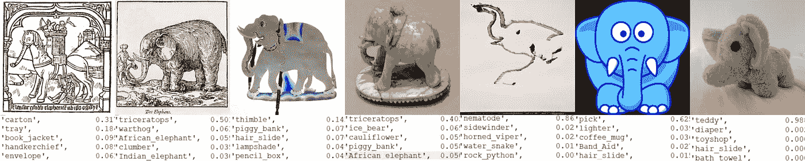

# AI 理解:大象是什么？

> 原文：<https://towardsdatascience.com/ai-understanding-what-is-an-elephant-7a6f75db938b?source=collection_archive---------47----------------------->

## 人类知识和人工智能模型中大象的表示

在这个故事中，我想谈谈一个词的抽象概念。它在不同语境中的含义。当前的机器学习算法如何理解它，为什么很难实现一个通用的、类似人类的知识。我想用大象这个词来说明我的想法。我会把这个帖子的收入捐出去拯救物种。*

“这不是一头大象”,字体为“大象——原图”,作者为[克里斯汀·斯蓬基亚](https://pixabay.com/users/sponchia-443272/?utm_source=link-attribution&utm_medium=referral&utm_campaign=image&utm_content=2870777),来自[皮克斯拜](https://pixabay.com/?utm_source=link-attribution&utm_medium=referral&utm_campaign=image&utm_content=2870777)

# 字典中的大象

这是《韦氏词典》对[大象的定义](https://www.merriam-webster.com/dictionary/elephant?src=search-dict-hed) [1]:

> **1a:** 一种体形粗壮，通常非常大，几乎无毛的食草哺乳动物(象科，象科),其口鼻部拉长成肌肉发达的象鼻，上颚有两颗门牙，特别是雄性长牙:
> 
> **(1):** 热带非洲的一种高大、大耳的哺乳动物(*loxotonta africana*)，有时被认为由两个独立的物种组成(撒哈拉以南的稀树草原的 *L. africana* 和中部和西部雨林的 *L. cyclotis* )
> 
> 也被称为*非洲象*
> 
> **(2)**东南亚森林中一种相对较小耳朵的哺乳动物
> 
> ——又称*亚洲象*、*印度象*
> 
> **b:** 任何一种已经灭绝的大象亲戚——参见[猛犸象](https://www.merriam-webster.com/dictionary/mammoth)、[乳齿象](https://www.merriam-webster.com/dictionary/mastodon)
> 
> 非常大或难以管理的人

这个条目可以说明理解一个词的概念的一些困难的挑战。首先，单词可能有许多完全不同的意思。在这里，单词*大象*有两个意思，它们之间唯一的联系是都指大的东西。其次，1a、1b 和 1a 亚型表明**在不同的上下文中，大象这个词代表不同的事物**，更大或更小的动物群体。对于一个学习动物知识的孩子来说，非洲象和亚洲象的区别没有生物学家重要(参见维基百科上大象种类的完整列表[)。最后，阅读和**理解这个定义需要了解其中使用的词语**(例如*哺乳动物*、*亚洲*和*非洲*)。](https://en.wikipedia.org/wiki/List_of_elephant_species)

这不是一个不确定的知识概念(AKMilroy 2015 after Margritte) [2]

# 自然语言处理中的大象

对于计算机来说，要理解一个普通的文本，它必须把它转换成数字。最直接的方法是为字典中的每个单词指定一个数字。为了将其表示为向量，其中两个单词是独立的，需要有一个向量空间，其维度与词汇的大小一样大(如果单词被用作该向量空间的标准基，这被称为**一键编码**)。

然而，这是一种非常昂贵的表示，人们可能想要一种更紧凑的表示。Mikolov 等人[3，4]提出了一种表示方法，其中向量空间被投影到一个更小的(100-300 dims)空间，基于该空间，单词在大型语料库中一起出现。使用这个**单词嵌入向量**，不仅表示变得更小，而且还有另一个非常重要的特征:相似的单词彼此更接近。在[上使用 en 英语语料库这个在线演示](http://bionlp-www.utu.fi/wv_demo/)，单词*大象*类似于下面的单词:`elephants, rhino, tiger, rhinoceros, tigers, hippo, gorilla, giraffe, rhinos, hippopotamus`。

有了这个单词向量表示，我们就可以使用向量运算了:如果我们从向量*大*中减去向量*大象*，再加上向量*鼠标*，一个与结果最相似的向量就是*小*。这叫做**字类比**:大*和*大象*的关系类似于*小*和*老鼠*的关系。*

正如我在上一节中提到的，单词有多重含义，通常只有上下文才能区分它们。最近的工作，如 Devlin 等人[5]提出了一种新的方法，称为**上下文化单词嵌入**向量来解决这个问题。如果你对此感兴趣，可以看看我以前的帖子！

[空间](https://spacy.io/)城市词典中[“房间里的大象”例句的依存可视化](https://www.urbandictionary.com/define.php?term=elephant%20in%20the%20room)

## 明摆着的难题

为了理解一个词的每一种用法，人们还应该研究一下**搭配**。例如，房间中的*大象不仅仅是建筑中的一只大型哺乳动物。在搭配中，单词有共同的意义，人们不能仅从各部分的总和中推导出它的意义。在某些情况下，像大象的脚，它需要特殊的参考，可能不是常识的一部分，但是，人们可以期待一个通用的人工智能理解参考。像 Spacy [6]这样的 NLP 工具包可以解决这个叫做**命名实体识别** (NER)的问题。*

 [## 大象的脚(切尔诺贝利)

### 大象的脚是切尔诺贝利事故中形成的大量堆芯熔融物和其他材料的昵称…

en.wikipedia.org](https://en.wikipedia.org/wiki/Elephant%27s_Foot_%28Chernobyl%29#/media/File:Chernobyl_Elephant%27s_Foot.jpg) 

# 计算机视觉中的大象

两个主要的图像数据集都包含大象的图像。OpenImages [7]有一个[单个大象类](https://storage.googleapis.com/openimages/web/visualizer/index.html?set=train&type=segmentation&r=false&c=%2Fm%2F0bwd_0j)，ImageNet [8]也有一个[非洲](http://www.image-net.org/synset?wnid=n02504458) (2277 张图片，61.32%受欢迎百分比)和[印度](http://www.image-net.org/synset?wnid=n02504013) (1650 张图片，55.85%受欢迎百分比)大象类。ImageNet 数据集通过在分层结构中对图像进行分类来回答上面提出的关于不同级别的单词组的问题。

ImageNet 层级中的大象— [图片来自 ImageNet 网站](http://www.image-net.org/synset?wnid=n02504013)(2020 年 10 月 22 日)

浏览这些图片，我们可以看到不同位置、年龄、大小和背景的大象。这些数据解决了第二张图中提出的问题(AKMilroy 2015，Margritte 之后):有许多图像只显示了动物的一部分，因此，根据这些数据训练的模型可以只从动物图像的一部分中识别大象。

[open images 数据集中带有分割的大象](https://storage.googleapis.com/openimages/web/visualizer/index.html?set=train&type=segmentation&r=false&c=%2Fm%2F0bwd_0j&id=03c735a736106056) ( [许可](https://creativecommons.org/licenses/by/4.0/))——[原始来源](https://farm7.staticflickr.com/26/89018026_9fcc9dffab_o.jpg)作者[德里克·济慈](https://www.flickr.com/people/dkeats/) ( [许可](https://creativecommons.org/licenses/by/2.0/))

# 大象的人类形象

虽然上一节提到的图像数据集包含大量真实动物的图像，但我们人类还有动物的其他表现形式:图画、人物和毛绒玩具。这里可以提出一些有趣的问题:

*   一个训练有素的人工智能能理解大象的概念吗？
*   它会把玩具归类为大象吗？
*   一般模型应该把玩具归类为大象吗？
*   什么时候应该把它归为大象？

七种可选的大象图片及其 Keras DenseNet 分类，带有预先训练的 ImageNet 权重

上图显示了七个可选的大象图片及其 DenseNet [9]分类[，在 Keras](https://keras.io/api/applications/densenet/) 中使用预先训练的 ImageNet 权重实现。我们可以看到，在很多情况下，模型识别的是格式(绘图，毛绒)，而不是图像中的动物。只有两个预测的前五名中有一头大象。

上图中的图像:

1.  [复制早期印刷版本*人类窥镜的插图*(1430 年)](https://commons.wikimedia.org/wiki/File:Elephant_(Speculum_Humanae_Salvationis).png)
2.  安德烈·泰韦特。F. André Thevet d'Angoulême。里昂、让·图尔内斯和吉尔的《数字评论与增刊》。Gazeau，1556 年。
3.  1976 年万隆奥林匹克运动会
4.  [棋子，主教 17 世纪末-18 世纪初](https://commons.wikimedia.org/wiki/File:Chess_Piece,_Bishop_MET_17.190.228(3).jpg)
5.  [后来出售的 t 恤上画的大象](https://commons.wikimedia.org/wiki/File:DGJ_4234_(3728964233).jpg)。丹尼斯·贾维斯
6.  [蓝色大象剪贴画](https://commons.wikimedia.org/wiki/File:Blauer_Elefant.png)
7.  毛绒大象的图片，自己的照片

# 拯救物种！

大象是野生动物的标志性动物。根据[拯救大象](https://www.savetheelephants.org/):

> 大象是非洲的园丁和景观工程师，无论它们漫游到哪里，都在播种和创造栖息地。
> 
> 如果不采取紧急措施来拯救它们的物种，大象可能会在一代人的时间内从野外消失。
> 
> 从 2010 年到 2012 年，仅仅三年时间，非洲就有大约 10 万头大象因为象牙被捕杀。

(*):我想把这个帖子的收入捐出来拯救大象。因此，每当 WWF Gifts 网站上的[非洲象虚拟收养捐赠金额达到 55 美元时，我都会将其捐赠给该组织。](https://gifts.worldwildlife.org/gift-center/gifts/Species-Adoptions/African-Elephant.aspx)

# 参考

[1]“大象。”Merriam-Webster.com。2011.https://www.merriam-webster.com(2020 年 10 月 22 日)。

[2] [米尔罗伊，A. K. (2017)。昆士兰植物群进化和灭绝的知识、技术和观点可视化。](https://www.researchgate.net/publication/321307469_Episteme_techne_poiesis_visualisations_of_evolution_and_extinction_in_Queensland_flora)

[3]t . miko lov，Sutskever，I .，Chen，k .，Corrado，G. S .，& Dean，J. (2013 年)。词和短语的分布式表示及其组合性。神经信息处理系统的进展(第 3111-3119 页)。

[4]t . miko lov，陈，k .，Corrado，g .，& Dean，J. (2013)。向量空间中单词表示的有效估计。 *arXiv 预印本 arXiv:1301.3781* 。

[5] Devlin，j .，Chang，M. W .，Lee，k .，& Toutanova，K. (2018 年)。Bert:用于语言理解的深度双向转换器的预训练。 *arXiv 预印本 arXiv:1810.04805* 。

[6] Honnibal，m .，& Montani，I. (2017 年)。 *spaCy 2:利用 Bloom 嵌入、卷积神经网络和增量解析的自然语言理解*。

[7] *Krasin I .、Duerig T .、Alldrin N .、Ferrari V .、Abu-El-Haija S .、Kuznetsova A .、Rom H .、Uijlings J .、Popov S .、Kamali S .、Malloci M .、Pont-Tuset J .、Veit A .、Belongie S .、Gomes V .、Gupta A .、Sun C .、Chechik G .、Cai D .、Feng Z .、Narayanan D .、Murphy K.*
OpenImages:大规模多标签多类别的公共数据集
可从[https://storage.googleapis.com/openimages/web/index.html.](https://storage.googleapis.com/openimages/web/index.html.)获得

[8]邓俊杰，董，魏，苏歇，李，李，李，，李(2009 年 6 月).Imagenet:一个大规模分层图像数据库。2009 年 IEEE 计算机视觉和模式识别会议(第 248–255 页)。Ieee。

[9]黄，g .，刘，z .，范德马腾，l .，，温伯格，K. Q. (2017)。密集连接的卷积网络。在*IEEE 计算机视觉和模式识别会议论文集*(第 4700–4708 页)中。