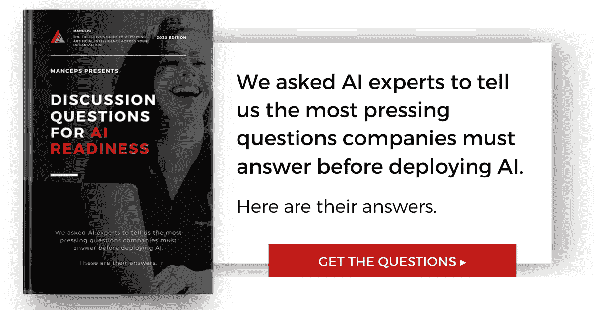

# 人工智能如何帮助金融和银行业

> 原文：<https://towardsdatascience.com/ai-use-cases-for-finance-and-banking-716b43082c5b?source=collection_archive---------50----------------------->

## 人工智能和机器学习为金融行业提供了前所未有的自动化承保、防止欺诈和获得新客户的能力。

在过去的几年里，金融和银行业的人已经开始看到将机器学习引入他们行业的力量。现在，各种规模的金融机构都在争先恐后地减少官僚作风，提高贷款过程的准确性和公平性。

不幸的是，许多金融机构仍在使用启发式方法来管理复杂、高度管控的流程，也就是说，他们流程的规则和法规是由一群(昂贵的)法律、金融和计算机编程专家手动配置和更新的。

# 是什么推动了采用人工智能的紧迫性？

需要提高速度和效率获得更深入的数据驱动洞察的机会复杂的法规和合规性要求糟糕的客户服务和漫长的等待时间。信用评分不能说明全部情况。

# 当机器学习进入金融和银行业时

1.  新的人工智能驱动的流程和产品产生新的收入流。
2.  多维度和跨辖区的欺诈计划可以立即被发现。
3.  客户获取变得更加个性化、简化和数据驱动。
4.  财务报告、合规性保证和管理任务都是自动完成的。
5.  风险评估和承保超越了信用评分。
6.  通过图像处理验证索赔并确定损失。

# 人工智能在金融和银行业的主要用途

来源: [Manceps](https://www.manceps.com/finance-and-banking) 通过 [Unsplash](https://unsplash.com/photos/snNHKZ-mGfE)

## 文本组织和摘要

Manceps 可以帮助金融机构将自然语言处理应用于大量文本和语音数据，以提取信息、获得洞察力并简化手动任务。虽然节省时间和成本是显而易见的好处，但识别关键信息的能力(众所周知的大海捞针)却能带来巨大的不同。考虑将自动摘要应用到法律文档、收入报告或工作申请中。

来源: [Manceps](https://www.manceps.com/finance-and-banking) 经 [Unsplash](https://unsplash.com/photos/7jSRJZJSvy4)

## 欺诈检测

欺诈检测现在不仅仅涉及风险因素清单。使用 ML 技术，欺诈检测系统现在可以主动学习和校准，以应对新的(或潜在的)安全威胁。通过分析数十亿个数据点，这些系统可以标记出否则会被人类忽视的问题，防止错误拒绝。

来源: [Manceps](https://www.manceps.com/finance-and-banking) 通过 [Unsplash](https://unsplash.com/photos/Fsgzm8N0hIY)

## 个性化零售体验

客户越来越擅长使用聊天机器人和其他对话界面来满足他们的银行需求。这种聊天机器人必须使用强大的自然语言处理引擎以及大量特定于金融的客户交互来构建。这些技术使得银行客户越来越难以辨别他们是否真的在与人交谈。

聊天机器人、财务助理和相关工具是自学的，这意味着它们会随着额外的客户互动而不断改进。

来源: [Manceps](https://www.manceps.com/finance-and-banking) 经 [Unsplash](https://unsplash.com/photos/_whs7FPfkwQ)

## 风险保理

预测分析运行在人工智能上，在金融领域，引入这种见解可以增加收入并降低成本。金融组织出于各种目的使用预测分析。这使得他们能够识别和锁定更有利可图的客户；更好地管理现金流；预测需求波动，降低风险。随着人工智能的能力越来越强，金融机构正在寻找越来越复杂的方法来利用这些数据。

来源: [Manceps](https://www.manceps.com/finance-and-banking) 通过 [Unsplash](https://unsplash.com/photos/3y1zF4hIPCg)

## 操作优化

像许多大型组织一样，金融机构正在转向人工智能，以自动化经常重复的任务，并帮助他们的业务更顺利地运行。在一个例子中，摩根大通利用机器人帮助员工重置密码。他们预计，2017 年机器人将处理近 200 万个请求，大约是 40 名全职员工的工作量。

*本文改编自* [*Manceps《金融与银行服务》页面*](https://www.manceps.com/finance-and-banking?utm_source=Medium&utm_medium=Toward%20Data%20Science&utm_term=Finance%20and%20Banking) *。Manceps 不仅帮助组织大规模地构建和部署人工智能模型，还帮助组织识别商业用例，使人工智能投资成为可能。*

*如果你正在考虑将人工智能引入你的组织，我建议你从这个优秀的资源开始:* [*人工智能就绪讨论问题*](https://www.manceps.com/resources/discussion-questions-for-ai-readiness?utm_source=Medium&utm_medium=Toward%20Data%20Science&utm_term=Finance%20and%20Banking) *。*

*更多与金融相关的用例，可以考虑查看:* [*来自全球最大金融和银行公司的 AI 例子*](https://www.manceps.com/resources/ai-examples-from-finance-and-banking?utm_source=Medium&utm_medium=Toward%20Data%20Science&utm_term=Finance%20and%20Banking) *。*