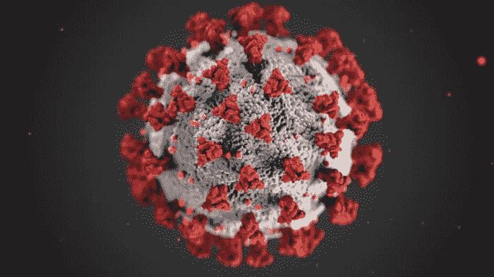
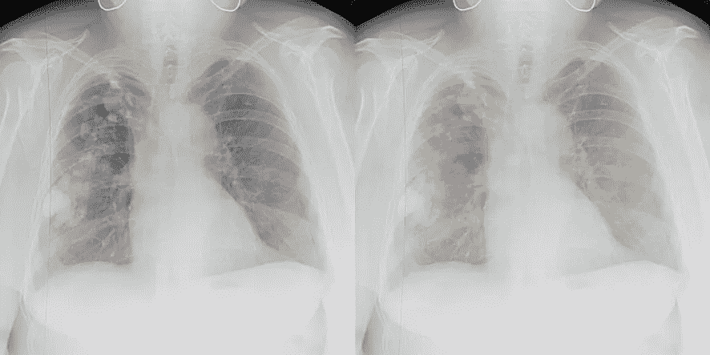

# 人工智能对新冠肺炎。真的管用吗？

> 原文：<https://towardsdatascience.com/ai-vs-covid-19-does-it-really-work-a001c8da990a?source=collection_archive---------39----------------------->

## 弄清楚我们能用现有的数据做什么，不能做什么

艾丽莎·埃克特女士和丹·希金斯女士在菲尔上的照片

## 内容:

1.  介绍
2.  制作我们的胸部 x 光新冠肺炎分类器
    2.1。数据准备
    2.2。训练
    2.3。结果
3.  真的管用吗？
    3.1。进一步分析
    3.2。讨论和要点

# 1.介绍

今天，每个人都知道疫情。专业人士尽最大努力帮助应对这一问题:防止感染的快速传播、开发诊断方法、药物发现、病人护理策略、疫苗开发、死亡率预测、全球经济的建模影响以及许多其他问题。

数据科学家也不例外。没有必要让任何人相信人工智能在医疗应用中非常有用。你可能已经看到出版物(甚至科学论文)声称已经开发出某种模型，可以预测患者是否患有新冠肺炎。一些出版物声称，当将深度学习应用于胸部 X 射线图像时，预测准确率达到 90%以上，这提出了许多问题。

这就是为什么:在 [Futuremed](http://futuremed.systems) 我们与医生密切合作，处理医疗数据。放射科医生说，胸部 x 光片中几乎没有新冠肺炎特有的模式。有时候，人工智能能够找到任何人类医生都无法找到的特征。

使用视网膜照片进行性别分类。

也许新冠肺炎的胸部 x 光片也是如此？让我们找出答案。

# 2.制作我们的胸部 x 光新冠肺炎分类器

这不是一个“如何训练神经网络”的教程，但我会添加所有必要的信息来重现所描述的工作。

## 2.1.数据准备

对于在胸部 X 射线图像上分类新冠肺炎的任务，我们的数据集应该至少有两个类:“新冠肺炎”和“其他”。
我们将使用四个数据源进行训练:
1。[著名的 GitHub 回购](https://github.com/ieee8023/covid-chestxray-dataset)带有新冠肺炎的图片。
2。来自意大利数据库[和新冠肺炎病例](https://www.sirm.org/category/senza-categoria/covid-19/)的图片。
3。胸部 x 光肺炎数据集。
4。 [NIH ChestXRay-14 数据集](https://www.kaggle.com/nih-chest-xrays/data)。

为了获得尽可能多的新冠肺炎图像，让我们结合前两个来源。意大利数据库中的大部分图片已经包含在 GitHub repo 中。但有些不是，所以我们只是手动添加。通过这种方式，我们可以获得目前(2020 年 4 月 7 日)新冠肺炎的所有可用图像，以及一些没有该图像的图像(如果有其他病理或“无发现”，它们将被用作“其他”类别样本)。这里要注意一点:每个患者在数据集的那个部分可以有多个图像，所以 *n_patients ≤ n_images* 。

为了获得“其他”类的更多图像，使用最后两个源。

*   从胸部 X 射线肺炎数据集中随机选取 450 幅图像，每类以*平衡*的方式。不考虑患者 id。这样我们得到:
    149 例无发现患者的 150 幅图像，
    144 例病毒性肺炎患者的 150 幅图像，
    144 例细菌性肺炎患者的 150 幅图像。
*   从 NIH ChestXRay-14 数据集中随机挑选 450 张图像:
    每 14 种病理状态 30 张图像，另外 30 张图像带有“未发现”标签。具有一种目标病理的图像也可能包含其他病理。所以这部分数据集*几乎平衡*。
    图像的采集方式使得该子数据集可能仅包含某个患者的一幅图像。换句话说，我们得到了 450 个独特的病人图像。

接下来，我们把所有的数据结合起来。以下是生成的数据集统计数据:

所有图像的尺寸都调整为 564x564。计算数据集中图像的平均值和标准偏差。

## 2.2.培养

让我们使用 DenseNet-121 作为模型的主干(它几乎成为处理 2D 医学图像的默认选择)。由于我们的新冠肺炎数据集太小，无法从头开始训练模型，让我们首先在 ChestXRay-14 上训练我们的模型，然后使用预训练的模型进行权重初始化。
处理医学图像时，确保同一患者的不同图像不会进入训练/验证/测试集至关重要。为了解决这个问题，由于新冠肺炎图像的缺乏，我们决定对患者使用 10 倍交叉验证*进行训练。
为培训进行了以下数据扩充:*

*   随机旋转(<15°),
*   Random crop (512x512),
*   Random intensity shift.

For evaluation, we used only center crops (no TTA).
计算的平均值和标准差用于增强后标准化图像。

对网络进行了修改，以便为这些类生成两个逻辑(“新冠肺炎”和“其他”)。数据是不平衡的，所以我们选择加权二进制交叉熵作为损失函数。还使用了软标记:一键编码标记平滑 0.05。当我们对患者进行交叉验证*时，两个类别的图像数量会从一个折叠到另一个折叠发生变化，因此我们会实时计算每个折叠的每个类别权重。*

使用带有 AMSGrad 的 Adam optimizer 来训练网络。其他超参数和代码可以在项目报告[这里](https://github.com/futuremed-ru/covid/tree/master/lungs-covid-19-classifier)找到。ROC AUC 模型验证集上的最佳值保存在每个折叠中。

## 2.3.结果

所得到的模型形成了用于进一步分析的集合。所有验证倍数指标的平均值:
ROC AUC: 0.99387，
准确性:0.95046。

为了进行测试，我们使用了来自 GitHub repo(2020 年 4 月 7 日至 22 日添加的)的新正面(PA 或 AP 视图)X 射线图像。
和需要平衡(“新冠肺炎”和“其他”)类别的图像数量是从从 ChestXRay-14 中随机选取的未用于训练的患者图像中添加的(由于它们是随机选取的，从统计上看，它们中的大多数都带有“无发现”标签)。所有这些带有相应标签的图像组成一个测试集。

测试集上的每个标签统计信息:

常见的指标有:

还不错！看起来我们有了一个坚实的胸部 x 光新冠肺炎分类器。

对于一些读者来说，结果可能看起来令人信服，但其他人可能会有“这里有问题”的感觉。

# 3.真的管用吗？

让我们使用更多的数据来评估我们的分类器的性能。

## 3.1.进一步分析

**首先**，让我们看看分类器在 **ChestXRay-14 数据集**的其余部分(未在训练中使用)上的性能统计:

由于在该数据集中没有新冠肺炎病例，那么我们唯一可以声称的是，我们的分类器在该数据集上具有相当好的特异性(0.99235) *。
此外，您可以看到，在“肺炎”和“浸润”等类别上没有假阳性峰值，这些类别可能与新冠肺炎 x 光照片类似。这是否意味着人工智能算法可以将新冠肺炎病与其他类似的疾病区分开来？*

**其次**，让我们来看看分类器在*不可见* **专有数据**上的表现。使用的数据集只有“正常”和“异常”标签。该数据集中没有新冠肺炎阳性患者图像。

特异性显著下降(至 0.69333)。分类器现在好像不太好。发生了什么事？

**第三**，我们来看看 **GitHub repo** 关于**新图片**(2020 年 4 月 7-22 日)的详细结果，有新冠肺炎案例。

综上所述，我们得到:

重新计算指标后，我们已经可以看到一些东西:

已经不是“还不错”了。我们现在可以看到真相:我们的分类器是垃圾。让我们好好想想。

## 3.2.讨论和要点

正如前面提到的，结果精度表明分类器无法区分图像中的新冠肺炎特定模式(记得放射科医生说，在胸部 X 射线图像中没有多少*特定的*到新冠肺炎模式)。但是分类器学到了什么，为什么它在 GitHub repo 和 ChestXRay-14 数据上表现良好？

分类器学习从“其他”类的数据集中挑选的图像看起来如何。它还了解到，任何病理模式都意味着它是“新冠肺炎”，“T2”，因为图像看起来不像是来自“其他”数据集。

> 所以，一般来说，分类器学会了区分一些病态的和看起来不像“其他”图像的东西。

患者的原始图像，带有分类器对新冠肺炎的预测(左)，对应的 GradCAM(右)。

这就是为什么它在我们的专有数据集(包含看起来不像“其他”图像的图像)上将几乎每三张图像标记为“新冠肺炎”。
分类器知道*正常和异常图像之间的一些*差异。每隔 3 个异常图像和每隔 5 个正常图像标记为“新冠肺炎”。至少我们的努力没有白费:)

尽管在训练时进行了强大的数据扩充，仔细的患者 k 倍交叉验证，以及加权损失函数，分类器在真实世界的数据上表现不佳。

我们鼓励任何感兴趣的人重复我们的实验。实际上，你不需要任何专有数据，你可以只从“其他”类中排除一个数据集，并将其作为“不可见”使用。

> *我想指出两个要点:*
> 
> *任何神经网络总会试图找到*解决任务的最简单方法*。*
> 
> 仔细查看验证模型性能的数据*。不仅仅是光秃秃的数字。*

在这一点上，我并不是说绝对不可能在胸部 x 光片上找到任何新冠肺炎特有的模式。有可能某种特定的东西确实存在，人工智能能够捕捉到它。但在以下情况下，这是绝对不可能的:

1.  神经网络是根据少量数据训练的
2.  当某个特定类别的图像与数据集的其余部分存在显著差异时

所有的源代码都可以在我们[项目的 GitHub repo](https://github.com/futuremed-ru/covid) 获得。如果你有任何问题，请随时联系我。