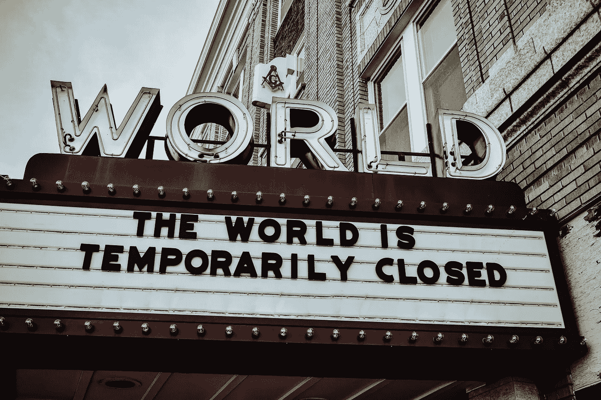
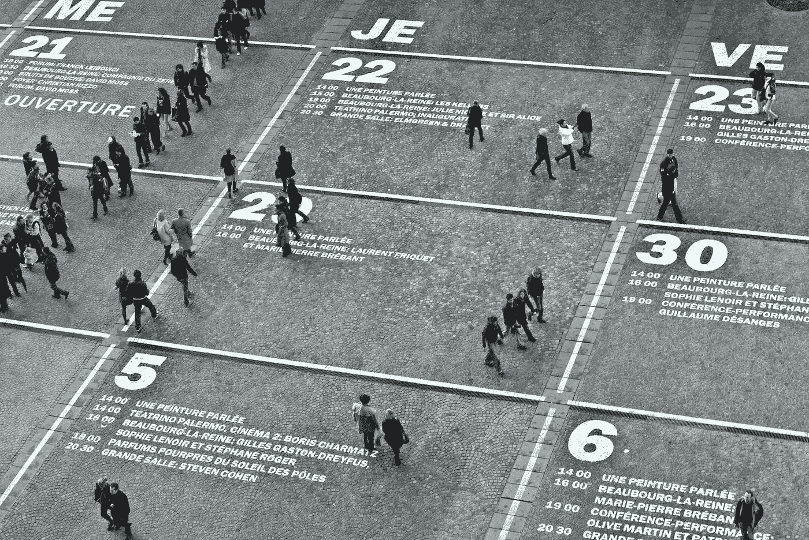
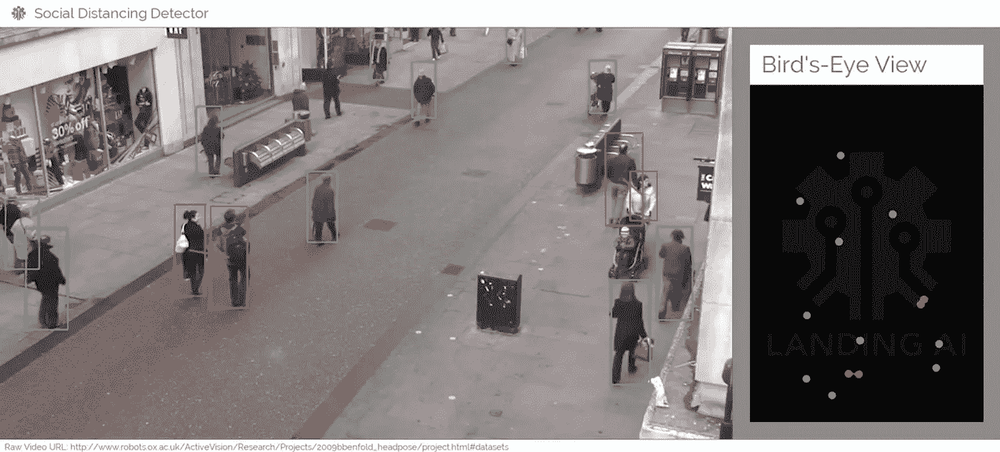
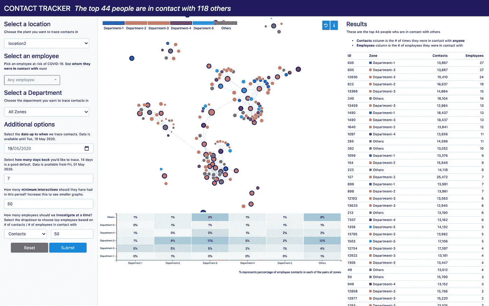
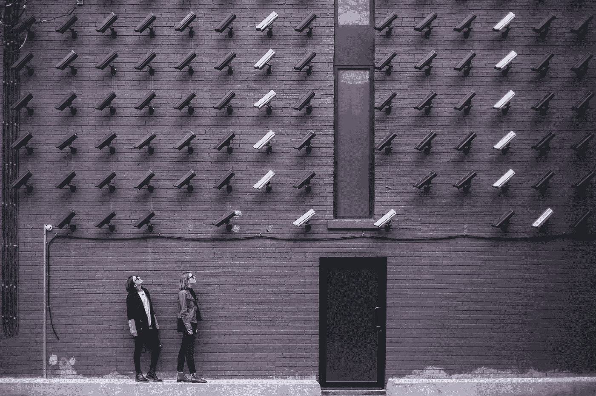

# 人工智能将为安全返回工作场所提供动力。以下是方法

> 原文：<https://towardsdatascience.com/ai-will-power-a-safe-return-to-the-workplace-heres-how-4968785c8e65?source=collection_archive---------66----------------------->

## 疫情还没有结束。如何安全地迎接员工重返职场？

想象一下你在隔离几个月后回到办公室的第一天:你不仅可能在早上的通勤途中暴露于病毒之下，而且随后你将面对拥挤的电梯。

当你进入楼层时，你会注意到门把手可能已经被你前面的几十个人碰过了，而且受限的工作空间很容易违反社交距离协议。这种情况很难让你放松，更不用说帮助你回到办公室工作的状态了。

克里斯蒂安·埃尔富特在 [Unsplash](https://unsplash.com/?utm_source=unsplash&utm_medium=referral&utm_content=creditCopyText) 上拍摄的照片

这就是为什么组织在欢迎他们的团队回到工作场所时采取严格而谨慎的措施是至关重要的。许多企业没有意识到的是，人工智能(AI)如何能够将更普遍的健康和安全协议推向新的高度。

该技术可以让团队以最安全的方式获得面对面协作的好处。以下是方法。

# 人工智能允许你安排谁回来，什么时候回来

照片由[柯蒂斯·麦克牛顿](https://unsplash.com/@curtismacnewton?utm_source=unsplash&utm_medium=referral&utm_content=creditCopyText)在 [Unsplash](https://unsplash.com/?utm_source=unsplash&utm_medium=referral&utm_content=creditCopyText) 上拍摄

所以，你打算邀请你的员工回到办公室。了解什么是最有效的方式来组织谁来，在什么日子来，来多长时间是一项复杂的任务——尤其是如果你有超过 50 名员工的话。这就是人工智能驱动的调度和规划工具的用武之地。

组织必须首先了解工作活动、员工任务的性质、客户互动的种类、会议时间表以及期望在现场协作的人员名单。

您必须将此与每个员工的风险级别评估结合起来。这可能包括一些因素，如他们在工作中的暴露程度、工作场所的类型以及需要与公众进行身体接触的程度。它还可以包括员工的家庭所在地、年龄、先前存在的状况，以及雇主可以(在道德上)用来保护他们和他们的团队的任何其他信息。

机器学习可以使用这些因素来平衡工作的关键程度和风险水平，并帮助制定出重返工作的时间表。该算法可以通过考虑典型工作场所阻塞点的允许容量来帮助规划一天内的时间表。这包括像电梯这样的位置或用于社交聚会的区域，它们可能是办公室内的高风险区域。

您必须根据不断变化的组织优先级、病毒控制的有效性和政府对企业的指导方针，不断调整这些计划。这份麦肯锡报告概述了不同类型工作场所的风险因素，可以作为一个有用的参考点。

# 人工智能让你确保安全协议得到遵守

在 [Unsplash](https://unsplash.com/?utm_source=unsplash&utm_medium=referral&utm_content=creditCopyText) 上[视觉](https://unsplash.com/@visuals?utm_source=unsplash&utm_medium=referral&utm_content=creditCopyText)拍摄的照片

一切照旧早已成为过去。再次和同事们在一起不会有挤在咖啡机旁或者在自助餐厅里分享拥挤的桌子的奢侈。现在，在工作中，社交距离是不可协商的。人工智能如何帮助确保员工在工作场所的安全？

人工智能可以帮助企业在员工和客户进入设施时处理他们的大规模体温筛查数据。加拿大公司 [PredictMedix](https://www.predictmedix.com/) 提供其人工智能体温检测技术[来帮助零售商店防止新冠肺炎的传播。](https://www.retail-insider.com/retail-insider/2020/5/ai-company-predictmedix-launches-covid-19-screening-technology-for-retailers)

人工智能驱动的计算机视觉工具可以自动监控工作场所，以确保人们戴上口罩，并与同事保持社交距离。人工智能初创公司 DatakaLab 使用巴黎地铁系统[的安全摄像头](https://www.theverge.com/2020/5/7/21250357/france-masks-public-transport-mandatory-ai-surveillance-camera-software)来检查乘客是否戴着口罩。

这些系统通过匿名检测一个人是否戴着面罩，避免了面部识别技术中有争议的元素。任何违规行为都可以报告给管理团队，让他们识别并采取适当的纠正措施。

社交距离探测仪— [登陆 AI 演示](https://landing.ai/landing-ai-creates-an-ai-tool-to-help-customers-monitor-social-distancing-in-the-workplace/)

这项技术可以扩展到检测办公室内的社交距离何时被打破。LandingAI 已经开发了一个人工智能的[工具](https://landing.ai/landing-ai-creates-an-ai-tool-to-help-customers-monitor-social-distancing-in-the-workplace/)，它可以分析实时视频流来估计人与人之间的距离，这可以用来立即识别违规行为。

许多组织正在探索使用物联网驱动的可穿戴设备，当用户彼此过于接近时，这些设备会向用户发出警告。组织可以分析这些数据，以了解办公室中的位置以及导致违反协议的情况。

虽然身体健康和防止病毒传播必须是当务之急，但帮助员工在艰难时期保持心理健康也至关重要。人工智能解决方案可以分析短信，以识别压力、抑郁或[焦虑](https://www.hrtechnologynews.com/news/people-analytics/can-ai-and-analytics-detect-burnout/174720)的潜在指标。

例如，StatusToday 的 AI [解决方案](https://blog.statustoday.com/meet-isaak-the-worlds-first-ai-dedicated-to-hr-and-people-analytics-a2598b8036e7)连接到组织内的电子邮件、聊天和通信系统，以识别可能处于精疲力竭边缘的员工。

# 人工智能推动恢复规划

Gramener 的联系人追踪应用程序— [演示](https://gramener.com/contacttracing)

无论你为安全返回工作场所做了多少准备、策略和计划，在病毒被完全击败之前，感染的可能性总是存在的。在人工智能的帮助下，你如何制定正确的流程来处理团队成员对新冠肺炎呈阳性的事件？

接触追踪[解决方案](https://gramener.com/contacttracing)可以帮助您使用可穿戴设备、生物识别技术或门禁卡了解员工在工作场所的移动情况。如果一名员工被感染，您可以确定与此人有密切接触的同事。接触追踪可以帮助您识别和隔离有风险的员工，而不是让所有员工远程操作。

尽管采取了所有重开办公室的措施，但很可能在未来几个月内，相当一部分员工将不得不远程办公。您必须继续利用促进远程工作的数据分析和智能协作应用程序，以确保您的远程团队保持高工作效率。

[马太·亨利](https://unsplash.com/@matthewhenry?utm_source=unsplash&utm_medium=referral&utm_content=creditCopyText)在 [Unsplash](https://unsplash.com/s/photos/privacy?utm_source=unsplash&utm_medium=referral&utm_content=creditCopyText) 上拍照

人工智能具有促进安全返回工作场所的巨大潜力，无论是办公室、仓库还是零售店。然而，贯穿所有这些计划的一条主线是**对数据收集**水平的关注，以及对其运作所必需的监控。

虽然这是一个合理的担忧，但必须在疫情的背景下看待这些举措，以及与之斗争的必要条件。如果公司和员工希望确保安全，同时避免任何形式的数据收集，那么我们可能没有可信的选择来重新工作。

现实情况是，必须在不损害员工健康和安全的情况下，对数据收集的程度做出判断。虽然我们已经提出了一些可供我们选择的技术，但每个组织都必须根据自己国家的规范，决定哪些技术适合自己的文化。

重要的是，在监控水平和使用数据的方式上，你要对你的员工公开透明。遵循最佳实践，真诚地收集数据，并致力于在风险水平下降时降低监控程度。

与此同时， **AI** 可能就是那个**不仅能让你的团队生存下来，还能在疫情的其余地方茁壮成长**的东西。

*这篇文章最初是在 IT Pro 门户网站上***发表的。增加了插图。标题照片由* [*埃德温·胡珀*](https://unsplash.com/@edwinhooper?utm_source=unsplash&utm_medium=referral&utm_content=creditCopyText) *上*[*Unsplash*](https://unsplash.com/?utm_source=unsplash&utm_medium=referral&utm_content=creditCopyText)*。**