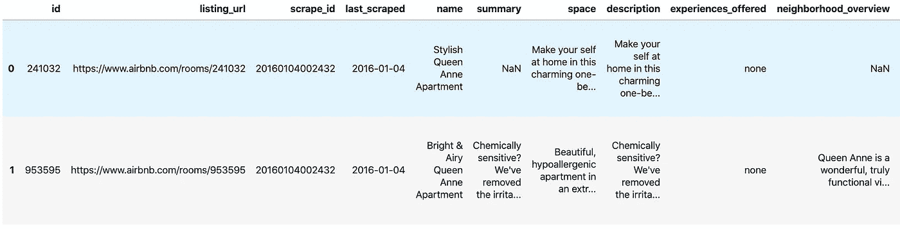
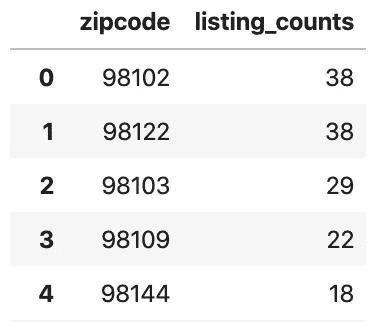
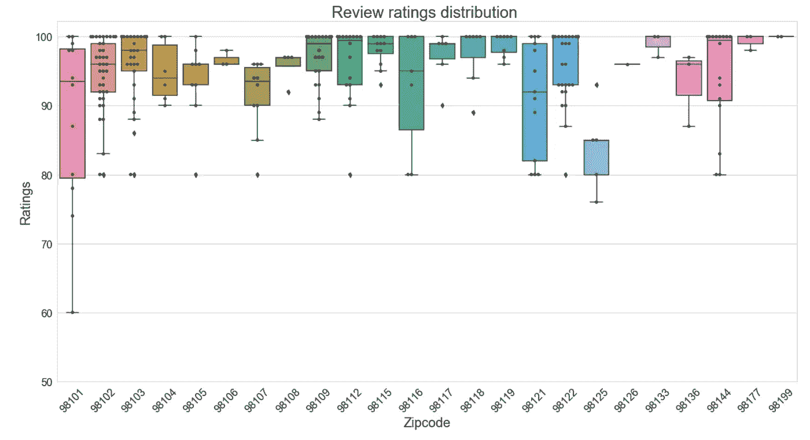
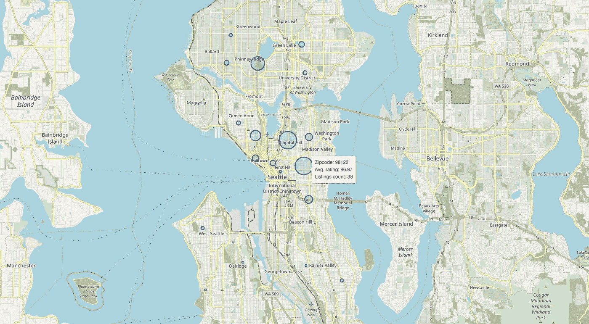
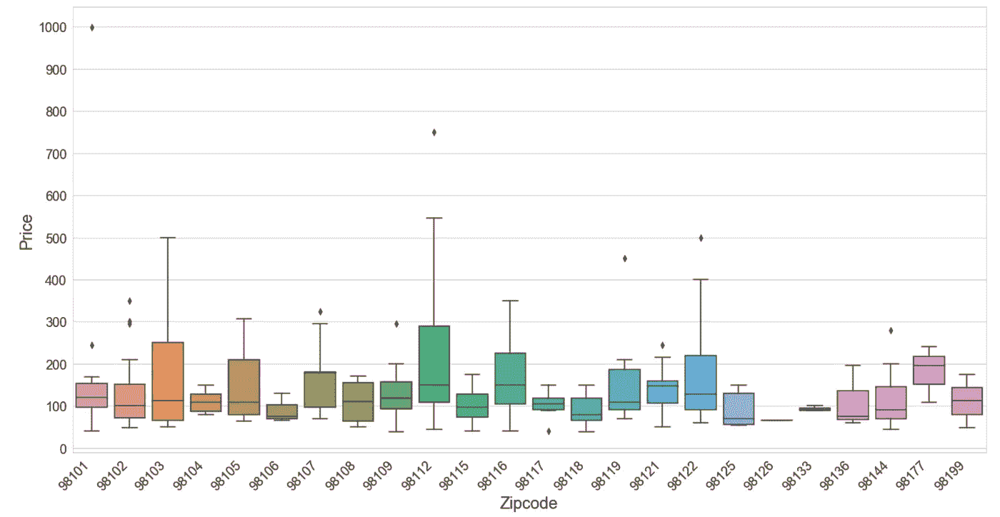
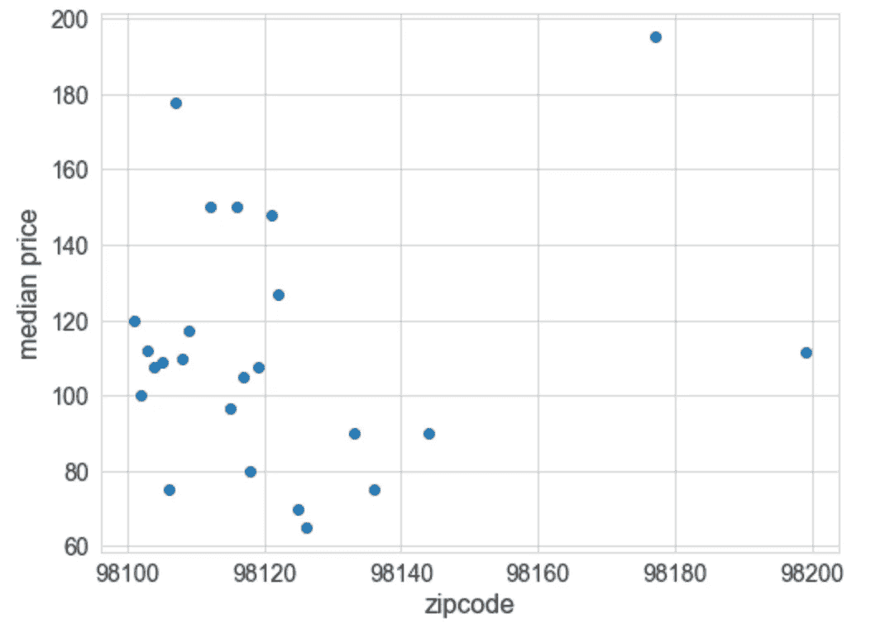
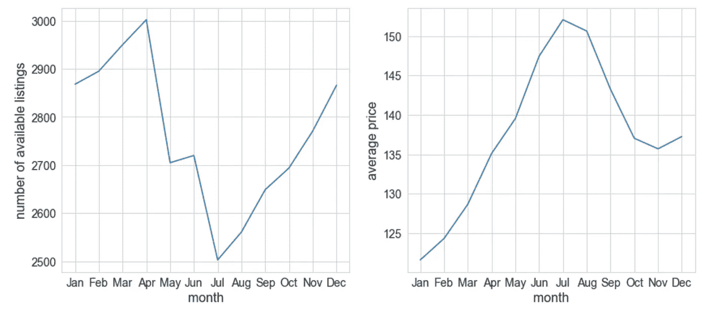

# 西雅图的 AirBnB 房屋:数据驱动的外观

> 原文：<https://towardsdatascience.com/airbnb-homes-in-seattle-a-data-driven-look-aac490f8ec4c?source=collection_archive---------35----------------------->

## 分析受欢迎程度、需求和价格。


来源:[谷歌图片](https://www.google.com/url?sa=i&url=https%3A%2F%2Fwww.toutsurmesfinances.com%2Fimmobilier%2Flocation-airbnb-a-paris-des-prix-differents-du-marche-classique.html&psig=AOvVaw3-CBYURbS9dcUgMeZgUIGc&ust=1586700668967000&source=images&cd=vfe&ved=0CAIQjRxqFwoTCLCLiM7T4OgCFQAAAAAdAAAAABAJ)

# **简介**

过去几年来，AirBnB 对现有的酒店公司构成了严重威胁。2018 年，AirBnB 在美国的[市场份额](https://secondmeasure.com/datapoints/airbnb-sales-surpass-most-hotel-brands/)在 18%左右。AirBnB 的多功能性，从在大城市市区租房到在树林里租树屋，使它成为如此大的竞争对手。

在本帖中，我们将看看西雅图的 AirBnB 房源。在这个分析中使用了两个主要数据集:**列表数据**，关于西雅图的 3818 个列表的信息，以及**日历数据**，给出一年中所有列表的每日可用性。数据集可以从 [kaggle](https://www.kaggle.com/airbnb/seattle) 下载。


照片由[Tj·霍洛韦丘克](https://unsplash.com/@tjholowaychuk?utm_source=unsplash&utm_medium=referral&utm_content=creditCopyText)在 [Unsplash](https://unsplash.com/collections/3825719/airbnb?utm_source=unsplash&utm_medium=referral&utm_content=creditCopyText) 上拍摄

在对数据进行初步评估后，我遇到了三个问题，激发了我的兴趣:

> 西雅图什么街区最受欢迎？
> 
> 这些地段的房源租金分布如何？
> 
> 一年中去西雅图最忙的时候是什么时候？在这段时间里，价格是如何变化的？

所有用于分析的代码都可以在 GitHub 上公开获得。

# 入门指南

## 加载数据

所有数据文件都是逗号分隔值(CSV)格式。使用 [pandas](https://pandas.pydata.org/) 可以很容易地将它们加载到数据帧中。`calendar_df`文件的输出如下所示:

```
listing_id        date available   price
0      241032  2016-01-04         t  $85.00
1      241032  2016-01-05         t  $85.00
2      241032  2016-01-06         f     NaN
3      241032  2016-01-07         f     NaN
4      241032  2016-01-08         f     NaN
```

这需要稍微解释一下:`available` 列只包含两个值:`t`或`f`，分别代表“真”或“假”，它显示一个列表何时可用或不可用。另外，`price` 列中的很多值为空。这是因为当一个列表变得不可用时，它的价格就变成了`NaN`(不是一个数字)。

同样，`listings_df`文件有关于清单的详细信息:



listings.csv 文件中的示例内容

## 数据准备

`calendar`和`listings`数据帧的`price`列都有一个字符串数据类型，很难进行算术运算。为了进一步分析，我们必须将其转换为数值数据类型。

现在，检查数据帧是否缺少值:

```
id                        0
zipcode                   7
latitude                  0
longitude                 0
number_of_reviews         0
review_scores_rating    647
property_type             1
room_type                 0
bathrooms                16
bedrooms                  6
availability_30           0
availability_60           0
availability_90           0
availability_365          0
price                     0
```

正如我们所看到的，有几列缺少值。在回答我们最初的问题之前，处理它们是很重要的。

我们发现值为`review_scores_rating`的列表没有评论。这是有道理的，因为评级是基于评论的。这些列表对于我们的案例来说不是很有趣，所以我们将删除它们。

`zipcode`列有 7 个`NaN`值。我们可以删除它们，但让我们尝试使用所谓的**反向地理编码来获取这些位置的邮政编码值。**我们将使用`latitude`和`longitude`的值来获得`zipcode` *的值(我们跳过了这个细节以避免跑题，但感兴趣的读者可以在*[*GitHub*](https://github.com/LakshyaMalhotra/data-analysis-projects/tree/master/analyzing-seattle-airbnb)*repo 中看到)。*

所有其他列缺少的值并不重要，因为我们无论如何都不会使用这些列值。

现在，随着数据清理的进行，我们可以专注于分析了。

## **问题 1:西雅图的哪些街区最受欢迎？**


照片由[奥克](https://unsplash.com/@jetcityninja?utm_source=medium&utm_medium=referral)在 [Unsplash](https://unsplash.com?utm_source=medium&utm_medium=referral) 上拍摄

虽然一个列表的受欢迎程度取决于很多因素，如物业类型、位置、提供的便利设施、价格等。我的流行度标准基于两件事:一个是一年至少三个季度不可用的列表，另一个是评论评级高的列表。现在，我对至少 9 个月不可用的标准有点模糊，因为这可能有几个原因，如主机在列表中进行*翻新*或主机不可用于维护列表。更好的标准是查看`availability_30`、`availability_60`、`availability_90`和`availability_365`列的可用性百分比。这些列分别给出了 30 天、60 天、90 天和 365 天中列表可用的天数。

根据可用性检查过滤后的`features_df`



每个街区的列表数量

正如我们所料，在 30、60、90 和 365 天内至少有 70%不可用的列表通常具有较高的总体评分。这意味着尽管有许多其他因素在起作用，但我们的标准或多或少是正确的。

要找到最受欢迎的列表，我们需要两件东西:一个是给定邻域中的列表数量，另一个是正确代表该邻域列表评级的单一聚合指标。下图显示了不同邮政编码的评级分布情况:



从上面的方框图可以清楚地看出，除了 7 个评级(满分 275 分)之外，所有评级的得分都至少为 80%。几乎全部的中值都在 90%以上。因此，用某种度量来聚合这些值是有意义的。我们将使用平均值，因为它会比使用中位数更严格一些。在使用 mean 作为聚合并将列表按邮政编码分组后，现在它们可以显示在地图上了。



[将](https://nbviewer.jupyter.org/github/LakshyaMalhotra/data-analysis-projects/blob/master/analyzing-seattle-airbnb/seattle_airbnb.ipynb)链接到互动地图

## 问题 2:这些地点的房源租金分布如何？



用邮政编码分配租金



在上面的图中，有几个租金超过 400 美元的离群值。我们会尽力找出这些房源是什么样的。但首先，让我们来计算这些位置的中间价格。

正如我们在左边看到的，中间价格变化很大，但主要集中在 80-120 美元之间。

大多数标价超过 400 美元的房源都是至少有 3 间卧室和 2 间浴室的整栋房子，这也解释了为什么它们会这么贵。然而有一个例外，那只是一套公寓，却是最贵的一套(1000 美元)。让我们来看看:


这个列表最贵是有道理的——它位于市中心，非常靠近城市的所有主要景点。

## 问题 3:一年中去西雅图最忙的时候是什么时候？

找出最繁忙的访问时间可以通过每月检查列表的可用性来完成。为了实现这一点，我们需要从`calendar_df`的`date`列中获取月份，然后应用 pandas datetime 操作。



正如我们所看到的，夏季尤其是七月、八月是游览西雅图最繁忙的时候，而可供选择的景点却最少。此外，由于需求旺盛，这几个月的挂牌价格最为昂贵。

# 结论

在这篇文章中，我们查看了来自西雅图的 AirBnB 数据，以了解三个主要的兴趣领域:人气、需求和价格。

虽然有许多因素被忽略了，但它仍然揭示了一些真正有趣的见解。

分析的主要要点如下:

*   大多数房源位于市中心附近，其中位于邮政编码为 98102 和 98122 的房源最受欢迎。一般来说，他们的评分非常高，达到 90%的评分。
*   大多数地点的房源价格在 80-120 美元之间。
*   夏季的几个月，特别是七月和八月，是去西雅图的高峰期，平均租金高达 150 美元。

这种分析有很大的扩展范围，包括:

*   评论的情绪是否正确地代表了总体评分？
*   还有哪些因素增加了房源的受欢迎程度，它们如何影响房源的价格？
*   价格的时间序列预测以及它们与来自 [AirBnB](http://insideairbnb.com/seattle/) 的最新数据的吻合程度如何？