# Airbnb-A 部分(Python-可视化、比较研究、回归)

> 原文：<https://towardsdatascience.com/airbnb-part-a-python-visualization-comparative-study-regression-7466c0cb5a1d?source=collection_archive---------25----------------------->

> 通过与华盛顿 DC 的对比研究、回归模型、互动地图
> 和自然语言处理，分析了西雅图 Airbnb 的情况。向市议会和旅行者提出建设性的建议

**形象由** [**甘万尼**](https://unsplash.com/photos/o4ktwpTEQso) **和** [**哈罗德·门多萨**](https://unsplash.com/photos/6xafY_AE1LM) **上的 Unsplash**

**B 部分:**可以在[这里找到](https://medium.com/@tuonggreenager/airbnb-part-b-python-interactive-map-natural-language-processing-48d472f14da3)

自 2008 年以来，Airbnb 帮助客人和主人以更独特、更个性化的方式旅行。该公司从一个出租的充气床垫发展到价值超过 300 亿美元的全球合作，这都要归功于其精力充沛的创始人布莱恩·切斯基。2020 年应该是 Airbnb 的黄金年，因为它将上市并发行世界上最受追捧的股票。悲剧的是，冠状病毒发生了。旅游业被疫情摧毁了。Airbnb 现在面临着烧钱、愤怒的房东和不确定的未来，因为 2000 名员工可能会被解雇，还有数十亿美元的高利率债务，这些债务是为了偿还客户而建立的。[(研，2020)](https://www.wsj.com/articles/airbnbs-coronavirus-crisis-burning-cash-angry-hosts-and-an-uncertain-future-11586365860)

尽管如此，随着六月的到来，情况开始好转。Airbnb 报告称，5 月 17 日至 6 月 3 日期间，美国房源的预订量超过了去年同期。在成功抗击病毒的国家，如德国、葡萄牙、韩国和新西兰，国内旅游也有类似的增长。像 Expedia 和 Booking.com 这样的其他公司也见证了国内度假租赁预订的激增。几个月来被压抑的需求导致夏季预订热潮，因为越来越多的人希望逃离他们的家庭冠状病毒避难所。现在，Airbnb 的房源比危机前更多，主要集中在传统的度假租赁市场，美国的顶级目的地。它们是南加州的大熊湖、田纳西-北卡罗来纳边境的烟雾山和德克萨斯州的阿兰萨斯港。[(卡维尔，2020)](https://www.latimes.com/business/story/2020-06-07/airbnb-coronavirus-demand) 尽管如此，任何反弹都来自一个非常低的基数，切茨基在 5 月份的电话会议上表示，他预计今年的收入将达到 2019 年上半年的水平。他说，今年上市仍是一个选择，但他将等待市场稳定下来，然后再做出最终决定。

作为一名之前接受过培训、现居住在西雅图的酒店经营者，我想分两部分做一个关于西雅图 Airbnb 现状的分析项目。第一部分是对西雅图和 DC 华盛顿州两个城市的比较研究。西雅图和华盛顿 DC 地区位于美国的两端，因为不同的原因而广为人知:分别是科技和文化中心与政治中心。此外，它们拥有相似的人口规模(刚刚超过 700，000)和多个列表(8740 和 9369)。然后，在第二部分，我们将从政府立场和游客的角度更深入地了解西雅图的市场，并推荐不仅有利于 Airbnb，还有利于这座城市及其市民的解决方案

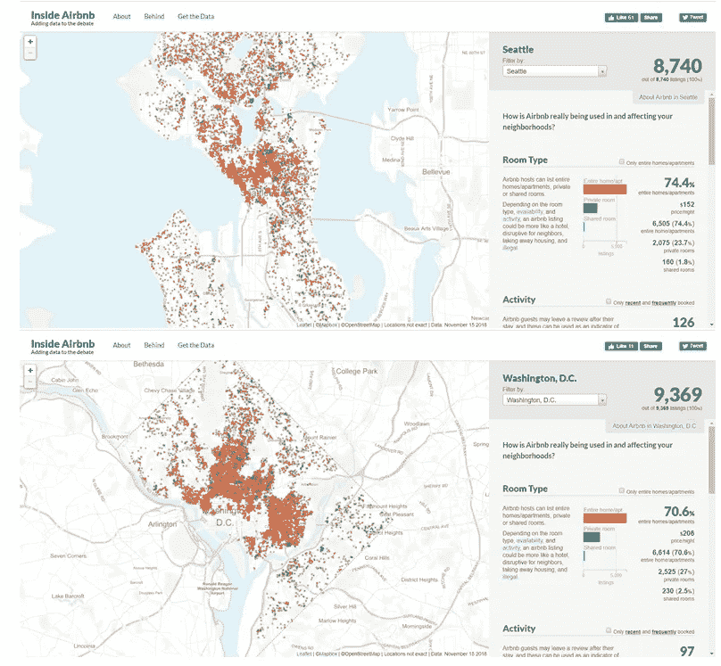

[**Airbnb 开放数据集**](http://insideairbnb.com/get-the-data.html)

数据集可以在 Airbnb 开放数据源下载。它们包括

***清单*** *:* 详细清单数据

***清单 _ 详细信息:*** 清单的汇总信息和指标

***点评*** *:* 详细点评

***reviews _ details:***汇总评论数据和列表 ID(便于基于时间的分析和链接到列表的可视化)。

***日历:*** 详细日历

***邻居* :** 地理过滤器的邻居列表。来源于城市或开源 GIS 文件。

***neighbors . geojson*:**城市的街区 geo JSON 文件。

数据集获取于 2020 年 4 月 23 日。西雅图有 7237 个值，而华盛顿 DC 有 9342 个值

# **I/数据探索**

当我们导入两个城市的“listings”数据集时，我们将 encoding='latin1 '指定为参考，以避免遇到 UnicodeDecodeError 错误:“utf-8”编解码器无法解码错误。所有西雅图的相关数据集将被命名为“sl ”,而 WashingtonDC 有“wl”。然后，我们就从数据准备部分开始。“列表”数据集有三个步骤。

***第一步:*** 通过一个函数运行两个数据集，清洗所有数值数据。为了解决这个问题，它包括多个子功能:从两个数据集(访问、交互、house_rules 等)中识别所有我们不需要的不相关因素。)，删除所有只有唯一值的列，如 id 或 url 链接(ID、listings_url 等。)，添加另一个用于审核的列，将所有“价格”列转换为数字，将所有百分比列转换为浮点数，生成新的审核指标，并删除原始审核列

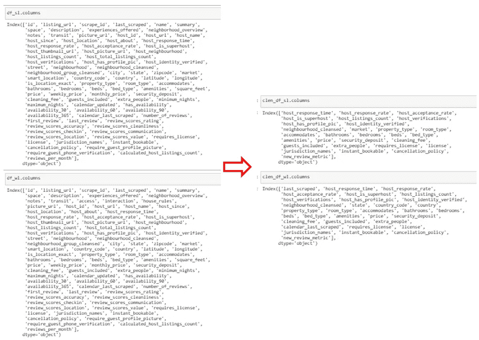

**(图片作者)**

***第三步:**从两个城市的“列表”数据集中检查定量信息。由于 Seattle 的“listings”的干净版本与 Washington DC 的“listings”相比具有更少的列，分别为 29 和 33，我们将检查哪个列出现在一个表中而没有出现在另一个表中:*

*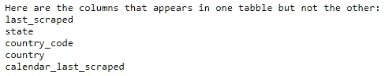*

***(图片作者)***

# ***II/可视化和回归分析***

## ***1)****AirBNB homes 房产对东西海岸的房价有什么影响？***

*从各自的角度来看，西雅图和华盛顿 DC 的价格区间有很大差异，前者比后者差得多。西雅图的房间价格最高只能达到 1200 美元/晚，而华盛顿 DC 最贵的房间价格是这个数字的两倍多(3000 美元/晚)。除了精品酒店是西雅图和华盛顿 DC 最昂贵的酒店之一，西雅图的飞机乘客喜欢住在法律和别墅，而那些访问华盛顿 DC 的人更喜欢入住酒店而不是其他类型的酒店。同样值得一提的是，西雅图所有房地产类型的价格波动都较大。这意味着您可以选择经济或奢侈的方式在翡翠城逗留。然而，如果我们看得更近一点，我们会发现其他类型的房地产价格，如住宅、公寓、宾馆，无论位置如何，价格都在 100-200 美元/晚之间。因此，旅行者在 Airbnb 上预订时不会注意到两个城市之间不成比例的价格区间差异。*

*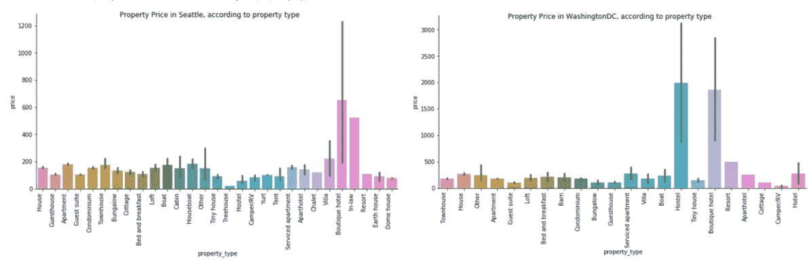*

***(图片作者)***

*在西雅图，旅行者更喜欢拥有一张真正的床，或者至少是一张折叠沙发，用于整个家庭、私人房间和酒店房间，这解释了为什么它们是这些类别中最贵的床。令人惊讶的是，在合住客房类别中，客人的期望大幅下降，其中大多数人对充气床垫感到满意，尽管与所有其他房间类型中的其他床类型相比，充气床垫可能同样昂贵(最多 500 美元/晚)。这种奇怪现象的一个原因是大量的季节性节日集中在艺术、文化、音乐等方面。整个夏天。 [(Bell et al .，2019)](https://www.thestranger.com/things-to-do/2019/07/17/40789078/46-festivals-to-check-out-in-seattle-this-weekend) 参与者往往是 20-30 岁，适应性更灵活，因此，在旺季共用房间里昂贵的充气床垫总比没有住宿好。相反，在 DC 的华盛顿州，除了酒店房间，充气床垫是所有房产类型中的首选。西雅图和华盛顿 DC 的床类型的价格范围没有区别，而后者的酒店房间的真正的床比前者(平均约 200 美元/晚)贵两倍(平均 600 美元/晚)，并且分布更稀疏(50-1200 美元/晚)*

*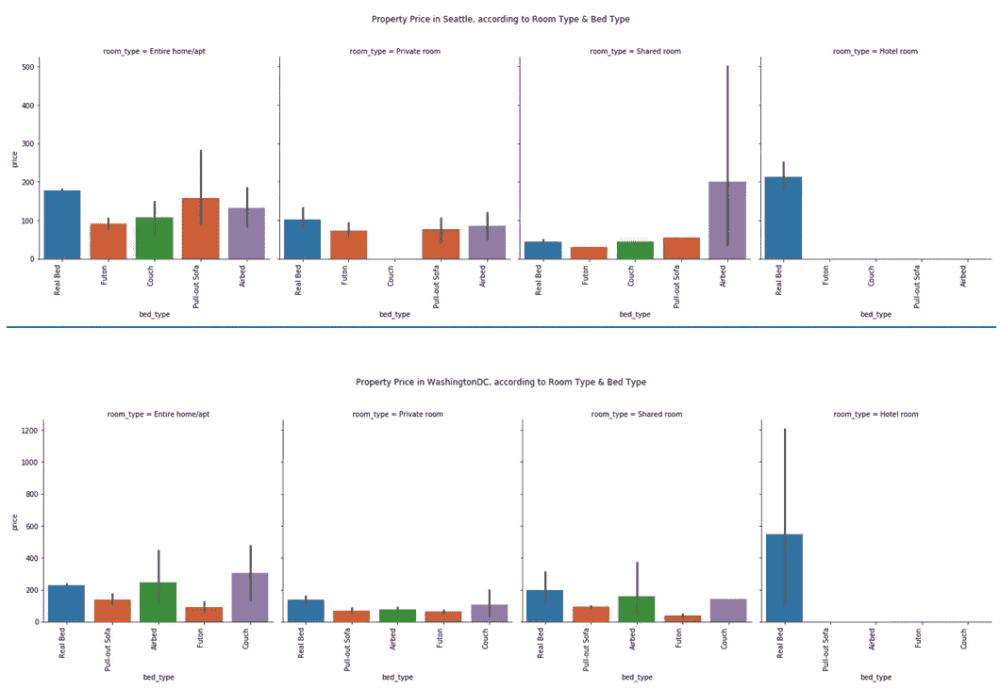*

***(图片作者)***

*一般来说，床的数量和浴室的数量是正相关的，客人需要的床和浴室的数量越多，价格越高。然而，在达到一定数量的床(11)和浴室(6-6.5)后，相关性就变成了负的。因此，我们可以假设，因为有规定，任何预订超过 12 张床或 6 个浴室的客人将获得团体折扣。西雅图的床位和价格之间的关系比 DC 的华盛顿稳定且分布均匀。根据上述城市热爱节日的原因，人们可以相信，当在一次入住中接待大量客人时，当地的酒店经营者和主人会更加熟悉。同样重要的是，与床相比，浴室对价格变化的影响更大。分布负向偏左，分布不均匀，因为有少量波动。例如，在西雅图，4.5- 5 间浴室的价格从 600 美元/晚下降到 100 美元/晚，然后反弹到 1000 美元/晚。*

*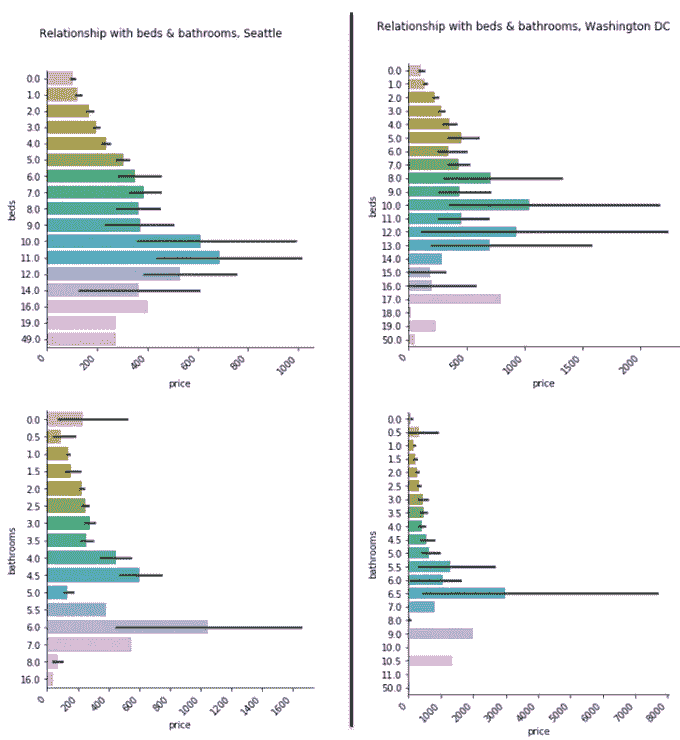*

***(图片作者)***

*另一方面，在西雅图和华盛顿 DC，卧室和住宿与价格的相关性是严格正的，左偏的。这些价格范围也彼此相似，客房为 100-2000 美元/晚，住宿类为 100-800 美元/晚。有趣的是，西雅图最多有 8 间卧室，而在华盛顿 DC 是 27 间，西雅图最多有 25 间，而在华盛顿 DC 是 16 间。我们可以得出结论，那些去西雅图过夏季节日的人只需要在再次出门前洗个澡，而不是呆在家里，所以他们不介意睡在合租公寓里不舒服的充气床上。这种现象表现为 7 至 8 间卧室的房间价格猛增 600 美元。*

*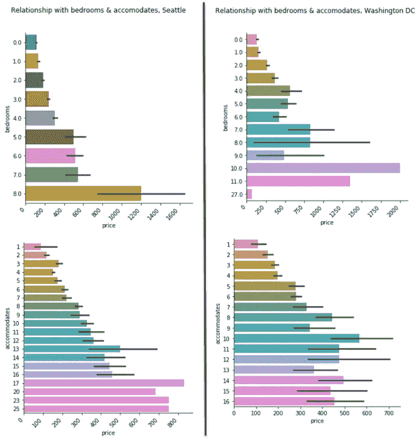*

***(图片作者)***

## ***2)** 哪些房东的行为或资料会影响东西海岸 AirBNB 房客的评论？*

*为了回答这个问题，我们将创建热图来展示 Airbnb 在每个城市的评论和行为特征之间的相关性。有四个步骤*

****步骤 1:*** 将所有六个分类列转换为虚拟变量，以进一步对它们进行评估:“host_response_time”、“host_has_profile_pic”、“host_identity_verified”、“host_is_superhost”、“instant_bookable”、“cancellation_policy”*

****第二步:*** 将虚拟变量列合并在一起*

****第三步:*** 只需从组中只保留促成行为相关的相关因素列。有些因子内部有大量的值，因此我们还需要剔除一些最多余的值，如“一周内的主机响应时间”，因为它们仅适用于少数数据集。*

****步骤 4:*** 使用 seaborn.heatmap()函数创建西雅图和华盛顿州 DC 的热图*

*对于西雅图的 Airbnb 来说，相关性相对较低，最高的是‘host _ is _ super _ host’和‘new _ review _ metric’之间的 0.39。这意味着你的列表的审核分数取决于该主机是否是西雅图的超级主机。另一方面，华盛顿 DC 的 Airbnb，积极方面的相关性相对较高，消极方面的相关性类似，最高的是“主机 _ 响应 _ 速率”和“主机 _ 接受 _ 速率”之间的 0.55。这意味着，如果华盛顿 DC 的主人阅读了你的信息，他/她有 55%的几率会接受你的 Airbnb 预订请求。*

*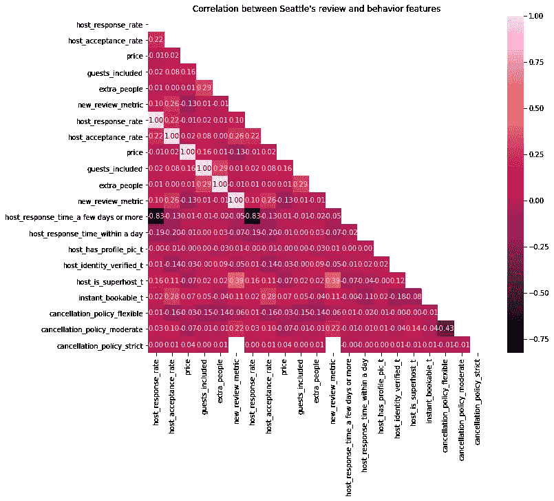*

***(图片作者)***

*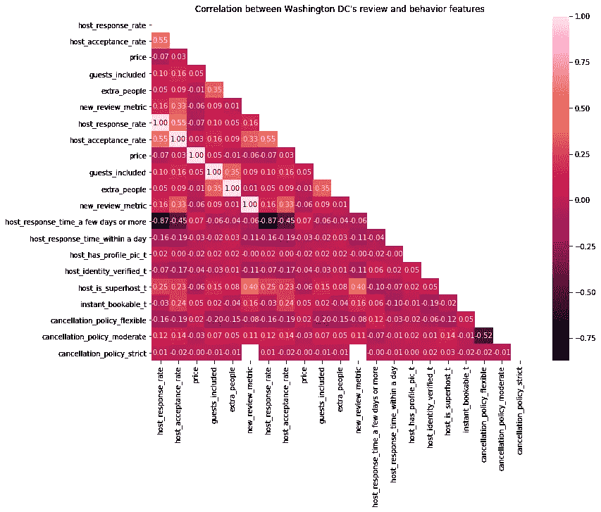*

***(图片作者)***

## ***3)****AirBNB 房源哪个是点评中最重要的一个？——【回归分析】***

*为了了解各种因素如何影响最终评审分数，我们将借助随机森林方法进行回归分析研究，然后举例说明。数据预处理包括:删除不相关的变量和缺少评论值的行，用它们的平均值填充缺少的数字列，为分类变量创建哑元。x 是所有独立因素，而 y 以“new_review_metric”作为因变量，并以 0.75/0.25 的比率拆分这些数据表。对于回归变量，我们将使用(n_estimators=100，criterion='mse '，random_state=42，n_jobs=-1。最终的模型精度和验证如下。结果彼此非常相似，均方误差较低，R2 较高，这表明预测值和可用因变量之间的差异很小，我们可以解释超过 90%的观察到的变化可以通过模型的输入来解释。*

*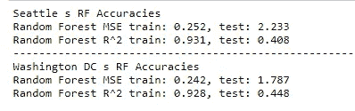*

***(图片作者)***

*在独立特征对评论的重要程度的可视化中，我们可以看到，与西雅图相比，在华盛顿 DC 的第一和第二高度重要特征之间存在更大的差异。此外，在预订 Airbnb 时,“女王城市”的游客更重视主人本身的质量，而不是酒店或房间，这与美国首都的模式相反。西雅图的“价格”排名也较低，这是因为如上所述，该城市的平均租赁价格适中。*

*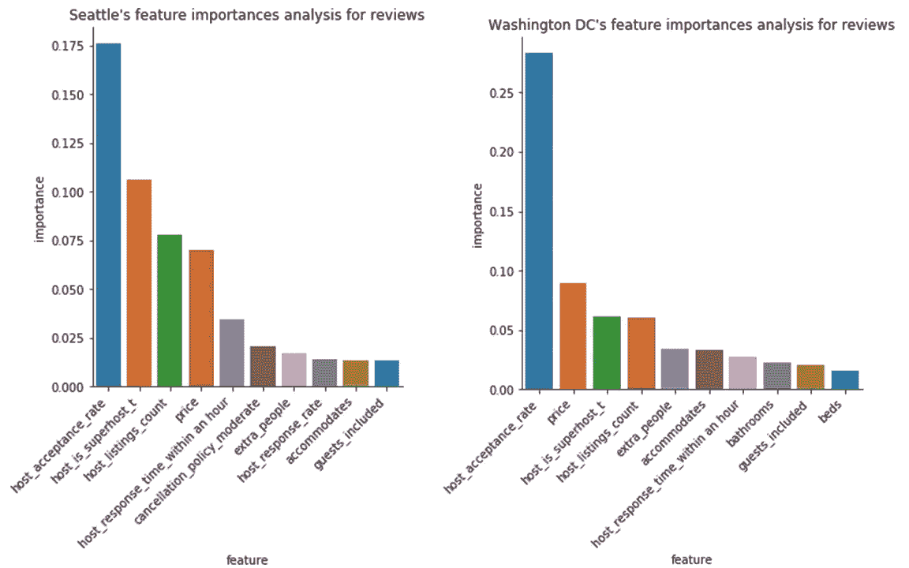*

***(图片作者)***

> ******待续 B 部分** ****

***Github:**[https://Github . com/lukastuong 123/Python-Projects/tree/master/Project-%20 Airbnb % 20(Python-% 20 interactive % 20 map % 2C % 20 自然% 20 语言% 20 处理% 2C % 20 比较% 20 研究% 2C % 20 回归)](https://github.com/Lukastuong123/Python-Projects/tree/master/Project-%20Airbnb%20(Python-%20Interactive%20Map%2C%20Natural%20Language%20Processing%2C%20Comparative%20Study%2C%20Regression))*

***参考&来源:***

***贝尔，j .，弗里德曼，e .，塞尔林，k .，&泽尔曼，J.** (2019 年 7 月 17 日)。本周末，西雅图地区将举办 46 个节日。陌生人。[https://www . the strange . com/things-to-do/2019/07/17/40789078/46-festivals-to-check-out-in-Seattle-this-weekend](https://www.thestranger.com/things-to-do/2019/07/17/40789078/46-festivals-to-check-out-in-seattle-this-weekend)*

***奥卡维尔** (2020 年 6 月 8 日)。Airbnb 发现度假租赁需求激增。洛杉矶时报。[https://www . latimes . com/business/story/2020-06-07/Airbnb-冠状病毒-需求](https://www.latimes.com/business/story/2020-06-07/airbnb-coronavirus-demand)*

***研，K.** (2020 年 4 月 8 日)。 *Airbnb 的冠状病毒危机:烧钱、愤怒的主机和不确定的未来*。华尔街日报。[https://www . wsj . com/articles/airbnbs-coronavirus-crisis-burning-cash-angry-hosts-and-an-uncertainty-future-11586365860](https://www.wsj.com/articles/airbnbs-coronavirus-crisis-burning-cash-angry-hosts-and-an-uncertain-future-11586365860)*

*— — —*

***数据集:**http://insideairbnb.com/get-the-data.html*

***灵感来源:**[https://www . ka ggle . com/Xi chenlou/Seattle-and-Boston-Airbnb-data-comparison](https://www.kaggle.com/xichenlou/seattle-and-boston-airbnb-data-comparison)*