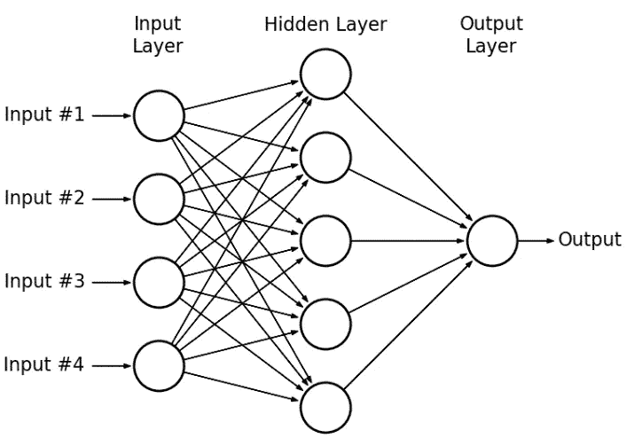

# Airbnb 价格预测:多层感知器与 TensorFlow 的 Keras API

> 原文：<https://towardsdatascience.com/airbnb-price-prediction-multilayer-perceptrons-with-tensorflows-keras-api-9096e7d0c340?source=collection_archive---------32----------------------->

## 这个项目是我在深度学习领域的第一步，使用 TensorFlow 和 Keras 开发了一个回归模型，能够尽可能低地用 MAE 进行价格预测。


泰勒·维克在 [Unsplash](https://unsplash.com?utm_source=medium&utm_medium=referral) 上的照片

# **语境**

当我在希望成为数据科学家的旅程中第一次遇到深度学习时，它是一个难以消化的领域。我最初之所以偏见地假设它令人困惑的复杂性，是因为这一领域的潜在逻辑和机制。然而，在花了一些时间来吸收深度学习的巨大适用性，特别是神经网络之后，我开始对利用它来解决数据科学问题产生兴趣。

在进入这个项目之前，我想提请注意机器学习和深度学习之间的激烈比较*这可能已经闪过我们的脑海，至少一次。本质上，当机器学习使用算法解码中到大规模的数据来做出决策时，深度学习创建了多层神经网络，需要更长的时间来训练，以产生更高精度的模型。*

*如果你热衷于尝试深度学习，请随意查看 Kaggle [在此](https://www.kaggle.com/stevezhenghp/airbnb-price-prediction)公开分享的数据集，并关注以下内容。*

# *1.解释数据分析*

**作为一名数据分析师/数据科学家，在数据可用于建模之前，我们 70%的时间都花在了数据清理和准备上。**

```
*import pandas as pd
import numpy as np
import matplotlib.pyplot as plt
import seaborn as snsdf = pd.read_csv("airbnb-price-prediction.csv")df.head()*
```

**

***注意** : *由于本文的重点是开发神经网络模型，我将只介绍 EDA 中的重要操作，但是您可以在本文末尾的 Github 库中查看完整的 EDA。**

*在加载数据集后，立即给我留下深刻印象的是“便利设施”变量，它嵌入了每行的非结构化值。如果它被构造成一个 JSON 字段，对我们来说将它展平并将每个子变量解析到不同的列中会更容易。然而，根据我的观察，该变量包括每个列表的不同娱乐项目，因此为了使其更有用，我决定**格式化值并合并唯一的值**以计算每个列表的娱乐项目占总数的百分比:*

```
*df.amenities = df.amenities.map(lambda x: "|".join([i.replace("}", "").replace("{", "").replace('"', "") for i in x.split(",")])df.amenities = df.amenities.map(lambda x: x.split("|")*
```

**

*df.map()*

```
*amenities_list = list(np.unique(np.concatenate(df.amenities))[1:-2])*
```

**

*唯一的()*

```
*df['amenities_percentage'] = df.amenities.apply(lambda x: len(x)/len(amenities_list)*100)*
```

*然后，我继续进行**检查是否有空值**来删除或填充实际值:*

```
*df_new.isna().sum()#Removing null values that would not help the modellingdf_new = df_new[df_new.bathrooms.notna()]
df_new = df_new[df_new.bedrooms.notna()]
df_new = df_new[df_new.beds.notna()]
df_new = df_new[df_new.host_since.notna()]#Fill null values with actual valuesdf_new.host_response_rate = df_new.host_response_rate.fillna("0%")
df_new.review_scores_rating = df_new.review_scores_rating.fillna(0)*
```

*此外，正如我们可能都知道的，异常值对建模过程相对敏感，所以我们应该**小心地处理异常值**(移除或转换)，以便模型可以更有效地学习数据。*

**

*sns.boxplot(df_new.price)*

*由于价格变量遵循高斯分布，我们将创建一个函数来移除超出固定范围的异常值:*

```
*from numpy import mean
from numpy import stddef remove_outliers(x):
    data_mean = mean(x)
    data_std = std(x)
    cutoff = data_std*3
    lower = data_mean - cutoff
    upper = data_mean + cutoff
    return lower, upperlower, upper = remove_outliers(df_new.price)df_new = df_new.loc[(df_new.price > lower) & (df_new.price < upper)]*
```

# *2.特征工程和缩放*

**类似于机器学习的建模，特征工程有助于预处理和转换原始数据集为更易消化的数据集，以训练模型。**

**

*df.head()*

*除了那些数字变量，我们需要转换模型可以理解和学习的分类变量。简而言之，我们将对二进制和多类变量分别应用不同的技术:**标签编码器和 OneHotEncoder** 。然而，在进行任何预处理步骤之前，我们 ***必须始终将数据集分为训练集和测试集*** ，以避免建模期间的数据泄漏。*

```
*from sklearn.model_selection import train_test_splitx = df_new.iloc[:, 1:-1]
y = df_new.iloc[:, -1]x_train, x_test, y_train, y_test = train_test_split(x, y, test_size = 0.3, random_state = 42)*
```

*然后，我们为转换导入标签编码器和 OneHotEncoder:在训练集上拟合并在两者上转换。*

```
*from sklearn.preprocessing import LabelEncoder, OneHotEncoder**#Binary variables**le = LabelEncoder()binary_var = ['cleaning_fee', 'host_has_profile_pic', 'host_identity_verified', 'instant_bookable']for i in binary_var:
    le.fit(x_train[i])
    x_train[i] = le.transform(x_train[i])
    x_test[i] = le.transform(x_test[i])**#Multi-category variables**oe = OneHotEncoder(sparse=False, handle_unknown = 'error')oe.fit(x_train[['property_type', 'room_type', 'bed_type', 'cancellation_policy', 'city']])#Transform the train setmulti = oe.transform(x_train[['property_type', 'room_type', 'bed_type', 'cancellation_policy', 'city']])
df_multi = pd.DataFrame(index = x_train.index, data=multi, columns=oe.get_feature_names(['property_type', 'room_type', 'bed_type', 'cancellation_policy', 'city']))
x_train = pd.concat([x_train, df_multi], axis=1)
x_train.drop(columns=['property_type', 'room_type', 'bed_type', 'cancellation_policy', 'city'], inplace=True)#Transform the test setmulti_test = oe.transform(x_test[['property_type', 'room_type', 'bed_type', 'cancellation_policy', 'city']])
df_multi_test = pd.DataFrame(index = x_test.index, data=multi_test, columns=oe.get_feature_names(['property_type', 'room_type', 'bed_type', 'cancellation_policy', 'city']))
x_test = pd.concat([x_test, df_multi_test], axis=1)
x_test.drop(columns=['property_type', 'room_type', 'bed_type', 'cancellation_policy', 'city'], inplace=True)*
```

*此外，由于每个变量都有不同的数据范围，我们需要对独立变量进行缩放，以便模型可以更快、更有效地学习数据。在这种情况下，我选择了**最小最大缩放器**将数据压缩到(0，1)的范围内，这对我们将在下一节中使用的算法很有用:*

```
*from sklearn.preprocessing import MinMaxScalermn = MinMaxScaler()x_train_scaled = pd.DataFrame(mn.fit_transform(x_train), columns = x_train.columns)
x_test_scaled = pd.DataFrame(mn.fit_transform(x_test), columns = x_test.columns)*
```

*好了，我们都准备好了！*

# *3.神经网络建模*

**什么是神经网络，为什么我们需要同时结合建模和优化？**

*在进入什么是神经网络之前，我想强调一下我们不能停留在建模阶段的惯例；更确切地说， ***这是一个建立模型和测试不同参数*** 的连续过程，以产生最高精度的模型。*

*回到神经网络的概念，简而言之:*

> *神经网络是一系列算法，通过模拟人脑运行方式的过程，努力识别一组数据中的潜在关系。——投资媒体。*

*如果你想更深入地了解这个概念，请点击这里查看 3Blue1Brown [的一系列视频，这些视频对神经网络的底层项目提供了全面的解释。](https://www.youtube.com/watch?v=aircAruvnKk&list=PLZHQObOWTQDNU6R1_67000Dx_ZCJB-3pi)*

*在深度学习中，特别是神经网络，我们使用 3 种常见的标准模型来进行预测:**多层感知器(MLP)** 、**卷积神经网络(CNN)** 和**递归神经网络(RNN)** 。对于这个项目，我已经从 MLP 开始，以获得深度学习的基本概念，但请关注我即将开展的项目，这些项目用更先进的模型解决数据科学问题。*

*那么，MLP 到底是什么，它在预测方面做了什么？*

*根据定义，*

> *多层感知器模型，简称 MLP，是一个标准的全连接神经网络模型。它由节点层组成，每个节点连接到前一层的所有输出，每个节点的输出连接到下一层节点的所有输入。—Machinelearningmastery.com*

*为了更容易可视化，*

**

*图片来源:ResearchGate*

*TensorFlow 和 Keras 是一个开源库，能够执行深度学习中的各种任务，即回归和分类。由于其复杂性，需要遵循几个步骤:*

1.  *定义模型*
2.  *编译模型*
3.  *符合模型*
4.  *评估模型*
5.  *做一个预测*

*为了更详细地解释，让我们看一下 MLP 模型的全步骤实现，如下所示:*

```
*from tensorflow.keras import Sequential
from tensorflow.keras.layers import Dense, Dropout
from tensorflow.keras.callbacks import EarlyStopping**#Step1\. Define the model**model = Sequential()model.add(Dense(16, activation = 'relu', kernel_initializer = 'he_normal', input_shape = (x_train_scaled.shape[1],)))
model.add(Dense(8, activation = 'relu', kernel_initializer = 'he_normal'))
model.add(Dense(1))**#Step2\. Compile the model**model.compile(optimizer = 'adam', loss = 'mse', metrics = 'mae')**#Step3\. Fit the model**history = model.fit(x_train_scaled, y_train, validation_data=(x_test_scaled, y_test), epochs=50,batch_size=64, verbose=0)**#Step4.1 Evaluate the model**loss, mae = model.evaluate(x_test_scaled, y_test)**#Step4.2 Plot the learning curve**plt.plot(history.history['loss'], label='train')
plt.plot(history.history['val_loss'], label='val')
plt.show()*
```

*(1)-定义模型:*

*   ***模型类型**:我们可以从 TensorFlow 中选择**顺序或功能模型 API** 。虽然顺序模型是实现起来最简单的模型，它以线性方式提供了一个一层接一层的“顺序”路径，但是功能模型是一个更复杂且更灵活的模型，它需要我们手动指定输入和输出层。*
*   ***节点数量**:这取决于你希望你的模型有多复杂。没有“一刀切”的选择，而是我们需要测试和学习，看看每层有多少节点产生最高的准确性。*
*   ***激活**:对于每层中的每个节点，神经网络计算输入的加权和(并添加一个偏差)，然后决定是否应该“激活”该节点。这意味着加权总和应该超过某个阈值，节点才会被“激活”。为了找到边界，我们需要确定激活函数来帮助定义边界的上限和下限。*

**

*图片来源:StackExchange*

*   ***初始化器**:如上所述，初始化器帮助定义设置输入层初始随机权重(w)的方式。有许多不同的初始化器适合不同的激活函数，我们将在下面的内容中测试它们。*

*(2)-编译模型:*

*   ***优化器**:优化器帮助改变神经网络的属性(例如，权重、学习率等。)以便尽可能减少模型的损失。类似于激活和初始化器，有一些优化器我们应该测试一下，看看哪个产生的模型精度最高。*
*   ***损失**:顾名思义，损失函数表示模型为了减少误差而采用的优化方法。从技术上讲，损失用于计算梯度，梯度用于更新神经网络的权重。*
*   ***指标**:根据我们构建的模型类型(例如回归、分类)，我们将选择相关的指标来评估模型的训练情况(例如回归的 MAE/MSE/RMSE 和分类的准确性)*

*(3)-拟合模型:*

*   ***时期**:时期的数量是训练集中整个例子的完整次数。例如，如果我们将历元数设置为 5，这意味着在模型产生最终结果之前，训练集将循环 5 次。*
*   ***Batch_size** :批次大小是在模型更新之前，用于估计模型误差的一个时期中的样本数。例如，如果我们将批量大小设置为 32，这意味着训练集的 32 个样本将用于训练模型和更新模型。然后，将使用接下来的 32 个样本，直到在一个时期中没有留下任何样本。如果我们有 1 个以上的历元，将重复该过程。*

*(4)-评估模型:*

*   ***。evaluate()** :我们将在测试集上调用这个函数，打印出错误值以及我们希望模型优化的指标。*
*   ***学习曲线**:我建议我们应该为我们测试的每个模型绘制学习曲线，因为重要的是要看到模型在每个时期是如何被训练的，以及模型是过拟合还是欠拟合。*

*好了，这是我们在神经网络中应该熟悉的所有核心参数。现在让我们打印出上面第一次试验模型的结果和学习曲线。*

**

*如所见，我们通过上述模型的设置实现了 0.3356 的 MAE。让我们将这个数字作为基准，看看我们是否可以在优化模型时获得更小的 MAE。*

# *4.神经网络优化*

*下面是我将使用的所有优化方法的快速总结，供您参考:*

1.  *具有特征选择的神经网络(相关热图/PCA)*
2.  *具有附加层的神经网络(增加模型复杂性)*
3.  *具有不同优化器的神经网络*
4.  *具有更高纪元的神经网络(早期停止)*
5.  *正则化神经网络(辍学和 L1/L2)*
6.  *具有不同激活和初始化的神经网络*
7.  *批量较小的神经网络*

*对于(1)方法，我想看看减少独立变量(特征)的数量或选择更重要的变量是否有助于改进模型。我依赖的两个选项是关联热图(手动选择)和 PCA(机器学习选择):*

**

*df.corr()*

*正如你所看到的，并不是所有的特征都与基于色阶的目标变量(价格)高度相关。因此，我只选择了与目标有更好相关性的变量(高度正/负)，但似乎模型并没有改进得更好:MAE >基准。*

**

*具有关联热图的模型:MAE = 0.3544(>基准= 0.3356)*

*使用 PCA，模型也没有改善多少，但是该模型的 MAE 优于我们手动选择的特征:*

**

*带 PCA 的模型:MAE = 0.3475(>基准= 0.3356)*

*对于(2)方法，我想看看**通过增加几个额外的层**来增加模型的复杂性是否有助于降低 MAE 值。*

```
*#Step1\. Define the model4model4 = Sequential()model4.add(Dense(32, activation = 'relu', kernel_initializer = 'he_normal', input_shape = (x_train_scaled.shape[1],)))
model4.add(Dense(16, activation = 'relu', kernel_initializer = 'he_normal'))
model4.add(Dense(8, activation = 'relu', kernel_initializer = 'he_normal'))
model4.add(Dense(8, activation = 'relu', kernel_initializer = 'he_normal'))
model4.add(Dense(1))#Step2 - 4 follows the same as the 1st model*
```

*如果第一个模型只有 2 个隐藏层，分别有 16 个和 8 个节点，我在现有的基础上添加了 2 个额外的层，并增加了节点的数量。如下所示，与上述方法相比，该模型略有改进，但与基准相比仍不够显著。*

**

*添加了额外的隐藏层:MAE = 0.3358(>基准= 0.3356)*

*对于(3)方法，我想**测试一个不同的优化器**，而不是通常推荐的“Adam”:“rms prop”。没有看到改进，但值得注意的是，模型在训练期间经常波动(正如您从橙色线—测试集上的评估中看到的):*

**

*具有 optimizer = "rmsprop "的模型:MAE= 0.3375(>基准= 0.3356)*

*对于(4)方法，历元的**数量**可能会影响模型的结果。如果你熟悉机器学习，你会有和我一样的担心——“*多少个历元足够训练模型？*“坦率地说，我们无法说出确切的数字，只能测试和学习。然而，Keras 提前停止**有助于阻止模型进一步循环/训练，这可能会导致过度拟合。***

*为了实现，我们只需要定义 EarlyStopping 这个变量，并设置“耐心”作为阈值，如果通过，模型将停止学习:*

```
*es = EarlyStopping(monitor = 'val_loss', patience=5)history = model6.fit(x_train_scaled, y_train, validation_data=(x_test_scaled, y_test), epochs=200, batch_size=64, verbose=0, callbacks = [es])*
```

*如果你看到上面，我设置了 monitor = 'val_loss '和 patience = 5，这意味着如果 val_loss 值(测试集)在连续 5 个时期后高于 loss 值(训练集)，模型将停止学习。如下，模型在 20+历元处停止。该方法不仅 ***防止模型过拟合*** ，而且 ***显著提高了模型的运行时间*** 。*

**

*具有提前停止的模型:MAE = 0.3371(>基准= 0.3356)*

*对于(5)方法，**正则化**是一种在模型学习时对其进行修改以便更好地推广的技术。这是通过在模型学习时最小化样本外测试误差来实现的，这也有助于减少过度拟合。你可能听说过机器学习中的“ **L1/L2 正则子**，它缩小了特征，但我们在神经网络中还有另一种常见的正则子——**DropOut。**让我们看看哪一个在当前数据集下表现更好:*

```
*#Step1\. Define the model7model7 = Sequential()model7.add(Dense(32, activation = 'relu', kernel_initializer = 'he_normal', input_shape = (x_train_scaled.shape[1],)))
model7.add(Dense(16, activation = 'relu', kernel_initializer = 'he_normal'))
model7.add(Dropout(0.3))
model7.add(Dense(8, activation = 'relu', kernel_initializer = 'he_normal'))
model7.add(Dropout(0.3))
model7.add(Dense(8, activation = 'relu', kernel_initializer = 'he_normal'))
model7.add(Dropout(0.3))
model7.add(Dense(1))#Step 2 - 4 follows the same as the 1st model*
```

**

*辍学模型:MAE = 0.3660(>基准= 0.3356)*

```
*#Step1\. Define the model8model8 = Sequential()model8.add(Dense(32, activation = 'relu', kernel_initializer = 'he_normal', input_shape = (x_train_scaled.shape[1],)))
model8.add(Dense(16, activation = 'relu', kernel_initializer = 'he_normal', kernel_regularizer = 'l1'))
model8.add(Dense(8, activation = 'relu', kernel_initializer = 'he_normal', kernel_regularizer = 'l1'))
model8.add(Dense(8, activation = 'relu', kernel_initializer = 'he_normal', kernel_regularizer = 'l1'))
model8.add(Dense(1))#Step 2 - 4 follows the same as the 1st model*
```

**

*具有 L1 正则化子的模型:MAE = 0.3344 ( < benchmark = 0.3356)*

*Voila! Finally, the model has improved, even slightly significantly as compared to the 1st model thanks to L1 Regularizer!*

*For (6) method, testing **激活和初始化器的不同组合**是一个很好的简单方法来查看模型是否改进。以下是实践中常用的组合:*

1.  *activation = 'sigmoid '，kernel _ initializer = ' glorot _ normal '*
2.  *activation = 'relu '，kernel_initializer = 'he_uniform '*

*但是，对于这个数据集，没有看到任何改进，所以我们可以传递这个方法。*

*转到最后一个，建议**在我们优化模型时测试更小的批量**，因为更小的批量提供了更好的正则化效果/更低的泛化误差，并改善了运行时间。*

*瞧啊。这个项目到此结束——用 TensorFlow 的 Keras API 进行 Airbnb 价格预测。我希望这篇文章对你有用并且容易理解。*

*在不久的将来，一定要关注我的**即将到来的数据科学和机器学习项目**！与此同时，您可以在这里查看我的 Github 以获得完整的资源库:*

*github:[https://github.com/andrewnguyen07](https://github.com/andrewnguyen07)LinkedIn:[www.linkedin.com/in/andrewnguyen07](http://www.linkedin.com/in/andrewnguyen07)*

*谢谢！*