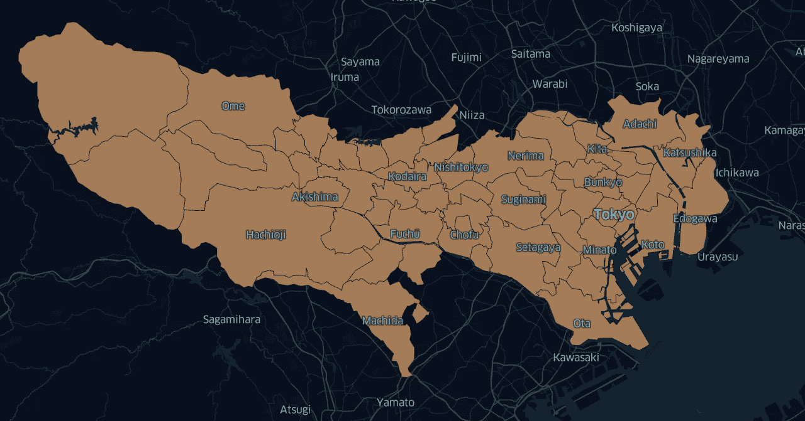
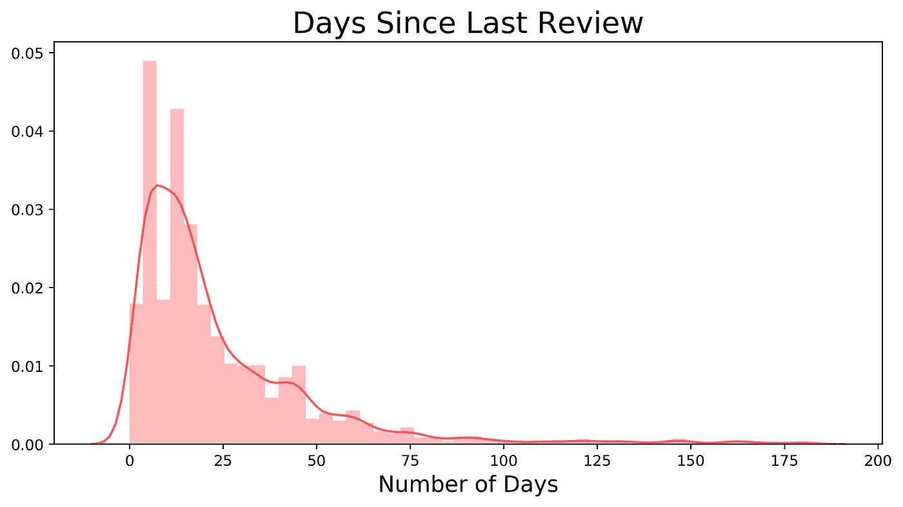
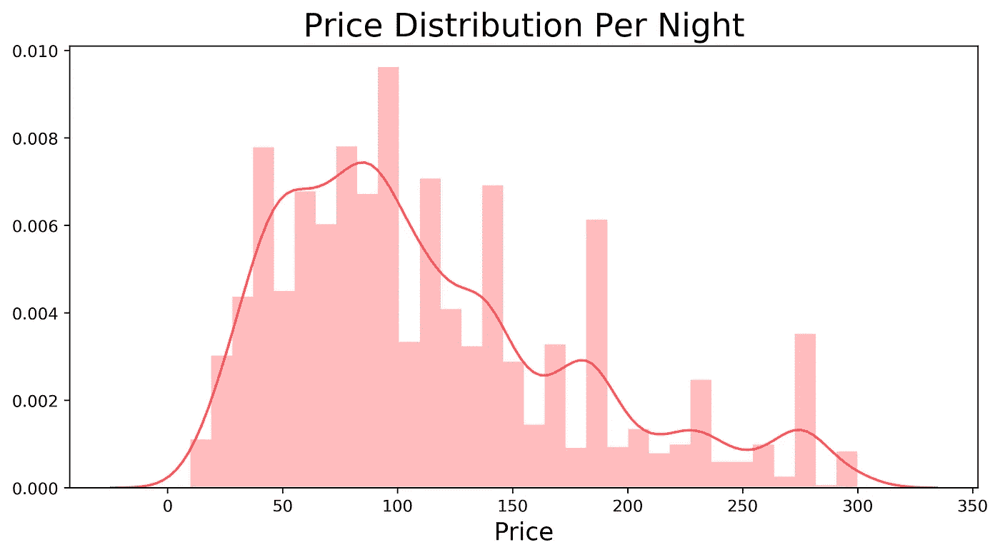
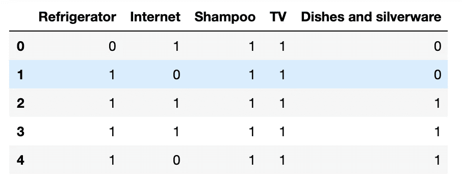
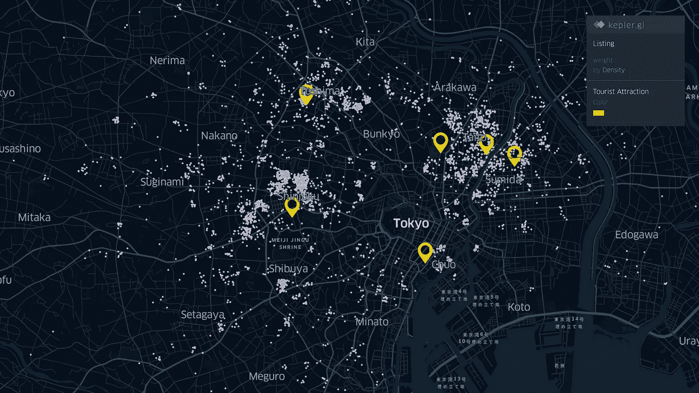
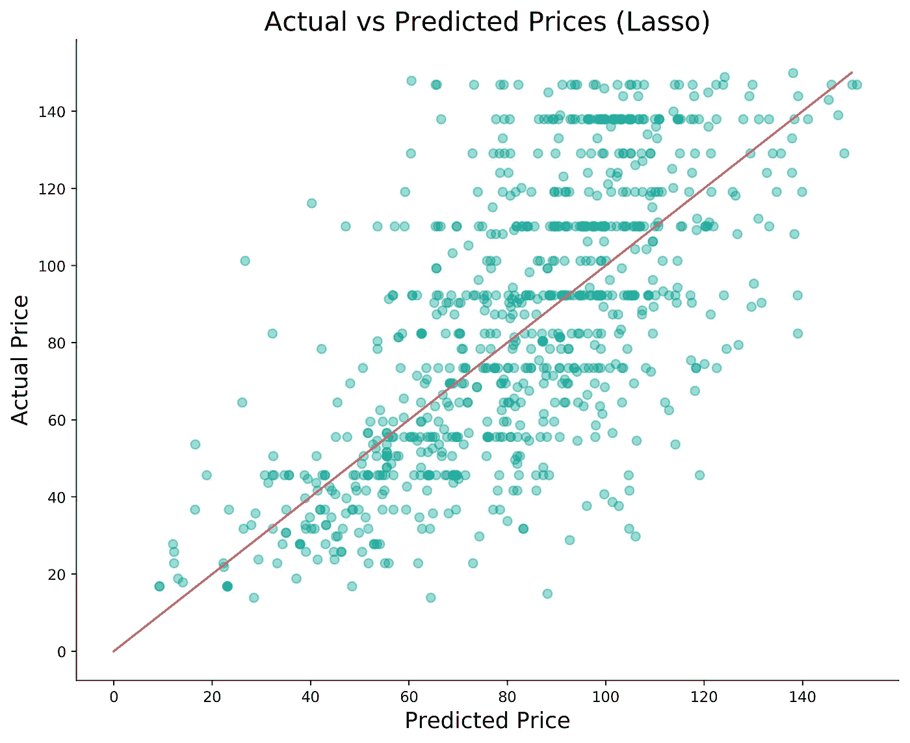
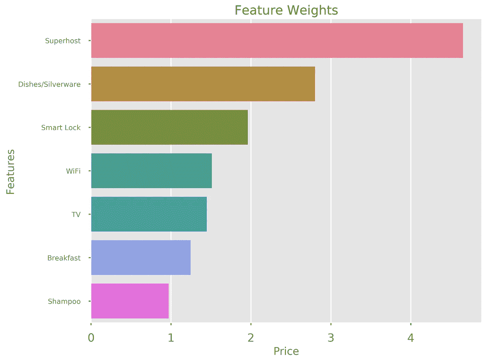
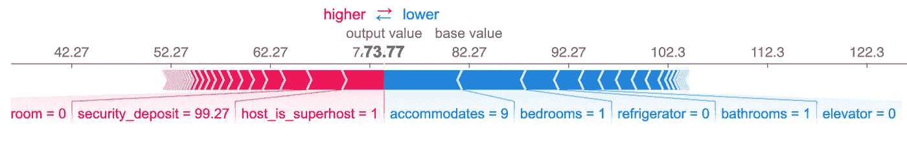
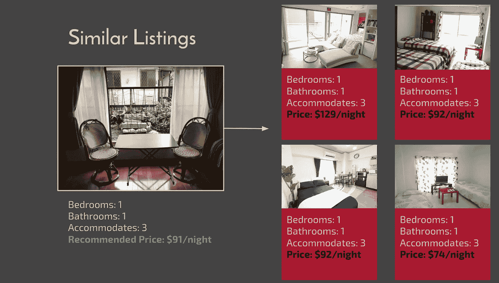

# Airbnb 价格推荐器

> 原文：<https://towardsdatascience.com/airbnb-pricing-recommender-19225d0f5d1?source=collection_archive---------25----------------------->

## 使用机器学习来识别最优列表价格

亚历山大·帕萨里克( [Pexels](https://www.pexels.com/photo/street-under-cloudy-sky-1344537/) )的照片

作为我的数据科学项目 Metis 的一部分，我试图为 Airbnb 主机设计一个更好的定价系统，以优化它们的上市价格。通过这篇文章，我希望解释促使我设计这个模型的原因，以及我用来训练最优回归模型的方法。

# 背景

如果你是一名主持人，你可能已经听说过 AirBnB 的智能定价(smart pricing)，这是一种帮助主持人根据需求和其他各种因素自动控制价格的定价工具。但是，尽管智能定价能够考虑到预订历史等因素，但它旨在最大限度地提高入住率，并可以提出比东道主希望的价格更低的价格。

因此，我想设计一个工具来训练活跃的列表，以建议最佳价格，同时也允许主机将推荐价格与类似列表的价格进行比较。

定价本身是非常个人化的，因为一些主人寻求提供负担得起和预算友好的体验，而其他人可能更奢侈，并寻求提供超级奢侈的体验。我不只是向主机建议价格，而是希望主机能够将建议价格与他们的直接竞争对手进行比较，以便更好地帮助他们对其列表价格做出决定。

## 目标

*   确定主持人可以用来提高可销售性的可操作特征
*   探索活跃列表的地理位置
*   创建一个可解释的回归模型，让主办方了解其建议价格背后的因素

## 我的方法

1.  从 InsideAirBnB 收集数据
2.  预处理数据并确定最佳列表
3.  特征工程/探索性数据分析
4.  回归建模和评估
5.  使用最近邻居识别相似的列表

## 数据

不幸的是，AirBnB 没有任何开放的数据集，但 InsideAirBnB 是一个独立的实体，它在网上搜集世界各大城市 AirBnB 房源的公开信息。对于这个项目的范围，我选择把重点放在日本东京的上市。

数据有一些限制，因为我只使用了 2019 年 9 月刮的房源。此外，虽然我想用时间序列来模拟季节性，但 InsideAirBnB 没有东京一年的数据。

# 数据处理

需要记住的是，在所有搜索到的列表上建模价格没有多大意义。这些上市公司中的许多可能定价很低或不活跃，在它们的基础上训练一个模型不一定会建议最佳价格。因此，定义什么是“好”列表并过滤掉次优列表是数据清理过程的第一步。要跟踪的一个关键要素是占用率，这不是数据集中包含的要素。

## **三藩市模式**

旧金山模型是 InsideAirBnB 的入住模型，旨在估计 AirBnB 房源出租的频率。简而言之，它执行以下操作:

*   通过假设 50%的审核率来估计预订数量
*   定义每个城市的平均停留时间(大多数城市为 3 天)
*   将*的预计预订量*和*的平均入住时间*相乘，得出入住率

你可以点击阅读更多关于这种入住模式的信息[。](http://insideairbnb.com/about.html)

## 那么，我们如何识别活跃的、可销售的房源呢？

*   在过去 6 个月中，已对列表进行了审核
*   列表在过去 12 个月中有超过 5 条评论
*   每月预定天数估计超过 7 天

加工后分配

## 价格分布

看一下我们的目标变量 price 的分布，发现 76.69%的列表价格低于 150 美元。这确实在后来发挥了作用，因为我发现使用 150 美元的阈值并创建两个模型，一个用于高于该阈值的列表，另一个用于低于该阈值的列表，提高了模型性能。

## 搬运便利设施

房源提供的便利设施的数量肯定会影响价格。InsideAirBnB 的数据集有一个便利设施功能，它列出了一个列表提供的所有便利设施，但这种格式的便利设施对回归建模没有用处。

因此，我解析了每个列表的便利设施字符串，并为每个可能的便利设施创建了一个新的特性列，用一个布尔值来表示一个列表是否提供该便利设施。这样做的一个问题是，它大大增加了数据集的维度，但我们可以通过查看 p 值和使用 lasso 正则化来消除信息量较少的便利条件。

## 热门旅游景点

另一个起作用的因素是靠近旅游景点。虽然东京有一个优秀的公共交通系统，但我想探索一下，到某些旅游景点的距离是否会影响列表的定价。我选择的 5 个旅游景点是:

1.  东京皇宫
2.  银座购物区
3.  浅草寺
4.  上野公园
5.  东京晴空塔

事实上，绘制预处理后数据集中剩余的最理想列表的位置显示，这些列表中的大多数都相对靠近这些旅游地点。

# 建模和评估

## 线性回归

在建模阶段，由于 OLS 中的高 p 值或多重共线性，许多不相关的要素被丢弃。为了让主持人容易理解推动价格预测的因素，我选择了线性回归模型，以便于解释。平均绝对误差(MAE)约为 18 美元。我还使用了岭和套索回归来防止过度拟合，但是这两种方法对最终的 MAE 分数都没有明显的影响。

最后，让我们看看对模型预测有影响的可操作特征。正如你在下面看到的，成为一个超级主持人，为顾客提供餐具和银器，对提高一个列表的可销售性以及抬高价格有很大的帮助。

## XGBoost

除了线性回归，我还使用了 XGBoost，因为它能够为数据找到更非线性的拟合。正如预期的那样，XGBoost 的表现优于线性回归，平均绝对误差约为 **$14.23。虽然 XGBoost 优于线性回归，但它的可解释性较差。可以使用 SHAP 等算法来增加 XGBoost 模型的可解释性，但从主持人的角度来看，理解线性回归权重仍然比理解 SHAP 图更容易。**

SHAP 力图(单次观测)

# 寻找相似的物品

我在这个项目中的最初目标之一是给用户一些类似的列表，以比较诸如便利设施、价格等。在项目的这一部分，我使用 NearestNeighbors 算法简单地在特征空间中查找最近的列表。由于原始数据集具有*列表 url* 特征，因此为最接近的列表索引数据集也为主机提供了列表 url 以转到这些列表的 AirBnB 页面。

# 结论

总的来说，这个项目是探索东京热门 AirBnB 房源特征的一个有趣的练习。不过要注意的是，在考虑价格时，肯定还有其他因素要考虑，如季节性、需求和一周中的某一天。虽然我使用的数据集没有很好的方法来纳入这些因素，但改进这个项目的下一步将是使用时间序列模型来解决季节性问题，并找出一种对需求建模的方法。

**感谢您的阅读！**

项目存储库可以在这里找到[。](https://github.com/AbishekGollapudi/DataProjects/tree/master/AirBnB%20Pricing)