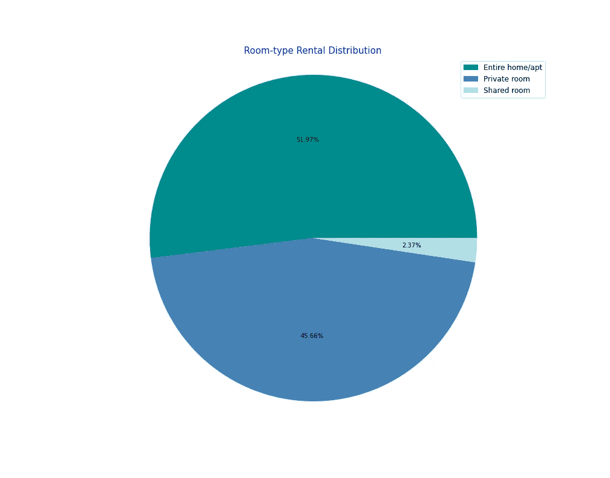
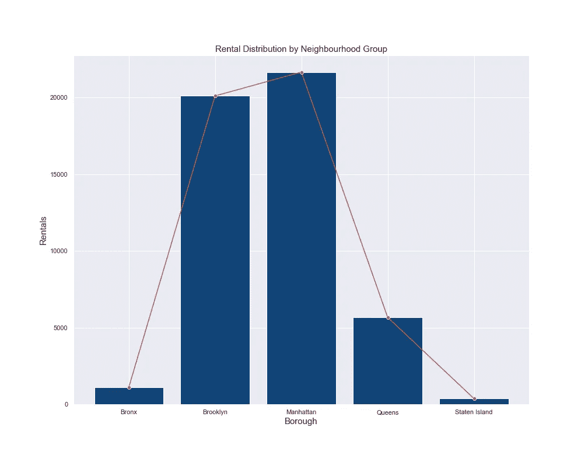
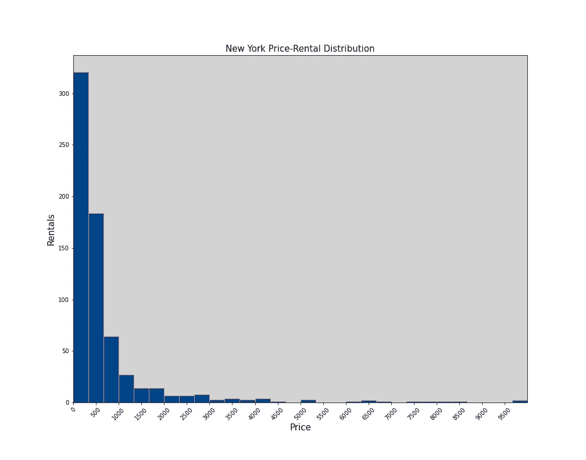
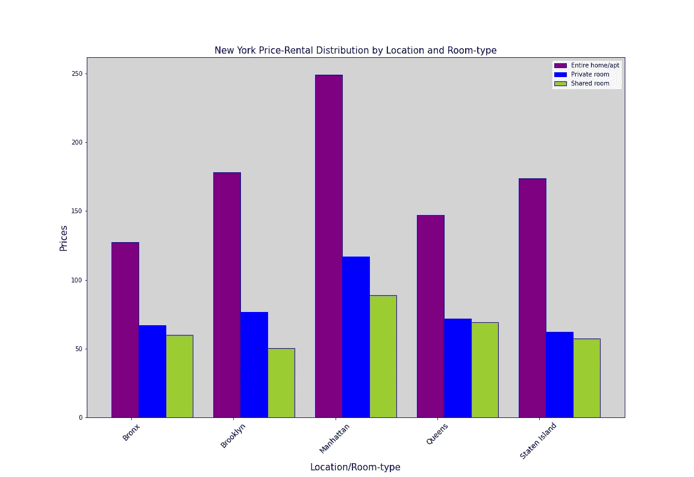
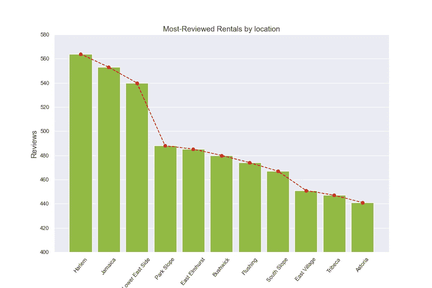
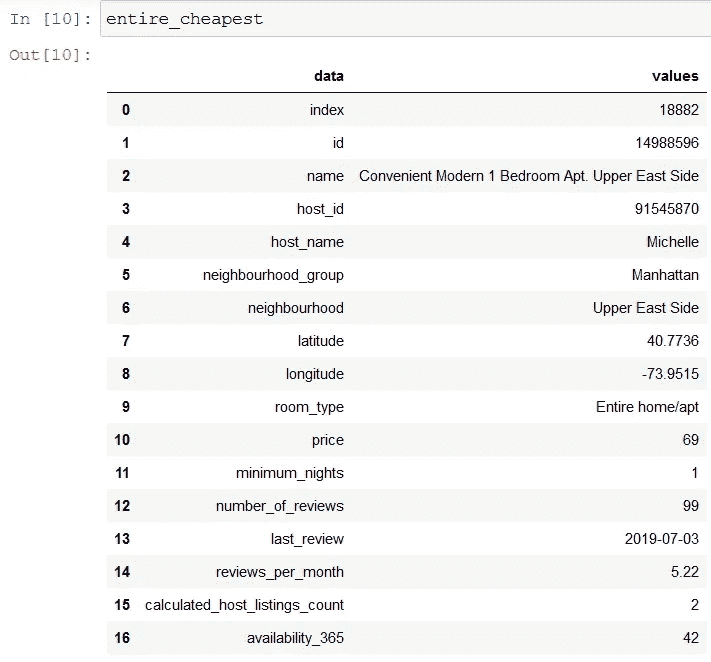
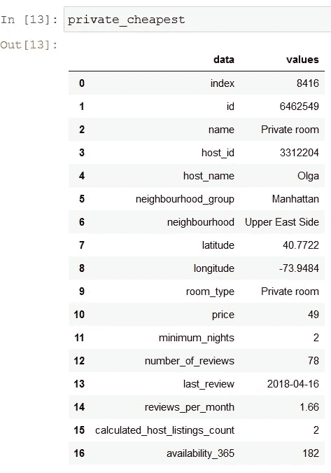

# 使用 Python 对纽约租金进行数据分析

> 原文：<https://towardsdatascience.com/airbnb-rental-analysis-of-new-york-using-python-a6e1b2ecd7dc?source=collection_archive---------22----------------------->

## 发现最方便的租赁方式，以便继续实施具有良好可视化效果的数据分析。


科尔顿杜克在 T2 的照片

T **他的城市不需要介绍**。纽约是美国人口第八大城市，估计有 800 万人口。它也是美国人口最稠密的主要城市，被称为世界文化、金融和媒体之都。

坐落在世界上最大的天然海港之一的纽约市由五个区组成，每个区都是纽约州的一个县。五个区——布鲁克林、皇后区、曼哈顿、布朗克斯和斯塔滕岛——于 1898 年合并成一个城市。

**有趣的事实**。

但是我们大多数人主要是通过其他东西来了解它的，比如它的规模，它的大气，以及每次我们有机会去参观它时它带给我们的快乐。

## 作为我上一篇文章[用 Python 实现商业智能可视化](https://medium.com/p/1d2d30ce8bd9?source=post_stats_page-------------------------------------)的后续部分，我决定为那些喜欢它的人写一篇文章，以展示可视化在 Python 中的实际和更广泛的应用。

在这种情况下，我将浏览包含纽约租房信息的 Airbnb 数据集，以帮助我们确定租房机会、便宜的价格、最受欢迎的住宿地点和其他见解。如果这听起来很有趣，请继续关注！

# **内容**:

> 数据集介绍(1 分钟阅读)
> 
> 使用 Python 进行数据探索性分析(7 分钟阅读)

# 1.数据集简介

Airbnb 是一家总部位于旧金山的公司，在全球超过 81，000 个城市开展业务，提供超过 600 万条租赁信息。从*数据创建的角度来看*，该公司已经从其运营的城市产生了大量的数据，如用户评论、位置描述和租金统计。

随着游客和商务旅行者以及其他人选择它作为出租房间、公寓或任何可用于寄宿家庭住所的方式，它已经成为在线租赁市场行业的**主导者**。该公司是建立寄宿家庭的先驱，这是一种受欢迎的接待和住宿形式，游客与他们要去的城市的当地人共用一个住所，并预先安排不同的停留时间。

我们要分析的数据集可以在我的 [GitHub](https://github.com/Jotaherrer/DataAnalysis) 账号中获得。分析数据集之前的第一步是预览它包含的信息。为了轻松处理这些信息，我们将使用 [Pandas](https://pandas.pydata.org/) ，这是一个用于数据操作和分析的 Python 库，它提供了用于操作数值表和时间序列的数据结构和操作。

# 2.数据探索性分析

在我们直接进入数据清理和数据转换之前，让我们设定要分析的前提:

> **A .每种房型对应的租金比例是多少？**
> 
> 纽约五个区的租金是如何分配的？
> 
> c .价格分布是怎样的，合理的价格范围是多少？
> 
> d .区分不同房型的价格。
> 
> 哪些地方是最受欢迎的租房地点？
> 
> F.给病人读者的租借建议。

我们将从导入必要的库开始工作。

```
# Imports
import pandas as pd
import matplotlib.pyplot as plt
import seaborn as sns
```

继续获取包含在中的数据。CSV 文件，该文件必须位于您的工作目录中，使用 Pandas 的函数 *read_csv。之后，在控制台中打印数据的预览，只是为了看看相关的变量和特性。内置函数 *head* 返回数据集的前五行:*

```
data = pd.read_csv('new_york.csv')
data.head()
```

完成这一步后，您将获得以下输出:

现在，让我们来看看数据集的基本信息，包括特性、数据类型、行、条目和每一个乍看起来可用的值。我们将利用*信息*功能来实现这一点:

```
data.info()
```

从 Gist 中可以看出，数据集包含 16 列、48，895 个条目或行，以及不同的数据类型，比如 Numpy 整数、对象和 Numpy 浮点。一些价值观

在特性或列中，我们可以找到 ID、房东姓名、租赁 ID、主机名、行政区和其他有价值的信息，我们稍后将从中提取结论。

继续用零替换数据集中的“**缺失**或**空值**，因为空值主要集中在“评论数量”和“上次评论”列中，它们在我们的分析中没有有用的应用。在这一点上要小心，因为不是每次看到“丢失”的值都应该替换它:

```
data.fillna(0,inplace=True)
```

检查重复的条目，它应该返回零:

```
sum(data.duplicated())
```

既然我们已经从数据集中清除了不必要的要素，让我们继续分析。

## A.每种房型对应的租金比例是多少？



作者图片

从数据集中可获得的全部租金中， **52%** 对应于整户公寓， **46%** 对应于私人房间租金，剩余的少数对应于样本的 **2%** 合租房间。

以下代码应该使您能够获得所呈现的可视化效果:

```
# 1 - Pie chartroom_type = data.groupby('room_type')['latitude'].count().reset_index()
room_type.rename(columns={'latitude':'n_rooms'},inplace=True)
plt.figure(figsize=(10,8))
plt.pie(room_type['n_rooms'],autopct='%1.2f%%', colors=['darkcyan', 'steelblue','powderblue'])
plt.axis('equal')
plt.legend(labels=room_type['room_type'],loc='best',fontsize='12')
plt.title('Room-type Rental Distribution', fontsize='15',color='b')
plt.show()
plt.close()
```

## B.我在导言中提到的五个区的租金是如何分配的？



正如可视化图中所反映的那样，**布鲁克林区和曼哈顿区**集中了 Airbnb 上大部分的租赁信息，这两个区总共有超过 4 万套租赁信息。这意味着纽约的大部分游客都住在这些地区的房产、房间或住宅里。

看一下创建情节的代码:

```
# 2 - Bar plot with neighbourhood distributionneighbourhood = data.groupby('neighbourhood_group')['neighbourhood'].count().reset_index()
fig,ax = plt.subplots(figsize=(12,8))
sns.barplot(x=neighbourhood[neighbourhood.columns[0]],
y=neighbourhood[neighbourhood.columns[1]],color='#004488',ax=ax)
sns.lineplot(x=neighbourhood[neighbourhood.columns[0]],y=neighbourhood[neighbourhood.columns[1]],color='r',marker='o',ax=ax)
plt.ylabel('Rentals', fontsize='15')
plt.xlabel('Borough',fontsize='15')
plt.title('Rental Distribution by Neighbourhood Group',fontsize='15')
plt.grid('x')
plt.show()
sns.set()
```

## C.价格分布是怎样的，合理的价格范围是多少？



作者图片

价格分布集中在 300-400 美元左右，很少观察到更高的价格。

```
# 3 - Histogram plot with price distributionprice = data.loc[:,['neighbourhood','price']].set_index('neighbourhood')
price_stats = data['price'].describe().reset_index()
price_counts = price.price.value_counts().reset_index()
price_counts.rename(columns={'index':'price','price':'count'},inplace=True)
fig2,ax = plt.subplots(figsize=(12,8))
fig2.patch.set_facecolor('lightgray')
ax.set_facecolor('lightgray')
plt.hist(price_counts['price'],bins=30,color='#004488',edgecolor='salmon')
ax.set_xticks(range(0,10000,500))
for tick in ax.get_xticklabels():
tick.set_rotation(45)
plt.xlabel('Price',fontsize='15')
plt.ylabel('Rentals', fontsize='15')
plt.xlim((-0.5,10000))
plt.title('New York Price-Rental Distribution',fontsize='15')
plt.show()
```

## D.区分不同房型的价格。



作者图片

在可用的不同房间类型中，需求最大的是全屋，其次是私人房间，最后是合住房间，这一趋势与第一次分析中的趋势相同。

在这种情况下，我们注意到，在需求较少的行政区，如布朗克斯或斯塔滕岛，价格分散在私人房间和合租房间之间缩小，而整个家庭保持价格分散。

需求更多的地区，如曼哈顿，私人房间的租金与需求较少的地区的整栋房屋租金价格相似。

```
# 4 - Bar plot with price to location distributionloc_price = data.groupby(['neighbourhood_group','room_type'])['price'].mean().reset_index()
locations = loc_price.neighbourhood_group.unique()
x_rooms1 = [0.8, 3.8, 6.8, 9.8, 12.8]
x_rooms2 = [1.6, 4.6, 7.6, 10.6, 13.6]
x_rooms3 = [2.4, 5.4, 8.4, 11.4, 14.4]
y_values1 = loc_price[loc_price['room_type'] == 'Entire home/apt']['price'].values
y_values2 = loc_price[loc_price['room_type'] == 'Private room']['price'].values
y_values3 = loc_price[loc_price['room_type'] == 'Shared room']['price'].values
fig3,ax2 = plt.subplots(figsize=(16,11))
fig3.patch.set_facecolor('lightgray')
ax2.set_facecolor('lightgray')
plt.bar(x_rooms1, y_values1, color='purple', edgecolor='b')
plt.bar(x_rooms2, y_values2, color='b', edgecolor='b')
plt.bar(x_rooms3, y_values3, color='yellowgreen', edgecolor='b')
ax2.set_xticks(range(1,16,3))
ax2.set_xticklabels(locations, fontsize='12')
for tick in ax2.get_xticklabels():
tick.set_rotation(45)
plt.xlabel('Location/Room-type',fontsize='15')
plt.ylabel('Prices', fontsize='15')
plt.legend(labels=loc_price.room_type.unique(), loc='best')
plt.title('New York Price-Rental Distribution by Location and Room-type',fontsize='15')
plt.show()
```

## E.哪是最受欢迎的租赁小屋的地点？



作者图片

根据 Airbnb 用户的评论，我们可以推断出哪些租房是最受欢迎的或最受欢迎的(这并不意味着它们是最好的，但为了简化案例，让我们考虑一下**如果它们被访问的次数更多，可能是因为以前的访问者留下了好评)**。

在上面的图片中，我们看到大多数被评论的位置涉及需求较少的行政区，其中最受欢迎的租赁往往平均有 550 条来自用户的评论。

```
# 5 - Most reviewed spotsreview = data.sort_values('number_of_reviews',ascending=False)
top_reviewed = review.loc[:,['neighbourhood','number_of_reviews']][:20]
top_reviewed = top_reviewed.groupby('neighbourhood').mean().sort_values('number_of_reviews',ascending=False).reset_index()
fig4,ax3 = plt.subplots(figsize=(12,8))
sns.barplot(x=top_reviewed['neighbourhood'],y=top_reviewed['number_of_reviews'].values,color='yellowgreen',ax=ax3)
plt.plot(top_reviewed['number_of_reviews'], marker='o', color='red',linestyle='--')
plt.ylabel('Reviews', fontsize='15')
plt.xlabel('Location',fontsize='15')
plt.ylim((400,580))
for ax in ax3.get_xticklabels():
ax.set_rotation(50)
plt.title('Most-Reviewed Rentals by location',fontsize='15')
plt.show()
sns.set()
```

## F.为患者读者提供的租赁建议

> 正如我们在上面的图片中看到的，曼哈顿和布鲁克林区的需求明显更大。

你可能想知道，住在这些地方要花多少钱？有没有可能通过这种分析找到机会，让我以尽可能低的价格在这些区租到一个好房子？答案是肯定的！

曼哈顿最著名的居住地之一是上东区的[](https://en.wikipedia.org/wiki/Upper_East_Side)**(UES)。上东区是一些最富有的个人和家庭的家园。这里有最时髦的纽约人居住的豪华公寓。**

**有了熊猫可用的过滤器，我们可以过滤位于上东区的租赁，我们可以在评论最多的租赁中获得最便宜的租赁，以便找到最合适的住宿地点！**

**根据上述标准，这些是最适合私人房间和住宅的租赁:**

****

**最便宜和最受欢迎的整屋出租**

****

**最便宜和受欢迎的私人房间出租**

**正如我们所看到的，每晚只需 69 美元，我们就可以住在世界上最豪华的地方之一的出租屋里，如果我们的预算有限，还可以花 49 美元租一个私人房间。**

**如果你有任何悬而未决的疑问，可以考虑看看我下面的脚本:**

```
import numpy as np
upper_east = data[data['neighbourhood'] == 'Upper East Side']
ninetieth_percentile = np.quantile(upper_east['number_of_reviews'], 0.85)
upper_east = upper_east[upper_east['number_of_reviews'] >= ninetieth_percentile]
upper_east = upper_east.sort_values('price',ascending=True)
private_room = upper_east[upper_east['room_type'] == 'Private room'].reset_index()
entire_home = upper_east[upper_east['room_type'] == 'Entire home/apt'].reset_index()
shared_room = upper_east[upper_east['room_type'] == 'Shared room'].reset_index()
private_cheapest = private_room.loc[0,:].reset_index()
private_cheapest.rename(columns={'index':'data','0':'values'},inplace=True)
entire_cheapest = entire_home.loc[0,:].reset_index()
entire_cheapest.rename(columns={'index':'data','0':'values'},inplace=True)
```

# ****结论****

**毫无疑问， **Airbnb** 和**在线租赁市场**行业将帮助我们获得更好的房屋或房间租赁，以优化旅行和旅游体验。我写这篇文章的目的是为你提供一个工具来帮助你实现这样的优化，并且*为什么不呢，决定你下次去纽约的时候会住在哪个地方？***

**如果你喜欢这篇文章中的信息，不要犹豫，联系我分享你的想法。它激励我继续分享！**

**您可以在以下社交网络中找到我:**

*   **[](https://www.linkedin.com/in/juli%C3%A1n-alfredo-herrera-08531559/)****。******
*   ****[**GitHub**](https://github.com/Jotaherrer)。****

# ****参考****

*   ****【1】[Airbnb 官网](https://www.airbnb.com/)。****
*   ****纽约****
*   ****[3] [用 Python 实现商业智能可视化](https://medium.com/p/1d2d30ce8bd9?source=post_stats_page-------------------------------------)****

******感谢您花时间阅读我的文章！如有任何问题、建议或意见，欢迎联系我:herrera.ajulian@gmail.com******