# 气流:如何以及何时使用它

> 原文：<https://towardsdatascience.com/airflow-how-and-when-to-use-it-2e07108ac9f5?source=collection_archive---------11----------------------->

## 除了知道如何使用气流，知道何时使用气流也很重要。

[Airflow](https://airflow.apache.org/) 是一款用于管理和监控工作流程的流行工具。对于我们在 [Bluecore](https://airflow.apache.org/) 的大多数数据科学工作流来说，它工作得很好，但也有一些其他工具表现更好的用例。除了知道*如何*使用气流，知道*何时*使用气流也很重要。

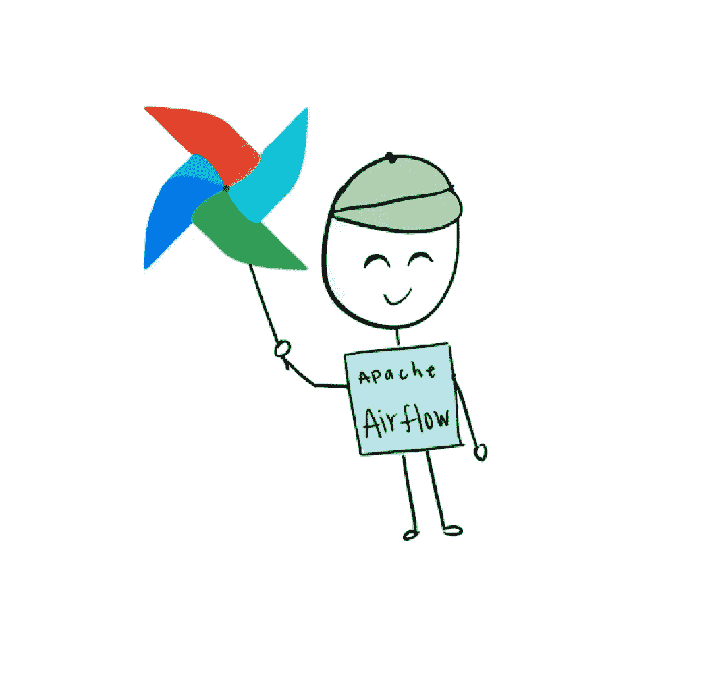

# 关于气流

> **“Airflow 是一个以编程方式创作、安排和监控工作流的平台。”—** [**气流文件**](https://airflow.apache.org/docs/stable/)

听起来很有用，对吧？嗯，确实是！Airflow 使得在它们的 UI 中监控管道的状态变得容易，并且您可以使用任务之间复杂的扇入和扇出关系来构建 Dag。他们还补充道:

> **“丰富的命令行实用程序使在 Dag 上执行复杂的手术变得轻而易举。”**

这让我笑了，因为有时与气流一起工作感觉像是脑部手术，而其他时候它工作了，感觉像是第二天回家的那种。

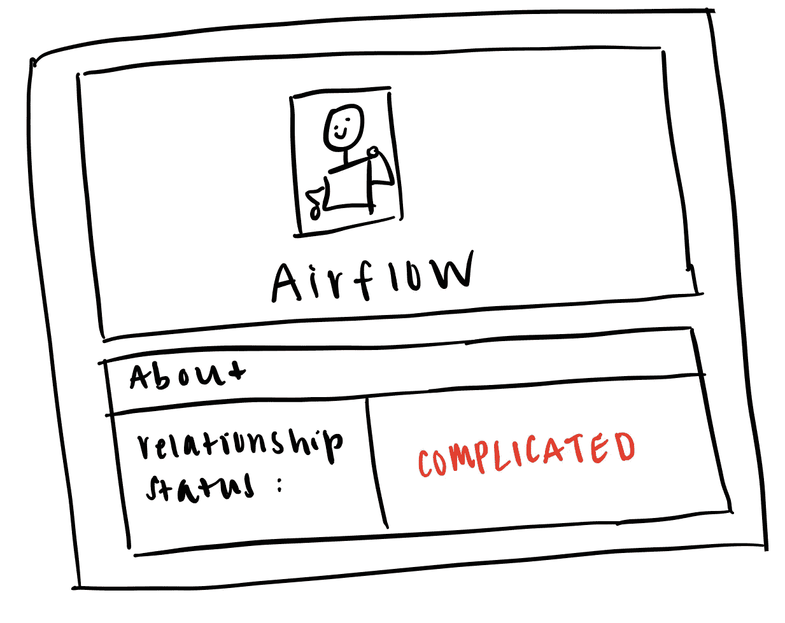

## 基本组件

在我们进入气流的更复杂的方面之前，让我们回顾几个核心概念。

## 熟练的技艺

> [**DAG 是您想要运行的所有任务的集合，以反映它们的关系和依赖性的方式组织。**](https://airflow.apache.org/docs/stable/concepts.html)

DAG 或有向无环图是流水线中所有任务、工作单元的集合。这些任务是按照它们之间的关系和依赖关系来组织的。例如，如果要查询数据库一，然后将结果加载到数据库二，则需要在将结果加载到数据库二的任务之前直接运行查询数据库一的任务。有向*非循环*图暗示你的管道只能向前，不能向后。一个任务可以重试，但是在完成一个任务并且下游的另一个任务已经开始之后，该任务不能重新运行。

DAG 页面是 Airflow UI 中的主页。显示 DAG 计划，并且可以打开/关闭。

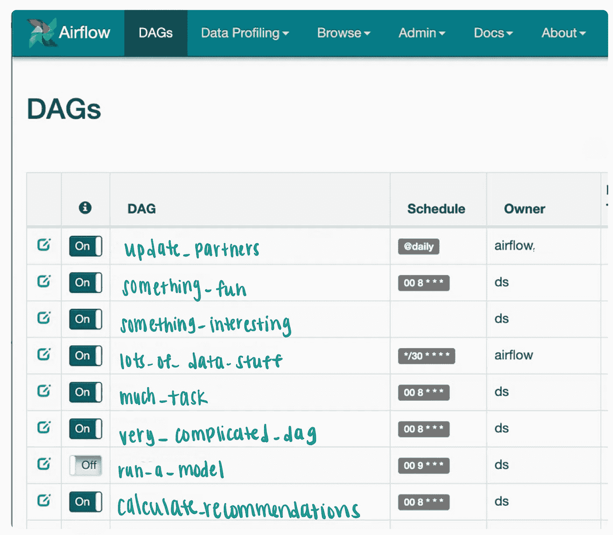

气流 UI DAG 视图

## DAG 管道示例

气流之所以如此有用，是因为它能够处理任务之间的复杂关系。您可以轻松地构造扇入和扇出的任务。

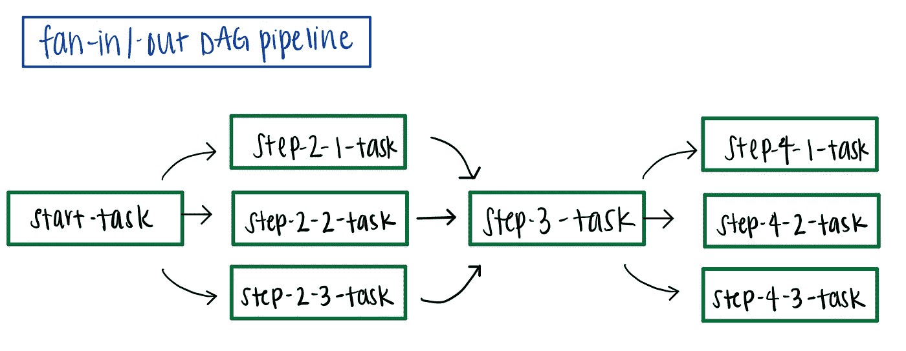

下面是我们在 Bluecore 使用的一个工作流程示例。这是一个非常简单的 DAG，它使用 AppEngineOperator 调用我们在 AppEngine 中创建的命令，该命令进行查询并返回 Bluecore 的活动合作伙伴列表。接下来，我们使用 PythonOperator 来更新 Airflow 变量。如果更新任务成功或失败，我们将向 [datadog](https://www.datadoghq.com/product/) 发送适当的度量。

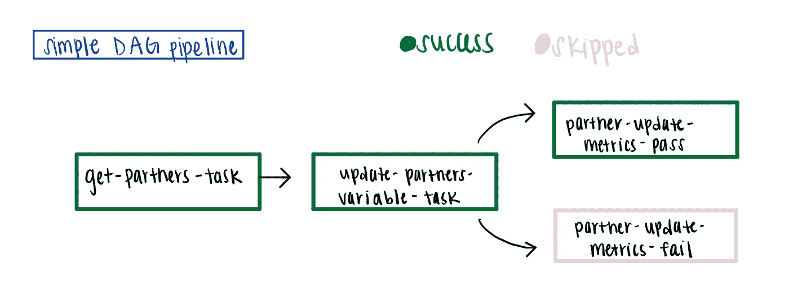

## 任务/操作员

> **“实例化操作员对象时生成任务。”-气流文件**

说快 10 倍。

任务是理想的独立部分，不依赖于来自另一个任务的信息。操作员类对象在运行时会变成任务。可以导入操作符类，实例化该类会产生类对象。该对象的实例化(运行操作符代码)是**任务**。一开始，任务和操作符之间的细微差别可能会令人困惑，所以我发现制作这个图表很有帮助。

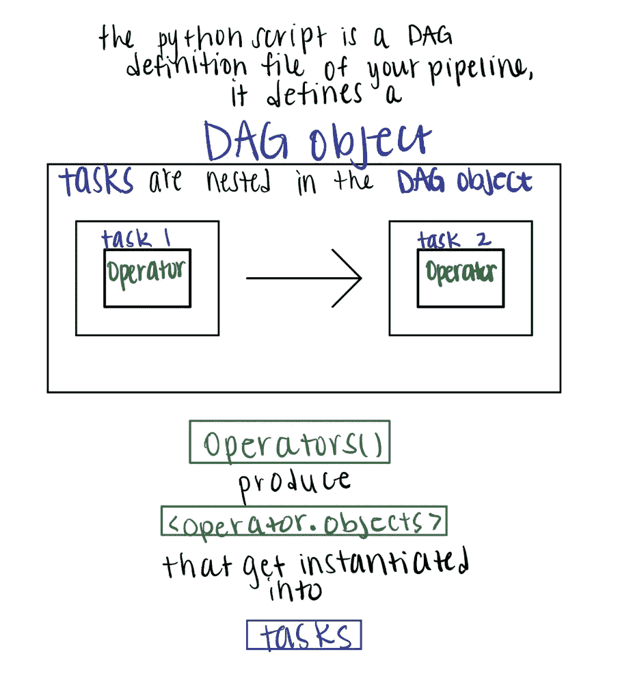

## 在 DAG 文件中定义 DAG 和任务

概念很好，但是你可能会问自己，我实际上如何编写代码来创建 DAG？嗯，在 Bluecore，我们有一个专门用于定义 Dag 的 python 文件的 [Github](https://github.com/) 库。例如，您可以创建 example_dag.py，并从定义 dag 对象开始。您将从 Airflow 导入 DAG 类，并定义您需要的参数。

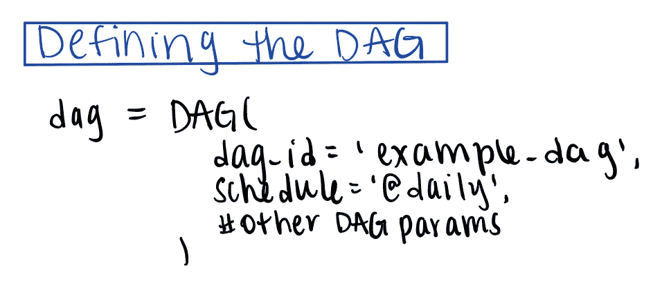

接下来，写下每个任务。将 dag 参数设置为 dag 对象会将任务与 DAG 相关联。

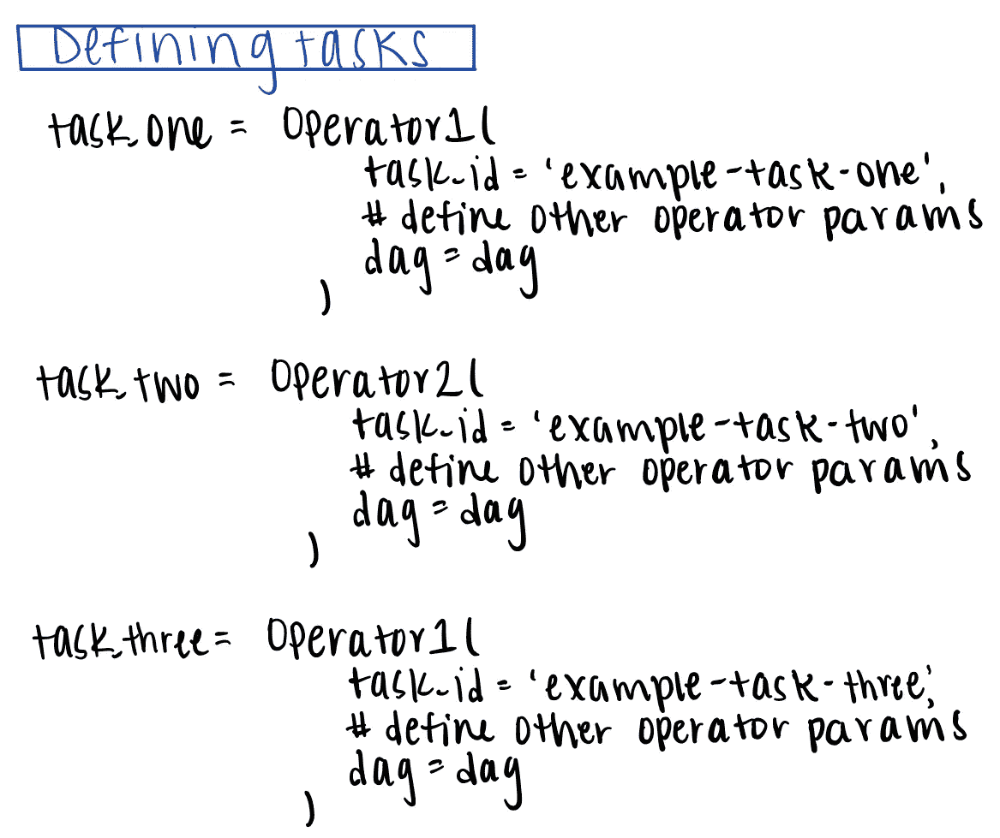

最后，定义任务之间的关系。

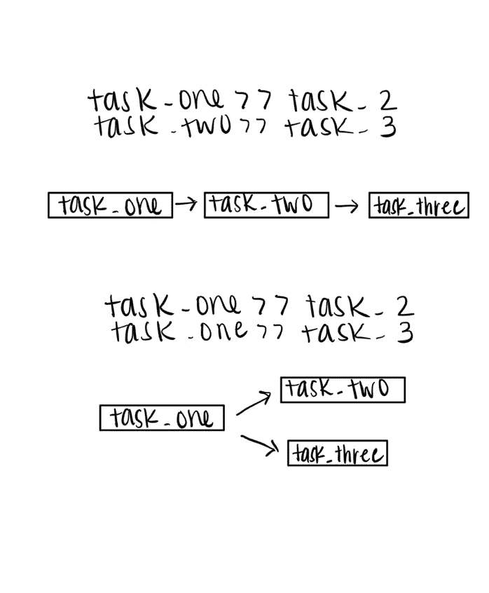

将 DAG 和任务定义以及定义上游/下游任务放在一起会产生一个 DAG 定义文件。

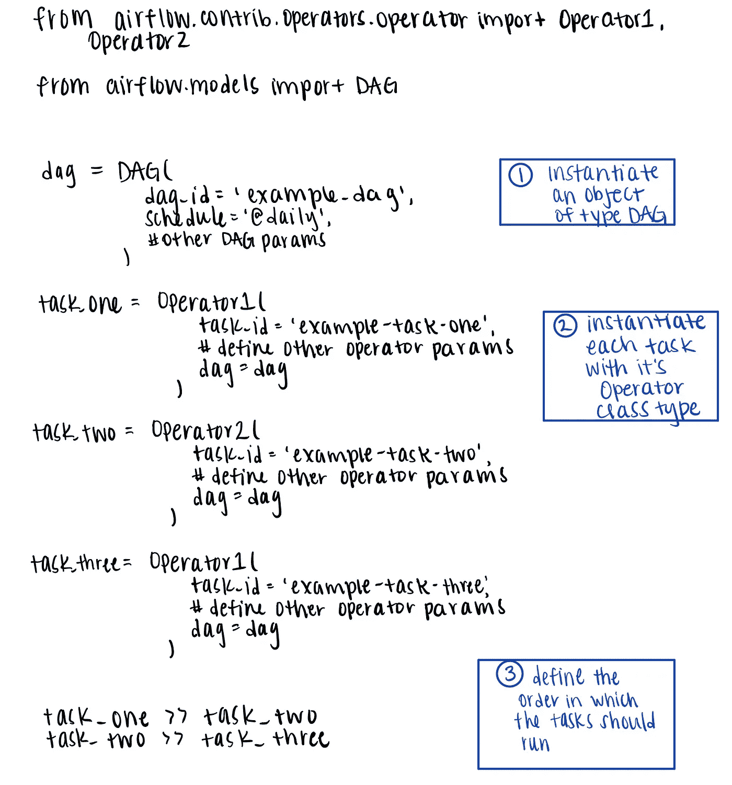

## 变量

变量是气流的另一个有用组成部分。我们使用变量有两个基本目的:**与环境相关的**和**特定于模型的参数**。可以在 DAG 文件中访问变量，例如，可以更新项目 id 或图像标签，而无需对 DAG 进行任何更改。如果您有多个环境，例如 QA 和生产环境，这将特别有用。此外，我们的一些模型并不面向所有合作伙伴，而是面向一组特定的合作伙伴。我们有一个单独的 DAG，它更新包含特定于模型的伙伴的变量，然后当模型运行时，它从变量中提取它的伙伴列表。

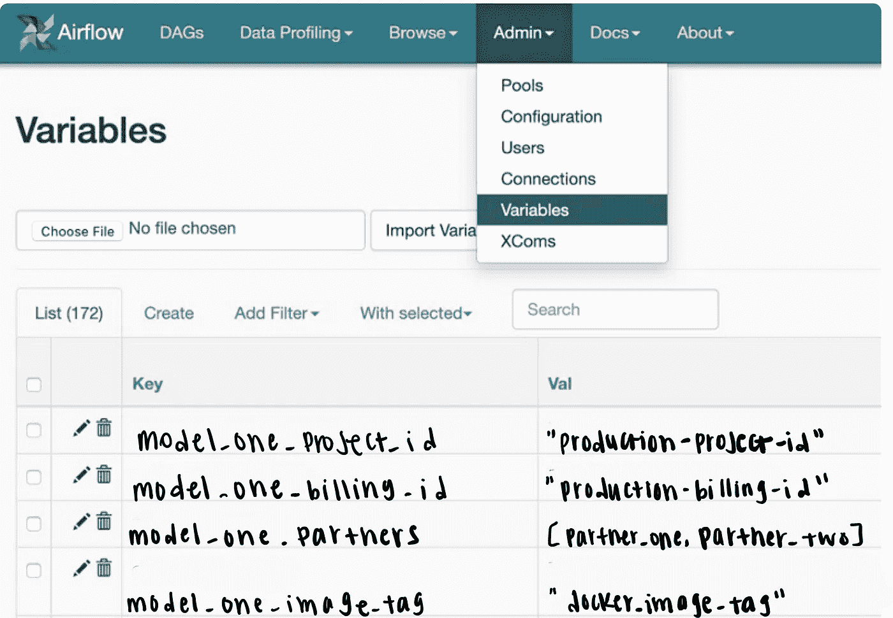

气流 UI 可变视图

## 泳池

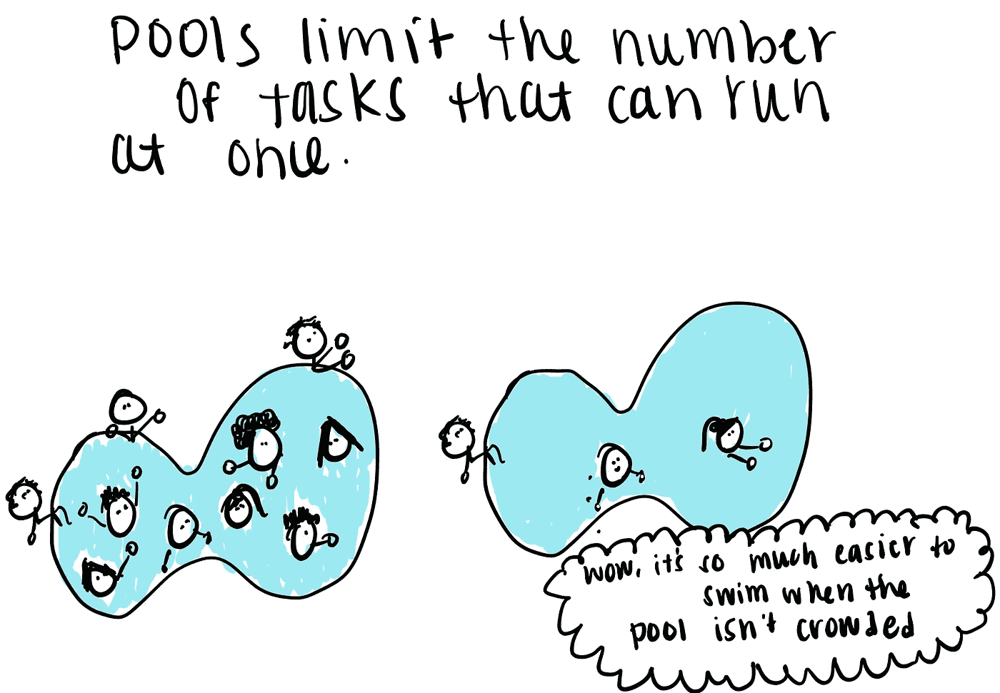

池控制允许 DAG 一次消耗的资源数量。应该根据任务完成的速度和 DAG 需要完成的速度来定义池。确保在使用池时，您没有使用其他人的池，否则两个 Dag 可能不会像预期的那样快速完成。

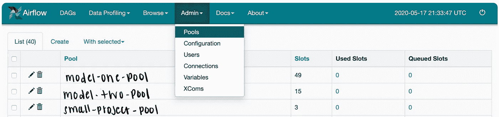

气流 UI 池视图

## XComs

理想情况下，任务是相互独立的，但有时这是不可能的，任务需要相互通信。这种相互通信是由 xcom 完成的。XComs 可以在任务之间“推”(发送)或“拉”(接收)。

例如，您可能需要将一个任务的返回值推送到 xcom 表中，以便在下一个任务中从 xcom 表中提取该值，并将其用作参数。在前面 DAGs 部分描述的简单 DAG 示例中，第一个任务将活动伙伴列表推送到 xcom 表，第二个任务从 xcom 表中取出伙伴列表，并将该列表设置为气流变量。

# 摘要

我们回顾了何时使用气流(当您的管道需要支持扇入/扇出时)，如何构建 DAG，DAG 为什么有用，以及各种气流组件。总之，我们了解了

*   熟练的技艺
*   任务/操作员
*   如何构建 DAG 和设置任务关系
*   变量
*   泳池
*   Xcoms

现在，您已经有了开始创建 DAG 所需的工具，可以在其中构建复杂的数据管道了！如果您有兴趣了解更多信息，请参见 [Airflow:如何以及何时使用它(高级)](https://medium.com/@alexagriffith/airflow-how-and-when-to-use-it-advanced-238ea6b63f13)了解有关操作符、结构化 Dag 以及 Airflow 缩放问题的更多信息。