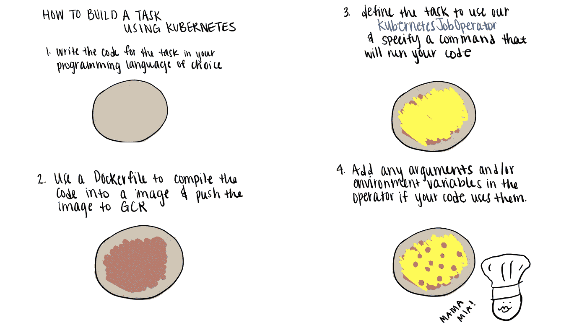
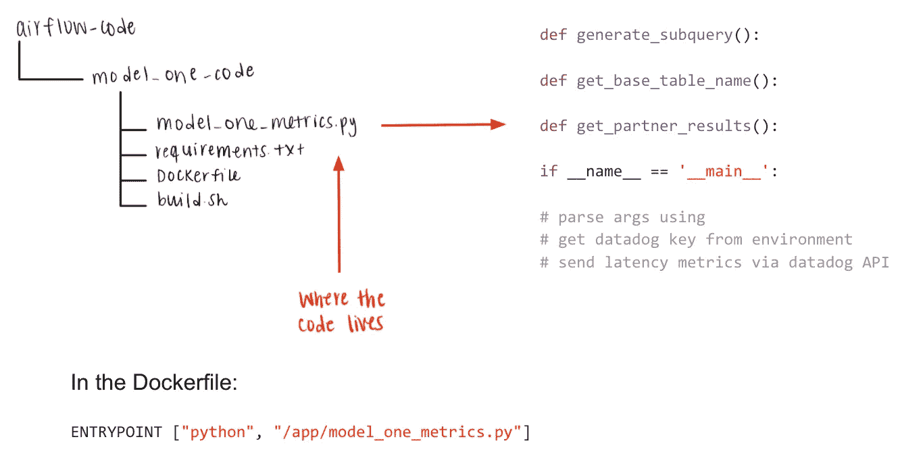
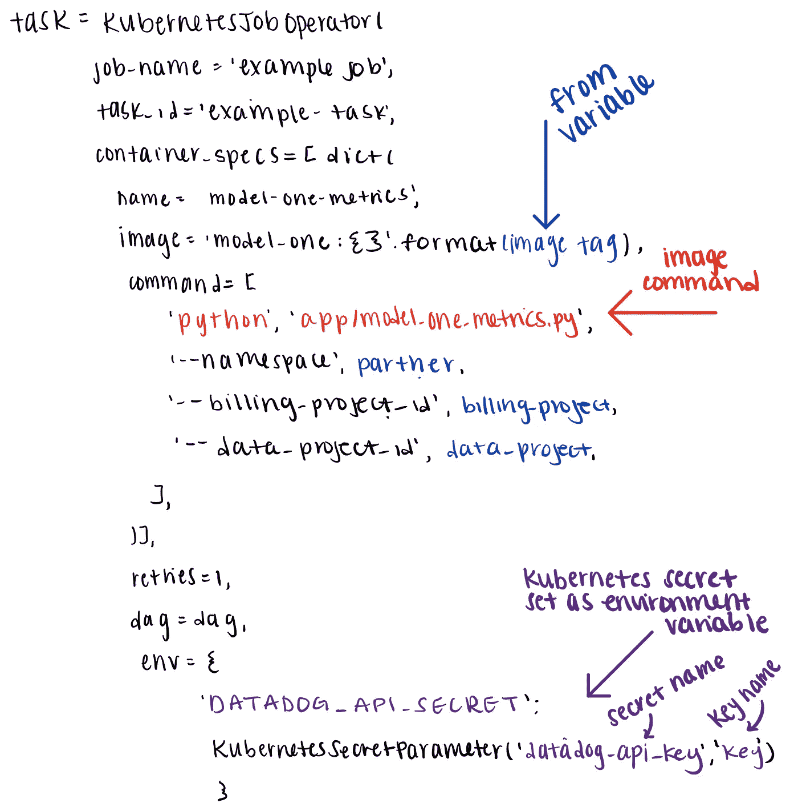
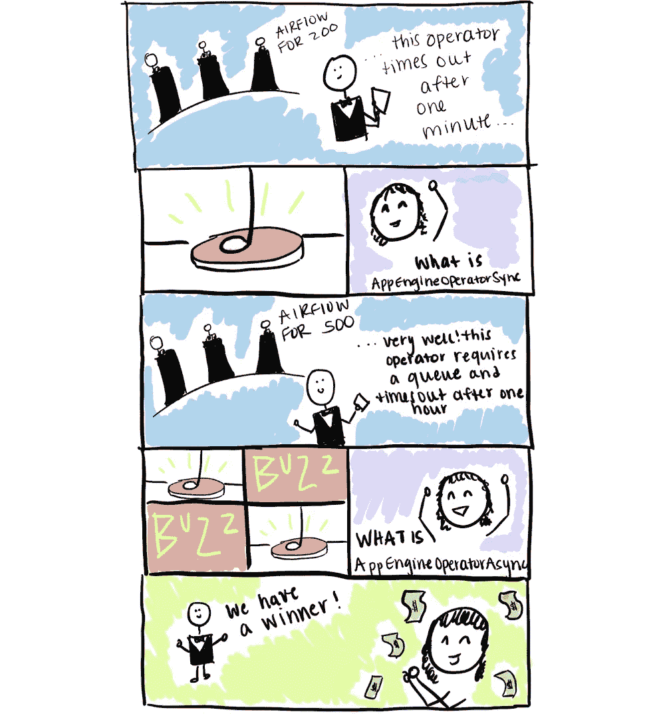
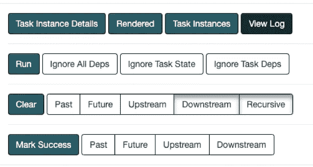
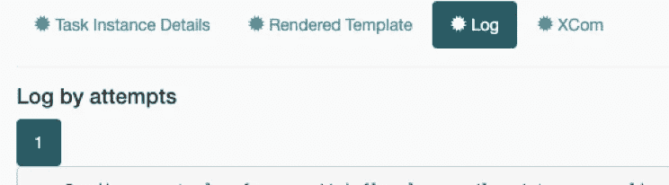
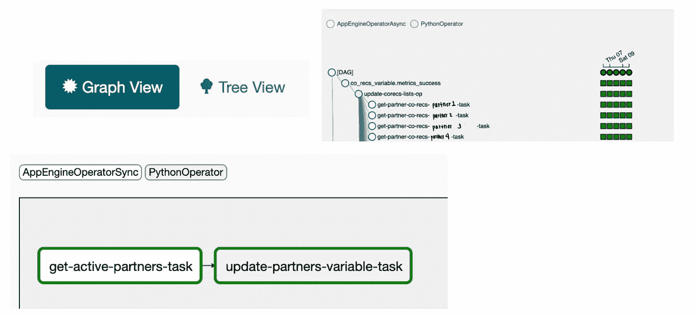
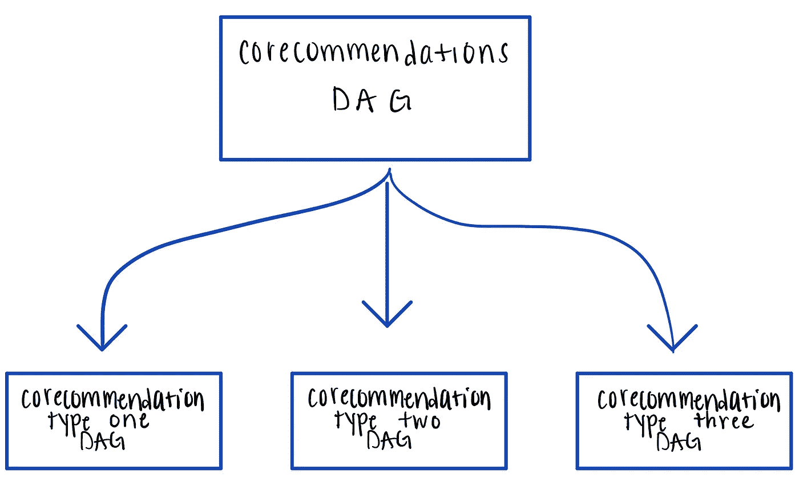
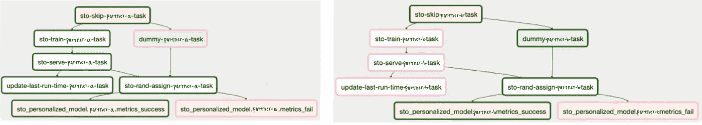
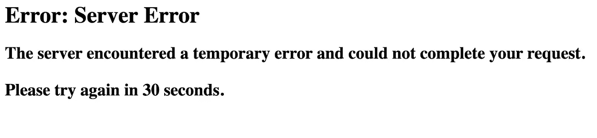

# 气流:如何和何时使用它(高级)

> 原文：<https://towardsdatascience.com/airflow-how-and-when-to-use-it-advanced-238ea6b63f13?source=collection_archive---------42----------------------->

[在《气流:如何以及何时使用它](https://medium.com/@alexagriffith/airflow-how-and-when-to-use-it-2e07108ac9f5)中，我们讨论了[气流](https://airflow.apache.org/docs/)的基本组件以及如何构建 DAG。一旦你开始构建 DAG，你会发现它变得很复杂。选择运算符和设置 DAG 结构需要一些时间。随着我们在 [Bluecore](https://www.bluecore.com/) 的不断发展壮大，我们将继续寻找更好地创建和扩展数据管道的解决方案。以下是我们一路走来学到的一些东西。

# 运算符:高级

从基本概念开始，我们将讨论气流操作符的一些更实际的应用。在 Bluecore，我们开发了自己的[kubernetjoboperator](https://github.com/TriggerMail/incubator-airflow/blob/master/airflow/contrib/operators/kubernetes_operator.py)和 [AppEngine(同步/异步)操作符](https://github.com/TriggerMail/incubator-airflow/blob/master/airflow/contrib/operators/app_engine_operator.py)。这些都是开源的，所以请随意查看。气流也有自己的 KubernetesPodOperator 和 AppEngineOperator。PythonOperator、AppEngineOperators 和 KubernetesJobOperator 是我们使用的三个主要运算符。因此，这是我要讨论的三个问题。

## python 运算符

PythonOperator 运行可从 DAG 调用的 python 函数。该运算符对于处理 DAG 中的大量简单工作非常有用。

我们使用 python 运算符的方法示例

*   设置气流变量
*   在“气流”数据库上运行 SQL 查询
*   将 xcom 值添加到“XCom”表中
*   发送数据狗指标

## KubernetesJobOperator

KubernetesJobOperator 从一个 [Docker](https://www.docker.com/) 映像运行代码。这意味着它几乎可以做任何事情！

我们使用 KubernetsJobOperator 的方法示例

*   查询/写入数据库(Bigtable、BigQuery、Datastore 等)。)
*   迁移数据
*   训练数据科学模型

这是迄今为止对我们最有用的操作符，但也是使用起来最复杂的。如果你使用[谷歌云平台](https://cloud.google.com/gcp/?utm_source=google&utm_medium=cpc&utm_campaign=na-US-all-en-dr-bkws-all-all-trial-b-dr-1008076&utm_content=text-ad-lpsitelinkCCexp2-any-DEV_c-CRE_113120492407-ADGP_Hybrid+%7C+AW+SEM+%7C+BKWS+%7C+US+%7C+en+%7C+BMM+~+Google+Cloud+Platform-KWID_43700009942847394-kwd-26415333781&utm_term=KW_%2Bgoogle%20%2Bcloud%20%2Bplatform-ST_%2Bgoogle+%2Bcloud+%2Bplatform&gclid=EAIaIQobChMIqcvU0vS76QIVI_3jBx0jXguvEAAYASAAEgL4L_D_BwE)并从[谷歌容器注册表](https://cloud.google.com/container-registry)中提取你的图片，这些是基本步骤

## 示例:使用 Kubernetes 构建任务

只要 Docker 映像在容器注册表中，代码就可以存在于任何地方。如果您将代码编写为脚本，那么您可以在操作符中将其用作命令，并在本地进行测试。在脚本中，接受参数并解析它们将允许 DAG 文件中的变量到达脚本。Kubernetes 的秘密也可以作为脚本可以使用的环境变量传入。

代码由 docker 文件构建，并指定入口点。

将 model_one_metrics.py 代码编译成映像后，就可以编写任务了。

KubernetesJobOperator 的示例代码

## 应用工程师

App Engine 操作员在 [Google App Engine (GAE)](https://cloud.google.com/appengine) 中运行一个命令。Bluecore 也创建了两个操作符。分别是 [AppEngineSyncOperator 和 appengineoperatorsync](https://github.com/TriggerMail/incubator-airflow/blob/master/airflow/contrib/operators/app_engine_operator.py)。我们的大部分代码都是用 AppEngine 编写的，所以这些操作符有很多用处。

我们使用 app engine 运算符的方式示例

*   检索所有活动合作伙伴的列表
*   更新合作伙伴权限和功能
*   设置电子邮件发送时间
*   压缩表格

## 调试/Kubectl

[Pod 日志对于调试 DAG 问题非常有帮助。](https://medium.com/bluecore-engineering/kubernetes-pod-logging-in-the-airflow-ui-ed9ca6f37e9d)在 UI 中点击任务即可找到。

气流用户界面中的日志页面。

如果这些日志还不够，使用 [**kubectl**](https://kubernetes.io/docs/reference/kubectl/overview/) **研究 pod/worker/scheduler/web 日志。**

# DAG 结构和策略

## 任务结构

有两种不同的视图，底部是“图形视图”，右边是“树视图”在下面的 DAG 中，我们查询一个任务中所有伙伴的列表，但是在右边的 DAG 中，我们在每个伙伴的基础上查询使用“corec”模型的伙伴。该结构取决于运行一项任务所需的时间。正确的任务在一个任务中查询每个伙伴花费的时间太长，所以最好将任务拆分。

更新变量的 Dag 的两种不同视图。左下方的 DAG 显示在“图形视图”中，右上方的 DAG 显示在“树视图”中。

## 动态 DAG 创建

我们有三种不同类型的共同推荐，我们在一个 DAG 中运行它们。每个合作伙伴对三个模型中的每一个都有三组不同的任务。这条狗变得又大又慢。现在，我们从一个 corecommendations DAG 文件中动态生成三个 DAG，并且我们可以在不同的时间设置计划，这样就不会一次占用太多的资源。

corecommendations DAG 文件动态创建三个 DAG，每个模型一个。

## DAG 分离

我们的一个模型有一些不同的 Dag。如果某些任务不依赖于当前 DAG 中的时间表或上游任务，则最好将 DAG 分开，尤其是在 DAG 需要经常运行，并且任务会降低 DAG 速度的情况下。

## 任务逻辑

我们曾经每周为每个合作伙伴运行两次模型。这导致 DAG 运行缓慢，因为所有任务都试图同时训练。为了解决这个问题，我们创建了一个合作伙伴 mod 7 的散列，结果是一周中运行该模型的那一天。加上三，我们得到第二天。这分散了每个合作伙伴的培训。

此外，每周只需要培训两次，但每天都需要“随机分配”。添加了涉及跳过的任务逻辑来处理这种情况。第一个任务决定应该采取哪条路径，并且，如果不是训练该伙伴的日子，则跳过训练和服务任务。

一个 DAG 中的两组不同的任务。左侧显示的是合作伙伴 a，右侧显示的是合作伙伴 b。在这次 DAG 运行中，是合作伙伴 a 而不是合作伙伴 b 进行训练。

DAG 细分:

1.  决定走哪条路(搭档 a 训练，搭档 b 不训练)

2.将不需要的路径任务标记为“跳过”(需要传递给随机分配的虚拟任务)

3.向[数据狗](https://www.datadoghq.com/product/)发送通过/失败指标

# 当气流不是最佳选择时

将[谷歌云调度器](https://cloud.google.com/scheduler/docs/creating)用于 [cron](https://en.wikipedia.org/wiki/Cron) 作业可能更适合不需要扇入/扇出的简单管道。

当在 DAG 中调度大量任务时，Airfow 存在扩展问题。UI 在加载 DAG 时出现问题，这使得调试和检查变得困难。当试图加载这些大型 Dag 时，web pod 有时会崩溃

目前，我们已经实施了一些变通办法来避免这个问题，但我们目前仍在研究改进的方法。这可能是气流不适合这种工作流程，也许 [Kubeflow](https://www.kubeflow.org/) 或 [Argo](https://argoproj.github.io/) 是更好的选择。让我知道，如果你有任何想法/意见缩放大型 Dag！

# 摘要

在[气流:如何以及何时使用它](https://medium.com/@alexagriffith/airflow-how-and-when-to-use-it-2e07108ac9f5)中，我们讨论了如何使用气流和创建 Dag 的基础知识。在本文中，我们以这些主题为基础，更详细地讨论了如何创建操作符和构建 DAG。具体来说，我们

*   探究构建任务的更高级的方法
*   检查 DAG 结构和策略

气流是一个很好的工具。UI 使得监控、调度和设计 Dag 变得相当容易。当扩展超过 500 个任务的 Dag 时，气流开始变得困难。要么需要应用变通方法来保持 Dag 的可观察性，要么可能需要另一个管道软件。