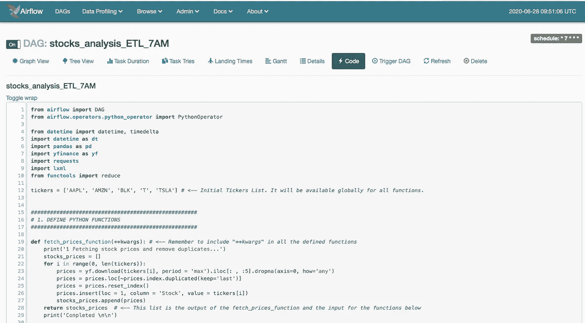

# 气流:如何在睡觉时刷新股市数据——第 1 部分

> 原文：<https://towardsdatascience.com/airflow-how-to-refresh-stocks-data-while-you-sleep-part-1-a464514e45b7?source=collection_archive---------26----------------------->

## 在关于 Apache Airflow 的第一篇教程中，学习如何构建一个数据管道来自动提取、转换和加载项目所需的股票价格和统计数据。


由[杰森·布里斯科](https://unsplash.com/@jsnbrsc?utm_source=medium&utm_medium=referral)在 [Unsplash](https://unsplash.com?utm_source=medium&utm_medium=referral) 拍摄的照片

## 什么是气流，它如何帮助你？

[Apache Airflow](https://airflow.apache.org/docs/stable/) 是一个工作流管理平台，允许用户以编程方式安排独立运行的作业，并通过其用户界面对其进行监控。Airflow 的主要组件是一个 **Webserver** (Airflow 的 UI 构建为 Flask App)、一个**调度器**、一个**执行器**和一个**元数据数据库**。

作为一名 BI 开发人员，我曾与数据工程师密切合作，很早就了解了 Airflow 擅长的领域，但我从未真正将理论付诸实践，直到我开始从事副业。

实际上，当我用[破折号](https://plotly.com/dash/)构建一个可视化股票价格和股票统计的应用程序时，我意识到每次我想要更新数据时，我都必须手动重新运行整个代码。当您需要提取、处理和提供数百个股票报价机的数据时，这个过程需要很长时间。我知道，如果我想扩大我的项目，我需要一个工具来编排幕后的重复任务，同时我专注于构建新的有趣的功能。

在本教程的第一部分，我将向您展示我最终是如何开始结合 Python 和 Airflow 来创建一个自动化的 ETL 管道的:

1.  从[雅虎财经](https://uk.finance.yahoo.com/most-active)下载股票价格并保存到一个列表中；
2.  对股票价格执行高级操作，生成一个 S **股票价格历史 DF** 和一个 S **股票价格统计 DF** 用于我的项目的不同部分；
3.  将数据保存为特定文件夹中的 CSV 文件。

但首先让我们激活一个虚拟环境，并安装气流。

## 安装和配置气流

对于本教程，我将假设您熟悉虚拟环境，并且您使用的是 Python 3.6 或更高版本，因为我发现安装有问题(如果您希望仔细检查，只需使用`python -V`):

1.  首先，激活您的虚拟环境，然后运行`pip install apache-airflow`。要验证安装是否成功，请键入命令`airflow version`。
2.  现在用`cd ~/airflow/`导航到 Airflow 主目录，用`mkdir dags`创建一个名为“dags”的新文件夹。在气流中，一个 **DAG (** 或[**有向无环图**](https://en.wikipedia.org/wiki/Directed_acyclic_graph) **)** 由许多操作符组成，这些操作符描述了为实现特定目标而需要执行的各个任务。例如，如果你想运行一个 Python 函数，你可以使用`Python Operator`，而如果你想执行一个 Bash 命令，你可以使用`BashOperator`，以此类推。要获得完整的可用操作员列表，请查看官方文档。
3.  调用`airflow initdb`命令来启动 SQLite 数据库，其中 Airflow 将存储管理您的工作流所必需的元数据。请注意，SQLite 数据库在生产环境中并不是最佳选择，但是当您开始使用 Airflow 时，它会很方便，因为它非常容易在本地配置。
4.  气流主文件夹中会出现一些新文件，其中有`airflow.cfg`。该文件包括将应用于 web 界面和 Dag 的所有配置选项。我强烈推荐用编辑器打开文件，设置`load_examples=False`。该选项默认设置为`True`，除非更改，否则每次运行 **Webserver** 时，您都会在 UI *上看到[一长串默认 DAG 示例](https://github.com/apache/airflow/tree/master/airflow/example_dags)，这在我看来有点混乱和混乱。*
5.  用**创建一个空文件。py** 扩展将包括您的原始 **Python 脚本+** **DAG 调度+ DAG 操作符+任务层次结构**。基本上，因为 Airflow 是基于 Python 的，所以您可以简单地将 DAG 嵌入到熟悉的 Python 脚本中，并将其执行留给 Airflow 的调度程序(稍后将详细介绍)。对于本教程，我最初创建了一个名为`stocks_analysis.py`的空文件。

下面的 bash 命令总结了到目前为止所做的工作:

```
(airflow_ve) AnBento-2:airflow $ mkdir dags(airflow_ve) AnBento-2:airflow $ airflow initdb(airflow_ve) AnBento-2:airflow $ ls
airflow-scheduler.err airflow-scheduler.pid airflow-webserver.out airflow.db unittests.cfg airflow-scheduler.log airflow-webserver.err airflow-webserver.pid dags airflow-scheduler.out airflow-webserver.log airflow.cfg logs(airflow_ve) AnBento-2:airflow $ open airflow.cfg(airflow_ve) AnBento-2:airflow $ cd dags(airflow_ve) AnBento-2:dags $ touch stocks_analysis.py(airflow_ve) AnBento-2:dags $ ls__pycache__ stocks_analysis.py
```

如果您遵循了所有的步骤，您现在应该准备好启动 Airflow Webserver 和 Scheduler，但是在此之前，您需要用 DAG 填充`stock_analysis.py`文件。

## 创建 DAG 来提取-转换-加载股票价格

我将在本教程中用来刷新股票价格、设置 DAG 及其操作符的完整代码可以在我的 [GitHub 帐户](https://github.com/anbento0490/code_tutorials/blob/master/Airflow%20Stock%20Prices%20ETL/stocks_analysis.py)中获得。


图片由[亚当·诺瓦克斯基](https://unsplash.com/@adamaszczos?utm_source=medium&utm_medium=referral)在 [Unsplash](https://unsplash.com?utm_source=medium&utm_medium=referral) 上拍摄

如果你正在跟随，现在是时候用`open stock_analysis.py`编辑空文件，并粘贴你在[code _ tutorials/air flow Stock Prices ETL](https://github.com/anbento0490/code_tutorials/tree/master/Airflow%20Stock%20Prices%20ETL)文件夹中找到的整个 Python 脚本了。保存更改后，在执行任何其他操作之前，请确保在环境中安装以下所有软件包:

气流现在应该能够识别有效的 DAG，您可以使用`airflow list_dags`轻松检查它:

```
(airflow_ve) AnBento-2:dags $ airflow list_dags[2020–06–27 09:40:35,002] {__init__.py:51} INFO — Using executor **SequentialExecutor**[2020–06–27 09:40:35,002] {dagbag.py:396} INFO — Filling up the DagBag from **/Users/anbento/airflow/dags** — — — — — — — — — — — — — — — — — — — — — — — — — — — — — — — — — -DAGS — — — — — — — — — — — — — — — — — — — — — — — — — — — — — — — — — -stocks_analysis_ETL_7AM
```

上面的屏幕没有抛出错误，您可以看出 DAG 实际上已被系统识别，因为`stock_analysis_ETL_7AM`正是我分配给 DAG 的名称:

实际上，我建议为您的 Dag 分配一个有意义的名称(遵循惯例*project _ name+process+schedule interval*),因为这有助于立即直观地看到您正在查看的作业以及它应该在何时运行，并且这在处理多个工作流时增加了清晰度。

上面的代码告诉 Airflow 何时调度作业，作业需要完成什么以及以什么顺序完成。从顶部开始，它可以分为三个部分:

1.  **Airflow DAG +默认参数:**在这里，您将指定作业名称、`start_date`和`schedule_interval`以及 Python 字典中定义的附加`default_args`。这里有几个建议，可以让你免去很多头疼的事情，也不用花时间去阅读无数的教程和堆栈溢出的帖子:

*   将静态的`start_date`设置为过去，例如`start_date = datetime(2020, 6, 23)` →实际上，为了正常工作，Airflow 要求任何作业的开始日期都已经是过去的日期，为了避免不可预测的行为，最好使用静态语法，而不是像`start_date = datetime.now()- timedelta(days=3)`这样的语法。
*   设置`catchup = False` →通过这种方式，您可以清楚地知道，尽管您的`start_date`已经过去，但您不希望气流回填您的数据，这意味着当您第一次运行它时，作业将不会执行多次，以覆盖从`start_date`到 DAG 打开日期之间的所有缺失运行。相反，气流将只运行它一次(立即),之后，它将坚持时间表。
*   更改`schedule_interval`时更改 DAG 名称→如果您希望将运行时间从上午 7 点更改为上午 8 点，最好也将 DAG 名称更改为`stock_analysis_ETL_8AM`。Airflow 会将这个 DAG 视为一个全新的 DAG，这样可以避免在元数据数据库中存储两个同名的 DAG…是的，您可以从 UI 中删除旧的 DAG。

**2。DAG 操作符:**对于本教程，我将使用三个`PythonOperators`来运行三个 Python 函数。每个 Python 操作符都是一个单独的任务，需要传递给*气流顺序执行器*以实现预期的结果。每个任务都由一个`task_id` 标识，为了避免混淆，我建议您确保任务名称和任务 id 始终匹配。我的任务是:

*   **fetch_prices_task** →该任务将调用一个名为*fetch _ prices _ function()*的 Python 函数，该函数从 Yahoo Finance 下载`tickers` 列表中 5 只股票的完整价格历史，删除重复项，应用简单的操作，并将它们保存在`stock_prices` 列表中:

如果您运行该函数，它应该会返回类似如下的内容:


因为我将使用`stock_prices`列表作为另外两个 Python 函数的*输入，所以这是顺序中需要执行的第一个任务。 ***任务执行*** ***层次*** 很重要，因为它允许我不在每一步都下载股票价格，而是只做一次(在开始时)，这样每个任务将运行得更快，整个过程将更有效率。*

*   ***stocks_plot_task** →该任务将调用名为 *stocks_plot_function()* 的第二个 Python 函数，该函数将`stock_prices`列表作为输入，并将每个股票价格历史连接到一个数据帧中，该数据帧随后将用于绘制股票价格的长期趋势。数据最终保存在一个名为`stocks_plots_data.csv`的 CSV 文件中。当然，您可以决定采取更高级的步骤，**将数据增量加载到您选择的 DB 中**——这实际上是正确的方法——但是为了保持简单并专注于气流能力，我们现在坚持使用 CSV 文件:*

*该功能运行时，显示`stock_plots_data` DF 的前 5 行:*

**

*stocks_plots_data 包括绘制 5 只股票的趋势和蜡烛图所需的所有价格字段*

*   ***stocks_table_task** →这个最后的任务将调用第三个名为*stocks _ table _ function()*的 Python 函数，该函数再次将`stock_prices`列表作为输入，只保留最后一个可用的`Adj Close` 价格，然后从 Yahoo Finance 获取大量统计数据。最终，输出被保存到一个名为`stocks_table_data.csv`的 CSV 文件中:*

*这个函数很长，所以只显示前 15 行。在这里找到完整版。*

*上述函数的输出是一个具有 5 行 13 列的 DF，其中 11 列是关键统计数据:*

**

***3。任务层级→** 这是 DAG 的最后一个组件，用于指定气流执行三个任务的顺序。就我而言，我选择了:*

```
*fetch_prices_task >> stocks_plot_task >> stocks_table_task*
```

*这意味着将首先执行`fetch_prices_task` (这是有意义的，因为它生成了用于其他两个任务的`stock_prices`列表)，然后是`stocks_plot_task`和`stocks_table_task`。*

*在这种情况下，您还可以决定合并第二个和第三个任务，因为它们互不依赖:*

```
*fetch_prices_task >> [stocks_plot_task, stocks_table_task]*
```

*注意在 Airflow 中[依赖关系](https://www.astronomer.io/guides/managing-dependencies/)是如何在语法上设置的(`set_upstream()`、`set_downstream()`)或者像我一样使用[、*位移法*、](https://stackoverflow.com/questions/141525/what-are-bitwise-shift-bit-shift-operators-and-how-do-they-work)操作符。*

## *气流交叉通信(XCom)*

*如果您试图在 Python IDE 中测试这些函数，您可能会注意到它们只是…失败了！。这是因为**为了让一个任务*的输出*在后续的其他任务中作为*的输入*被调用，Airflow 使用了一个名为 XCom** 的任务间通信 Python 类。因此，我必须修改原始函数，添加:*

*   *一个[关键字参数(**kwargs)](https://stackoverflow.com/questions/1769403/what-is-the-purpose-and-use-of-kwargs) 用于所有三个；*
*   *下面两行为 *stocks_plot_function()* 和*stocks _ table _ function()*:*

```
*ti = kwargs[‘ti’]
stocks_prices = ti.xcom_pull(task_ids=’fetch_prices_task’)* 
```

*   *`provide_context = True`对于每个 Python 操作符。*

*实际上，正如[文档](https://airflow.apache.org/docs/1.10.1/concepts.html?highlight=xcom)(非常简洁……)所解释的，一个任务可以通过调用`xcom_push()`方法或者简单地通过在它调用的函数结束时返回输出来使输出可用(就像我对`return stock_prices`所做的)。*

*以类似的方式，一个任务可以通过调用`xcom_pull()`方法获取输出，该方法精确地指定应该从哪个任务获取输入(`task_ids ='fetch_prices_task'`)。*

**

*[Denys Nevozhai](https://unsplash.com/@dnevozhai?utm_source=medium&utm_medium=referral) 在 [Unsplash](https://unsplash.com?utm_source=medium&utm_medium=referral) 上拍摄的照片*

*是的，我知道……如果你第一次使用 Airflow，你可能会想为什么不能在`fetch_prices_function()`之外定义`stock_prices=[]`,并在其他两个函数中使用它作为全局列表。事情是这样的，Airflow 一次性解析 Python 代码，因此它需要一个更复杂的系统来让任务相互“交流”。如果你对主题[仍有疑问，这是最近帮助我的另一篇优秀文章](https://stackoverflow.com/questions/46059161/airflow-how-to-pass-xcom-variable-into-python-function)。*

***最后一步:如何激活股票分析 ETL 作业***

*既然您已经掌握了代码在做什么以及 DAG 是如何构建的，那么是时候打开两个单独的 Bash 窗口了。在第一个窗口中，您应该运行命令来启动 air flow***web server***:*

```
*(airflow_ve) AnBento-2:airflow $ airflow webserver*
```

*而在第二个窗口中，您应该启动气流 ***调度器*** :*

```
*(airflow_ve) AnBento-2:airflow $ airflow scheduler*
```

*如果您导航到默认的[http://0 . 0 . 0 . 0:8080/admin/](http://0.0.0.0:8080/admin/)本地地址，您将有望看到下面的屏幕:*

**

*气流正确显示了`stocks_analysis_ETL_7AM` DAG，但是为了启动该过程，需要手动打开作业。一旦你这样做了，气流 ***顺序执行器*** 将立即根据它们的层次运行所有三个任务:*

**

*墨绿色表示 3 个任务都已成功执行，您可以点击 ***最近任务*** 进行验证:*

**

*这意味着包含股票数据的 2 个更新的 CSV 文件已经保存到指定的位置。如果出现问题，并且您希望再次检查代码，您可以在用户界面中通过单击***DAG _ name>Code***来完成:*

**

## **结论**

*恭喜你！如果你有足够的动力完成本 Airflow 教程的第 1 部分**的结尾，你现在应该能够构建你的第一个 **ETL 本地管道**，并使用它来刷新你个人项目背后的数据。你还学习了如何使用 **XCom 类**动态连接任务，我希望这些知识在你开始构建更复杂的 Dag 时会派上用场。***

*在**第二部分**中，我将向您展示如何**在生产中部署气流 Dag**，以便它们可以在您睡觉时真正运行，但在此之前，请看看最后两条建议:*

*   *在本地构建 ETL 管道意味着，除非您的机器启动，**Dag 将不会在预定的时间运行。**实际上，为了让 Airflow 正常工作，web 服务器和调度程序都需要在后台运行。如果您保持它们运行，而您的系统进入空闲状态，只要您重新激活系统，气流就会覆盖它在不活动期间错过的作业。但是，将 Dag 部署到生产环境将解决这个问题。*
*   *理解**执行日期**和**开始日期**之间的差异以及 Airflow 执行工作流的方式通常并不简单。为了帮助你理解要点，请看一下这篇深入探讨这个话题的文章。*

*请让我知道你是否喜欢评论中的教程，我希望能在第 2 部分看到你！*

## ***你可能也喜欢:***

*[](https://levelup.gitconnected.com/15-git-commands-you-should-learn-before-your-very-first-project-f8eebb8dc6e9) [## 在你开始第一个项目之前，要掌握 15 个 Git 命令

### 您需要掌握的最后一个 Git 教程是命令行版本控制。

levelup.gitconnected.com](https://levelup.gitconnected.com/15-git-commands-you-should-learn-before-your-very-first-project-f8eebb8dc6e9) [](/8-popular-sql-window-functions-replicated-in-python-e17e6b34d5d7) [## Python 中复制的 8 个流行的 SQL 窗口函数

### 关于如何利用业务分析中的 Pandas 高效复制最常用的 SQL 窗口的教程…

towardsdatascience.com](/8-popular-sql-window-functions-replicated-in-python-e17e6b34d5d7) [](https://medium.com/analytics-vidhya/connect-to-databases-using-python-and-hide-secret-keys-with-env-variables-a-brief-tutorial-4f68e33a6dc6) [## 使用环境变量隐藏您的密码

### 关于如何在使用 Python 连接到数据库时使用环境变量隐藏密钥的教程

medium.com](https://medium.com/analytics-vidhya/connect-to-databases-using-python-and-hide-secret-keys-with-env-variables-a-brief-tutorial-4f68e33a6dc6)*