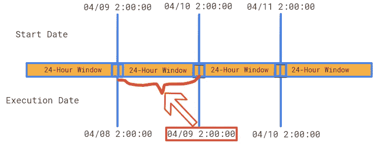

# 气流调度间隔 101

> 原文：<https://towardsdatascience.com/airflow-schedule-interval-101-bbdda31cc463?source=collection_archive---------2----------------------->

气流调度间隔可能是一个很难理解概念，即使对于从事气流工作的开发人员来说也很难理解。StackOverflow 上偶尔会出现一个令人困惑的问题:“为什么我的 DAG 没有按预期运行？”。这个问题通常表明气流调度间隔中的误解。在本文中，我们将讨论如何设置气流调度间隔，调度气流 Dag 的预期结果，以及如何通过示例调试气流调度间隔问题。


来源:[阿伦视觉](https://unsplash.com/@aronvisuals)来自 [Unsplash](https://unsplash.com/photos/BXOXnQ26B7o)

## 气流如何调度 DAGs？

首先，气流不是流式解决方案。人们通常把它作为 ETL 工具或 cron 的替代品。由于 Airflow 有自己的调度程序，并且它采用 cron 的调度时间间隔语法，因此 Airflow 调度程序中最小的数据和时间间隔是分钟。在调度程序内部，唯一持续运行的是调度程序本身。

然而，作为一个非流式解决方案，以避免锤你的系统资源，气流不会看，并触发你的 Dag 的所有时间。它以一定的时间间隔安排监控，这是一个名为`scheduler_heartbeat_sec`的可配置设置，建议您提供一个大于 60 秒的数字，以避免生产中出现一些意外结果。原因是 Airflow 仍然需要一个后端数据库来跟踪所有的进程，以防崩溃。设置更少的心跳秒数意味着 Airflow scheduler 必须更频繁地检查以查看是否需要触发任何新任务，这会给 Airflow scheduler 及其后端数据库带来更大的压力。

最后，气流调度器遵循心跳间隔，并遍历所有 DAG，计算它们的下一个调度时间，并与挂钟时间进行比较，以检查是否应该触发给定的 DAG。

## 为什么你需要一个开始日期？

每个 DAG 都有自己的时间表，`start_date` 就是 DAG 应该被包含在气流调度程序中的日期。它还有助于开发人员在 DAG 的生产日期之前发布它。你可以在气流 1.8 之前更动态地设置`start_date` 。但是，建议您设置一个固定的日期，更多详细信息可参考“[动态 start_date](https://github.com/apache/airflow/blob/master/UPDATING.md#less-forgiving-scheduler-on-dynamic-start_date) 上的宽松调度程序”。

## 我们应该使用哪个时区？

气流基础设施最初仅从 UTC 开始。尽管您现在可以将 Airflow 配置为在您的本地时间运行，但大多数部署仍然采用 UTC。在 UTC 下设置气流使跨越多个时区的业务变得容易，并使您在夏令时等偶然事件中的生活更加轻松。您设置的计划间隔将与您的气流基础设施设置相同。

## 如何设置气流调度间隔？

您可能熟悉定义 DAG 的语法，并且通常在 DAG 类的`args`下实现`start_date` 和`scheduler_interval` 。

```
from airflow import DAG
from datetime import datetime, timedeltadefault_args = {
    'owner': 'XYZ',
    'start_date': datetime(2020, 4, 1),
    'schedule_interval': '@daily',
}dag = DAG('tutorial', catchup=False, default_args=default_args)
```

## 为 schedule_interval 提供什么值？

[气流调度器](https://airflow.apache.org/docs/stable/scheduler.html)部分提供了关于您可以提供什么值的更多详细信息。当然，你需要一个 crontab 来处理`scheduler_interval`。如果你发现自己迷失在 crontab 的定义中，尝试使用 [crontab guru](https://crontab.guru/) ，它会解释你放在那里的内容。气流也给你一些用户友好的名字，如`@daily`或`@weekly`。我发现这些名字不如 crontab 简洁明了。它也仅限于几个时间间隔，底层实现仍然是 crontab，因此您甚至可能想要学习 crontab 并接受它。此外，如果你只是想触发你的 DAG，使用手动`schedule_interval:None`。

## execution_date 和 start_date 有什么区别？

作为调度程序，日期和时间是非常必要的组件。在《气流》中，有两个日期你需要付出额外的努力去消化:`execution_date` 和`start_date`。注意`start_date`与您在之前的 DAG 中定义的日期不同。

*   **execution_date** 是您期望 DAG 被触发的 **start** 日期和时间。
*   **start_date** 是 DAG 被触发的日期和时间，这个时间通常是指挂钟。

一个常见的问题是，“为什么 execution_date 不同于 start_date？”为了得到这个问题的答案，让我们看看一个 DAG 的执行情况，并使用`**0 2 * * ***`、**、**，这有助于我们更好地理解气流计划间隔。请参考以下代码作为示例。

调度程序 101 DAG

`**0 2 * * ***` 意思是每天凌晨两点气流会开始新的工作。我们可以让具有此间隔的 DAG 运行多天。如果你点击`Browse` → `Tasks Instances`，你会看到**执行日期**和**开始日期。**

我在 04–10 00:05:21(UTC)启动了这个新的 DAG，任何新的气流 DAG 通常首先会进行回填，这是默认启用的。正如您在下面的快照中所看到的， **execution_date** 按照预期完美地按天递增，时间也是预期的。另一方面， **start_date** 是气流调度程序开始任务的时间。


任务实例示例(作者图片)

在回填了所有之前的执行之后，您可能会注意到 04–09 不在这里，但是现在已经是 04–10 挂钟了。这里出了什么问题？

答案是:**没什么问题。**


来源:托尼·巴贝尔来自 https://gph.is/2jqoiRI

首先，Airflow 是用 ETL 思维构建的，这通常是一个 24 小时运行的批处理。考虑一个 ETL 作业，在 24 小时的窗口内，只有在 24 小时结束后才触发作业。同样的规则也适用于此，我们没有看到 04–09 上的 **execution_date** 是因为 24 小时窗口尚未关闭。从 **execution_date，**我们知道最后一次成功运行是在 04–08t 02:00:00(记住 **execution_date** 这里是 24 小时窗口的开始时间)，它结束于 04–09t 02:00:00(不含)。那么，04-09 运行的 24 小时窗口是什么呢？就是 04–09t 02:00:00 到 04–10t 02:00:00，还没到。



执行数据和开始日期的关系(图片由作者提供)

气流调度程序何时运行 04–09 执行？它会一直等到 04–10 02:00:00(挂钟)。一旦 04–09 的执行被触发，您将看到 **execution_date** 为 04–09t 02:00:00，而 **start_date** 将类似于 04–10t 02:01:15(这随着 Airflow 决定何时触发任务而变化，我们将在下一节中介绍更多)。

鉴于上述背景，你很容易明白为什么**的执行日期**与**的开始日期**不同。理解**执行日期**和**开始日期**之间的区别将会非常有帮助，当你尝试基于**执行日期**应用你的代码并使用类似`{{ds}}`的宏时

另一种思考方式是:**执行日期**将接近前一个**开始日期。**我们用一个更复杂的例子:`**0 2 * * 4,5,6**` ，这个 crontab 的意思是周四周五周六 02:00 运行*。*

下面是挂钟或**开始日期**的日历，红色文本是预计的执行日期。如果您有这样的计划间隔，那么对于气流会在 04–09 触发 04–04DAG 执行，您应该不会感到惊讶。


时间间隔示例(图片由作者提供)

## 为什么触发 Dag 会有短暂的延迟？

从上面的例子中，虽然我们发现日期不同，但时间略有不同。例如，对于每日间隔，**执行日期**为 04–09t 02:00:00，**开始日期**为 04–10t 02:01:15。气流对那 1.25 分钟的延迟有什么作用？

这类似于一个会议场景。你可能不会按照日历上的时间开始会议。比如，你有一个每周一上午 10:00:00 的虚拟会议邀请( **scheduler_interval** )。在本周一上午 10:00:00(**execution _ date**)，您从日历提醒中收到加入会议的通知，然后您单击该会议链接并开始您的虚拟会议。当您进入会场，会议开始时，时间是上午 10:01:15(**start _ date**)。


来源:[优 X 创投](https://unsplash.com/@youxventures)来自 [Unsplash](https://unsplash.com/photos/6awfTPLGaCE)

您可能已经注意到了 execution_date 和 start_date 之间的小延迟。理想情况下，它们应该是相同的，但现实并非如此。问题是为什么气流不会按时触发 DAG 并延迟其实际运行？正如我们之前讨论的，气流调度器不会一直监控 Dag。调度程序等待其下一个心跳来触发新的 Dag，这一过程会导致延迟。此外，即使调度程序准备在同一时间触发，您也需要考虑代码执行和数据库更新时间。以上原因都会造成调度的短暂延迟。

## 最终想法

我希望这篇文章可以揭开气流调度间隔是如何工作的。气流是一个内部复杂的系统，但对用户来说很简单。按照最初的 ETL 思维方式，理解气流调度器如何处理时间间隔可能需要一些时间。一旦您更好地理解了气流调度间隔，创建具有期望间隔的 DAG 应该是一个无障碍的过程。

希望这个故事对你有帮助。本文是我的工程&数据科学系列的**部分，目前包括以下内容:**


[赵承志](https://chengzhizhao.medium.com/?source=post_page-----bbdda31cc463--------------------------------)

## 数据工程和数据科学故事

[View list](https://chengzhizhao.medium.com/list/data-engineering-data-science-stories-ddab37f718e7?source=post_page-----bbdda31cc463--------------------------------)47 stories

你也可以 [**订阅我的新文章**](https://chengzhizhao.medium.com/subscribe) 或者成为 [**推荐媒介会员**](https://chengzhizhao.medium.com/membership) 可以无限制访问媒介上的所有故事。

如果有问题/评论，**请不要犹豫，写下这个故事的评论**或者通过 [Linkedin](https://www.linkedin.com/in/chengzhizhao/) 或 [Twitter](https://twitter.com/ChengzhiZhao) 直接**联系我。**