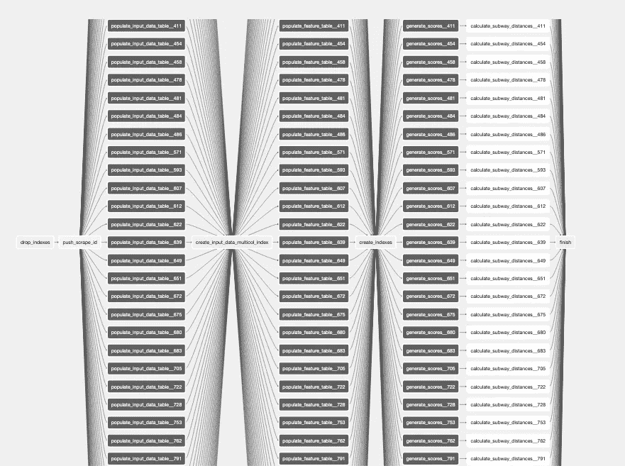

# 气流—在任务之间共享数据

> 原文：<https://towardsdatascience.com/airflow-sharing-data-between-tasks-7bbaa27eeb1?source=collection_archive---------6----------------------->



作者图片

## 如果你在网上寻找气流教程，大多数都会给你很好的介绍什么是气流。他们将从概念上谈论 ETL，DAG 是什么，构建第一个 DAG 并向您展示如何执行它。经常被忽略的是 DAG 的任务应该如何交换数据。

*本文假设你至少对什么是气流及其工作原理有一个基本的了解。*

如果你在网上寻找气流教程，大多数都会给你很好的介绍什么是气流。他们将从概念上谈论 ETL，DAG 是什么，构建第一个 DAG 并向您展示如何执行它。

经常被忽略的是这些任务应该如何交换数据。

在构建任务时要记住的一点是，任务必须是幂等的。简化一下我们的例子，这意味着如果使用相似的输入参数执行成功，那么无论您调用它们多少次，它们都会产生相同的结果。当与任务输入/输出相结合时，这可能并不总是显而易见的。

当考虑数据交换时，我们可以区分以下任务:

*   根本不需要共享数据
*   只分享一小块信息
*   运算符本身存储作为其执行结果的数据
*   可以以存储结果的方式编写的运算符
*   使用气流挂钩保存或读取结果的自定义操作员

**不需要数据共享**

这种任务关系的简单例子是在第一个任务中在数据库中创建一个表，并在下一个任务中填充该表。

这里最重要的是执行顺序。我们需要确保表存在，以便我们可以写入它。在我们的例子中，我们只需要确保第一个任务在第二个任务的上游，我们就可以开始了:

```
create_table.set_upstream(populate_table)
```

或者用我最喜欢的语法:

```
create_table >> populate_table
```

**共享小块数据**

在这里，达格的 XComs 开始发挥作用。它们易于使用，并允许在运行 DAG 的任何任务之间共享数据。它们被永久地保存在 Airflow 的元数据数据库中，但是我考虑在单个 DAG 之外使用它们作为反模式。

我听说过人们使用 XCom 在任务间共享大数据集的情况，这肯定是可能的，但由于一些原因应该避免。

首先，它破坏了元数据数据库，打破了气流是什么的概念——一个应该最低限度地参与执行和数据存储的编排器。

第二，不是所有的东西都可以储存。基本上，XCom 数据是泡菜，泡菜也有其局限性。

此外，有时 XComs 可能包含敏感数据，在决定将其存储在 Airflow 的数据库中之前，您应该三思而行。

应该记住的是，如果任务返回结果，那么这些结果将可用于下一个任务的“拉取”。不幸的是，您知道它们是否返回结果的唯一方法是深入研究 Operator 的源代码(我强烈推荐这种方法，因为它将极大地提高您对气流如何工作的理解)。

我不知道使用 XCom 共享的数据的最大大小应该是多少，但是我想说，如果它能加速 DAGs 的开发，那么几 MB 是可以的。或者换句话说，如果你的任务的结果没有内置的结果“存储”,你会觉得懒惰🙂要编写单独的操作符，您可以考虑将其推送到 XCom。

**具有“本地”结果存储的操作员**

很容易知道 operator 是否会存储它的执行结果，因为它是传递给 operator 类的参数之一。这里的示例是“BigQueryExecuteQueryOperator ”,其中查询输出被保存到另一个表中:

```
execute_query = BigQueryExecuteQueryOperator(
    task_id="execute_query_save",
    sql="SELECT * FROM MY_DATASET.TABLE_IN",
    use_legacy_sql=False,
    destination_dataset_table="MY_DATASET.TABLE_OUT")
```

为了使用结果，流水线中的下一个任务必须到达 TABLE_OUT。

**可以被“强制”存储数据的操作员**

假设我们的操作符没有等效的“destination_dataset_table”参数。

当然，您可以通过继承“BigQueryExecuteQueryOperator”来编写自己的操作符，但有时更简单的选择是编写您的查询，以便将结果存储在某个地方。类似于:

```
INSERT INTO TABLE_OUT
SELECT <columns> FROM TABLE_IN
```

**自定义操作员读/写**

如果你运气不好，剩下的就是使用气流的钩子来完成这项工作。该选项既可用于写入任务的结果数据，也可用于在下一个必须使用它的任务中读取数据。是的，这意味着您必须编写一个自定义任务，例如如下所示:

```
def load_data(ds, **kwargs):
    conn = PostgresHook(postgres_conn_id=src_conn_id).get_conn() # Notice: cursor had to be named to make loading in batches work      (so called "server cursor")
    cursor = conn.cursor('serverCursor')
    cursor.execute(kwargs['query']) while True:
        records = cursor.fetchmany(size=10000)
        if not records:
            break
        *[ ... do something with records ...]* cursor.close()
    conn.close()
```

并使用例如“PythonOperator”来执行它:

```
load_and_transform = PythonOperator(task_id='load_and_transform',
    python_callable=load_data,
    op_kwargs={'query': 'SELECT * FROM TABLE_IN'},
    provide_context=True,
    dag=your_dag)
```

我希望这些简单的技巧能帮助你写出更可靠的任务。

*旁注:如果你正在寻找在任务间传递数据时更友好的工具，可以看看与 Airflow 有很多相似之处的 impfect . io，并尝试修复 Airflow 的错误。请记住，使用它并不是完全免费的。*