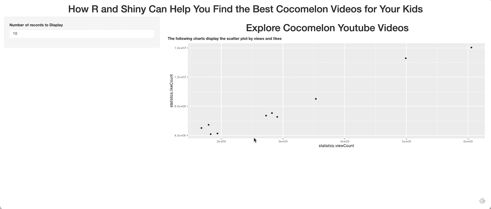

# 气流状态 101

> 原文：<https://towardsdatascience.com/airflow-state-101-2be3846d4634?source=collection_archive---------15----------------------->

## 阿帕奇气流状态概述

(图片由 [Unsplash](https://unsplash.com/s/photos/windmill?utm_source=unsplash&utm_medium=referral&utm_content=creditCopyText) 上的 [Zbynek Burival](https://unsplash.com/@zburival?utm_source=unsplash&utm_medium=referral&utm_content=creditCopyText) 拍摄)

在 Airflow 中，为了描述等待执行后续步骤的 DAG 或任务的状态，我们定义了 State 来共享有关管道进度的信息。如果没有状态，任何 DAG 或任务的执行都会变成黑盒，您可能需要创建额外的外部标志或资源来检查状态，以帮助确定作业是完成还是失败。幸运的是，Airflow 提供了状态机制，并将最近记录的每个状态存储在其后端数据库中。这种方式不仅易于在 Airflow UI 或 DB 中查看任何作业的状态，而且它还是一个持久层，有助于在遇到故障时重新运行或回填。

在本文中，我们将讨论什么是气流状态，这些状态有哪些类型，如何使用气流状态进行测试和调试。可能有外部服务，气流也可能跟踪这些状态，但这些状态不在我们讨论的范围内。

# 国家在气流中做什么？

现实生活中状态的一个很好的例子就像交通灯。你会有三种状态:红色、黄色和绿色。红灯禁止任何车辆通行，而绿灯允许车辆通行。

走红绿灯(Gif By [SPAR](https://giphy.com/gifs/MySPAR-spar-my-green-tag-sale-RK4gAjDOPT8Lys5TvG)

气流状态的最基本用法是指定当前状态，并指定气流调度程序来决定未来的动作。虽然气流有更多的状态，类似于红绿灯，但也有一些共同的特征。

*   没有双重状态。在气流中，状态是单个值。不允许双重状态。这样，一个同时有“Failed”和“UP_FOR_RETRY”的状态在这里就没有太大意义了。
*   状态是静态的，或者是给定时刻的快照。Airflow 将状态保存在其后端数据库中，并且状态的更新不是一个连续的过程。由于 Airflow 调度程序的心跳间隔，您可能会遇到数据库中的状态更新滞后，调度程序停止运行的罕见情况。
*   状态有一个定义的生命周期。气流库中有详细的[生命周期图](https://github.com/apache/airflow/blob/main/docs/apache-airflow/img/task_lifecycle_diagram.png)。状态必须遵循生命周期的流程，除了重试的情况，状态通常不能后退。

# 那些状态是什么？我什么时候能见到他们？

对于当前版本的气流 1.10.11，气流中的状态有两个主要类别:任务和运行。

*   Dagrun:成功，正在运行，失败；
*   任务:成功、正在运行、失败、上游失败、已跳过、启动重试、启动重新计划、排队、无、已计划。

气流任务等级状态(作者供图)

DAG 是任务的集合；DAG 的状态就像你家里的主电源开关。如果它失败了，即使您让它的任务继续运行，气流调度程序也会忽略它，因为 dagrun 的状态是 failed。

DAG 级别的状态就像主电源开关(Ariel Victor 的黑白动画 GIF)

任务级别的状态处于更细粒度的级别，因为任务之间可能存在依赖关系。一些状态可能有多个连续的状态，这就是为什么在任务级别有更多的状态来处理更复杂的情况。例如，upstream_failed 表示当前任务由于上游失败而无法执行。

查看状态的另一种方式是查看状态是已完成还是未完成。完成状态意味着气流调度程序将不再监控它们，因此它不在调度和监控的范围内。另一方面，对于未完成状态，那些是待定状态，对于当前未完成状态将有即将到来的改变，但是最终目标是达到完成状态。

至于现在，已完成的状态是 SUCCESS，FAILED，UPSTREAM_FAILED(注意这一个在已完成状态列表中没有提到)，和 SKIPPED，其余都是未完成状态。

让我们更详细地检查每个状态并进行讨论。

成功状态

**成功** *(在 dagrun 和任务级别|完成状态下)*:成功状态表示气流在运行作业时没有遇到任何错误，并且成功完成。在气流中，dagrun 有一个深绿色的圆圈，任务等级有一个深绿色的方块。即使对于一个虚拟任务，因为没有任何错误，虽然气流在这里没有执行任何有意义的事情，但它仍然会将虚拟任务视为成功，因为我们告诉气流不要运行任何东西，气流应该会将成功返回给我们。

运行状态

**正在运行** *(在 dagrun 和任务级别|未完成状态状态中)*:正在运行状态确定气流调度器已经将那些 dag 或任务分配给执行器。它正在监视(通过心跳)它的状态，执行器正在运行实际的作业。在气流中，dagrun 有一个浅绿色的圆圈，任务等级有一个浅绿色的方块。由于运行是一种未完成状态，因此在任何给定时间，您的 dag 或任务都可能失败，然后会导致重试或失败状态。此外，在任务级别，当给定的任务仍在运行时，如果您重新运行任务本身(通过清除其状态)，有时气流调度程序会进入**关闭**状态，这是关闭和终止任务的外部请求。

失效状态

**失败** *(在 dagrun 和任务级|完成状态下)*:失败状态向用户指出在执行期间出现了问题，气流无法调度执行到底。在气流中，dagrun 有一个红圈，任务等级有一个红方块。由于气流中没有双重状态，对于部分成功，dagrun 仍然会标记为失败，以便用户进一步探索。另一方面，在任务层，Airflow 标记了确切的失败任务，并且该任务的所有下游都标记为 UPSTREAM_FAILED(如果 *trigger_rule 默认为 all_success* )，这很好地帮助用户立即找到失败的最初原因。

上游 _ 失败状态

**UPSTREAM_FAILED** *(仅限任务级|完成状态):*上游失败状态是指上游发生了一些错误的状态。您也可以有多个上游，在这种情况下，您可以考虑 *trigger_rule* ，它默认为 *all_success* 。在这种情况下，如果任何上游任务失败，就会得到 UPSTREAM_FAILED。然而，如果你不想有这种行为，气流提供了更多的选项，例如，你可以做 *one_success，*如果只有一个上游任务是成功的，它将继续当前的任务。

跳过状态

**跳过** *(仅限任务级|完成状态):*跳过状态是已经被忽略执行的任务，调度器绕过该任务继续执行。在分支操作中，跳过一个任务通常是一种预期的行为，您有多个条件可以选择，一旦决定了其中的一些，未选择的将被标记为跳过。您还可以在不使用分支运算符的情况下明确标记跳过的任务，这涉及手动设置气流状态。每当您跳过一个任务时，它的所有下游任务也会被跳过。

启动重试状态

**UP_FOR_RETRY** *(仅任务级|未完成状态)*:UP _ FOR _ RETRY 状态表示之前的尝试已经失败，因为该任务已经重试了多次，它被标记为准备重试。但是在下一次迭代中，任务需要等待多长时间才能重试呢？气流调度程序在重试时间间隔过后等待，并在下一个调度程序的心跳到达时启动。

启动重新计划状态

**UP _ FOR _ schedule***(仅任务级|未完成状态)*:UP _ FOR _ schedule 是自 Airflow 1.10.2 以来新引入的状态，更多细节可以参考 Apache Airflow 1.10.2 新版本中的[亮点。这种状态主要适用于传感器，它有助于避免消耗所有工作插槽，以便解决死锁情况。](https://godatadriven.com/blog/highlights-from-the-new-apache-airflow-1-10-2-release/)

排队状态

**排队** *(仅任务级|未完成状态)*:当任务等待执行器中的槽时，触发队列状态。队列状态只是一个等待执行程序在管道中执行簿记的列表，执行程序将任务分配给工作程序来运行实际的任务。一旦一个槽可用，就从队列中拉出一个任务(有优先级)，工人将运行它。

无状态

**无** *(仅任务级|未完成状态)*:无状态可能会引起混淆，因为它在某些语言中表示未知。这里它只是一种描述新任务创建的方式，它的初始状态是未知的。当一个新的 dagrun 启动时，您会观察到 None 状态，它的所有任务首先都是 None。此外，如果您想要重新运行某些 Dag 或任务，一旦您清除了状态，所有这些状态都将变为 None 状态。在后端，如果是第一次启动 dagrun，尽管所有任务都处于 NONE 状态，但在任务被调度之前，您不会在 DB 中找到任何条目。然而，重新运行一个任务来清除它的状态是另一回事，在重新运行之前，您会在 DB 中找到它以前的状态。

**已调度** *(仅限任务级|未完成状态)*已调度状态是让气流将任务发送给执行者运行。气流调度程序检查多种条件，以确定是否可以调度任务。例如，由于整个气流中的可用时隙，以及挂钟时间和计划时间之间的时间，任务可以被阻止进行计划。一旦满足了调度的所有条件，气流调度器就会将任务推进到调度状态。

一个令人兴奋的功能是改变气流用户界面的颜色。如果你不喜欢默认的，这个新特性是在 Airflow 1.10.11 中引入的，你可以[在 UI 中自定义状态颜色](https://airflow.readthedocs.io/en/latest/howto/customize-state-colors-ui.html)

# 气流任务状态的生命周期

气流任务生命周期图(来自[阿帕奇气流](https://github.com/apache/airflow/blob/master/docs/img/task_lifecycle_diagram.png)

该状态由气流调度器和执行器驱动和控制。Airflow 官方 GitHub 有这个生命周期图，很好地展示了状态流程图。我们已经讨论了每个状态和传感器的状态(UP _ FOR _ RESCHEDULE)。此图还显示了每个组件的可能状态列表。可选阶段转换是每个气流操作器的选项，由用户控制以可选地执行重试。尽管如此，所有其他阶段都必须遵循这个转换流程。

# 最终想法

五彩缤纷的国家(照片由[汉娜·摩根](https://unsplash.com/@hannahmorgan7?utm_source=unsplash&utm_medium=referral&utm_content=creditCopyText)在 [Unsplash](https://unsplash.com/s/photos/ferris-wheel?utm_source=unsplash&utm_medium=referral&utm_content=creditCopyText) 上拍摄)

状态是气流生态系统中不可或缺的元素。状态就像气流中的安全带。它对每个 dagrun 和任务进行跟踪，每当 Airflow 调度器、执行器或工作器中出现崩溃时，状态会作为检查点执行，因此我们不必从头开始。此外，由于状态也显示在 Airflow UI 中，每个人都将其作为监控状态的中心位置。最后，Airflow 在内部使用状态来跟踪任务的进度，工程师可以依靠状态来执行更多定制的任务。我希望这篇文章能给你一个气流状态的基本概念，以及为什么理解每种状态之间的区别是必要的。干杯！！

希望这个故事对你有帮助。本文是我的工程&数据科学系列的**部分，目前包括以下内容:**

[赵承志](https://chengzhizhao.medium.com/?source=post_page-----2be3846d4634--------------------------------)

## 数据工程和数据科学故事

[View list](https://chengzhizhao.medium.com/list/data-engineering-data-science-stories-ddab37f718e7?source=post_page-----2be3846d4634--------------------------------)47 stories

你也可以 [**订阅我的新文章**](https://chengzhizhao.medium.com/subscribe) 或者成为 [**推荐媒介会员**](https://chengzhizhao.medium.com/membership) 无限制访问媒介上的所有故事。

如果有问题/评论，**请不要犹豫，写下这个故事的评论**或通过 [Linkedin](https://www.linkedin.com/in/chengzhizhao/) 或 [Twitter](https://twitter.com/ChengzhiZhao) 直接**联系我。**