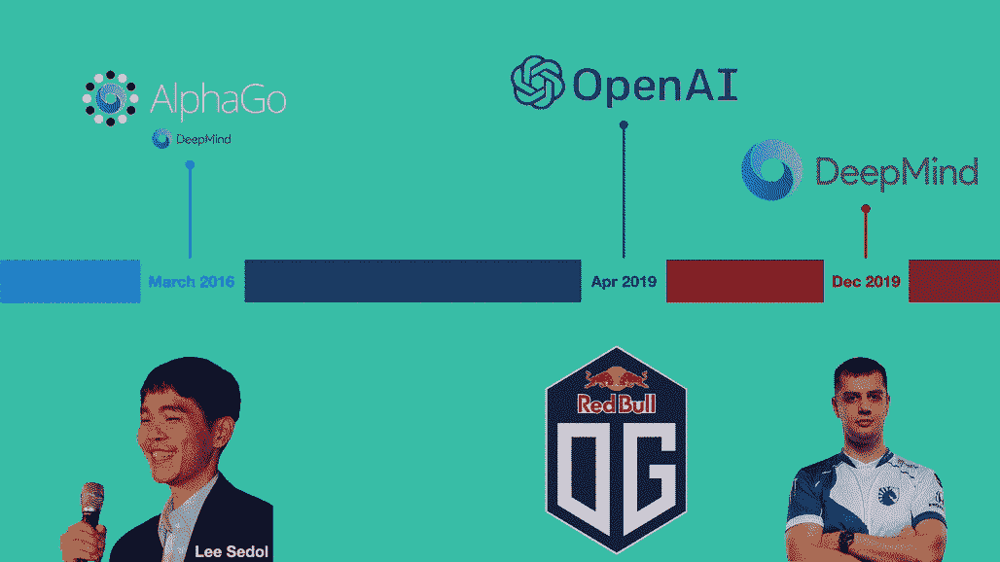

# 人工智能与人类的共存以及为什么我们都应该关注它

> 原文：<https://towardsdatascience.com/ais-coexistence-with-humans-and-why-we-should-all-be-concerned-37a8cc444600?source=collection_archive---------43----------------------->

## 对李开复《人工智能的超能力》的再思考

## 我们离完全的 AI 共存还有多远？

***注*** *:这篇文章很大程度上是受李开复的‘AI 超能力’的启发，加上我个人的一些想法。许多观点是从他的书中摘录的，任何发现的相似之处都是有意的。*

作为一名人工智能的学生、实践者和倡导者，我很幸运能够一窥人工智能技术在表面之下是如何工作的，并且在一定程度上也让我想象人工智能不仅在现在，而且在未来会有什么样的可能性。

对于普通人来说，人工智能被视为一种有可能在不同工作领域取代人类的技术，而且这种取代已经开始。然而，他们没有看到的是，人类和整个社会将在多大程度上受到人工智能革命的影响，就像工业革命和互联网繁荣如何戏剧性地改变了我们的生活方式一样。

让我感到害怕的是，如果人们继续忘记人工智能到底是什么以及它能做什么，郝在所谓的“人工智能精英”与世界其他人(她认为是“无用”的人)之间的反乌托邦世界可能会成为现实。

作为一名未来学家，我认为在过渡到人工智能驱动的世界时，每个人都应该意识到这一点。

来源:[来自 istockphoto 的 BahadirTanriover](https://www.istockphoto.com/fi/portfolio/BahadirTanriover?mediatype=photography)

# 有了今天的人工智能技术，很大一部分工作将会、能够并且已经被取代

> 蒸汽机、缝纫机、电的发明都取代了工作。我们已经克服了。人工智能的挑战在于，这 40%，无论是 15 年还是 25 年，都比以前的革命来得更快。”
> 
> —李开复

上面的引用概括了 *Lee* 对我们目前生活的这场**人工智能革命**的预言——在未来 15 到 25 年内，世界上 40%的工作将被人工智能技术取代，关键的区别在于这种取代的变化率。

## 人工智能革命——第三次工业革命？

在人类历史上，我们从第一次工业革命中幸存了下来——这是一次向新制造工艺的大规模过渡，彻底改变了商品的生产方式。随后，我们在第二次工业革命中蓬勃发展，也被称为技术革命，这是一个商品和服务快速标准化和工业化的阶段，包括铁路网络、污水处理系统、电气化、海运、汽车等领域。

许多人现在将我们生活的时代称为人工智能革命，也可能是我们(未来)的孩子可能知道的第三次工业革命，因为商品和服务的消费方式已经发生了巨大的变化。相对于生产的商品数量，今天提供的服务的数量和类型已经激增，因为互联网使这成为可能。

不仅仅是互联网，而是支撑整个互联网生态系统的外围设备的快速发展，以及随之而来的人工智能的发展。

## 回到起点——人工智能的崛起

人工智能是一种在有明确输入和输出的问题上蓬勃发展的技术。通常，这些是优化问题(监督学习)，如信用评分、垃圾邮件分类和情感分析。当输出没有被标记时(例如，垃圾邮件/非垃圾邮件，肯定/否定)，我们也可以根据算法“认为”每个数据点应该被分类到什么类别来进行分类(无监督)。前面提到的是典型的传统机器学习方法(例如，随机森林、支持向量机、逻辑/线性回归、基于密度的模型)，它们已经存在并被研究了很长一段时间。

导致这场人工智能革命的是深度学习技术进步的扩散和广泛采用。不是“创造”而是 ***采用*** 这项技术。

正如李所说，我们不是处在一个发现的时代，而是处在一个实施的时代。人们很容易被误导，因为媒体不断报道新的突破性成果，如谷歌的 *DeepMind* 和埃隆马斯克的 *OpenAI* 击败的 [*AlphaGo*](https://en.wikipedia.org/wiki/AlphaGo_versus_Lee_Sedol) 、 [*Dota 2*](https://www.vox.com/2019/4/13/18309418/open-ai-dota-triumph-og) 和 [*星际争霸*](https://www.newscientist.com/article/2221840-deepminds-starcraft-playing-ai-beats-99-8-per-cent-of-human-gamers/) 。回到 2016 年，*李·塞多尔*甚至无法想象一个计算机程序在*围棋*中击败他。如今，他已经(2019 年)从*围棋*退役，因为他认为“*即使【他】成为№ 1，也有一个不能被打败的实体*”[5]。

围棋、DotA 2 和星际争霸冠军被 AI 击败(图片来源:作者创作)

继 *AlphaGo* 之后， *Dota 2* 和 *Starcraft* 等更复杂的实时多人在线对战竞技场(MOBA)游戏中的职业队伍也在人们认为不可能完成的任务中被废黜。在像 *Go* 这样的回合制游戏中，计算机程序可以*可能*穷尽游戏的所有可能状态(*棋盘或游戏在任何给定时间点的状态*)，并预测下一步最佳行动应该是什么，在游戏的多次迭代中进行训练，并采用各种探索-利用策略。对于 MOBA 游戏，这些游戏状态指数(可能)为无穷大，包括额外的复杂性，如博弈论、不完全信息、长期规划和实时多人互动[3]。然而，人们不知道的是，这些突破实际上是同一基础技术的不同应用。

AlphaStar 在行动(来源:Deepmind 的[博客](https://deepmind.com/blog/article/alphastar-mastering-real-time-strategy-game-starcraft-ii)

秘制酱？**深度学习**。

深度学习使用神经网络——一种通过特定网络结构解析输入的独特方式——来训练模型，以理解输入和输出之间的线性和非线性关系。神经网络试图以类似的结构模拟我们大脑中的神经元，权重作为我们在决策时对每个特征(因素)的重视程度。这种捕捉非线性的能力是与传统机器学习模型的关键区别，传统机器学习模型本质上大多是线性的。

为什么不早点采用这项技术？

尽管深度学习自 2000 年代以来就已经存在，但直到 2016 年，由 *Yann LeCun* (人工智能的教父之一)领导的人工智能研究人员团队在世界上最大的图像识别比赛中超过了基准错误率 *ImageNet* ，社区才认识到它。当时，由于缺乏研究资金、计算能力和认可，很少被采用。

艾教父:(从左至右)约舒阿·本吉奥、扬·勒村和杰弗里·辛顿(图片来源:作者创作)

今天，随着 GPU 和 TPU 为我们的人工智能系统提供支持，人们能够将开源技术应用到许多不同的领域。过去由博士主导的领域现在不再有同样的准入门槛，因为推进技术需要先进的技术技能，而*技术应用*不需要同样的严格程度。这就是开源技术的魅力所在，它为人们提供了实验甚至改进的基础。

借助这项新技术，我们可以看到深度学习在不同行业的快速应用——从制造业到零售业到银行业，从蓝领工人到白人。人工智能时代是一个变革的时代，一个颠覆可能成为新常态的时代。我们经常看到行业被打乱，运营被打乱，我们的道路上可能挤满了自动驾驶汽车。

## 谁有被技术‘取代’的风险？

李将工作大致分为两类——体力劳动和认知劳动。在下面的两个图表中，纵轴描述了工作中的社会参与程度。

第一张图表代表体力劳动岗位的替代风险，横轴描述环境中的结构水平。如前所述，AI 非常擅长学习输入与输出有某种形式关系的任务(即近似`f(x) = y`)。不用说，基于规则的工作是最容易取代的，因为它不需要人工智能，只需要简单的自动化。

**替换风险:** **体力劳动**(来源:作者创作，内容改编自李《AI 超能力》)

第二张图表代表了认知劳动工作的替代风险，横轴描述了所涉及的创造力水平。

**替换风险:** **认知劳动**(来源:作者创作，内容改编自李《AI 超能力》)

人们可以观察到体力劳动和认知劳动之间的一些相似之处——与具有某种不可预测性或需要创新思维的工作相比，涉及重复工作和很少社交互动的基于规则的工作(体力或认知)风险更大。

## 被取代还是被置换？

虽然更多的“传统”工作可以被取代，但我认为这 40%受影响的工作中有很大一部分是被取代的，而不是被 T21 取代的。

人工智能从未被创造出来做人类的工作——至少不完全是。机器人就是为此而生的。你可能会问这有什么区别？在我看来，机器人代表了人工智能可以驻留的物理实体。换句话说，人工智能代表了机器人的“T2 大脑”。传统工作之所以会被取代，是因为我们只需要一个拥有“基于规则的大脑”的机器人。这就是工业革命发生并改变商品生产方式的原因。

然而，有了人工智能，我们试图解决的问题会成倍地(也许是无限地)变得更加困难。在医疗场景中，AI 很大程度上用于诊断甚至药物开发和患者监测的阶段。图像识别的使用在医疗保健中更加普遍，因为图像识别变得如此之好如此之快。这通常在 X 射线图像上进行，以在检测乳腺癌甚至新冠肺炎的迹象时识别异常。在前者中，已经确定人工智能在诊断乳腺癌方面“优于”医生，假阳性率降低了 1.2%，假阴性率降低了 2.7%[6]。

在银行业，人工智能用于识别交易中的异常情况(即欺诈)并批准贷款。在海事方面，AI 用于识别海上物体，防止碰撞。在电子商务中，人工智能被用来预测你可能会购买什么商品。在我们消费内容的网站上，人工智能被用来推荐我们可能想要观看或阅读的项目。在我们的 iPhones 上，人工智能被用来自动完成我们的文本，回答我们在谷歌搜索上键入的问题(也称为自然语言处理中的问答)，甚至在我们懒得自己做的时候，使用语音识别为我们设置闹钟。

这里的底线是——**AI*补充了*我们做事的方式，因为它抽象出了我们可能必须提供客观意见的情感元素。**在乳腺癌诊断中，需要多名放射科医生做出判断，尤其是当这些判断不一致时。个体放射科医生一生中只能经历有限次数的 x 光检查，并且受到疲劳和容易出错的限制。人工智能系统可以在一天内通过同样数量的 X 射线，全天候工作，并提供类似甚至更高的准确性。这也适用于其他工作。

然而，由于做同样工作所需的人员数量将会减少，人员流动是不可避免的。新的补充性工作将会出现，以帮助这一过渡，例如需要了解如何操作这些人工智能驱动技术的人员。

剩下的问题是:

> 我们如何应对，更重要的是，如何适应人工智能带来的这些变化？

# 真正的人工智能危机

是的，AI 很吓人。

如果我们不知道它能做什么，那就太可怕了。如果我们无所事事，让我们的工作被取代，或者更糟糕的是，被人工智能取代，这也很可怕。

## 自满

在个人层面上，我们必须意识到人工智能的能力和可能性。思考人工智能如何影响我们的生活是很重要的。如果我们选择不理解人工智能到底是什么，我们就会失败，并有被取代或取代的风险。

在国家层面，各国需要开始思考和利用他们拥有的任何数据。政府在推动人工智能和技术的采用方面发挥了巨大作用，正如中国如何在几十年内从技术落后者加速成为人工智能超级大国一样。人工智能有一种赢者通吃的趋势，因为先行者可以扩大庞大的用户群，而这本身就会产生数据，从而形成一个自我延续的循环。

## 能力

我们在个人、企业和国家各个层面都承担责任。就个人而言，跟上这场人工智能革命是我们的责任。 ***提升技能*** 前所未有的重要。有了互联网上的大量可用资源，学习几乎任何技能现在都是可能的。

在企业和国家层面，变革通常来自高层。高级管理层和内阁部长需要鼓励创新，并拨出预算来鼓励创新。人才管理也是至关重要的，因为人工智能人才是稀缺和流动的。

## 合作的

在全球范围内，世界上可能不可避免地会出现一些人工智能巨头(在人工智能领域占据主导地位的公司和国家)。这无疑会造成贫富之间以及第一和第三世界国家之间的差距越来越大。随着强大的力量而来的是巨大的责任(*是的，cheesy I know*)——我真的希望这些人工智能大亨们能够共同努力，在国内和国际上弥合这一差距。

# 我们会在有生之年体验完全的人工智能自主吗？

简而言之，没有。

事实是，今天的人工智能没有许多人想象的那么好，但也没有我们担心的那么糟糕。我们常常害怕我们没有完全掌握的东西。

在 *Lee* 的书中，他将*自主 AI* 描述为第四波 AI(第一波是*互联网 AI* ，第二波是*商业 AI* ，第三波是*感知 AI* )。它代表了机器从极其复杂的数据集进行优化的能力与其新发现的感官能力的融合[1]。简而言之，当机器被赋予根据它感知的事物(无论是视觉还是听觉)做出决定的能力(T21)。这些与简单地基于一套规则运行的机器形成了鲜明的对比。

我们今天最接近的东西是自动驾驶汽车。然而，当谈到自主人工智能时，仍然有许多考虑和影响，人工智能伦理和治理发挥着巨大的作用。为了实现完全的人工智能自主，我们必须超越我们的有生之年去想象可能性。

# 遗言

人工智能塑造我们世界的方式每天都让我感到惊讶，我希望这篇文章能揭示出今天我们的生活与人工智能是如何融合的。更重要的是，理解人工智能对我们个人、工人和全球公民的影响，是创造一个未来几代人可以生活的更加公平的世界的基础。

如果你还没有读过李开复的《人工智能的超能力》，我强烈建议你读一读！

来源:[故事镜头](https://www.getstoryshots.com/books/ai-superpowers-summary/)

***支持我！*** —如果你喜欢我的内容并且*没有*订阅 Medium，请考虑支持我并通过我的推荐链接[订阅这里](https://davidcjw.medium.com/membership) ( *注意:你的一部分会员费将作为推荐费*分摊给我)。

## 参考资料:

[1] [AI 超级大国——中国、硅谷与世界新秩序，*李开复*](https://www.amazon.com/AI-Superpowers-China-Silicon-Valley-ebook/dp/B0795DNWCF)

[2] [人工智能超能力对抗所有其他超能力](https://qz.com/963248/meet-hao-jingfang-author-of-folding-beijing-the-dystopian-science-fiction-writer-who-advises-chinas-government/)

【3】[阿尔法星:掌握即时战略游戏星际争霸 2](https://deepmind.com/blog/article/alphastar-mastering-real-time-strategy-game-starcraft-ii)

【4】[开启 AI — Dota 2](https://openai.com/projects/five/)

李·塞多尔退休了

[6] [人工智能“胜过”诊断乳腺癌的医生](https://www.bbc.com/news/health-50857759)