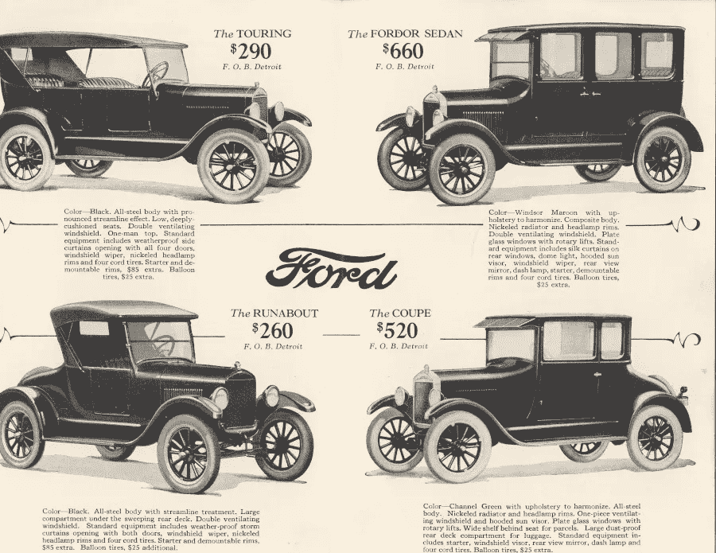
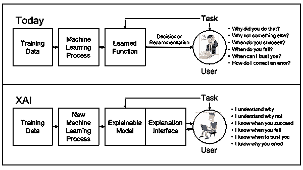
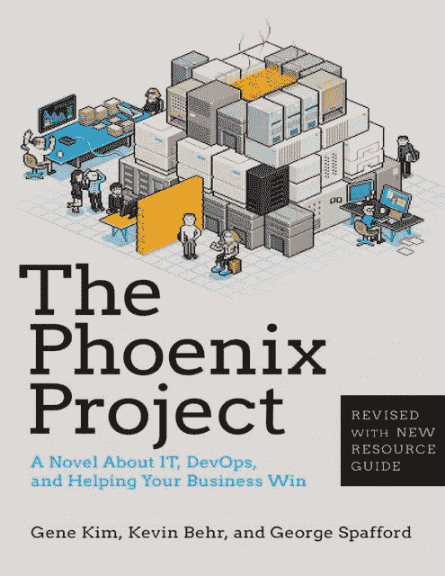

# 艾的凤凰计划时刻

> 原文：<https://towardsdatascience.com/ais-phoenix-project-moment-b51f581711d8?source=collection_archive---------19----------------------->

**艾的凤凰计划时刻**

2018 年晚些时候，在亚利桑那州一段荒凉的双车道高速公路上，[伊莱恩·赫尔茨贝格](https://en.wikipedia.org/wiki/Death_of_Elaine_Herzberg)赢得了她从未想要的荣誉。

她成为第一个被自动驾驶汽车撞死的行人。

当汽车花费 290 到 520 美元的小财富时

她和 122 年前的一个女人[布丽奇特·德里斯科尔](https://www.washingtonpost.com/news/tripping/wp/2018/03/22/fatal-crash-with-self-driving-car-was-a-first-like-bridget-driscolls-was-121-years-ago-with-one-of-the-first-cars/)有着相似的悲惨命运，她于 1896 年死于一项早期实验技术之手，当时她正在伦敦的傍晚散步:

一辆车。

普通大众喜欢把人工智能看作超人，在某种程度上他们是超人。他们可以击败世界上最好的围棋选手或 99%的 DOTA 2 选手，这是一款非常复杂的实时战略游戏。

但这并不意味着它们是完美的。即使今天最先进的人工智能也会犯严重的错误，包括大多数人会发现很容易克服的错误。

当我们把人工智能从棋盘游戏和视频游戏的狭窄领域中拿出来，放到现实世界中时，它们面临着一系列永无止境的边缘情况和意想不到的场景。这一点在高风险的自动驾驶汽车领域表现得最为明显，在这个领域，每一个错误都可能意味着生死之别。

Lyft 无人驾驶汽车部门研发负责人吕克·文森特(Luc Vincent)表示，无人驾驶汽车可能出现的问题几乎是无限的。

Lyft 自动驾驶汽车测试

Lyft 发现，当他们被其他司机超车时，他们的汽车正在刹车。另一家自动驾驶汽车公司 Zoox 发现他们的汽车无法处理黄色的左手转向灯，因为大多数转向灯都是绿色的。他们不得不请艺术家来绘制黄色的转向信号，并加载到他们的模拟软件中。很快，Zoox 的汽车在现实世界中看到它们的能力有了很大提高，但无论你做什么，总会出现另一种情况。

“这有点像打地鼠。“你解决了一个问题，另一个问题可能会出现，”应用直觉公司首席执行官合撒儿·尤尼斯说，根据 CNN 的优秀文章关于这个“世代型技术挑战”所面临的无尽困难

著名机器人专家、麻省理工学院荣誉退休教授罗德尼·布鲁克斯给[写了一篇非常长且详细的帖子](https://rodneybrooks.com/edge-cases-for-self-driving-cars/)，解释了为什么他认为无人驾驶汽车比几乎所有人想象的都要遥远。他列举了几十个边缘案例:

*   如果你沿着一条狭窄的单行道走，这条单行道被建筑挡住了，那么违反法律回到这条单行道上可以吗？
*   这辆车能应付青少年恶作剧和大喊冲突的命令吗？
*   汽车能理解警察或路边工作人员的手势吗？
*   汽车能识别别人贴的假路牌还是损坏的路牌？

# 变得有鸭意识还是机器推理的局限性

所有这些场景对今天的人工智能来说都非常困难，因为它们没有更深层次的上下文意识或通用抽象推理。情境人工智能是人工智能研究的前沿，这就是为什么它得到了像 DARPA 这样的[未来主义组织的资助。](https://venturebeat.com/2018/10/23/darpa-wants-to-build-contextual-ai-that-understands-the-world/)

DARPA 可解释人工智能框架

让人类如此神奇的是，我们善于从其他问题中抽象出解决方案，来解决我们从未见过的全新问题。我们可以研究物理定律、运动定律和惯性定律，建造一艘前所未有的火箭，并首次在月球着陆。

一个[卷积神经网络](https://hackernoon.com/learning-ai-if-you-suck-at-math-p5-deep-learning-and-convolutional-neural-nets-in-plain-english-cda79679bbe3) (CNN)可以研究火箭的例子，但如果没有现成的解决方案来建造火箭，那么它就不能发明一个。一个从未见过鸭子的 CNN 不会突然意识到鸭子的存在。

无人驾驶汽车推动了可能性的极限。关于我们现在已经有自动驾驶汽车自信地行驶在纽约市普通街道上的疯狂乐观的预测正在让位于现实检验意识，这可能比我们想象的要长得多。

在一个层面上，我们遇到了深度学习和强化学习的局限性。在最近的人工智能最大的会议之一 NeurIps 上，一些业界最耀眼的明星，包括蒙特利尔人工智能研究所 Mila 的主任 Yoshua Bengio，就人工智能的现状给出了一个发人深省的信息:

> “我们有以非常狭窄的方式学习的机器，”本吉奥说。“他们需要比人类智能例子多得多的数据来学习一项任务，他们仍然会犯愚蠢的错误。”

机器人专家罗德尼甚至走得更远，他说，要拥有一辆真正的[4 级或 5 级](https://www.forbes.com/sites/annatobin/2019/07/07/what-are-the-different-levels-of-self-driving-cars/#767b1e3ff475)自动驾驶汽车，这意味着汽车不需要轮子，可以在除了最糟糕的天气条件之外的任何情况下行驶，并做出自己的决定，将需要某种接近人工通用智能的东西(AGI)。仅仅将一堆互不相连的神经网络缝合在一起，并希望更高形式的理解会神奇地出现是不够的。

要让一辆自动驾驶汽车在现实世界的混乱中工作，在司机按喇叭和插队的情况下，在坑坑洼洼、破损的交通灯或贴满贴纸的街道标志的情况下，我们很有可能无法在今天的人工智能艺术中实现这一目标。现在，我们是否能利用神经网络的魔力让自动驾驶汽车发挥作用，或者我们是否需要新的算法，将在全球顶尖 R&D 团队的实验室中决定，因为他们正在竞相寻找解决方案。

但是如果我们仔细观察，自动驾驶汽车的世界向我们展示了一个更加基本和根本的问题，这个问题正在摧毁数据科学团队，而且我们现在就可以解决这个问题。

# 红队崛起的凤凰

87%的数据科学项目[从未投入生产](https://venturebeat.com/2019/07/19/why-do-87-of-data-science-projects-never-make-it-into-production/)是有原因的。

今天，大多数数据科学团队都不知道如何处理边缘情况，当我们的模型遇到现实生活时，这些情况就像野生兔子一样成倍增加。

一个 ConvNet 看到左边的图像是一个 45 英里每小时的标志！

自我学习的算法有各种各样的场景，只是我们无法预见，直到它们迎面而来。如果你的视觉检测系统有 97%的准确率，但检测到[一个涂鸦覆盖的停车标志是 45 英里/小时的标志](https://spectrum.ieee.org/cars-that-think/transportation/sensors/slight-street-sign-modifications-can-fool-machine-learning-algorithms)，它的准确率可能为零，因为有人会受伤或死亡。

即使是世界上最准确、最成功的 CNN，也常常在凌乱的现实世界中挣扎。麻省理工学院和 IBM 刚刚推出了 [ObjectNet 数据集](https://venturebeat.com/2019/12/10/mit-and-ibms-objectnet-shows-that-ai-struggles-at-object-detection-in-the-real-world/?fbclid=IwAR3j4ygEt_jV1o1VLTH_W5swgIo831oVeZIahN2jbYrBElihEuIfSeeWtvY)来展示这些算法在面对损坏的东西，或部分隐藏的东西，或以奇怪的角度放置的东西时表现得有多糟糕。该数据集花了三年时间整合，一些最先进的对象检测模型的准确率从 ImageNet 上的 97%下降到 ObjectNet 上的 50–55%。

提供图像识别功能的 ObjectNet 图像

仅仅测试准确性和收工已经不够了。准确性分数标志着一个模型的最低能力。这些分数就像你放在简历上为你在新工作中担保的两个人。它们表明你并没有那么无能，以至于你在这个世界上找不到两个人来说你的好话，仅此而已。

但是，要让像自动驾驶汽车这样复杂的东西成为现实，我们需要一种方法来解决快速扩散的边缘案例“打地鼠”的问题。要做到这一点，我们需要超越*的整体*精度，并转向对边缘案例的精度*进行自动化测试。我们可以通过传统的软件编程来做到这一点。*

人工智能开发有其独特的挑战，但在我们如何在一些最精英的编程团队上开发软件与数据科学团队现在和未来如何开发人工智能之间有很多重叠。

要理解为什么你只需要知道一点点编程的历史。

DevOps 是一个大问题的答案，当我们的应用程序开始变得太大太复杂，旧的编程方法无法熟练处理时，这个问题才浮出水面。早期的计算机应用程序比今天多方面的应用程序简单。它们主要是由公司开发团队为一个狭窄的用例构建的。有了这些隐藏在公司防火墙后面的应用程序,[瀑布模型](https://www.geeksforgeeks.org/software-engineering-classical-waterfall-model/)运行得非常好。只有几千个用户会接触那个应用程序，所以你可以把边缘情况保持在最低限度。

但是互联网改变了一切。随着上亿用户使用一个应用程序，越来越多的错误会出现，而在严格控制的环境中只有几千名用户。DevOps 来救援了。它使互联网规模的应用成为可能。

AI 再次改变游戏。

有了人工智能，我们面临着未知事物的指数级增长。

修复它的关键是单元测试。

我们可以把每一个边缘案例看作是一个需要自动化单元测试的 bug。

敏捷和 DevOps 风格编程的兴起教会了我们如何自动化测试，因为复杂的软件在广泛分布的编程团队的手中经历了无数的变化。软件团队经常发现，由于程序员签入依赖于损坏的库的代码，或者由于程序员剪切并粘贴旧代码而没有意识到它有缺陷，一个被压制的网络错误不知何故在一百次修订后又回来了。人工智能团队将需要开发自己的自动化边缘案件处理器，以处理欺诈检测系统，每当有人前往法国或在阿尔伯克基使用 ATM 机时，这些系统就会开始得到误报。

当我们调整算法的参数或重新训练新数据时，它突然开始出错，人工智能团队将不得不建立特殊的测试，以确保这些“错误”不会突然出现。自动驾驶汽车团队可能会创建一个 CNN，它擅长处理愤怒的人类司机切断他们的道路，但如果它突然又开始丢失贴有贴纸的街道标志，那也没什么关系。

为了构建一个更好的单元测试，工程团队将需要掌握[机器学习操作(MLOps)](https://www.pachyderm.com/platform/) 并学习构建一个良好的 MLOps 管道，可以快速发现并消除新的 bug。

在我为[红帽 OpenShift Commons](https://www.youtube.com/watch?v=bjsSAmtsoRc&feature=youtu.be) 的演讲中，我谈到了如何为人工智能团队建立一个 QA，我现在称之为人工智能红队。这是一个由快速响应的编码人员、工程师和数据科学家组成的团队，他们寻找人工智能异常的短期分类解决方案和长期解决方案。这是一个非常精英的团队，很像一个白帽黑客队，他们的工作是闯入网络，使他们免受黑帽的攻击。

AI 红队的工作就是墨菲定律的答案。他们专门破解 AI，再修复。他们负责找出未知的未知，并在伤害他人或伤害底线之前将它们公之于众。

在不太遥远的将来，我们将需要世界各地数以百万计的红色团队构建他们自己的 ObjectNets，并以真正的开源精神共享它们，以真正创造出可以安全地倒在单行道上或穿越暴雨和大雪的汽车。

把这当成是[给 AI](https://www.amazon.com/Phoenix-Project-DevOps-Helping-Business-ebook/dp/B078Y98RG8/ref=sr_1_1?dchild=1&keywords=phoenix+project&qid=1612348262&sr=8-1) 的凤凰计划。

如果你不知道这本书，你应该知道。这是一本关于软件和业务转型的非常好的读物。任何一本书，只要能把软件开发和业务流程升级变成一次有趣的、超级娱乐性的旅行，书中充满了我们在现实世界中似乎都认识的人物，都是非常特别的。这本书有助于推广 DevOps 软件开发模型，但不仅如此，它还展示了我们如何通过在组织的每个级别上以不同的方式思考问题来解决过去的问题。

在人工智能时代，我们将不得不再次转变我们的理解和方法。

人工智能带来了新的挑战，这是我们手动编写所有软件并手动教给它道路规则时从未面临过的挑战。今天的软件正在自学道路规则。当它在红灯处右转时，最先进的人工智能团队已经准备好了。

现在是艾的凤凰计划的时刻。

为了建设未来，有时我们只需要回顾过去。

############################################

*[***作者***](http://meuploads.com/) ***【工程师】*** [***亲博者***](https://medium.com/@dan.jeffries)*[***播客***](http://dailyposthuman.com/)*[***我还运营了***](https://www.youtube.com/watch?v=01kPat84a8g) [***实用 AI 伦理联盟***](http://practical-ai-ethics.org/) ***和*** [***AI 基础设施联盟***](http://ai-infrastructure.org/) ***，两个倡导安全透明 AI 的开放社区。******

**############################################**

**这篇文章包括亚马逊的会员链接。**

**############################################**