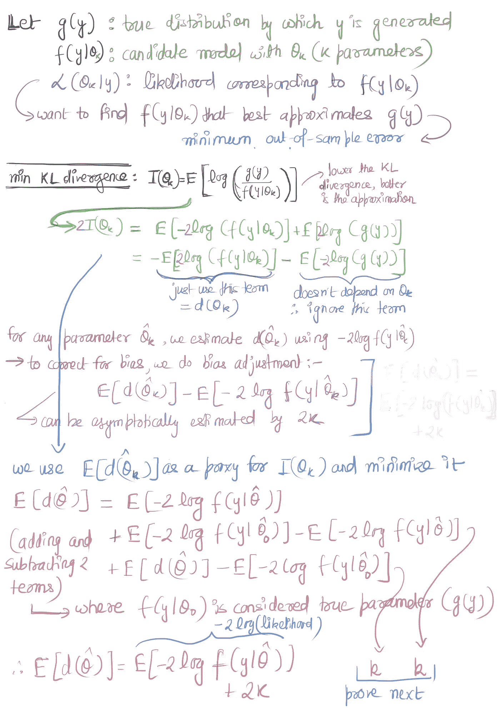
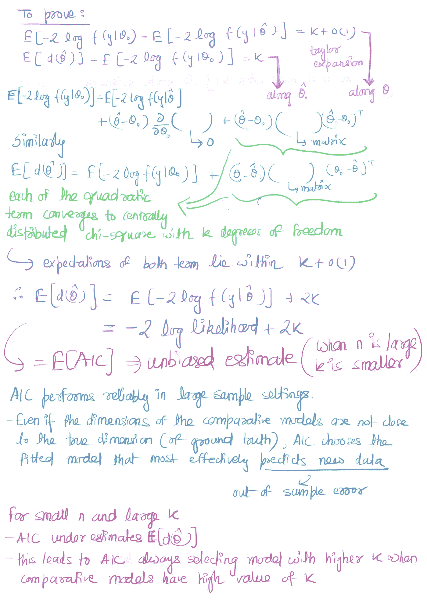

# 阿凯克信息论

> 原文：<https://towardsdatascience.com/akaike-information-criteria-942d1f554537?source=collection_archive---------19----------------------->

## AIC 背后的想法

我们所有人都曾用 AIC 来选择模特。这个博客是关于 AIC 背后的想法，它是什么，为什么它被用于模型选择。虽然有人告诉我们如何计算 AIC，但至少没人告诉我为什么要这么做背后的逻辑——这篇博客将对此进行阐述。

AIC 是对样本外误差的估计。AIC 以信息论为基础。他称之为熵最大化原理，最小化 AIC 相当于最大化热力学系统的熵。因此，在信息论的语言中，我们可以说，当编码一个模型时(*我们永远找不到确切的模型*，一些信息在表示数据生成的过程中丢失了。

AIC 测量了*相对信息损失*。由于我们没有确切的模型，我们无法测量确切的损失。因此，我们测量不同模型之间的相对损失(我们必须从中选择我们的模型)。如果我们有 3 个 AIC 值分别为 100、102 和 110 的模型，那么第二个模型的 exp((100-102)/2)= 0.368 倍是第一个模型的概率，以最大限度地减少信息损失。同样，第三个模型的概率是第一个模型的 0.007 倍，以最大限度地减少信息损失。

AIC 由 **2 x 参数数量-2 log(似然)**给出

当选择模型(例如多项式函数)时，我们选择具有最小 AIC 值的模型。或者，如果我们可以选择前 2-3 个模型，收集更多的数据，并选择 AIC 最小的一次。这个博客是关于——这个 AIC 公式从何而来？

在 AIC，我们试图最小化模型和地面真实函数之间的 KL 差异。AIC 是对代理函数估计的计算。因此，最小化 AIC 类似于最小化 KL 与地面真实值的偏离，从而最小化样本外误差。下图显示了 AIC 的推导过程。

**图一。**推导第一部分

**图二。**推导第二部分

贝叶斯信息标准(BIC)的计算类似于 AIC。BIC 用 2 ln(n)k 代替 2k，这些被称为罚项。有争议的是，如果真实模型存在于模型组中，BIC 选择概率为 1 的真实模型，给定 *n* 趋于无穷大。由于我们在候选模型集中从来没有真正的真实模型，这个属性并没有被高度重视。此外，AIC 最大限度地降低了选择一个非常糟糕的模型的风险。

**参考** 1。[维基百科 AIC 页面](https://en.wikipedia.org/wiki/Akaike_information_criterion)
2。[AIC 的衍生](https://onlinelibrary.wiley.com/doi/epdf/10.1002/wics.1460)