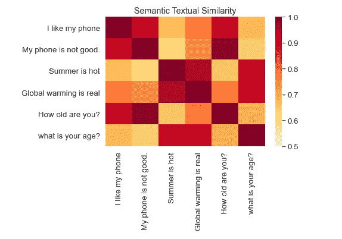

# Albert 矢量化(带 Tensorflow Hub)

> 原文：<https://towardsdatascience.com/albert-vectorization-with-tensorflow-hub-c6b892ed7ed4?source=collection_archive---------22----------------------->


## 我们使用来自 tensorflow-hub 的预训练 Albert 嵌入对输入文本进行矢量化。它被用作 Keras 层，因此可以很容易地扩展以构建深度学习模型。

BERT 的出现打破了 NLP 的传统范式。下游的模型构建现在是从一个以语言知识为基础的模型开始，而不是从零开始。ALBERT 可以被称为 lite BERT，它使用转换器-编码器架构，参数数量大大减少。在本文中，词汇大小也是 30K，与最初的 BERT 中使用的一样。ALBERT 区别于 BERT 的三个主要方面是分解嵌入参数化、跨层参数共享和句子顺序预测。

# 优于伯特

当人们试图简单地放大模型的隐藏尺寸时，BERT like 模型可能提供质量差的性能。诸如因子分解嵌入参数化之类的参数缩减技术用于将隐藏层的大小与词汇嵌入的大小分开，这使得在不显著增加参数大小的情况下增加隐藏大小变得容易。而跨层参数共享防止参数随着网络的深度而增长。因此，这两种技术都显著减少了传统 BERT 的参数数量，而没有恶化性能和提高参数效率。通过引入句子顺序预测的自监督损失(SOP ), ALBERT 的性能得到进一步改善。

在本文中，我们将使用 tensorflow-hub 模块的 keras 层格式获得相应文本的 ALBERT 向量。

# 1.设置环境

我们将使用 tensorflow keras API 制作一个模型，它将为文本输入提供 ALBERT 嵌入。环境设置包括安装所需的库和获取所需的 tensorflow-hub 模块以获得 ALBERT vectors。使用的库有:

```
#tensorflow==2.2.0
#tensorflow_hub=0.8.0
#sentencepiece==0.1.91
#tqdm==4.47.0
#seaborn==0.10.1
#numpy==1.19.0
```

我们将使用 TF2 保存的艾伯特模型格式。您可以直接使用 tfhub 上的模块进行推断。但是对于生产场景，最好将模块放在本地。为此，我们需要首先获取模块的 zip 文件并将其解压缩。

```
# mkdir albert_en_base
# mkdir 1
# wget [https://tfhub.dev/tensorflow/albert_en_base/1https://tfhub.dev/tensorflow/albert_en_base/1](https://tfhub.dev/tensorflow/albert_en_base/1https://tfhub.dev/tensorflow/albert_en_base/1)
# tar-xzf albert_en_base_1.tar.gztar-xzf albert_en_base_1.tar.gz
# rm -rf albert_en_base_1.tar.gzrm -rf albert_en_base_1.tar.gz
```

# 2.符号化

我们将把 ALBERT 模块作为 keras 层导入。

```
albert_layer = hub.KerasLayer("albert_en_base/1", trainable=False)
```

棘手的是，艾伯特模块不能直接输入文本。它需要经过一个预处理层。

首先，我们将使用 ALBERT tokenizer 对输入文本进行分词，它基于一个句子片断分词器，即子词级分词器。它是一个数据驱动的标记器，用来处理词汇表之外的单词。因为我们在每次输入时只有一个文本，所以句子的标记列表看起来像["[CLS]"]+标记+ ["[SEP]"]。

```
sp_model_file = albert_layer.resolved_object.sp_model_file.asset_path.numpy()
tokenizer = FullSentencePieceTokenizer(sp_model_file)
stokens = tokenizer.tokenize(sentence)
stokens = stokens[:MAX_LEN]
stokens = ["[CLS]"] + stokens + ["[SEP]"]
```

例如，文本“车身由金属制成，具有高张力”会生成一个令牌列表，如下所示:

```
['▁the',
 '▁body',
 '▁is',
 '▁made',
 '▁of',
 '▁metallic',
 'a',
 '▁and',
 '▁deliver',
 'i',
 '▁high',
 '▁tension']
```

现在，我们需要 3 个输入序列，可以馈入艾伯特模块。

*   标记 id:用于从 ALBERT vocab 字典中提取的句子中的每个标记。
*   mask ids:for each token，用于屏蔽仅用于序列填充的标记(因此每个序列都有固定的长度)。
*   Segment ids 表示一个句子序列(我们这里的例子)，1 表示序列中有两个句子。

```
def get_ids(tokens, tokenizer, max_seq_length):
  """Token ids from Tokenizer vocab"""
  token_ids = tokenizer.convert_tokens_to_ids(tokens,)
  input_ids = token_ids + [0] * (max_seq_length-len(token_ids))
  return input_idsdef get_masks(tokens, max_seq_length):
  return [1]*len(tokens) + [0] * (max_seq_length - len(tokens))def get_segments(tokens, max_seq_length):
  """Segments: 0 for the first sequence, 1 for the second""
  segments = []
  current_segment_id = 0
  for token in tokens:
    segments.append(current_segment_id)
    if token == "[SEP]":
      current_segment_id = 1
  return segments + [0] * (max_seq_length - len(tokens))ids = get_ids(stokens, tokenizer, MAX_SEQ_LEN)
**# [2, 13, 1, 589, 17378, 3, 0, 0, 0, 0, 0, 0, 0, 0, 0, 0, 0, 0, 0, 0, 0, 0]**masks = get_masks(stokens, MAX_SEQ_LEN)
**# [1, 1, 1, 1, 1, 1, 0, 0, 0, 0, 0, 0, 0, 0, 0, 0, 0, 0, 0, 0, 0, 0]**segments = get_segments(stokens, MAX_SEQ_LEN)
**# [0, 0, 0, 0, 0, 0, 0, 0, 0, 0, 0, 0, 0, 0, 0, 0, 0, 0, 0, 0, 0, 0]**
```

# 3.艾伯特矢量化

现在我们已经准备好了所需的输入处理。我们将使用 tf keras API 建立一个模型，它将接受处理后的输入，并获得文本的 ALBERT 向量。输出艾伯特矢量包含 2 个矢量，一个是汇集输出和序列输出。pooled_output 是维度 1x768 的句子嵌入，序列输出是维度 1x(token_length)x768 的令牌级嵌入。

```
def get_model():
  input_word_ids = tf.keras.layers.Input(shape=(MAX_SEQ_LEN,), dtype=tf.int32,name="input_word_ids")
  input_mask = tf.keras.layers.Input(shape=(MAX_SEQ_LEN,), dtype=tf.int32,name="input_mask")
  segment_ids = tf.keras.layers.Input(shape=(MAX_SEQ_LEN,), dtype=tf.int32,name="segment_ids") pooled_output, sequence_output = albert_layer([input_word_ids, input_mask, segment_ids]) model = tf.keras.models.Model(inputs=[input_word_ids, input_mask,  segment_ids], outputs=[pooled_output, sequence_output])
  return model
```

制作 keras 模型的想法是通过添加所需的层和参数，轻松地将其扩展到任何分类模型。

现在所有的艰苦工作都完成了。将只需要一个推理函数来获得文本的相应艾伯特嵌入。

```
s = "This is a nice sentence."def get_albert_vec(s):
  stokens = tokenizer.tokenize(s)
  stokens = ["[CLS]"] + stokens + ["[SEP]"]
  ids = get_ids(stokens, tokenizer, MAX_SEQ_LEN)
  masks = get_masks(stokens, MAX_SEQ_LEN)
  segments = get_segments(stokens, MAX_SEQ_LEN)
  input_ids = np.asarray(ids, dtype=np.int32).reshape(1,22)
  input_masks = np.asarray(masks, dtype=np.int32).reshape(1,22)
  input_segments = np.asarray(segments, dtype=np.int32).reshape(1,22)
  return input_ids, input_masks, input_segmentsinput_ids, input_masks, input_segments = get_albert_vec(s)
pool_embs, word_embs = albert_model.predict(
      [[input_ids, input_masks, input_segments]]
)
```

为了快速检查句子嵌入的质量，让我们在一小组示例上运行它，并使用它们对应的归一化句子嵌入向量的点积来检查每对的句子相似性得分。

```
sentences = [
# Smartphones
"I like my phone",
"My phone is not good.",# Weather
"Recently a lot of hurricanes have hit the US",
"Global warming is real",# Asking about age
"How old are you?",
"what is your age?"]run_and_plot(sentences)
```



# **参考文献**

[](https://github.com/sambit9238/Deep-Learning/tree/master/sarcasm_classifier/albert_tfhub) [## sambit 9238/深度学习

### 此时您不能执行该操作。您已使用另一个标签页或窗口登录。您已在另一个选项卡中注销，或者…

github.com](https://github.com/sambit9238/Deep-Learning/tree/master/sarcasm_classifier/albert_tfhub) [](https://medium.com/doxastar/from-bert-to-albert-pre-trained-langaug-models-5865aa5c3762) [## 从伯特到阿尔伯特:预训练的兰格模型

### 预训练语言模型的研究进展

medium.com](https://medium.com/doxastar/from-bert-to-albert-pre-trained-langaug-models-5865aa5c3762) [](https://ai.googleblog.com/2019/12/albert-lite-bert-for-self-supervised.html) [## ALBERT:一个用于语言表达自我监督学习的 Lite BERT

### 自从一年前 BERT 问世以来，自然语言研究已经采用了一种新的范式，利用了大量的…

ai.googleblog.com](https://ai.googleblog.com/2019/12/albert-lite-bert-for-self-supervised.html) [](https://analyticsindiamag.com/googles-nlp-powered-pretraining-method-albert-is-leaner-meaner/) [## 谷歌的 NLP 驱动的预训练方法 ALBERT 更精简&更刻薄

### 自然语言处理(NLP)是新兴技术中最多样化的领域之一。去年，搜索引擎…

analyticsindiamag.com](https://analyticsindiamag.com/googles-nlp-powered-pretraining-method-albert-is-leaner-meaner/) [](https://amitness.com/2020/02/albert-visual-summary/) [## 视觉论文摘要:阿尔伯特(A Lite BERT)

### 考虑下面给出的一个句子。作为人类，当我们遇到“苹果”这个词时，我们可以:联想“苹果”这个词…

amitness.com](https://amitness.com/2020/02/albert-visual-summary/)